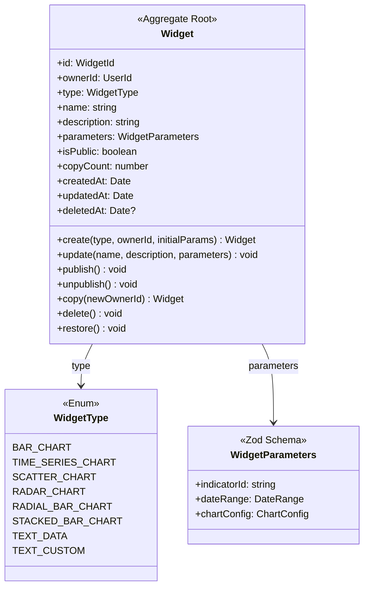

# Widget Library Unit - 도메인 모델 설계

## 개요

Widget Library Unit의 도메인 모델을 DDD(Domain-Driven Design) 전술적 패턴을 사용하여 정의합니다.

**바운디드 컨텍스트**: Widget Library (단일 컨텍스트)

**핵심 도메인 개념**: 사용자가 생성하고 관리하는 재사용 가능한 시각화 컴포넌트

**사용자 스토리 범위**: US3.1 ~ US3.8 (8개)

## 유비쿼터스 언어 (Ubiquitous Language)

| 용어 | 정의 |
|------|------|
| Widget | 경제 지표를 시각화하는 재사용 가능한 컴포넌트 |
| Widget Type | 위젯의 시각화 형태 (차트 7종 + 텍스트 2종) |
| Widget Parameters | 위젯 렌더링에 필요한 설정 값 (지표, 기간, 차트 옵션 등) |
| Owner | 위젯을 생성한 사용자 |
| Public Widget | 다른 사용자가 복사할 수 있도록 공개된 위젯 |
| Widget Gallery | 공개 위젯 목록을 보여주는 화면 |
| Widget Copy | 공개 위젯을 내 라이브러리로 복사하는 행위 (Deep Copy) |
| Soft Delete | 논리적 삭제 (`deletedAt` 타임스탬프 사용) |

## 애그리게이트 (Aggregates)

### Widget Aggregate

**Aggregate Root**: Widget

**트랜잭션 경계**: 개별 위젯 단위

**불변 조건 (Invariants)**:
- 위젯은 반드시 소유자(ownerId)를 가져야 함
- 위젯은 반드시 하나의 타입(type)을 가져야 함
- 위젯 파라미터는 타입별 Zod Schema 검증을 통과해야 함
- 삭제된 위젯(`deletedAt != null`)은 수정 불가
- 위젯 이름은 1자 이상 100자 이하

**설계 근거**:
- Widget만 Aggregate Root로 정의 (WidgetLibrary는 Application Service 레벨)
- 트랜잭션 일관성은 개별 위젯 단위로만 필요
- DDD 원칙 "작은 Aggregate가 좋다" 준수
- Pro 사용자의 대량 위젯 시나리오에서 동시성 보장



## 엔티티 (Entities)

### Widget (Aggregate Root)

**식별자**: `id: WidgetId` (UUID)

**속성**:
- `ownerId: UserId` - 위젯 소유자 (필수)
- `type: WidgetType` - 위젯 타입 (필수, 불변)
- `name: string` - 위젯 이름 (1-100자)
- `description: string` - 위젯 설명 (선택, 최대 500자)
- `parameters: WidgetParameters` - 위젯 파라미터 (Zod Schema)
- `isPublic: boolean` - 공개 여부 (기본값: false)
- `copyCount: number` - 복사된 횟수 (기본값: 0, 인기도 지표)
- `createdAt: Date` - 생성 일시
- `updatedAt: Date` - 수정 일시
- `deletedAt: Date | null` - 삭제 일시 (Soft Delete)

**메서드**:

#### 생성 메서드
```typescript
static create(
  type: WidgetType,
  ownerId: UserId,
  initialParams: WidgetParameters
): Widget
```
- 새로운 위젯 생성
- WidgetCreated 이벤트 발행
- US3.1 구현

#### 수정 메서드
```typescript
update(
  name?: string,
  description?: string,
  parameters?: WidgetParameters
): void
```
- 위젯 정보 수정
- 삭제된 위젯은 수정 불가
- `updatedAt` 갱신
- US3.2 구현 (이벤트 발행하지 않음 - 참조 기반 자동 반영)

#### 공개/비공개 메서드
```typescript
publish(): void
unpublish(): void
```
- `publish()`: 공개 상태로 변경, WidgetPublished 이벤트 발행
- `unpublish()`: 비공개 상태로 변경
- US3.4 구현

#### 복사 메서드
```typescript
copy(newOwnerId: UserId): Widget
```
- 완전히 독립적인 복사본 생성 (Deep Copy)
- 새 ID 발급, 파라미터 deep clone
- `isPublic = false`, `copyCount = 0` 초기화
- 원본의 `copyCount` 증가
- US3.3 구현

#### 삭제/복구 메서드
```typescript
delete(): void
restore(): void
```
- `delete()`: Soft Delete (`deletedAt` 설정), WidgetDeleted 이벤트 발행
- `restore()`: 삭제 취소 (`deletedAt = null`), WidgetRestored 이벤트 발행
- US3.6 구현

**생명주기**:
1. 생성 (create) → WidgetCreated 이벤트
2. 수정 (update) → 이벤트 없음 (참조 기반)
3. 공개 (publish) → WidgetPublished 이벤트
4. 복사 (copy) → 새로운 Widget 생성
5. 삭제 (delete) → WidgetDeleted 이벤트, Soft Delete
6. 복구 (restore) → WidgetRestored 이벤트 (선택)

## 값 객체 (Value Objects)

### WidgetType (TypeScript Union Type Enum)

**정의**:
```typescript
type WidgetType =
  | 'BAR_CHART'
  | 'TIME_SERIES_CHART'
  | 'SCATTER_CHART'
  | 'RADAR_CHART'
  | 'RADIAL_BAR_CHART'
  | 'STACKED_BAR_CHART'
  | 'TEXT_DATA'
  | 'TEXT_CUSTOM'
  | 'GRID_TABLE';
```

**타입별 메타데이터** (별도 상수):
```typescript
const WIDGET_TYPE_METADATA = {
  BAR_CHART: {
    displayName: '막대 차트',
    category: 'chart',
    icon: 'BarChartIcon',
    description: '비교 분석에 적합'
  },
  // ... 기타 타입
} as const;
```

**설계 근거**:
- 9가지 위젯 타입은 고정된 상수 (런타임 추가 없음)
- TypeScript Union Type의 컴파일 타임 타입 체크 활용
- IDE 자동완성 지원
- JSON 직렬화 자동 처리
- 타입별 검증 로직이나 행동(behavior) 필요 시 값 객체로 리팩토링 가능

### WidgetParameters (Zod Schema)

**설계 원칙**:
- Zod Schema를 사용하여 타입 안정성 + 런타임 검증
- Recharts 공식 타입 정의 재사용
- 직렬화 안전 (함수 제외)
- Frontend/Backend 공유

**기본 구조**:
```typescript
// 공통 파라미터
const BaseParametersSchema = z.object({
  indicatorId: z.string().uuid(),
  dateRange: DateRangeSchema,
  title: z.string().optional(),
  showLegend: z.boolean().default(true),
});

// 타입별 파라미터 (예시: Bar Chart)
const BarChartParametersSchema = BaseParametersSchema.extend({
  xAxisKey: z.string(),
  yAxisKey: z.string(),
  barColor: z.string().regex(/^#[0-9A-F]{6}$/i),
  showGrid: z.boolean().default(true),
  // Recharts BarChart props (선별)
  layout: z.enum(['horizontal', 'vertical']).default('horizontal'),
  barSize: z.number().positive().optional(),
}).passthrough(); // 확장 여지

type BarChartParameters = z.infer<typeof BarChartParametersSchema>;
```

**타입별 파라미터 목록**:
- `BAR_CHART`: BarChartParameters
- `TIME_SERIES_CHART`: TimeSeriesChartParameters
- `SCATTER_CHART`: ScatterChartParameters
- `RADAR_CHART`: RadarChartParameters
- `RADIAL_BAR_CHART`: RadialBarChartParameters
- `STACKED_BAR_CHART`: StackedBarChartParameters
- `TEXT_DATA`: TextDataParameters
- `TEXT_CUSTOM`: TextCustomParameters
- `GRID_TABLE`: GridTableParameters

**검증 전략**:
- 핵심 파라미터 (indicatorId, dateRange) 필수 정의
- Recharts 옵션은 자주 쓰는 것만 선별하여 Schema화
- `.passthrough()` 사용으로 점진적 확장 가능

### DateRange (Zod Schema)

```typescript
const DateRangeSchema = z.object({
  startDate: z.string().datetime(),
  endDate: z.string().datetime(),
  preset: z.enum(['1M', '3M', '6M', '1Y', '5Y', 'ALL']).optional(),
}).refine(
  data => new Date(data.startDate) <= new Date(data.endDate),
  { message: 'startDate must be before endDate' }
);

type DateRange = z.infer<typeof DateRangeSchema>;
```

## 도메인 이벤트 (Domain Events)

### 1. WidgetCreated

**발행 시점**: `Widget.create()` 메서드 실행 후

**속성**:
```typescript
interface WidgetCreatedEvent {
  eventId: string;
  occurredAt: Date;
  widgetId: string;
  ownerId: string;
  type: WidgetType;
  name: string;
}
```

**구독자**:
- Subscription Unit (사용량 추적)
- Admin Console (통계)
- Audit Log (감사 로그)

**비즈니스 가치**: US3.1 위젯 생성 추적

### 2. WidgetPublished

**발행 시점**: `Widget.publish()` 메서드 실행 후 (비공개 → 공개 변경 시)

**속성**:
```typescript
interface WidgetPublishedEvent {
  eventId: string;
  occurredAt: Date;
  widgetId: string;
  ownerId: string;
  type: WidgetType;
  name: string;
}
```

**구독자**:
- Widget Gallery Service (갤러리 업데이트)
- Notification Service (소유자 알림)
- Recommendation Service (추천 시스템, 향후)

**비즈니스 가치**: US3.4 공개 위젯 관리, US3.7 갤러리 업데이트

### 3. WidgetDeleted

**발행 시점**: `Widget.delete()` 메서드 실행 후 (Soft Delete)

**속성**:
```typescript
interface WidgetDeletedEvent {
  eventId: string;
  occurredAt: Date;
  widgetId: string;
  ownerId: string;
  deletedAt: Date;
}
```

**구독자**:
- Dashboard Unit (위젯 참조 제거, US3.6)
- Subscription Unit (사용량 감소)

**비즈니스 가치**: US3.6 위젯 삭제 시 모든 대시보드에서 자동 제거

**처리 방식**:
- Soft Delete 패턴 사용
- Dashboard Unit의 WidgetDeletedEventHandler가 비동기 처리
- 실패 시 재시도 메커니즘 (Message Queue)
- Eventual Consistency 보장

### 4. WidgetRestored (선택)

**발행 시점**: `Widget.restore()` 메서드 실행 후

**속성**:
```typescript
interface WidgetRestoredEvent {
  eventId: string;
  occurredAt: Date;
  widgetId: string;
  ownerId: string;
}
```

**구독자**:
- Dashboard Unit (복구 알림, 선택적)
- Subscription Unit (사용량 재계산)

**비즈니스 가치**: 향후 위젯 복구 기능 추가 시 사용

### 발행하지 않는 이벤트

**WidgetUpdated** (발행 안 함):
- 이유: US3.2 "즉시 반영"은 참조 기반 아키텍처로 자동 해결
- Dashboard는 widgetId 참조만 저장 → 렌더링 시 최신 Widget 조회
- 매 편집마다 이벤트 발행 시 성능 저하 및 불필요한 복잡도 증가
- TanStack Query의 캐시 무효화 전략으로 Frontend 실시간성 보장

## 도메인 서비스 (Domain Services)

**결론**: Widget Library Unit에는 도메인 서비스가 필요하지 않습니다.

**이유**:
1. **WidgetFactory 불필요**:
   - 위젯 생성 로직은 복잡한 도메인 규칙 없음
   - `Widget.create()` 정적 팩토리 메서드로 충분
   - DDD 원칙 "엔티티에 로직을 최대한 배치" 준수

2. **복사 로직은 Aggregate 메서드**:
   - `Widget.copy()` 메서드가 담당
   - 단일 Aggregate 작업이므로 도메인 서비스 불필요

3. **렌더링은 Presentation Layer**:
   - UI/UX 관심사로 도메인 아님
   - Clean Architecture Dependency Rule 준수
   - `<WidgetRenderer>` React 컴포넌트가 처리

## 정책 (Policies)

**결론**: Widget Library Unit에는 도메인 정책이 없습니다.

**이유**:

1. **공개/비공개 토글**:
   - 정책 아님, 단순 상태 변경 메서드 (`Widget.publish()`)
   - 특별한 공개 조건이나 제약사항 없음
   - 향후 조건 추가 시 (예: 콘텐츠 검토) PublishingPolicy로 승격 가능

2. **플랜별 제한 (Free 6개, Pro 무제한)**:
   - Subscription 도메인의 정책
   - Widget 도메인은 관여하지 않음
   - Dashboard Unit에서 위젯 추가 시 Subscription Service 호출하여 검증

3. **삭제 전 경고**:
   - 정책 아님, UX 관심사
   - Application Service가 Dashboard Unit API 호출하여 사용 개수 조회
   - Presentation Layer가 확인 다이얼로그 표시
   - 삭제 자체는 항상 허용 (사용 여부 무관)

**정책 관리 레이어**:
- 비즈니스 제약사항 검증은 Application Service에서 수행
- 도메인 규칙이 복잡해지면 그때 정책 패턴 도입 고려

## 리포지토리 인터페이스 (Repository Interface)

### IWidgetRepository

**위치**: Domain Layer (인터페이스), Infrastructure Layer (구현)

**책임**: Widget Aggregate의 저장/조회를 담당하는 컬렉션 추상화

**메서드**:

#### 기본 CRUD

```typescript
interface IWidgetRepository {
  // 저장 (생성 & 수정)
  save(widget: Widget): Promise<void>;

  // ID로 조회
  findById(widgetId: WidgetId): Promise<Widget | null>;

  // 삭제 (Soft Delete 구현)
  delete(widgetId: WidgetId): Promise<void>;

  // 존재 확인
  exists(widgetId: WidgetId): Promise<boolean>;
}
```

#### 필수 쿼리 메서드

```typescript
interface IWidgetRepository {
  // 내 위젯 목록 (US3.1)
  findByOwnerId(
    ownerId: UserId,
    options?: {
      includeDeleted?: boolean;
      sortBy?: 'createdAt' | 'updatedAt' | 'name';
      order?: 'asc' | 'desc';
      limit?: number;
      offset?: number;
    }
  ): Promise<Widget[]>;

  // 공개 위젯 목록 (US3.7)
  findPublicWidgets(
    options: {
      sortBy: 'popular' | 'latest'; // popular = copyCount, latest = createdAt
      limit: number;
      offset: number;
      type?: WidgetType; // 선택적 필터
    }
  ): Promise<Widget[]>;

  // 타입별 조회 (관리자용, 선택)
  findByType(type: WidgetType): Promise<Widget[]>;
}
```

**제공하지 않는 메서드**:
- 복잡한 검색 (제목, 태그, 카테고리): 초기 버전에 불필요
- 향후 필요 시 Elasticsearch 기반 별도 SearchRepository로 분리
- Repository는 최소한의 인터페이스 유지

**트랜잭션 경계**:
- 단일 Widget Aggregate 저장/조회: 단일 트랜잭션
- 여러 Widget 조회 (목록): 읽기 전용, 트랜잭션 불필요
- 이벤트 발행: Application Service에서 트랜잭션 완료 후 발행

**구현 기술**:
- Supabase PostgreSQL
- Soft Delete: `WHERE deletedAt IS NULL` 조건 자동 추가
- 인덱스: `(ownerId, deletedAt)`, `(isPublic, deletedAt, copyCount)`, `(type, deletedAt)`

### Dashboard Unit 연계 쿼리

**US3.5 위젯별 사용 중인 대시보드 수 확인**:

**WidgetRepository의 책임 아님** - Dashboard 도메인 조회 필요

**구현 방식**:
```typescript
// Application Service
class WidgetApplicationService {
  async getWidgetUsage(widgetId: WidgetId): Promise<WidgetUsageInfo> {
    // Dashboard Unit API 호출
    const response = await fetch(`/api/dashboards/widgets/${widgetId}/usage`);
    const usageCount = await response.json();

    return {
      widgetId,
      dashboardCount: usageCount,
    };
  }
}
```

**Dashboard Unit API**:
```
GET /api/dashboards/widgets/{widgetId}/usage
Response: { count: number }
```

**설계 근거**:
- "대시보드 수"는 Dashboard Aggregate의 데이터
- Widget Aggregate는 자신이 어디서 사용되는지 모름 (단방향 참조)
- WidgetRepository가 Dashboard 테이블 조회 시 Repository 경계 위반
- Unit 간 통신은 Application Layer에서 조율

## 애그리게이트 간 참조 방식

### Dashboard → Widget (참조)

**관계**: Dashboard는 Widget을 참조

**참조 방식**: ID 참조 (widgetId)

```typescript
// Dashboard Aggregate
class Dashboard {
  private widgetIds: WidgetId[]; // ID 참조만 저장

  addWidget(widgetId: WidgetId): void {
    // 위젯 존재 여부는 Application Service에서 검증
    this.widgetIds.push(widgetId);
  }
}
```

**렌더링 시**:
```typescript
// Presentation Layer
function DashboardView({ dashboard }) {
  const widgetIds = dashboard.getWidgetIds();

  return (
    <>
      {widgetIds.map(widgetId => (
        <WidgetContainer key={widgetId} widgetId={widgetId} />
      ))}
    </>
  );
}

function WidgetContainer({ widgetId }) {
  // TanStack Query로 최신 Widget 조회
  const { data: widget } = useQuery(['widget', widgetId], () =>
    widgetService.getWidget(widgetId)
  );

  if (!widget) return <WidgetNotFound />;

  return <WidgetRenderer widget={widget} />;
}
```

**설계 근거**:
- US3.2 "위젯 편집 시 모든 대시보드에 즉시 반영" 자동 구현
- 데이터 중복 없음
- Widget 변경 시 이벤트 불필요
- TanStack Query 캐시 무효화로 Frontend 실시간성 보장

### 공개 위젯 복사 (Deep Copy)

**관계**: 사용자는 타인의 공개 위젯을 복사

**복사 방식**: Deep Copy (완전히 독립적인 복사본)

```typescript
// Application Service
class WidgetApplicationService {
  async copyPublicWidget(
    widgetId: WidgetId,
    currentUserId: UserId
  ): Promise<Widget> {
    const originalWidget = await this.widgetRepository.findById(widgetId);

    if (!originalWidget || !originalWidget.isPublic) {
      throw new WidgetNotPublicError();
    }

    // Deep Copy 생성
    const copiedWidget = originalWidget.copy(currentUserId);

    await this.widgetRepository.save(copiedWidget);

    // 원본의 copyCount 증가
    originalWidget.incrementCopyCount();
    await this.widgetRepository.save(originalWidget);

    return copiedWidget;
  }
}
```

**설계 근거** (US3.3):
- "복사된 위젯은 독립적으로 편집 가능" 요구사항
- 원본 위젯 변경 시 복사본에 영향 없음
- 새 ID, 새 소유자, 파라미터 deep clone
- 복사 후 완전히 독립적인 별도 Widget Aggregate
- 향후 "업데이트 확인" 필요 시 `copiedFrom` 메타데이터 추가 가능

## 비즈니스 규칙 및 제약사항

### 도메인 규칙

1. **소유권 규칙**:
   - 모든 위젯은 반드시 소유자를 가짐
   - 소유자만 위젯 수정/삭제 가능
   - 소유권은 복사 시에만 변경 가능

2. **공개 규칙**:
   - 기본적으로 위젯은 비공개 (`isPublic = false`)
   - 공개 위젯만 타인이 복사 가능
   - 비공개로 전환해도 기존 복사본은 영향 없음

3. **삭제 규칙**:
   - Soft Delete 사용 (`deletedAt` 타임스탬프)
   - 삭제된 위젯은 수정 불가
   - 삭제 시 Dashboard Unit에 WidgetDeleted 이벤트 발행

4. **타입 불변성**:
   - 위젯 타입은 생성 후 변경 불가
   - 타입 변경 필요 시 새 위젯 생성 필요

5. **파라미터 검증**:
   - 모든 파라미터는 타입별 Zod Schema 검증 통과 필요
   - 직렬화 가능한 데이터만 허용 (함수 제외)

### 외부 도메인 제약사항

1. **플랜별 제한** (Subscription Unit):
   - Free 플랜: 대시보드당 위젯 6개 제한
   - Pro 플랜: 무제한
   - 검증은 Dashboard Unit에서 수행

2. **지표 존재 확인** (Admin Console Unit):
   - `parameters.indicatorId`는 Admin Console에 등록된 지표여야 함
   - Application Service에서 검증

3. **대시보드 연계** (Dashboard Unit):
   - 위젯 삭제 시 모든 대시보드에서 참조 제거 (이벤트 기반)
   - 위젯 사용 개수 조회 시 Dashboard Unit API 호출

## 사용자 스토리 매핑

### US3.1: 내 위젯 목록 조회

**도메인 모델 구현**:
- `IWidgetRepository.findByOwnerId(ownerId)` 메서드
- `Widget.ownerId` 속성으로 소유권 관리
- Application Service에서 현재 사용자 ID로 필터링

**쿼리 흐름**:
```
User → Application Service → IWidgetRepository.findByOwnerId(userId) → Widget[]
```

### US3.2: 위젯 편집 시 모든 대시보드에 즉시 반영

**도메인 모델 구현**:
- `Widget.update(name, description, parameters)` 메서드
- **WidgetUpdated 이벤트 발행 안 함**
- Dashboard는 widgetId 참조만 저장
- 렌더링 시 항상 최신 Widget 조회 (참조 기반)

**아키텍처 설계**:
```
User Edit → Application Service → Widget.update() → Repository.save()
Dashboard Render → Query Widget by ID → Latest Widget (자동 반영)
```

**Frontend 캐시 무효화**:
```typescript
// 위젯 편집 후
queryClient.invalidateQueries(['widget', widgetId]);
```

### US3.3: 공개 위젯 복사

**도메인 모델 구현**:
- `Widget.copy(newOwnerId)` 메서드 (Deep Copy)
- `Widget.isPublic` 속성으로 공개 여부 관리
- `Widget.copyCount` 속성으로 인기도 추적

**복사 흐름**:
```
User → Application Service →
  1. Repository.findById(widgetId) → 원본 Widget
  2. originalWidget.copy(currentUserId) → 복사본 Widget (새 ID)
  3. Repository.save(copiedWidget)
  4. originalWidget.incrementCopyCount()
  5. Repository.save(originalWidget)
```

### US3.4: 위젯 공개/비공개 전환

**도메인 모델 구현**:
- `Widget.publish()` 메서드 → WidgetPublished 이벤트
- `Widget.unpublish()` 메서드
- `Widget.isPublic` 속성

**전환 흐름**:
```
User → Application Service → Widget.publish() →
  1. isPublic = true
  2. WidgetPublished 이벤트 발행
  3. Repository.save()
```

### US3.5: 위젯별 사용 중인 대시보드 수 확인

**도메인 모델 구현**:
- Application Service가 Dashboard Unit API 호출
- WidgetRepository의 책임 아님 (다른 Bounded Context)

**조회 흐름**:
```
User → Application Service →
  1. Dashboard Unit API: GET /api/dashboards/widgets/{widgetId}/usage
  2. Response: { count: number }
  3. Presentation Layer에 전달
```

### US3.6: 위젯 삭제 시 모든 대시보드에서 자동 제거

**도메인 모델 구현**:
- `Widget.delete()` 메서드 (Soft Delete)
- WidgetDeleted 도메인 이벤트
- Dashboard Unit의 WidgetDeletedEventHandler가 구독

**삭제 흐름**:
```
User → Application Service → Widget.delete() →
  1. deletedAt = now()
  2. WidgetDeleted 이벤트 발행
  3. Repository.save()

Dashboard Unit (Async) → WidgetDeletedEventHandler →
  1. Dashboard.removeWidget(widgetId)
  2. 모든 대시보드에서 위젯 참조 제거
```

### US3.7: 공개 위젯 갤러리 (인기순/최신순)

**도메인 모델 구현**:
- `IWidgetRepository.findPublicWidgets(sortBy, limit, offset)` 메서드
- 쿼리 모델 (CQRS Read Model), 별도 Aggregate 아님
- `Widget.copyCount` (인기순), `Widget.createdAt` (최신순)

**갤러리 조회 흐름**:
```
User → Application Service → WidgetGalleryService →
  IWidgetRepository.findPublicWidgets({
    sortBy: 'popular',
    limit: 20,
    offset: 0
  }) → Widget[]
```

### US3.8: 위젯 데이터 내보내기 (CSV, JSON)

**도메인 모델 구현**:
- Application Service가 Data Integration Unit API 호출
- 도메인 로직 없음 (Infrastructure 관심사)

**내보내기 흐름**:
```
User → Application Service →
  1. Widget.parameters 추출
  2. Data Integration Unit: POST /api/data/export
     Body: { indicatorId, dateRange, format: 'csv' }
  3. File Download
```

## 레이어 아키텍처 (Clean Architecture)

### Domain Layer

```
src/domain/
├── entities/
│   └── widget.entity.ts          # Widget Aggregate Root
├── value-objects/
│   ├── widget-type.ts             # WidgetType Enum
│   ├── widget-parameters.schema.ts # Zod Schemas
│   └── date-range.schema.ts       # DateRange Schema
├── events/
│   ├── widget-created.event.ts
│   ├── widget-published.event.ts
│   ├── widget-deleted.event.ts
│   └── widget-restored.event.ts
└── repositories/
    └── widget.repository.interface.ts  # IWidgetRepository
```

**의존성**: 없음 (Pure TypeScript/Zod)

### Application Layer

```
src/application/
├── services/
│   ├── widget-application.service.ts
│   └── widget-gallery.service.ts
├── dto/
│   ├── create-widget.dto.ts
│   ├── update-widget.dto.ts
│   └── widget-usage.dto.ts
└── use-cases/
    ├── create-widget.use-case.ts
    ├── copy-public-widget.use-case.ts
    ├── delete-widget.use-case.ts
    └── get-widget-usage.use-case.ts
```

**의존성**: Domain Layer만 의존

### Infrastructure Layer

```
src/infrastructure/
├── persistence/
│   ├── supabase-widget.repository.ts  # IWidgetRepository 구현
│   └── widget.mapper.ts               # Domain ↔ DB 변환
└── events/
    └── event-publisher.ts             # 이벤트 발행 구현
```

**의존성**: Domain Layer (인터페이스 구현)

### Presentation Layer

```
src/presentation/
├── components/
│   ├── widget-renderer.tsx          # 위젯 렌더링
│   ├── widget-list.tsx
│   └── widget-gallery.tsx
└── hooks/
    ├── use-widget.ts
    └── use-widget-gallery.ts
```

**의존성**: Application Layer (Use Cases)

## 기술적 고려사항

### 1. Soft Delete 패턴

**이유**:
- 위젯 삭제 시 Dashboard Unit의 비동기 정리 필요
- 실수로 삭제한 위젯 복구 가능성
- 감사 로그 및 데이터 무결성 보장

**구현**:
```typescript
// Repository Query
const query = supabase
  .from('widgets')
  .select('*')
  .eq('owner_id', ownerId)
  .is('deleted_at', null); // 삭제되지 않은 것만 조회
```

### 2. 이벤트 기반 아키텍처

**이벤트 버스**:
- Supabase Realtime (초기)
- 향후 RabbitMQ/AWS EventBridge 전환 고려

**Eventual Consistency**:
- 위젯 삭제 후 Dashboard 정리는 비동기 (수 초 지연 허용)
- 실패 시 재시도 메커니즘
- 고아 참조(orphaned reference) 방어 로직 (렌더링 시 null 체크)

### 3. TanStack Query 캐시 전략

**캐시 키 설계**:
```typescript
['widget', widgetId]           // 개별 위젯
['widgets', 'my']              // 내 위젯 목록
['widgets', 'public', sortBy]  // 공개 갤러리
```

**무효화 전략**:
```typescript
// 위젯 수정 후
queryClient.invalidateQueries(['widget', widgetId]);

// 위젯 삭제 후
queryClient.invalidateQueries(['widgets', 'my']);
queryClient.removeQueries(['widget', widgetId]);
```

### 4. 동시성 제어

**낙관적 잠금 (Optimistic Locking)**:
```typescript
class Widget {
  private version: number; // Version 필드 추가

  update(...): void {
    this.version++;
  }
}

// Repository 구현
async save(widget: Widget): Promise<void> {
  const result = await supabase
    .from('widgets')
    .update({ ...data, version: widget.version })
    .eq('id', widget.id)
    .eq('version', widget.version - 1); // 이전 버전과 일치해야 업데이트

  if (result.count === 0) {
    throw new ConcurrentModificationError();
  }
}
```

### 5. 성능 최적화

**데이터베이스 인덱스**:
```sql
CREATE INDEX idx_widgets_owner_deleted ON widgets(owner_id, deleted_at);
CREATE INDEX idx_widgets_public_popular ON widgets(is_public, deleted_at, copy_count DESC);
CREATE INDEX idx_widgets_public_latest ON widgets(is_public, deleted_at, created_at DESC);
CREATE INDEX idx_widgets_type ON widgets(type, deleted_at);
```

**쿼리 최적화**:
- N+1 문제 방어: `findByOwnerId()` 한 번에 모든 위젯 로드
- 페이지네이션: `limit`, `offset` 파라미터 사용
- 선택적 로딩: 갤러리에서는 `parameters` 제외 (용량 큰 필드)

## 테스트 전략

### 단위 테스트 (Domain Layer)

```typescript
describe('Widget Entity', () => {
  it('should create a widget with valid parameters', () => {
    const widget = Widget.create('BAR_CHART', userId, params);
    expect(widget.type).toBe('BAR_CHART');
  });

  it('should throw error when updating deleted widget', () => {
    widget.delete();
    expect(() => widget.update(...)).toThrow();
  });

  it('should create independent copy with new owner', () => {
    const copied = widget.copy(newUserId);
    expect(copied.id).not.toBe(widget.id);
    expect(copied.ownerId).toBe(newUserId);
  });
});
```

### 통합 테스트 (Application Layer)

```typescript
describe('WidgetApplicationService', () => {
  it('should publish WidgetCreated event after creation', async () => {
    const widget = await service.createWidget(dto);

    expect(eventBus.published).toContainEqual(
      expect.objectContaining({ type: 'WidgetCreated' })
    );
  });

  it('should prevent copying private widget', async () => {
    await expect(
      service.copyPublicWidget(privateWidgetId, userId)
    ).rejects.toThrow(WidgetNotPublicError);
  });
});
```

### E2E 테스트 (Presentation Layer)

```typescript
describe('Widget Gallery', () => {
  it('should display public widgets sorted by popularity', async () => {
    const { findAllByRole } = render(<WidgetGallery sortBy="popular" />);

    const widgets = await findAllByRole('article');
    expect(widgets[0]).toHaveTextContent('Most Copied Widget');
  });
});
```

## 확장 포인트

### 1. 위젯 타입 추가

- `WidgetType` Enum에 새 타입 추가
- 해당 타입의 Zod Schema 정의
- `WIDGET_TYPE_METADATA` 상수 업데이트
- Presentation Layer에 렌더링 컴포넌트 추가

### 2. 공개 조건 추가 (예: 승인 필요)

- PublishingPolicy 도메인 서비스 생성
- `Widget.publish()` 메서드에 정책 적용
- WidgetApprovalRequested 이벤트 추가
- Admin Console에서 승인 워크플로우 구현

### 3. 위젯 검색 기능

- Elasticsearch 기반 별도 SearchRepository 생성
- WidgetIndexed 이벤트 추가 (생성/수정 시 발행)
- Elasticsearch Index 동기화 EventHandler 구현
- Application Service에 검색 메서드 추가

### 4. 위젯 버전 관리

- WidgetVersion 엔티티 추가 (Widget Aggregate 내부)
- `Widget.createVersion()` 메서드 구현
- `IWidgetRepository.findVersions(widgetId)` 메서드 추가
- Presentation Layer에 버전 비교/복구 UI 추가

### 5. 협업 기능 (공동 편집)

- 새로운 Aggregate: WidgetCollaboration
- 권한 관리: WidgetPermission 값 객체 (Owner, Editor, Viewer)
- WidgetShared 이벤트 추가
- Real-time 동기화: Supabase Realtime 활용

## 참고 문서

- `docs/aidlc/inception/units/widget-library.md` - 요구사항 및 사용자 스토리
- `docs/aidlc/inception/units/integration_contract.md` - 단위 간 인터페이스 계약
- `docs/aidlc/construction/plan_construction_widget-library.md` - 도메인 모델 설계 계획 및 의사결정 기록
