# Unit 1: Pipe Mechanism - Logical Design v1.0

## 문서 정보

**목적**: Work Status Markers의 논리적 데이터 구조, 알고리즘, 인터페이스를 구체적으로 설계

**상태**: Draft v1.0

**참조 문서**:
- `domain_design.md` - 도메인 모델 (3,504줄, 8개 섹션)
- `unit-01-pipe-mechanism.md` - Unit 1 정의 및 범위
- `integration_plan.md` - Unit 간 통합 계약

**작성 원칙**:
- 코드 스니펫 생성 금지 (명세만 작성)
- 표 + Mermaid 다이어그램으로 구조 표현
- 단계별 설명 + 정규식 패턴으로 알고리즘 표현
- API 문서 형식으로 인터페이스 명세

---

## 목차

1. [Work Status Markers 데이터 구조](#section-1-work-status-markers-데이터-구조)
2. [HANDOFF LOG 파싱 알고리즘](#section-2-handoff-log-파싱-알고리즘)
3. [타임스탬프 검증 로직](#section-3-타임스탬프-검증-로직)
4. [마커 읽기/쓰기 인터페이스](#section-4-마커-읽기쓰기-인터페이스)
5. [재시작 메커니즘 로직](#section-5-재시작-메커니즘-로직)
6. [상태 전이 다이어그램](#section-6-상태-전이-다이어그램)
7. [예외 처리 및 오류 복구](#section-7-예외-처리-및-오류-복구)
8. [성능 고려사항](#section-8-성능-고려사항)

---

# Section 1: Work Status Markers 데이터 구조

## 1.1 필수 필드 데이터 스키마

Work Status Markers는 HTML 주석으로 마크다운 파일 상단에 임베딩되는 메타데이터입니다.

### 1.1.1 CURRENT_AGENT 필드

| 속성 | 값 |
|------|-----|
| **필드명** | CURRENT_AGENT |
| **데이터 타입** | string |
| **허용 값** | 빈 문자열 또는 에이전트 이름 |
| **기본값** | 없음 (필수 필드) |
| **제약사항** | 에이전트 이름은 `[a-z-]+` 패턴 (소문자, 하이픈만) |
| **의미** | 현재 작업 중인 에이전트 식별자 |
| **예시** | `content-initiator`, `overview-writer`, 빈 문자열 (완료 시) |

**상태별 값**:
- **PENDING**: 다음 에이전트 이름 (예: `content-initiator`)
- **IN_PROGRESS**: 작업 중인 에이전트 이름 (예: `concepts-writer`)
- **COMPLETED**: 빈 문자열 (`""`)
- **FAILED**: 실패한 에이전트 이름 유지

**도메인 불변식** (domain_design.md Section 5.2.2 참조):
- 에이전트 순서는 파이프라인 정의를 따라야 함
- CURRENT_AGENT가 빈 문자열이면 STATUS는 COMPLETED여야 함

---

### 1.1.2 STATUS 필드

| 속성 | 값 |
|------|-----|
| **필드명** | STATUS |
| **데이터 타입** | enum (열거형) |
| **허용 값** | PENDING, IN_PROGRESS, COMPLETED, FAILED |
| **기본값** | PENDING |
| **제약사항** | 반드시 4개 값 중 하나 |
| **의미** | 파이프라인 전체 진행 상태 |
| **상태 전이** | Section 6.1 참조 |

**STATUS 값 정의** (domain_design.md Section 2.2.3 참조):

| STATUS | 의미 | 조건 |
|--------|------|------|
| PENDING | 대기 중 | CURRENT_AGENT 설정됨, HANDOFF LOG에 START만 있음 |
| IN_PROGRESS | 진행 중 | CURRENT_AGENT 설정됨, 하나 이상의 에이전트 실행됨 |
| COMPLETED | 완료 | CURRENT_AGENT 비어있음, HANDOFF LOG에 COMPLETE 있음 |
| FAILED | 실패 | HANDOFF LOG에 FAILURE 있음 |

**도메인 불변식** (domain_design.md Section 5.1.2 참조):
- STATUS는 항상 4개 값 중 하나여야 함
- 대소문자 정확히 일치해야 함 (PENDING, not pending)

---

### 1.1.3 STARTED 필드

| 속성 | 값 |
|------|-----|
| **필드명** | STARTED |
| **데이터 타입** | ISO 8601 timestamp |
| **형식** | `YYYY-MM-DDTHH:MM:SS+09:00` |
| **허용 값** | 유효한 ISO 8601 날짜/시간 |
| **기본값** | 파이프라인 시작 시간 |
| **제약사항** | STARTED ≤ UPDATED |
| **의미** | 파이프라인 최초 시작 시각 |
| **예시** | `2025-10-14T18:15:00+09:00` |

**형식 구성 요소**:
- `YYYY`: 4자리 연도
- `MM`: 2자리 월 (01-12)
- `DD`: 2자리 일 (01-31)
- `T`: 날짜와 시간 구분자
- `HH`: 2자리 시 (00-23)
- `MM`: 2자리 분 (00-59)
- `SS`: 2자리 초 (00-59)
- `+09:00`: 타임존 (UTC+9, 한국 표준시)

**도메인 불변식** (domain_design.md Section 5.1.3 참조):
- ISO 8601 형식 엄격히 준수
- 타임존 필수 (예: +09:00)
- 유효한 날짜/시간이어야 함 (예: 02-31 불가)

---

### 1.1.4 UPDATED 필드

| 속성 | 값 |
|------|-----|
| **필드명** | UPDATED |
| **데이터 타입** | ISO 8601 timestamp |
| **형식** | `YYYY-MM-DDTHH:MM:SS+09:00` |
| **허용 값** | 유효한 ISO 8601 날짜/시간 |
| **기본값** | STARTED와 동일 (초기) |
| **제약사항** | STARTED ≤ UPDATED |
| **의미** | 마커 최종 업데이트 시각 |
| **갱신 시점** | 에이전트가 마커 업데이트할 때마다 |

**갱신 규칙** (domain_design.md Section 4.2 참조):
- 에이전트가 Postcondition 수행 시 UPDATED 타임스탬프 갱신
- HANDOFF LOG 엔트리 추가 시 동시 갱신
- CURRENT_AGENT 변경 시 동시 갱신

---

### 1.1.5 HANDOFF LOG 필드

| 속성 | 값 |
|------|-----|
| **필드명** | HANDOFF LOG |
| **데이터 타입** | array of log entries (여러 줄) |
| **형식** | `[EVENT_TYPE] agent-name \| message \| timestamp` |
| **허용 값** | 유효한 이벤트 엔트리 배열 |
| **기본값** | `[START] pipeline \| Content generation started \| <timestamp>` |
| **제약사항** | Append-Only (수정/삭제 금지) |
| **의미** | 파이프라인 실행 이력 추적 |

**HANDOFF LOG 엔트리 구조**:

```
[EVENT_TYPE] agent-name | message | YYYY-MM-DDTHH:MM:SS+09:00
└─────┬────┘ └───┬───┘   └──┬───┘   └───────────┬──────────────┘
   이벤트 타입  에이전트명   메시지        ISO 8601 타임스탬프
```

**구분자**: 파이프 문자 (`|`) 양옆에 공백 1개

**엔트리 구성 요소**:

| 구성 요소 | 설명 | 제약사항 |
|-----------|------|----------|
| **EVENT_TYPE** | 이벤트 종류 | START, DONE, IMPROVE, FAILURE, SKIP, COMPLETE 중 하나 |
| **agent-name** | 에이전트 이름 | `[a-z-]+` 패턴 (소문자, 하이픈만) |
| **message** | 이벤트 설명 | 한글/영문/숫자, 파이프 문자 포함 불가 |
| **timestamp** | 이벤트 발생 시각 | ISO 8601 형식 |

**6개 EVENT_TYPE** (domain_design.md Section 3.1 참조):

| EVENT_TYPE | 발생 시점 | 상태 변화 | 예시 메시지 |
|------------|-----------|-----------|-------------|
| START | 파이프라인 시작 | STATUS: PENDING | Content generation started |
| DONE | 에이전트 작업 완료 | CURRENT_AGENT 다음으로 이동 | Overview section completed |
| IMPROVE | 개선 요청 후 재작업 | CURRENT_AGENT 이전 에이전트로 | Improved concepts section |
| FAILURE | 에이전트 작업 실패 | STATUS: FAILED | Failed to generate quiz |
| SKIP | 에이전트 건너뛰기 | CURRENT_AGENT 다음으로 | Skipped optional section |
| COMPLETE | 파이프라인 완료 | STATUS: COMPLETED, CURRENT_AGENT: "" | All content validated |

**도메인 불변식** (domain_design.md Section 5.2.3 참조):
- HANDOFF LOG는 Append-Only (기존 엔트리 수정/삭제 금지)
- 타임스탬프 순서대로 정렬되어야 함
- 파이프라인당 [START]는 1개만 (처음에만)
- 파이프라인당 [COMPLETE]는 1개만 (마지막에만)

---

## 1.2 선택 필드 데이터 스키마

### 1.2.1 VALIDATION_SCORE 필드

| 속성 | 값 |
|------|-----|
| **필드명** | VALIDATION_SCORE |
| **데이터 타입** | integer |
| **허용 값** | 0-100 |
| **기본값** | 없음 (content-validator가 설정) |
| **제약사항** | 정수만 허용 |
| **의미** | content-validator의 품질 평가 점수 |
| **사용처** | Unit 5 (품질 측정) |

**점수 의미** (domain_design.md Section 8.3.5 참조):
- **90-100점**: 개선 불필요, 즉시 완료
- **70-89점**: 경미한 개선 필요 (선택적)
- **0-69점**: 중대한 개선 필요 (필수)

**FD-5: 90점 임계값** (domain_design.md Section 8.3.5):
- 90점 이상 시 content-validator가 [COMPLETE] 기록하고 파이프라인 종료
- 90점 미만 시 IMPROVEMENT_NEEDED 기록 후 해당 에이전트 재실행

---

### 1.2.2 IMPROVEMENT_NEEDED 필드

| 속성 | 값 |
|------|-----|
| **필드명** | IMPROVEMENT_NEEDED |
| **데이터 타입** | array of structured items (여러 줄) |
| **형식** | `- agent-name: improvement description` |
| **허용 값** | 에이전트별 개선 항목 목록 |
| **기본값** | 없음 (content-validator가 설정) |
| **제약사항** | YAML 리스트 형식 준수 |
| **의미** | content-validator의 개선 지시 사항 |

**엔트리 형식**:

```
IMPROVEMENT_NEEDED:
- concepts-writer: 난이도별 설명 길이 불균형 (Easy 너무 짧음)
- visualization-writer: 시각화 컴포넌트 인터랙션 부족
```

**구조**:
- 각 줄은 `-` (하이픈 + 공백)로 시작
- `agent-name:` 다음 공백 후 개선 설명
- 에이전트당 1개 엔트리 (중복 방지)

**사용 시나리오** (domain_design.md Section 6.5.3):
1. content-validator가 VALIDATION_SCORE < 90점 판정
2. IMPROVEMENT_NEEDED 필드에 에이전트별 개선 사항 기록
3. 오케스트레이션이 IMPROVEMENT_NEEDED 확인
4. 해당 에이전트 재실행 (CURRENT_AGENT 업데이트)
5. 재작업 완료 후 [IMPROVE] 이벤트 기록

---

## 1.3 HANDOFF LOG 엔트리 상세 명세

### 1.3.1 [START] 엔트리

**형식**:
```
[START] pipeline | Content generation started | 2025-10-14T18:15:00+09:00
```

**필드 값**:
- **EVENT_TYPE**: START
- **agent-name**: pipeline (고정값)
- **message**: "Content generation started" (관례)
- **timestamp**: 파이프라인 시작 시각

**발생 조건** (domain_design.md Section 3.2.1):
- content-initiator 에이전트가 파이프라인 초기화 시
- 파일 생성 직후 Work Status Markers 최초 작성 시

**상태 변화**:
- **Before**: 파일 없음
- **After**: STATUS = PENDING, CURRENT_AGENT = content-initiator

---

### 1.3.2 [DONE] 엔트리

**형식**:
```
[DONE] overview-writer | Overview section completed | 2025-10-14T18:20:00+09:00
```

**필드 값**:
- **EVENT_TYPE**: DONE
- **agent-name**: 작업 완료한 에이전트 이름
- **message**: 작업 내용 설명 (예: "Overview section completed")
- **timestamp**: 작업 완료 시각

**발생 조건** (domain_design.md Section 3.2.2):
- 에이전트가 Postcondition 수행 시
- 자신의 출력 섹션 작성 완료 시

**상태 변화**:
- **STATUS**: PENDING → IN_PROGRESS (첫 번째 DONE 시)
- **CURRENT_AGENT**: 다음 에이전트로 업데이트
- **UPDATED**: 현재 타임스탬프로 갱신

**Handoff Protocol** (domain_design.md Section 4.2):
1. 에이전트가 출력 섹션 작성
2. HANDOFF LOG에 [DONE] 엔트리 추가
3. CURRENT_AGENT를 다음 에이전트로 업데이트
4. UPDATED 타임스탬프 갱신

---

### 1.3.3 [IMPROVE] 엔트리

**형식**:
```
[IMPROVE] concepts-writer | Improved concepts section per validator feedback | 2025-10-14T18:35:00+09:00
```

**필드 값**:
- **EVENT_TYPE**: IMPROVE
- **agent-name**: 개선 작업한 에이전트 이름
- **message**: 개선 내용 (예: "Improved concepts section per validator feedback")
- **timestamp**: 개선 완료 시각

**발생 조건** (domain_design.md Section 3.2.6, FD-2):
- content-validator가 IMPROVEMENT_NEEDED 기록 후
- 해당 에이전트가 재실행되어 개선 완료 시

**상태 변화**:
- **STATUS**: IN_PROGRESS 유지
- **CURRENT_AGENT**: content-validator로 업데이트 (재검증 필요)
- **UPDATED**: 현재 타임스탬프로 갱신

**IMPROVE vs DONE** (domain_design.md Section 2.3.1):
- **DONE**: 최초 작업 완료
- **IMPROVE**: 개선 요청 후 재작업 완료

**비선형 흐름** (domain_design.md Section 7.1.3):
```
overview-writer [DONE] → concepts-writer [DONE] → ... → content-validator (검증 실패)
  ↑                                                              ↓
  └──────────────────── (IMPROVEMENT_NEEDED 기록) ───────────────┘

concepts-writer (재실행) [IMPROVE] → content-validator (재검증)
```

---

### 1.3.4 [FAILURE] 엔트리

**형식**:
```
[FAILURE] quiz-writer | Failed to generate quiz: Invalid topic metadata | 2025-10-14T18:40:00+09:00
```

**필드 값**:
- **EVENT_TYPE**: FAILURE
- **agent-name**: 실패한 에이전트 이름
- **message**: 실패 원인 (예: "Failed to generate quiz: Invalid topic metadata")
- **timestamp**: 실패 시각

**발생 조건** (domain_design.md Section 3.2.3):
- 에이전트가 Precondition 확인 실패 시
- 에이전트가 작업 중 오류 발생 시
- 에이전트가 Postcondition 보장 불가 시

**상태 변화**:
- **STATUS**: IN_PROGRESS → FAILED
- **CURRENT_AGENT**: 실패한 에이전트 이름 유지
- **UPDATED**: 현재 타임스탬프로 갱신

**재시작 메커니즘** (Section 5 참조):
- [FAILURE] 발견 시 오케스트레이션이 해당 에이전트 재실행
- 재실행 성공 시 [DONE] 또는 [IMPROVE] 엔트리 추가
- [FAILURE] 엔트리는 유지 (이력 보존)

---

### 1.3.5 [SKIP] 엔트리

**형식**:
```
[SKIP] visualization-writer | Skipped visualization: No interactive components needed | 2025-10-14T18:25:00+09:00
```

**필드 값**:
- **EVENT_TYPE**: SKIP
- **agent-name**: 건너뛴 에이전트 이름
- **message**: 건너뛴 이유 (예: "Skipped visualization: No interactive components needed")
- **timestamp**: 건너뛴 시각

**발생 조건** (domain_design.md Section 3.2.4):
- 에이전트가 Precondition 확인 결과 작업 불필요 판단
- 선택적 섹션이 해당 토픽에 적합하지 않을 때

**상태 변화**:
- **STATUS**: IN_PROGRESS 유지
- **CURRENT_AGENT**: 다음 에이전트로 업데이트
- **UPDATED**: 현재 타임스탬프로 갱신

**SKIP vs FAILURE**:
- **SKIP**: 의도적 건너뛰기 (정상 흐름)
- **FAILURE**: 오류로 인한 실패 (비정상 흐름)

---

### 1.3.6 [COMPLETE] 엔트리

**형식**:
```
[COMPLETE] content-validator | All content validated, pipeline complete | 2025-10-14T18:50:00+09:00
```

**필드 값**:
- **EVENT_TYPE**: COMPLETE
- **agent-name**: content-validator (고정값)
- **message**: "All content validated, pipeline complete" (관례)
- **timestamp**: 완료 시각

**발생 조건** (domain_design.md Section 3.2.5):
- content-validator가 VALIDATION_SCORE ≥ 90점 판정 시
- 모든 섹션 검증 통과 시

**상태 변화**:
- **STATUS**: IN_PROGRESS → COMPLETED
- **CURRENT_AGENT**: 빈 문자열로 설정
- **UPDATED**: 현재 타임스탬프로 갱신

**파이프라인 종료 조건** (FD-5):
- [COMPLETE] 엔트리 존재
- STATUS = COMPLETED
- CURRENT_AGENT = ""
- VALIDATION_SCORE ≥ 90

---

## 1.4 HTML 주석 형식 명세

### 1.4.1 주석 경계 처리

Work Status Markers는 HTML 주석 (`<!-- -->`) 내부에 작성됩니다.

**기본 구조**:
```
<!--
CURRENT_AGENT: concepts-writer
STATUS: IN_PROGRESS
STARTED: 2025-10-14T18:15:00+09:00
UPDATED: 2025-10-14T18:22:00+09:00

HANDOFF LOG:
[START] pipeline | Content generation started | 2025-10-14T18:15:00+09:00
[DONE] content-initiator | Initialized content structure | 2025-10-14T18:16:00+09:00
[DONE] overview-writer | Overview section completed | 2025-10-14T18:20:00+09:00
[DONE] concepts-writer | Concepts section completed | 2025-10-14T18:22:00+09:00
-->
```

**경계 규칙**:
- 시작 주석: `<!--` (주석 시작 후 즉시 개행)
- 종료 주석: `-->` (마지막 필드 후 개행 후 종료)
- 주석 내부는 일반 텍스트 (HTML 태그 없음)

---

### 1.4.2 단일 줄 필드 형식

**형식**:
```
FIELD_NAME: value
```

**규칙**:
- 필드명: 대문자, 언더스코어 허용 (예: CURRENT_AGENT)
- 콜론 (`:`) 다음 공백 1개
- 값: 필드별 데이터 타입 준수
- 줄바꿈으로 필드 구분

**예시**:
```
CURRENT_AGENT: overview-writer
STATUS: IN_PROGRESS
STARTED: 2025-10-14T18:15:00+09:00
UPDATED: 2025-10-14T18:20:00+09:00
VALIDATION_SCORE: 85
```

---

### 1.4.3 여러 줄 필드 형식

**형식**:
```
FIELD_NAME:
entry-line-1
entry-line-2
...
```

**규칙**:
- 필드명 후 콜론 (`:`)만 (값 없음)
- 다음 줄부터 엔트리 시작
- 각 엔트리는 독립적인 줄
- 다음 필드명 또는 주석 종료까지 계속

**HANDOFF LOG 예시**:
```
HANDOFF LOG:
[START] pipeline | Content generation started | 2025-10-14T18:15:00+09:00
[DONE] content-initiator | Initialized content structure | 2025-10-14T18:16:00+09:00
[DONE] overview-writer | Overview section completed | 2025-10-14T18:20:00+09:00
```

**IMPROVEMENT_NEEDED 예시**:
```
IMPROVEMENT_NEEDED:
- concepts-writer: 난이도별 설명 길이 불균형 (Easy 너무 짧음)
- visualization-writer: 시각화 컴포넌트 인터랙션 부족
```

---

### 1.4.4 UTF-8 인코딩 요구사항

**필수 인코딩**: UTF-8 (BOM 없음)

**이유**:
- 한글 메시지 지원 (HANDOFF LOG, IMPROVEMENT_NEEDED)
- 크로스 플랫폼 호환성 (macOS, Linux, Windows)
- Git 버전 관리 호환성

**검증 방법**:
```bash
file -I [파일명]  # charset=utf-8 확인
```

**인코딩 오류 시 증상**:
- 한글 깨짐 (`�` 문자 출력)
- 파싱 실패 (바이트 시퀀스 오류)

**해결 방법**:
```bash
iconv -f <잘못된인코딩> -t UTF-8 [파일명] > [출력파일명]
```

---

## 1.5 데이터 구조 다이어그램

### 1.5.1 Work Status Markers 전체 구조

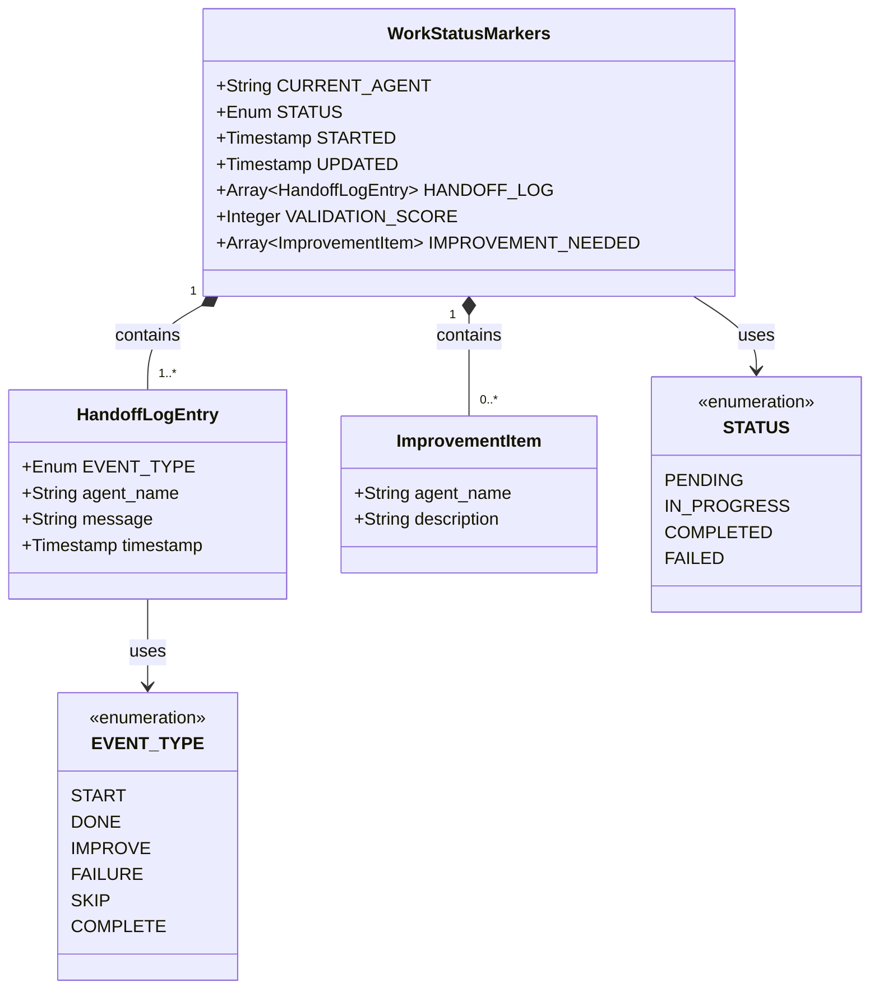

**다이어그램 설명**:
- **WorkStatusMarkers**: 최상위 데이터 구조
- **HandoffLogEntry**: HANDOFF LOG의 개별 엔트리
- **ImprovementItem**: IMPROVEMENT_NEEDED의 개별 항목
- **STATUS**: 4개 상태 열거형
- **EVENT_TYPE**: 6개 이벤트 타입 열거형

---

### 1.5.2 필드 간 관계

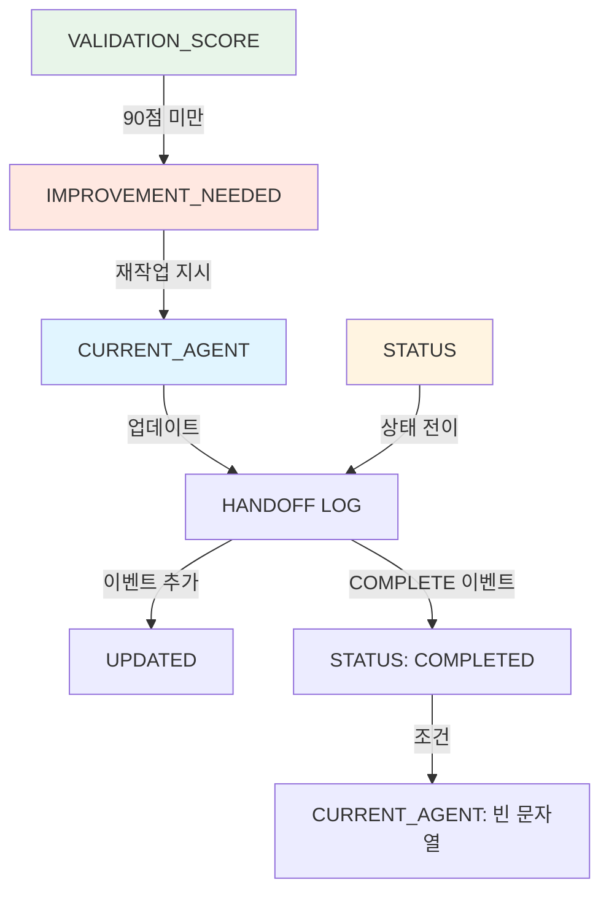

**관계 설명**:
1. **CURRENT_AGENT 업데이트** → HANDOFF LOG 엔트리 추가 → UPDATED 갱신
2. **STATUS 변경** → HANDOFF LOG에 이벤트 기록
3. **VALIDATION_SCORE < 90** → IMPROVEMENT_NEEDED 작성 → CURRENT_AGENT 업데이트
4. **[COMPLETE] 이벤트** → STATUS: COMPLETED + CURRENT_AGENT: ""

---

## Section 1 체크리스트

Phase 2.2 - Step 1 완료 항목:

- [x] 1.1 필수 필드 데이터 스키마 정의
  - [x] CURRENT_AGENT
  - [x] STATUS
  - [x] STARTED
  - [x] UPDATED
  - [x] HANDOFF LOG
- [x] 1.2 선택 필드 데이터 스키마 정의
  - [x] VALIDATION_SCORE
  - [x] IMPROVEMENT_NEEDED
- [x] 1.3 HANDOFF LOG 엔트리 구조 정의
  - [x] 6개 EVENT_TYPE 상세 명세
- [x] 1.4 HTML 주석 형식 명세
  - [x] 주석 경계 처리
  - [x] 단일 줄 / 여러 줄 필드 형식
  - [x] UTF-8 인코딩 요구사항
- [x] 1.5 데이터 구조 다이어그램 (Mermaid)

**다음 섹션**: Section 2 - HANDOFF LOG 파싱 알고리즘

---

# Section 2: HANDOFF LOG 파싱 알고리즘

## 2.1 HTML 주석 추출 알고리즘

### 2.1.1 알고리즘 목적

마크다운 파일에서 Work Status Markers HTML 주석 블록을 추출합니다.

**입력**: 마크다운 파일 전체 내용 (string)

**출력**: Work Status Markers 블록 내용 (string) 또는 오류

**제약사항**:
- HTML 주석은 파일 최상단에 위치
- `<!--`로 시작하여 `-->`로 종료
- 중첩된 주석 없음

---

### 2.1.2 추출 단계

**Step 1: 파일 읽기**
- UTF-8 인코딩으로 파일 전체 읽기
- 파일 존재 확인 (없으면 FILE_NOT_FOUND 오류)
- 인코딩 오류 확인 (UTF-8 불일치 시 ENCODING_ERROR)

**Step 2: HTML 주석 시작 지점 찾기**
- 파일 시작부터 `<!--` 문자열 검색
- 주석 시작 전 공백/개행만 허용
- `<!--` 발견 못하면 MARKER_NOT_FOUND 오류

**Step 3: HTML 주석 종료 지점 찾기**
- `<!--` 이후부터 `-->` 문자열 검색
- `-->` 발견 못하면 INCOMPLETE_MARKER 오류

**Step 4: 주석 내용 추출**
- `<!--`와 `-->` 사이의 텍스트 추출
- 시작/종료 태그는 제외
- 앞뒤 공백 제거

**Step 5: 유효성 검사**
- 추출된 내용이 비어있지 않은지 확인
- 필수 필드 키워드 존재 확인 (CURRENT_AGENT, STATUS, HANDOFF LOG)

---

### 2.1.3 정규식 패턴

**전체 마커 추출 패턴**:
```regex
<!--\s*([\s\S]*?)\s*-->
```

**패턴 설명**:
- `<!--`: HTML 주석 시작 (리터럴)
- `\s*`: 시작 후 선택적 공백
- `([\s\S]*?)`: 캡처 그룹 - 모든 문자 (개행 포함), 비탐욕적 매칭
- `\s*`: 종료 전 선택적 공백
- `-->`: HTML 주석 종료 (리터럴)

**Bash 사용 시**:
```bash
# sed를 사용한 추출
marker_content=$(sed -n '/<!--/,/-->/p' "$file_path" | sed '1d;$d')
```

**참고**: Bash에서는 정규식 다중 줄 매칭이 제한적이므로 sed 명령 사용 권장

---

### 2.1.4 오류 처리

| 오류 코드 | 조건 | 조치 |
|-----------|------|------|
| FILE_NOT_FOUND | 파일이 존재하지 않음 | 파일 경로 확인 요청 |
| ENCODING_ERROR | UTF-8 인코딩 아님 | `iconv`로 변환 후 재시도 |
| MARKER_NOT_FOUND | `<!--` 없음 | 마커가 없는 파일 (초기화 필요) |
| INCOMPLETE_MARKER | `-->` 없음 | 마커 손상 (수동 복구 필요) |
| EMPTY_MARKER | 주석 내용 비어있음 | 마커 손상 (재생성 필요) |

**오류 메시지 형식**:
```
ERROR: <오류코드> - <설명>
FILE: <파일경로>
LINE: <문제발생위치> (가능한 경우)
```

---

## 2.2 필드별 파싱 알고리즘

### 2.2.1 단일 줄 필드 파싱

**대상 필드**: CURRENT_AGENT, STATUS, STARTED, UPDATED, VALIDATION_SCORE

**형식**: `FIELD_NAME: value`

**파싱 단계**:

**Step 1: 필드 라인 찾기**
- 마커 블록에서 필드명으로 시작하는 줄 검색
- 대소문자 구분 (CURRENT_AGENT, not current_agent)

**Step 2: 값 추출**
- 콜론 (`:`) 이후 텍스트 추출
- 앞뒤 공백 제거 (trim)

**Step 3: 데이터 타입 검증**
- CURRENT_AGENT: 문자열 (공백 허용, 빈 문자열 허용)
- STATUS: enum 검증 (PENDING | IN_PROGRESS | COMPLETED | FAILED)
- STARTED, UPDATED: ISO 8601 형식 검증 (Section 3 참조)
- VALIDATION_SCORE: 정수 (0-100 범위)

**Step 4: 필수 필드 확인**
- CURRENT_AGENT, STATUS, STARTED, UPDATED는 반드시 존재
- 없으면 MISSING_REQUIRED_FIELD 오류

---

### 2.2.2 단일 줄 필드 정규식

**필드 추출 패턴**:
```regex
^FIELD_NAME:\s*(.*)$
```

**패턴 설명**:
- `^`: 줄 시작
- `FIELD_NAME:`: 필드명 리터럴 + 콜론
- `\s*`: 선택적 공백
- `(.*)`: 캡처 그룹 - 값 (줄 끝까지)
- `$`: 줄 끝

**Bash 구현 예시**:
```bash
# CURRENT_AGENT 추출
current_agent=$(echo "$marker_content" | grep "^CURRENT_AGENT:" | sed 's/^CURRENT_AGENT:\s*//' | sed 's/\s*$//')

# STATUS 추출
status=$(echo "$marker_content" | grep "^STATUS:" | sed 's/^STATUS:\s*//' | sed 's/\s*$//')
```

---

### 2.2.3 여러 줄 필드 파싱

**대상 필드**: HANDOFF LOG, IMPROVEMENT_NEEDED

**형식**:
```
FIELD_NAME:
entry-line-1
entry-line-2
...
```

**파싱 단계**:

**Step 1: 필드 시작 라인 찾기**
- `FIELD_NAME:` 형식의 줄 검색 (값 없이 콜론만)

**Step 2: 엔트리 라인 수집**
- 필드 시작 라인 다음부터 수집 시작
- 다음 필드명 또는 주석 종료까지 계속
- 각 줄은 배열 요소로 저장

**Step 3: 종료 조건 판별**
- 다음 줄이 대문자로 시작하고 콜론 포함 → 다음 필드 시작
- 다음 줄이 `-->` → 주석 종료
- 빈 줄은 무시 (건너뛰기)

**Step 4: 엔트리 배열 반환**
- 각 엔트리를 배열 요소로 반환
- 빈 배열 허용 (IMPROVEMENT_NEEDED는 선택 필드)

---

### 2.2.4 여러 줄 필드 정규식

**HANDOFF LOG 추출 패턴**:
```regex
^HANDOFF LOG:\s*$(.*?)^(?=[A-Z_]+:|-->)
```

**패턴 설명**:
- `^HANDOFF LOG:\s*$`: 필드명 줄 (값 없음)
- `(.*?)`: 캡처 그룹 - 모든 엔트리 (비탐욕적)
- `^(?=[A-Z_]+:|-->)`: 다음 필드 또는 주석 종료 (전방탐색, 미소비)

**Bash 구현 예시**:
```bash
# HANDOFF LOG 엔트리 추출
handoff_log=$(echo "$marker_content" | sed -n '/^HANDOFF LOG:/,/^[A-Z_]/p' | sed '1d;$d')

# 배열로 변환
IFS=$'\n' read -r -d '' -a log_entries <<< "$handoff_log"
```

---

## 2.3 HANDOFF LOG 엔트리 파싱 알고리즘

### 2.3.1 엔트리 구조 분해

**입력**: HANDOFF LOG 엔트리 한 줄 (string)

**출력**: 4개 구성 요소 (event_type, agent_name, message, timestamp)

**형식**: `[EVENT_TYPE] agent-name | message | YYYY-MM-DDTHH:MM:SS+09:00`

---

### 2.3.2 파싱 단계

**Step 1: EVENT_TYPE 추출**
- `[`와 `]` 사이 텍스트 추출
- 공백 제거
- enum 검증 (START | DONE | IMPROVE | FAILURE | SKIP | COMPLETE)

**Step 2: 파이프 구분자로 분할**
- 엔트리를 ` | ` (공백-파이프-공백)로 분할
- 3개 부분으로 분할되어야 함
- 부분 수가 맞지 않으면 INVALID_ENTRY_FORMAT 오류

**Step 3: agent-name 추출**
- 첫 번째 부분에서 `]` 이후 텍스트 추출
- 앞뒤 공백 제거
- 패턴 검증: `[a-z-]+` (소문자, 하이픈만)

**Step 4: message 추출**
- 두 번째 부분 그대로 사용
- 앞뒤 공백 제거
- 파이프 문자 포함 여부 확인 (포함 시 경고)

**Step 5: timestamp 추출**
- 세 번째 부분 그대로 사용
- 앞뒤 공백 제거
- ISO 8601 형식 검증 (Section 3 참조)

---

### 2.3.3 엔트리 파싱 정규식

**전체 엔트리 파싱 패턴**:
```regex
^\[([A-Z]+)\]\s+([a-z-]+)\s+\|\s+(.*?)\s+\|\s+(\d{4}-\d{2}-\d{2}T\d{2}:\d{2}:\d{2}\+\d{2}:\d{2})$
```

**패턴 설명**:
- `^\[([A-Z]+)\]`: EVENT_TYPE 캡처 (대문자만)
- `\s+`: 공백
- `([a-z-]+)`: agent-name 캡처 (소문자, 하이픈)
- `\s+\|\s+`: 파이프 구분자 (양옆 공백)
- `(.*?)`: message 캡처 (모든 문자, 비탐욕적)
- `\s+\|\s+`: 파이프 구분자
- `(\d{4}-\d{2}-\d{2}T\d{2}:\d{2}:\d{2}\+\d{2}:\d{2})`: timestamp 캡처 (ISO 8601)
- `$`: 줄 끝

**Bash 구현 예시**:
```bash
# 정규식 매칭
if [[ "$entry" =~ ^\[([A-Z]+)\][[:space:]]+([a-z-]+)[[:space:]]+\|[[:space:]]+(.*)[[:space:]]+\|[[:space:]]+([0-9T:+-]+)$ ]]; then
    event_type="${BASH_REMATCH[1]}"
    agent_name="${BASH_REMATCH[2]}"
    message="${BASH_REMATCH[3]}"
    timestamp="${BASH_REMATCH[4]}"
else
    echo "ERROR: INVALID_ENTRY_FORMAT"
    exit 1
fi
```

---

### 2.3.4 EVENT_TYPE 검증

**검증 알고리즘**:

**Step 1: 추출된 EVENT_TYPE을 6개 허용 값과 비교**
```
허용 값: START, DONE, IMPROVE, FAILURE, SKIP, COMPLETE
```

**Step 2: 대소문자 정확히 일치 확인**
- START (O), start (X), Start (X)

**Step 3: 불일치 시 오류**
- 오류 코드: INVALID_EVENT_TYPE
- 오류 메시지: "Unknown event type: <값>. Expected one of: START, DONE, IMPROVE, FAILURE, SKIP, COMPLETE"

**Bash 구현 예시**:
```bash
valid_event_types=("START" "DONE" "IMPROVE" "FAILURE" "SKIP" "COMPLETE")

if [[ ! " ${valid_event_types[@]} " =~ " ${event_type} " ]]; then
    echo "ERROR: INVALID_EVENT_TYPE - Unknown event type: $event_type"
    exit 1
fi
```

---

### 2.3.5 agent-name 검증

**검증 패턴**: `^[a-z-]+$`

**검증 규칙**:
- 소문자 영문자만 허용 (a-z)
- 하이픈 허용 (-)
- 최소 1자 이상
- 숫자, 대문자, 언더스코어 불가

**예외 규칙**:
- `pipeline` (START 이벤트 전용 특수 이름)
- 에이전트 이름 목록 (고정):
  - content-initiator
  - overview-writer
  - concepts-writer
  - visualization-writer
  - practice-writer
  - quiz-writer
  - content-validator

**Bash 구현 예시**:
```bash
if [[ ! "$agent_name" =~ ^[a-z-]+$ ]]; then
    echo "ERROR: INVALID_AGENT_NAME - Agent name must match [a-z-]+"
    exit 1
fi
```

---

## 2.4 파싱 오류 처리 전략

### 2.4.1 오류 분류

| 오류 레벨 | 설명 | 조치 |
|-----------|------|------|
| **CRITICAL** | 필수 필드 누락, 마커 손상 | 즉시 중단, 복구 필요 |
| **ERROR** | 형식 오류, 검증 실패 | 즉시 중단, 수정 필요 |
| **WARNING** | 선택 필드 누락, 형식 불일치 | 계속 진행, 경고 기록 |

---

### 2.4.2 필수 필드 누락 시

**오류 조건**:
- CURRENT_AGENT, STATUS, STARTED, UPDATED, HANDOFF LOG 중 하나라도 없음

**오류 메시지**:
```
CRITICAL: MISSING_REQUIRED_FIELD
Missing field: CURRENT_AGENT
File: /path/to/file.md
Action: Add missing field to Work Status Markers
```

**복구 전략**:
1. 파일 백업
2. 누락된 필드 기본값으로 추가:
   - CURRENT_AGENT: ""
   - STATUS: PENDING
   - STARTED: 현재 시각
   - UPDATED: 현재 시각
   - HANDOFF LOG: `[START] pipeline | Content generation started | <timestamp>`
3. 재파싱 시도

---

### 2.4.3 형식 오류 시

**오류 조건**:
- 필드 형식이 명세와 불일치
- 정규식 매칭 실패
- 데이터 타입 불일치

**오류 메시지**:
```
ERROR: INVALID_FORMAT
Field: STATUS
Expected: PENDING | IN_PROGRESS | COMPLETED | FAILED
Actual: in_progress
Line: 3
Action: Fix field value to match specification
```

**복구 전략**:
1. 파일 백업
2. 자동 수정 가능한 경우:
   - 대소문자 불일치 → 대문자로 변환
   - 공백 문제 → trim 처리
3. 자동 수정 불가능한 경우:
   - 오류 상세 보고
   - 수동 수정 요청

---

### 2.4.4 인코딩 오류 시

**오류 조건**:
- UTF-8 인코딩이 아님
- 한글 깨짐 (`�` 문자)
- 바이트 시퀀스 오류

**오류 메시지**:
```
ERROR: ENCODING_ERROR
File: /path/to/file.md
Expected encoding: UTF-8
Detected encoding: EUC-KR (또는 ISO-8859-1)
Action: Convert file to UTF-8
```

**복구 전략**:
```bash
# 인코딩 감지
detected_encoding=$(file -I "$file_path" | sed 's/.*charset=//')

# UTF-8로 변환
if [ "$detected_encoding" != "utf-8" ]; then
    iconv -f "$detected_encoding" -t UTF-8 "$file_path" > "$file_path.utf8"
    mv "$file_path.utf8" "$file_path"
fi
```

---

## 2.5 파싱 알고리즘 다이어그램

### 2.5.1 전체 파싱 흐름

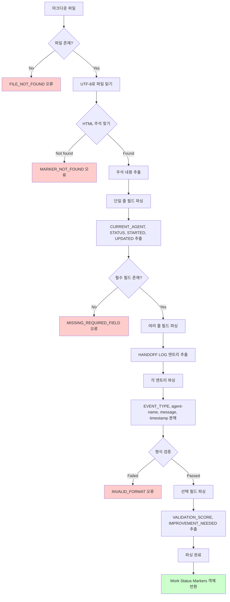

---

### 2.5.2 HANDOFF LOG 엔트리 파싱 상세

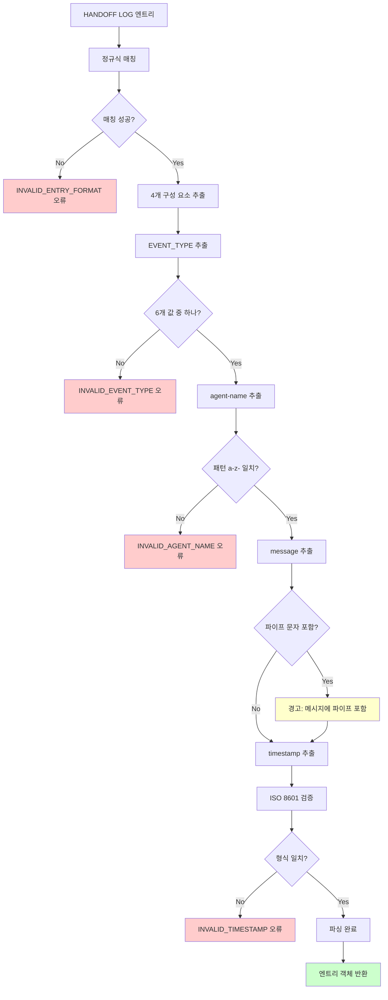

---

## Section 2 체크리스트

Phase 2.2 - Step 2 완료 항목:

- [x] 2.1 HTML 주석 추출 알고리즘
  - [x] 추출 단계 명세
  - [x] 정규식 패턴
  - [x] 오류 처리
- [x] 2.2 필드별 파싱 알고리즘
  - [x] 단일 줄 필드 파싱
  - [x] 여러 줄 필드 파싱
  - [x] 정규식 패턴
- [x] 2.3 HANDOFF LOG 엔트리 파싱 알고리즘
  - [x] 구조 분해 단계
  - [x] 정규식 패턴
  - [x] EVENT_TYPE 검증
  - [x] agent-name 검증
- [x] 2.4 파싱 오류 처리 전략
  - [x] 오류 분류
  - [x] 복구 전략
- [x] 2.5 파싱 알고리즘 다이어그램 (Mermaid)

**다음 섹션**: Section 3 - 타임스탬프 검증 로직

---

# Section 3: 타임스탬프 검증 로직

## 3.1 ISO 8601 형식 검증 규칙

### 3.1.1 형식 명세

**표준 형식**: `YYYY-MM-DDTHH:MM:SS+09:00`

**구성 요소**:

| 구성 요소 | 설명 | 형식 | 예시 |
|-----------|------|------|------|
| YYYY | 4자리 연도 | `\d{4}` | 2025 |
| MM | 2자리 월 (01-12) | `\d{2}` | 10 |
| DD | 2자리 일 (01-31) | `\d{2}` | 14 |
| T | 날짜/시간 구분자 | 리터럴 `T` | T |
| HH | 2자리 시 (00-23) | `\d{2}` | 18 |
| MM | 2자리 분 (00-59) | `\d{2}` | 15 |
| SS | 2자리 초 (00-59) | `\d{2}` | 00 |
| +09:00 | 타임존 오프셋 | `[+-]\d{2}:\d{2}` | +09:00 |

**예시**:
- ✅ 유효: `2025-10-14T18:15:00+09:00`
- ✅ 유효: `2025-01-01T00:00:00+09:00`
- ❌ 무효: `2025-10-14 18:15:00` (T 구분자 없음)
- ❌ 무효: `2025-10-14T18:15:00` (타임존 없음)
- ❌ 무효: `2025-10-14T18:15:00Z` (Z 대신 +09:00 필요)

---

### 3.1.2 정규식 패턴

**ISO 8601 검증 패턴**:
```regex
^\d{4}-\d{2}-\d{2}T\d{2}:\d{2}:\d{2}[+-]\d{2}:\d{2}$
```

**패턴 설명**:
- `^\d{4}`: 4자리 연도
- `-\d{2}`: 2자리 월
- `-\d{2}`: 2자리 일
- `T`: 리터럴 T
- `\d{2}:\d{2}:\d{2}`: 시:분:초
- `[+-]\d{2}:\d{2}`: 타임존 (+09:00 또는 -05:00 등)
- `$`: 문자열 끝

**Bash 검증 예시**:
```bash
timestamp_pattern="^[0-9]{4}-[0-9]{2}-[0-9]{2}T[0-9]{2}:[0-9]{2}:[0-9]{2}[+-][0-9]{2}:[0-9]{2}$"

if [[ ! "$timestamp" =~ $timestamp_pattern ]]; then
    echo "ERROR: INVALID_TIMESTAMP - Timestamp must match ISO 8601 format"
    exit 1
fi
```

---

### 3.1.3 의미적 검증 규칙

정규식 검증 후 추가로 의미적 유효성 검증:

**월 범위 검증**:
- 01-12 범위 확인
- 00월, 13월 등 거부

**일 범위 검증**:
- 01-31 범위 확인
- 월별 최대 일수 확인:
  - 1, 3, 5, 7, 8, 10, 12월: 31일
  - 4, 6, 9, 11월: 30일
  - 2월: 28일 (윤년 29일)

**시간 범위 검증**:
- 시: 00-23
- 분: 00-59
- 초: 00-59

**타임존 검증**:
- +09:00 (한국 표준시) 권장
- 다른 타임존도 허용 (예: +00:00, -05:00)

**Bash 의미적 검증 예시**:
```bash
# date 명령으로 유효성 검증
if ! date -d "$timestamp" > /dev/null 2>&1; then
    echo "ERROR: INVALID_TIMESTAMP - Invalid date/time values"
    exit 1
fi
```

---

## 3.2 타임스탬프 생성 로직

### 3.2.1 현재 시각 생성

**목적**: 새 Work Status Markers 생성 또는 필드 갱신 시 현재 시각 타임스탬프 생성

**Bash date 명령 형식**:
```bash
current_timestamp=$(date +"%Y-%m-%dT%H:%M:%S%:z")
```

**형식 지정자 설명**:
- `%Y`: 4자리 연도
- `%m`: 2자리 월 (01-12)
- `%d`: 2자리 일 (01-31)
- `T`: 리터럴 T
- `%H`: 2자리 시 (00-23)
- `%M`: 2자리 분 (00-59)
- `%S`: 2자리 초 (00-59)
- `%:z`: 타임존 (+09:00 형식)

**출력 예시**:
```
2025-10-14T18:15:00+09:00
```

---

### 3.2.2 타임존 설정

**한국 표준시 (KST) 설정**:
```bash
export TZ="Asia/Seoul"
current_timestamp=$(date +"%Y-%m-%dT%H:%M:%S%:z")
```

**기타 타임존 예시**:
- UTC: `TZ="UTC"` → `2025-10-14T09:15:00+00:00`
- 미국 동부: `TZ="America/New_York"` → `2025-10-14T05:15:00-04:00`

**주의사항**:
- 모든 타임스탬프는 동일한 타임존 사용 권장 (+09:00)
- 타임존 혼용 시 STARTED ≤ UPDATED 검증에 주의

---

## 3.3 타임스탬프 비교 로직

### 3.3.1 STARTED ≤ UPDATED 검증

**도메인 불변식** (domain_design.md Section 5.1.3):
- STARTED (파이프라인 시작 시각)는 UPDATED (마지막 업데이트 시각)보다 이전이거나 같아야 함

**비교 알고리즘**:

**Step 1: 타임스탬프를 Unix 시간으로 변환**
```bash
started_unix=$(date -d "$started" +%s)
updated_unix=$(date -d "$updated" +%s)
```

**Step 2: 숫자 비교**
```bash
if [ "$started_unix" -gt "$updated_unix" ]; then
    echo "ERROR: INVALID_TIMESTAMPS - STARTED ($started) is after UPDATED ($updated)"
    exit 1
fi
```

**오류 예시**:
```
STARTED: 2025-10-14T20:00:00+09:00
UPDATED: 2025-10-14T18:00:00+09:00

ERROR: INVALID_TIMESTAMPS - STARTED is after UPDATED (2 hours difference)
```

---

### 3.3.2 HANDOFF LOG 시간 순서 검증

**도메인 불변식** (domain_design.md Section 5.2.3):
- HANDOFF LOG 엔트리는 타임스탬프 순서대로 정렬되어야 함

**검증 알고리즘**:

**Step 1: 모든 엔트리의 타임스탬프 추출**
```bash
IFS=$'\n' read -r -d '' -a timestamps <<< "$(echo "$handoff_log" | grep -o '[0-9T:+-]\{25\}')"
```

**Step 2: 순차적으로 비교**
```bash
prev_unix=0
for i in "${!timestamps[@]}"; do
    current_unix=$(date -d "${timestamps[$i]}" +%s)
    if [ "$current_unix" -lt "$prev_unix" ]; then
        echo "ERROR: HANDOFF_LOG_OUT_OF_ORDER - Entry $i is out of chronological order"
        exit 1
    fi
    prev_unix=$current_unix
done
```

**오류 예시**:
```
[DONE] overview-writer | ... | 2025-10-14T18:20:00+09:00
[DONE] concepts-writer | ... | 2025-10-14T18:15:00+09:00  ← ERROR: 이전 엔트리보다 빠름
```

---

### 3.3.3 타임스탬프 차이 계산

**목적**: 작업 소요 시간 측정, 성능 분석

**계산 방법**:
```bash
start_unix=$(date -d "$started" +%s)
end_unix=$(date -d "$updated" +%s)
diff_seconds=$((end_unix - start_unix))
```

**시간 단위 변환**:
```bash
diff_minutes=$((diff_seconds / 60))
diff_hours=$((diff_seconds / 3600))
diff_days=$((diff_seconds / 86400))
```

**사람이 읽기 쉬운 형식**:
```bash
human_readable=$(printf "%dd %dh %dm %ds" $((diff_seconds/86400)) $((diff_seconds%86400/3600)) $((diff_seconds%3600/60)) $((diff_seconds%60)))
```

**출력 예시**:
```
Pipeline duration: 0d 0h 35m 12s
```

---

## 3.4 검증 실패 시 오류 메시지

### 3.4.1 형식 오류

**오류 메시지**:
```
ERROR: INVALID_TIMESTAMP_FORMAT
Field: STARTED
Value: 2025-10-14 18:15:00
Expected format: YYYY-MM-DDTHH:MM:SS+09:00
Example: 2025-10-14T18:15:00+09:00

Fix:
1. Add 'T' separator between date and time
2. Add timezone offset (+09:00 for KST)
3. Use 24-hour format (00-23)
```

---

### 3.4.2 의미적 오류

**무효한 날짜**:
```
ERROR: INVALID_DATE
Value: 2025-02-31T18:15:00+09:00
Reason: February 31st does not exist (max 28 or 29 days)

Fix: Check month/day combination is valid
```

**시간 순서 오류**:
```
ERROR: TIMESTAMPS_OUT_OF_ORDER
STARTED: 2025-10-14T20:00:00+09:00
UPDATED: 2025-10-14T18:00:00+09:00
Reason: STARTED (20:00) is after UPDATED (18:00)

Fix: Ensure STARTED ≤ UPDATED
```

---

## Section 3 체크리스트

Phase 2.2 - Step 3 완료 항목:

- [x] 3.1 ISO 8601 형식 검증 규칙
  - [x] 형식 명세
  - [x] 정규식 패턴
  - [x] 의미적 검증
- [x] 3.2 타임스탬프 생성 로직
  - [x] 현재 시각 생성 (Bash date 명령)
  - [x] 타임존 설정
- [x] 3.3 타임스탬프 비교 로직
  - [x] STARTED ≤ UPDATED 검증
  - [x] HANDOFF LOG 시간 순서 검증
  - [x] 시간 차이 계산
- [x] 3.4 검증 실패 시 오류 메시지

**다음 섹션**: Section 4 - 마커 읽기/쓰기 인터페이스 (에이전트용)

---

# Section 4: 마커 읽기/쓰기 인터페이스

## 설계 원칙 (중요)

**에이전트 자율성 강조**:

이 섹션에서 설계하는 모든 인터페이스는 **에이전트가 직접 호출하는 헬퍼 함수**입니다.

**핵심 원칙** (domain_design.md Section 1.1):
1. **에이전트가 Handoff Protocol을 따라 마커를 직접 읽고 쓴다**
2. **오케스트레이션은 검증만 수행, 마커를 직접 조작하지 않음**
3. **Unit 3 (Agent Prompts)에서 에이전트가 이 함수 사용법을 명시받음**

**책임 분리**:
- **에이전트**: 마커 읽기/쓰기 (이 섹션의 함수 사용)
- **오케스트레이션**: 사전/사후 검증 (검증 함수만 사용)

---

## 4.1 읽기 인터페이스 설계 (에이전트용)

### 4.1.1 parse_work_status_markers

**용도**: **에이전트가 Precondition 확인 시 호출** (domain_design.md Section 4.1)

**함수 시그니처**:
```
parse_work_status_markers(file_path)
```

**Parameters**:

| 매개변수 | 타입 | 설명 |
|----------|------|------|
| file_path | string | 마크다운 파일 절대 경로 |

**Returns**:

| 필드 | 타입 | 설명 |
|------|------|------|
| CURRENT_AGENT | string | 현재 에이전트 이름 (빈 문자열 가능) |
| STATUS | enum | PENDING \| IN_PROGRESS \| COMPLETED \| FAILED |
| STARTED | timestamp | 파이프라인 시작 시각 (ISO 8601) |
| UPDATED | timestamp | 마지막 업데이트 시각 (ISO 8601) |
| HANDOFF_LOG | array[string] | 핸드오프 로그 엔트리 배열 |
| VALIDATION_SCORE | integer | 검증 점수 (0-100, 선택 필드) |
| IMPROVEMENT_NEEDED | array[string] | 개선 항목 배열 (선택 필드) |

**Errors**:

| 오류 코드 | 조건 | 에이전트 조치 |
|-----------|------|---------------|
| FILE_NOT_FOUND | 파일 없음 | 작업 중단, 오류 보고 |
| MARKER_NOT_FOUND | HTML 주석 없음 | 초기화 필요 (content-initiator 호출) |
| INVALID_FORMAT | 형식 오류 | 작업 중단, 복구 요청 |
| MISSING_REQUIRED_FIELD | 필수 필드 누락 | 작업 중단, 복구 요청 |

**사용 시나리오**:

**에이전트 Precondition 확인** (domain_design.md Section 4.1):
```
1. 에이전트가 작업 시작 전 parse_work_status_markers 호출
2. CURRENT_AGENT 필드 확인:
   - 자신의 이름과 일치하는가?
   - 일치하지 않으면 작업 건너뛰기 (다른 에이전트의 차례)
3. 필수 입력 섹션 존재 확인:
   - overview-writer는 별도 입력 불필요
   - concepts-writer는 Overview 섹션 존재 확인
4. STATUS 확인:
   - FAILED 상태면 재시작 처리
```

**Bash 구현 가이드**:
```bash
# parse_work_status_markers 호출
source scripts/lib/work-status-markers.sh
parse_work_status_markers "/path/to/content.md"

# 반환 값 사용
if [ "$CURRENT_AGENT" != "concepts-writer" ]; then
    echo "Not my turn, skipping..."
    exit 0
fi

if [ "$STATUS" == "FAILED" ]; then
    echo "Restarting from failure..."
fi
```

---

### 4.1.2 get_last_handoff_event

**용도**: **에이전트가 마지막 이벤트 확인 시 호출** (재시작 메커니즘 지원)

**함수 시그니처**:
```
get_last_handoff_event(file_path, event_type)
```

**Parameters**:

| 매개변수 | 타입 | 설명 |
|----------|------|------|
| file_path | string | 마크다운 파일 절대 경로 |
| event_type | enum | 찾을 이벤트 타입 (DONE, IMPROVE, FAILURE 등) |

**Returns**:

| 필드 | 타입 | 설명 |
|------|------|------|
| agent_name | string | 이벤트를 발생시킨 에이전트 이름 |
| message | string | 이벤트 메시지 |
| timestamp | timestamp | 이벤트 발생 시각 |
| found | boolean | 해당 이벤트 발견 여부 |

**Errors**: (parse_work_status_markers와 동일)

**사용 시나리오**:

**재시작 지점 식별**:
```
1. 오케스트레이션이 get_last_handoff_event("file.md", "FAILURE") 호출
2. [FAILURE] 이벤트 발견 시:
   - agent_name 필드로 실패한 에이전트 식별
   - 해당 에이전트 재실행
```

---

## 4.2 쓰기 인터페이스 설계 (에이전트용)

### 4.2.1 write_work_status_markers

**용도**: **에이전트가 Postcondition 보장 시 호출** (domain_design.md Section 4.2)

**함수 시그니처**:
```
write_work_status_markers(file_path, fields_map)
```

**Parameters**:

| 매개변수 | 타입 | 설명 |
|----------|------|------|
| file_path | string | 마크다운 파일 절대 경로 |
| fields_map | map | 업데이트할 필드와 값 (key-value 쌍) |

**fields_map 구조**:
```
fields_map = {
    "CURRENT_AGENT": "next-agent-name",
    "STATUS": "IN_PROGRESS",
    "UPDATED": "2025-10-14T18:20:00+09:00"
}
```

**Returns**:

| 반환 값 | 타입 | 설명 |
|---------|------|------|
| success | boolean | true (성공) 또는 false (실패) |

**Errors**:

| 오류 코드 | 조건 | 에이전트 조치 |
|-----------|------|---------------|
| WRITE_FAILED | 파일 쓰기 실패 | 재시도 또는 오류 보고 |
| VALIDATION_FAILED | 업데이트 후 검증 실패 | 롤백, 오류 보고 |
| PERMISSION_DENIED | 파일 쓰기 권한 없음 | 권한 확인 요청 |

**원자성 보장 방법**:

**Step 1: 임시 파일에 쓰기**
```bash
temp_file="${file_path}.tmp"
# 마커 업데이트 후 temp_file에 저장
```

**Step 2: 검증**
```bash
validate_work_status_markers "$temp_file"
```

**Step 3: 원본 교체**
```bash
if [ $? -eq 0 ]; then
    mv "$temp_file" "$file_path"
else
    rm "$temp_file"
    return 1
fi
```

**사용 시나리오**:

**에이전트 Postcondition 수행** (domain_design.md Section 4.2):
```
1. 에이전트가 작업 완료 후 write_work_status_markers 호출
2. 업데이트할 필드:
   - CURRENT_AGENT: 다음 에이전트 이름
   - STATUS: IN_PROGRESS (또는 COMPLETED)
   - UPDATED: 현재 시각
3. 실패 시 롤백, 재시도
```

---

## 4.3 부분 업데이트 인터페이스 설계 (에이전트용)

### 4.3.1 update_current_agent

**용도**: **에이전트가 핸드오프 시 호출** (CURRENT_AGENT 필드만 업데이트)

**함수 시그니처**:
```
update_current_agent(file_path, agent_name)
```

**Parameters**:

| 매개변수 | 타입 | 설명 |
|----------|------|------|
| file_path | string | 마크다운 파일 절대 경로 |
| agent_name | string | 다음 에이전트 이름 (빈 문자열 가능) |

**동작**:
1. CURRENT_AGENT 필드 업데이트
2. UPDATED 타임스탬프 자동 갱신

**Returns**: success (boolean)

**Errors**: (write_work_status_markers와 동일)

---

### 4.3.2 append_handoff_log

**용도**: **에이전트가 작업 완료 시 호출** (HANDOFF LOG 엔트리 추가)

**함수 시그니처**:
```
append_handoff_log(file_path, event_type, agent_name, message)
```

**Parameters**:

| 매개변수 | 타입 | 설명 |
|----------|------|------|
| file_path | string | 마크다운 파일 절대 경로 |
| event_type | enum | START \| DONE \| IMPROVE \| FAILURE \| SKIP \| COMPLETE |
| agent_name | string | 에이전트 이름 |
| message | string | 이벤트 설명 메시지 |

**동작**:
1. 현재 시각으로 타임스탬프 생성
2. 형식에 맞춰 엔트리 생성: `[EVENT_TYPE] agent-name | message | timestamp`
3. HANDOFF LOG 끝에 추가 (Append-Only)
4. UPDATED 타임스탬프 자동 갱신

**Returns**: success (boolean)

**Errors**: (write_work_status_markers와 동일)

**사용 시나리오**:

**에이전트 작업 완료** (domain_design.md Section 4.2):
```bash
# overview-writer가 작업 완료 후 호출
append_handoff_log "/path/to/content.md" "DONE" "overview-writer" "Overview section completed"

# 결과:
# [DONE] overview-writer | Overview section completed | 2025-10-14T18:20:00+09:00
```

---

### 4.3.3 set_validation_score

**용도**: **content-validator가 점수 기록 시 호출**

**함수 시그니처**:
```
set_validation_score(file_path, score)
```

**Parameters**:

| 매개변수 | 타입 | 설명 |
|----------|------|------|
| file_path | string | 마크다운 파일 절대 경로 |
| score | integer | 검증 점수 (0-100) |

**동작**:
1. VALIDATION_SCORE 필드 추가 또는 업데이트
2. score < 90 시 STATUS를 IN_PROGRESS 유지
3. score ≥ 90 시 다음 단계로 (append_handoff_log로 COMPLETE 기록)

**Returns**: success (boolean)

**Errors**: (write_work_status_markers와 동일) + INVALID_SCORE (범위 오류)

---

### 4.3.4 set_improvement_needed

**용도**: **content-validator가 개선 항목 기록 시 호출**

**함수 시그니처**:
```
set_improvement_needed(file_path, improvements_map)
```

**Parameters**:

| 매개변수 | 타입 | 설명 |
|----------|------|------|
| file_path | string | 마크다운 파일 절대 경로 |
| improvements_map | map | 에이전트별 개선 사항 (key: agent, value: description) |

**improvements_map 구조**:
```
improvements_map = {
    "concepts-writer": "난이도별 설명 길이 불균형 (Easy 너무 짧음)",
    "visualization-writer": "시각화 컴포넌트 인터랙션 부족"
}
```

**동작**:
1. IMPROVEMENT_NEEDED 필드 추가 또는 업데이트
2. YAML 리스트 형식으로 작성
3. UPDATED 타임스탬프 자동 갱신

**Returns**: success (boolean)

---

## 4.4 검증 인터페이스 설계 (오케스트레이션용)

### 4.4.1 validate_work_status_markers

**용도**: **오케스트레이션이 사전/사후 검증 시 호출** (마커 조작 안함)

**함수 시그니처**:
```
validate_work_status_markers(file_path)
```

**Parameters**:

| 매개변수 | 타입 | 설명 |
|----------|------|------|
| file_path | string | 마크다운 파일 절대 경로 |

**Returns**:

| 필드 | 타입 | 설명 |
|------|------|------|
| valid | boolean | 전체 검증 성공 여부 |
| errors | array[string] | 오류 메시지 배열 (valid=false 시) |
| warnings | array[string] | 경고 메시지 배열 (선택 필드 관련) |

**검증 항목** (domain_design.md Section 5):

1. **필수 필드 존재**:
   - CURRENT_AGENT, STATUS, STARTED, UPDATED, HANDOFF LOG

2. **필드 형식 정확성**:
   - STATUS: enum 4개 값 중 하나
   - STARTED, UPDATED: ISO 8601 형식
   - VALIDATION_SCORE: 0-100 범위

3. **도메인 불변식**:
   - STARTED ≤ UPDATED
   - HANDOFF LOG Append-Only (시간 순서)
   - STATUS = COMPLETED이면 CURRENT_AGENT = ""

4. **상태 전이 유효성**:
   - STATUS 전이가 허용되는가 (Section 6.1 참조)

**오류 출력 형식**:
```
{
  "valid": false,
  "errors": [
    "MISSING_REQUIRED_FIELD: CURRENT_AGENT",
    "INVALID_TIMESTAMP: STARTED is after UPDATED"
  ],
  "warnings": [
    "OPTIONAL_FIELD_MISSING: VALIDATION_SCORE"
  ]
}
```

**사용 시나리오**:

**오케스트레이션 사전 검증** (Unit 4):
```bash
# 에이전트 실행 전 검증
validate_work_status_markers "/path/to/content.md"
if [ "$valid" == "false" ]; then
    echo "Precondition failed: ${errors[@]}"
    exit 1
fi

# 에이전트 실행...
claude -p .claude/agents/concepts-writer.md

# 에이전트 실행 후 검증
validate_work_status_markers "/path/to/content.md"
if [ "$valid" == "false" ]; then
    echo "Postcondition failed: ${errors[@]}"
    # 롤백 또는 복구
fi
```

---

## 4.5 인터페이스 계층 구조

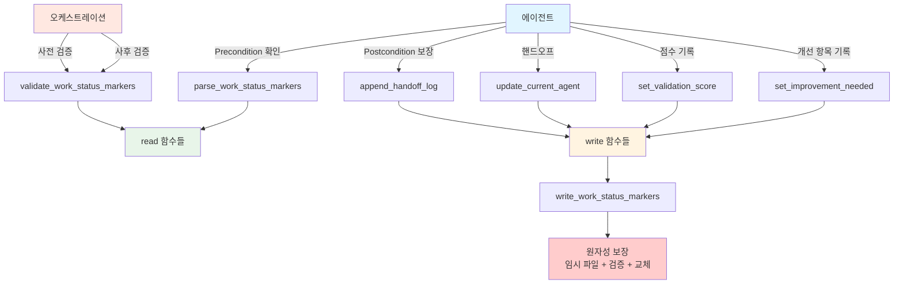

**계층 설명**:
- **최상위**: 에이전트, 오케스트레이션
- **중간**: 목적별 함수 (parse, append, update, validate)
- **하위**: 기본 read/write 함수
- **최하위**: 원자성 보장 메커니즘

---

## Section 4 체크리스트

Phase 2.2 - Step 4 완료 항목:

- [x] 설계 원칙 명시 (에이전트 자율성 강조)
- [x] 4.1 읽기 인터페이스 설계 (에이전트용)
  - [x] parse_work_status_markers
  - [x] get_last_handoff_event
- [x] 4.2 쓰기 인터페이스 설계 (에이전트용)
  - [x] write_work_status_markers
  - [x] 원자성 보장 방법
- [x] 4.3 부분 업데이트 인터페이스 설계 (에이전트용)
  - [x] update_current_agent (핸드오프 시)
  - [x] append_handoff_log (작업 완료 시)
  - [x] set_validation_score (점수 기록 시)
  - [x] set_improvement_needed (개선 항목 기록 시)
- [x] 4.4 검증 인터페이스 설계 (오케스트레이션용)
  - [x] validate_work_status_markers (검증만, 조작 안함)
- [x] 4.5 인터페이스 계층 구조 다이어그램

**다음 섹션**: Section 5 - 재시작 메커니즘 로직

---

# Section 5: 재시작 메커니즘 로직

## 5.1 재시작 지점 식별 알고리즘

### 5.1.1 5단계 우선순위 알고리즘

**목적**: 파이프라인 중단 후 재시작 시 어느 에이전트부터 실행할지 결정

**우선순위 순서** (domain_design.md Section 8.3.3, FD-3):

```
Priority 1: IMPROVEMENT_NEEDED 확인
Priority 2: CURRENT_AGENT 확인
Priority 3: HANDOFF LOG 마지막 [FAILURE] 확인
Priority 4: [COMPLETE] 확인
Priority 5: 마지막 [DONE] 또는 [IMPROVE] 다음 에이전트
```

---

### 5.1.2 Priority 1: IMPROVEMENT_NEEDED 확인

**조건**: IMPROVEMENT_NEEDED 필드 존재

**동작**:
1. IMPROVEMENT_NEEDED 필드 파싱
2. 개선 필요한 에이전트 목록 추출
3. 첫 번째 에이전트를 재시작 지점으로 선택

**알고리즘**:
```
Step 1: parse_work_status_markers(file_path)
Step 2: if IMPROVEMENT_NEEDED exists:
  Step 3: improvements = parse IMPROVEMENT_NEEDED field
  Step 4: first_agent = improvements[0].agent_name
  Step 5: return first_agent
```

**예시**:
```
IMPROVEMENT_NEEDED:
- concepts-writer: 난이도별 설명 길이 불균형
- visualization-writer: 시각화 컴포넌트 인터랙션 부족

→ 재시작 지점: concepts-writer
```

**Bash 구현 가이드**:
```bash
# IMPROVEMENT_NEEDED 필드 확인
improvement_needed=$(echo "$marker_content" | sed -n '/^IMPROVEMENT_NEEDED:/,/^[A-Z_]/p' | sed '1d;$d')

if [ -n "$improvement_needed" ]; then
    # 첫 번째 에이전트 추출
    restart_agent=$(echo "$improvement_needed" | head -1 | sed 's/^- \([^:]*\):.*/\1/')
    echo "Priority 1: Restarting from $restart_agent (improvement needed)"
    exit 0
fi
```

---

### 5.1.3 Priority 2: CURRENT_AGENT 확인

**조건**: CURRENT_AGENT 필드가 비어있지 않음

**동작**:
1. CURRENT_AGENT 필드 읽기
2. 해당 에이전트를 재시작 지점으로 선택

**알고리즘**:
```
Step 1: parse_work_status_markers(file_path)
Step 2: if CURRENT_AGENT != "":
  Step 3: return CURRENT_AGENT
```

**예시**:
```
CURRENT_AGENT: concepts-writer
STATUS: IN_PROGRESS

→ 재시작 지점: concepts-writer
```

**의미**: 파이프라인이 concepts-writer 차례에서 중단됨

**Bash 구현 가이드**:
```bash
current_agent=$(echo "$marker_content" | grep "^CURRENT_AGENT:" | sed 's/^CURRENT_AGENT:\s*//')

if [ -n "$current_agent" ]; then
    echo "Priority 2: Restarting from $current_agent (current agent)"
    exit 0
fi
```

---

### 5.1.4 Priority 3: HANDOFF LOG 마지막 [FAILURE] 확인

**조건**: HANDOFF LOG에 [FAILURE] 이벤트 존재

**동작**:
1. HANDOFF LOG에서 [FAILURE] 이벤트 검색
2. 마지막 [FAILURE] 이벤트의 agent_name 추출
3. 해당 에이전트를 재시작 지점으로 선택

**알고리즘**:
```
Step 1: parse_work_status_markers(file_path)
Step 2: failure_events = filter HANDOFF LOG by EVENT_TYPE == "FAILURE"
Step 3: if failure_events not empty:
  Step 4: last_failure = failure_events[-1]
  Step 5: return last_failure.agent_name
```

**예시**:
```
HANDOFF LOG:
[START] pipeline | ... | 2025-10-14T18:15:00+09:00
[DONE] overview-writer | ... | 2025-10-14T18:20:00+09:00
[FAILURE] concepts-writer | Failed to parse metadata | 2025-10-14T18:25:00+09:00

→ 재시작 지점: concepts-writer
```

**Bash 구현 가이드**:
```bash
# 마지막 FAILURE 이벤트 찾기
last_failure=$(echo "$handoff_log" | grep '^\[FAILURE\]' | tail -1)

if [ -n "$last_failure" ]; then
    # agent_name 추출
    failure_agent=$(echo "$last_failure" | sed 's/^\[FAILURE\]\s*\([a-z-]*\).*/\1/')
    echo "Priority 3: Restarting from $failure_agent (after failure)"
    exit 0
fi
```

---

### 5.1.5 Priority 4: [COMPLETE] 확인

**조건**: HANDOFF LOG에 [COMPLETE] 이벤트 존재

**동작**:
1. HANDOFF LOG에서 [COMPLETE] 이벤트 검색
2. [COMPLETE] 발견 시 재시작 불가 판정

**알고리즘**:
```
Step 1: parse_work_status_markers(file_path)
Step 2: complete_event = find [COMPLETE] in HANDOFF LOG
Step 3: if complete_event exists:
  Step 4: return ERROR: "Pipeline already completed, restart not allowed"
```

**예시**:
```
HANDOFF LOG:
...
[COMPLETE] content-validator | All content validated | 2025-10-14T18:50:00+09:00

→ 오류: 파이프라인 이미 완료, 재시작 불가
```

**Bash 구현 가이드**:
```bash
# COMPLETE 이벤트 확인
complete_event=$(echo "$handoff_log" | grep '^\[COMPLETE\]')

if [ -n "$complete_event" ]; then
    echo "ERROR: Pipeline already completed, restart not allowed"
    echo "Use --force flag to override"
    exit 1
fi
```

---

### 5.1.6 Priority 5: 마지막 [DONE] 또는 [IMPROVE] 다음 에이전트

**조건**: Priority 1-4 모두 해당 없음

**동작**:
1. HANDOFF LOG에서 마지막 [DONE] 또는 [IMPROVE] 이벤트 찾기
2. 해당 에이전트의 다음 에이전트를 재시작 지점으로 선택

**알고리즘**:
```
Step 1: parse_work_status_markers(file_path)
Step 2: last_event = find last [DONE] or [IMPROVE] in HANDOFF LOG
Step 3: completed_agent = last_event.agent_name
Step 4: next_agent = get_next_agent(completed_agent)
Step 5: return next_agent
```

**에이전트 순서** (파이프라인 정의):
```
content-initiator → overview-writer → concepts-writer →
visualization-writer → practice-writer → quiz-writer → content-validator
```

**예시**:
```
HANDOFF LOG:
[START] pipeline | ... | 2025-10-14T18:15:00+09:00
[DONE] content-initiator | ... | 2025-10-14T18:16:00+09:00
[DONE] overview-writer | ... | 2025-10-14T18:20:00+09:00

→ 재시작 지점: concepts-writer (overview-writer 다음)
```

**Bash 구현 가이드**:
```bash
# 마지막 DONE 또는 IMPROVE 이벤트 찾기
last_done_or_improve=$(echo "$handoff_log" | grep -E '^\[(DONE|IMPROVE)\]' | tail -1)

if [ -n "$last_done_or_improve" ]; then
    # agent_name 추출
    completed_agent=$(echo "$last_done_or_improve" | sed 's/^\[(DONE|IMPROVE)\]\s*\([a-z-]*\).*/\1/')

    # 다음 에이전트 계산
    agent_order=("content-initiator" "overview-writer" "concepts-writer" "visualization-writer" "practice-writer" "quiz-writer" "content-validator")

    for i in "${!agent_order[@]}"; do
        if [ "${agent_order[$i]}" == "$completed_agent" ]; then
            next_index=$((i + 1))
            if [ $next_index -lt ${#agent_order[@]} ]; then
                restart_agent="${agent_order[$next_index]}"
                echo "Priority 5: Restarting from $restart_agent (after $completed_agent)"
                exit 0
            fi
        fi
    done
fi

echo "ERROR: Cannot determine restart point"
exit 1
```

---

## 5.2 재시작 조건 분류

### 5.2.1 정상 재시작 (IMPROVEMENT_NEEDED)

**시나리오**: content-validator가 개선 필요 판정

**특징**:
- STATUS: IN_PROGRESS 유지
- IMPROVEMENT_NEEDED 필드 존재
- 특정 에이전트만 재실행

**재시작 절차**:
1. IMPROVEMENT_NEEDED에서 첫 번째 에이전트 식별
2. CURRENT_AGENT를 해당 에이전트로 업데이트
3. 에이전트 재실행
4. 완료 후 [IMPROVE] 이벤트 기록
5. IMPROVEMENT_NEEDED 필드 제거 (또는 완료 항목 삭제)

**Work Status Markers 변화**:
```
Before:
CURRENT_AGENT: content-validator
STATUS: IN_PROGRESS
IMPROVEMENT_NEEDED:
- concepts-writer: 설명 개선 필요

After (재시작 시):
CURRENT_AGENT: concepts-writer
STATUS: IN_PROGRESS
(IMPROVEMENT_NEEDED 유지)

After (완료 시):
CURRENT_AGENT: content-validator
STATUS: IN_PROGRESS
(IMPROVEMENT_NEEDED 제거)
HANDOFF LOG:
...
[IMPROVE] concepts-writer | Improved concepts per feedback | <timestamp>
```

---

### 5.2.2 실패 후 재시작 ([FAILURE])

**시나리오**: 에이전트 실행 중 오류 발생

**특징**:
- STATUS: FAILED
- HANDOFF LOG에 [FAILURE] 이벤트
- 실패한 에이전트부터 재실행

**재시작 절차**:
1. 마지막 [FAILURE] 이벤트에서 실패한 에이전트 식별
2. CURRENT_AGENT를 해당 에이전트로 업데이트
3. STATUS를 IN_PROGRESS로 변경
4. 에이전트 재실행
5. 성공 시 [DONE] 이벤트 기록
6. [FAILURE] 이벤트는 이력으로 보존

**Work Status Markers 변화**:
```
Before:
CURRENT_AGENT: concepts-writer
STATUS: FAILED
HANDOFF LOG:
...
[FAILURE] concepts-writer | Metadata parsing error | <timestamp>

After (재시작 시):
CURRENT_AGENT: concepts-writer
STATUS: IN_PROGRESS
(HANDOFF LOG 유지)

After (성공 시):
CURRENT_AGENT: visualization-writer
STATUS: IN_PROGRESS
HANDOFF LOG:
...
[FAILURE] concepts-writer | Metadata parsing error | <timestamp>
[DONE] concepts-writer | Concepts section completed | <timestamp>
```

---

### 5.2.3 수동 재시작 (--force)

**시나리오**: 사용자가 강제 재시작 요청

**특징**:
- [COMPLETE] 상태에서도 재시작 가능
- 특정 에이전트 지정 가능
- 기존 이력 보존

**재시작 절차**:
1. `--force` 플래그로 [COMPLETE] 체크 우회
2. `--from-agent` 옵션으로 시작 에이전트 지정
3. CURRENT_AGENT 업데이트
4. STATUS를 IN_PROGRESS로 변경
5. 에이전트 실행

**명령어 예시**:
```bash
# 전체 재시작
./scripts/content-generator-v6.sh --direct=/path/to/file.md --force

# 특정 에이전트부터 재시작
./scripts/content-generator-v6.sh --direct=/path/to/file.md --force --from-agent=concepts-writer
```

---

### 5.2.4 중단 후 계속 (CURRENT_AGENT)

**시나리오**: 파이프라인이 정상 진행 중 중단됨 (Ctrl+C, 시스템 종료 등)

**특징**:
- STATUS: IN_PROGRESS
- CURRENT_AGENT 설정됨
- 마지막 완료된 에이전트 이후부터 계속

**재시작 절차**:
1. CURRENT_AGENT 확인
2. 해당 에이전트부터 실행 재개
3. 추가 마커 업데이트 불필요

**Work Status Markers 변화**:
```
Before (중단 시):
CURRENT_AGENT: visualization-writer
STATUS: IN_PROGRESS
HANDOFF LOG:
...
[DONE] concepts-writer | ... | <timestamp>

After (재시작 시):
(변화 없음, visualization-writer 실행만 재개)
```

---

## 5.3 재시작 시 마커 상태 복원

### 5.3.1 STATUS 업데이트 로직

**재시작 시 STATUS 결정**:

| 재시작 전 STATUS | 재시작 조건 | 재시작 후 STATUS |
|------------------|-------------|------------------|
| PENDING | Priority 2 (CURRENT_AGENT) | IN_PROGRESS |
| IN_PROGRESS | Priority 1, 2, 5 | IN_PROGRESS (유지) |
| FAILED | Priority 3 ([FAILURE]) | IN_PROGRESS |
| COMPLETED | Priority 4 (--force) | IN_PROGRESS |

**업데이트 함수**:
```bash
update_status_for_restart() {
    local file_path=$1
    local current_status=$2

    if [ "$current_status" == "FAILED" ] || [ "$current_status" == "COMPLETED" ]; then
        # FAILED 또는 COMPLETED → IN_PROGRESS
        update_field "$file_path" "STATUS" "IN_PROGRESS"
    fi
    # IN_PROGRESS는 유지
}
```

---

### 5.3.2 HANDOFF LOG 보존 전략

**원칙**: HANDOFF LOG는 Append-Only, 절대 수정/삭제하지 않음

**재시작 시 동작**:
1. 기존 HANDOFF LOG 모두 보존
2. [FAILURE] 이벤트도 이력으로 유지
3. 재실행 성공 시 새 [DONE] 또는 [IMPROVE] 추가

**예시**:
```
HANDOFF LOG:
[START] pipeline | ... | 2025-10-14T18:15:00+09:00
[DONE] overview-writer | ... | 2025-10-14T18:20:00+09:00
[FAILURE] concepts-writer | Error | 2025-10-14T18:25:00+09:00
[DONE] concepts-writer | Completed after retry | 2025-10-14T18:30:00+09:00
                        ↑ 재시작 후 추가된 엔트리
```

**이력 보존 이유**:
- 실패 원인 추적 가능
- 재시도 횟수 파악
- 디버깅 및 성능 분석

---

### 5.3.3 IMPROVEMENT_NEEDED 처리

**개선 완료 후 처리 방법**:

**옵션 A: 필드 제거** (권장)
```bash
# IMPROVEMENT_NEEDED 필드 전체 제거
sed -i '/^IMPROVEMENT_NEEDED:/,/^[A-Z_]/d' "$file_path"
```

**옵션 B: 완료 항목만 삭제**
```bash
# 특정 에이전트 항목만 제거
sed -i "/^- $agent_name:/d" "$file_path"
```

**타이밍**:
- content-validator가 재검증 후 VALIDATION_SCORE ≥ 90 시
- [COMPLETE] 이벤트 기록 전

---

## 5.4 재시작 불가 조건

### 5.4.1 [COMPLETE] 상태

**조건**: HANDOFF LOG에 [COMPLETE] 이벤트 존재

**오류 메시지**:
```
ERROR: RESTART_NOT_ALLOWED
Reason: Pipeline already completed
COMPLETE event: [COMPLETE] content-validator | All content validated | 2025-10-14T18:50:00+09:00
Status: COMPLETED

Action: Use --force flag to override, or create a new content file
```

**우회 방법**:
```bash
# --force 플래그로 강제 재시작
./scripts/content-generator-v6.sh --direct=/path/to/file.md --force
```

---

### 5.4.2 손상된 마커

**조건**: Work Status Markers 파싱 실패 또는 검증 실패

**오류 메시지**:
```
ERROR: CORRUPTED_MARKERS
Reason: Invalid marker format or missing required fields
Validation errors:
  - MISSING_REQUIRED_FIELD: CURRENT_AGENT
  - INVALID_TIMESTAMP: STARTED format mismatch

Action: Restore from backup or manually fix markers
```

**복구 방법**:
1. 백업 파일 확인: `file.md.backup`
2. 수동 수정: 마커 형식 명세 참조 (Section 1)
3. 초기화: content-initiator로 재생성

---

### 5.4.3 Lock 파일 존재

**조건**: 동일 파일에 대한 다른 파이프라인 실행 중

**Lock 파일 형식** (FD-4: PID 기반 Lock):
```
file.md.lock

내용:
PID: 12345
STARTED: 2025-10-14T18:15:00+09:00
AGENT: concepts-writer
```

**오류 메시지**:
```
ERROR: LOCK_FILE_EXISTS
Reason: Another pipeline is running for this file
Lock file: /path/to/file.md.lock
Process ID: 12345
Started: 2025-10-14T18:15:00+09:00

Action: Wait for other pipeline to finish, or kill process 12345
```

**복구 방법**:
```bash
# 프로세스 확인
ps -p 12345

# 프로세스 없으면 stale lock 제거
if ! ps -p 12345 > /dev/null; then
    rm "/path/to/file.md.lock"
fi
```

---

## 5.5 재시작 메커니즘 다이어그램

### 5.5.1 5단계 우선순위 플로우

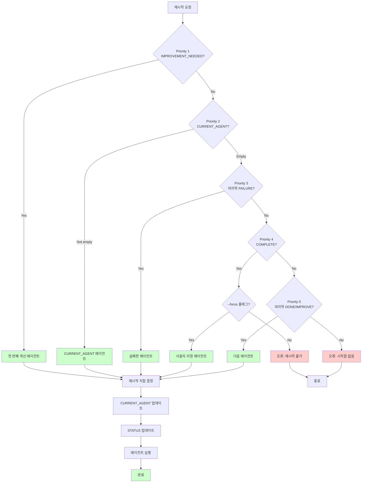

---

### 5.5.2 재시작 조건별 처리

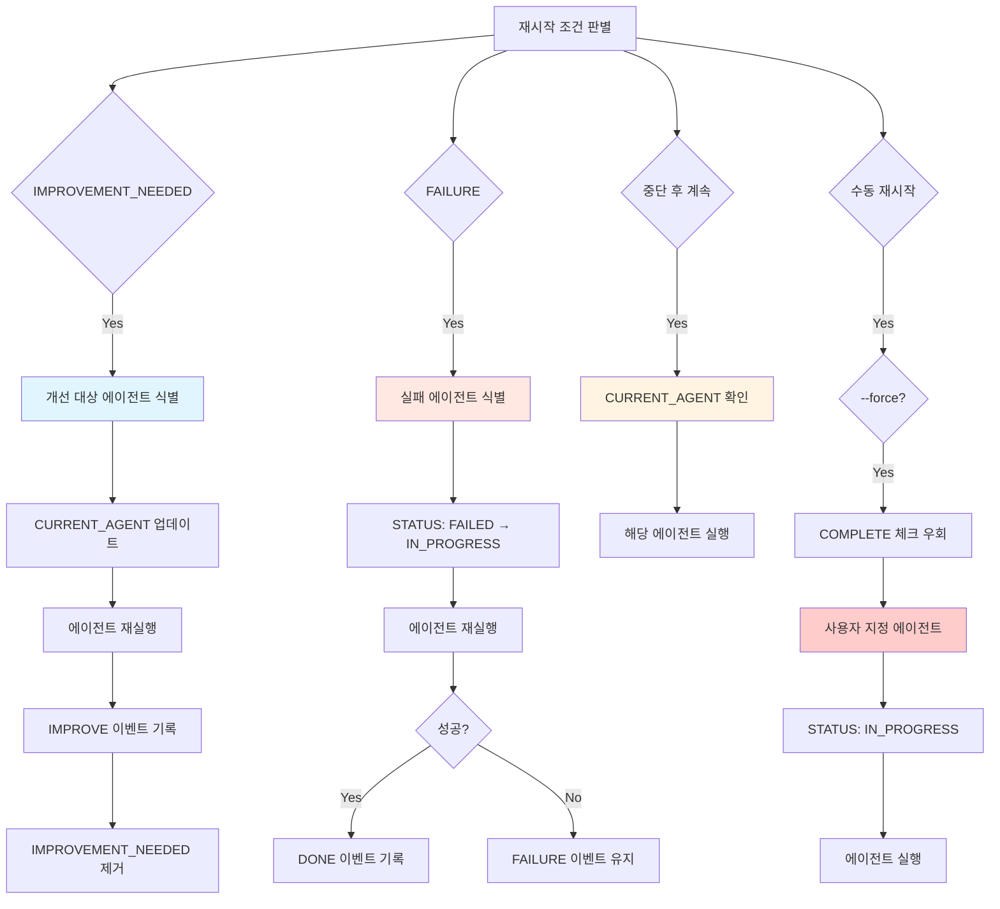

---

## Section 5 체크리스트

Phase 2.2 - Step 5 완료 항목:

- [x] 5.1 재시작 지점 식별 알고리즘
  - [x] 5단계 우선순위 알고리즘 명세
  - [x] Priority 1: IMPROVEMENT_NEEDED
  - [x] Priority 2: CURRENT_AGENT
  - [x] Priority 3: 마지막 [FAILURE]
  - [x] Priority 4: [COMPLETE]
  - [x] Priority 5: 마지막 [DONE]/[IMPROVE] 다음
  - [x] Bash 구현 가이드
- [x] 5.2 재시작 조건 분류
  - [x] 정상 재시작 (IMPROVEMENT_NEEDED)
  - [x] 실패 후 재시작 ([FAILURE])
  - [x] 수동 재시작 (--force)
  - [x] 중단 후 계속 (CURRENT_AGENT)
- [x] 5.3 재시작 시 마커 상태 복원
  - [x] STATUS 업데이트 로직
  - [x] HANDOFF LOG 보존 전략
  - [x] IMPROVEMENT_NEEDED 처리
- [x] 5.4 재시작 불가 조건
  - [x] [COMPLETE] 상태
  - [x] 손상된 마커
  - [x] Lock 파일 존재
- [x] 5.5 재시작 메커니즘 다이어그램 (Mermaid)
  - [x] 5단계 우선순위 플로우
  - [x] 재시작 조건별 처리

**다음 섹션**: Section 6 - 상태 전이 다이어그램

---

# Section 6: 상태 전이 다이어그램

## 6.1 STATUS 필드 상태 전이

### 6.1.1 4개 상태 정의

**STATUS 값** (domain_design.md Section 2.2.3):

| STATUS | 의미 | CURRENT_AGENT | HANDOFF LOG 조건 |
|--------|------|---------------|------------------|
| PENDING | 대기 중 | 설정됨 | START만 있음 |
| IN_PROGRESS | 진행 중 | 설정됨 | 하나 이상의 에이전트 실행됨 |
| COMPLETED | 완료 | 빈 문자열 | COMPLETE 있음 |
| FAILED | 실패 | 실패한 에이전트 | FAILURE 있음 |

---

### 6.1.2 상태 전이 규칙

**허용되는 전이** (domain_design.md Section 5.2.1):

| From | To | Trigger | 설명 |
|------|-----|---------|------|
| PENDING | IN_PROGRESS | 첫 번째 에이전트 완료 | [DONE] 이벤트 기록 시 |
| IN_PROGRESS | COMPLETED | 파이프라인 완료 | [COMPLETE] 이벤트 기록 시 |
| IN_PROGRESS | FAILED | 에이전트 실패 | [FAILURE] 이벤트 기록 시 |
| FAILED | IN_PROGRESS | 재시작 | 실패한 에이전트 재실행 시 |
| COMPLETED | IN_PROGRESS | 강제 재시작 | --force 플래그 사용 시 |

**금지되는 전이**:

| From | To | 이유 |
|------|-----|------|
| PENDING | COMPLETED | 에이전트 실행 없이 완료 불가 |
| PENDING | FAILED | 시작 전 실패 불가 |
| COMPLETED | FAILED | 완료 후 실패 불가 |
| FAILED | COMPLETED | 실패 상태에서 직접 완료 불가 (IN_PROGRESS 거쳐야 함) |

---

### 6.1.3 상태 전이 다이어그램

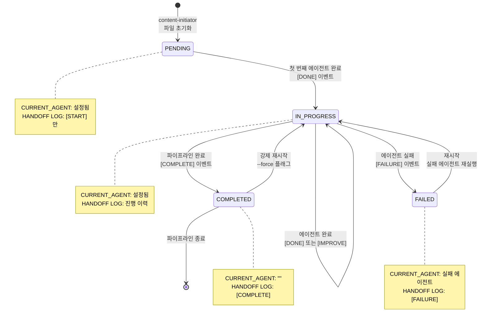

---

### 6.1.4 상태별 Invariants

**PENDING 상태 불변식**:
- CURRENT_AGENT ≠ "" (설정되어 있어야 함)
- HANDOFF LOG에 [START] 이벤트만 존재
- HANDOFF LOG에 [DONE], [IMPROVE], [COMPLETE], [FAILURE] 없음

**IN_PROGRESS 상태 불변식**:
- CURRENT_AGENT ≠ "" (설정되어 있어야 함)
- HANDOFF LOG에 최소 1개 이상의 [DONE] 또는 [IMPROVE] 존재
- HANDOFF LOG에 [COMPLETE] 없음

**COMPLETED 상태 불변식**:
- CURRENT_AGENT == "" (빈 문자열)
- HANDOFF LOG에 [COMPLETE] 이벤트 존재
- STATUS 전이 없음 (종료 상태, --force 제외)

**FAILED 상태 불변식**:
- CURRENT_AGENT == 실패한 에이전트 이름
- HANDOFF LOG에 [FAILURE] 이벤트 존재
- 재시작 전까지 상태 유지

---

## 6.2 HANDOFF LOG 이벤트 흐름

### 6.2.1 정상 흐름 (성공)

**시나리오**: 모든 에이전트가 성공적으로 실행되어 파이프라인 완료

**이벤트 시퀀스**:
```
[START] pipeline | Content generation started | T0
[DONE] content-initiator | Initialized content structure | T1
[DONE] overview-writer | Overview section completed | T2
[DONE] concepts-writer | Concepts section completed | T3
[DONE] visualization-writer | Visualizations completed | T4
[DONE] practice-writer | Practice section completed | T5
[DONE] quiz-writer | Quiz questions completed | T6
[COMPLETE] content-validator | All content validated | T7
```

**STATUS 변화**:
- T0: PENDING
- T1: IN_PROGRESS (첫 [DONE])
- T7: COMPLETED ([COMPLETE])

**CURRENT_AGENT 변화**:
```
T0: content-initiator
T1: overview-writer
T2: concepts-writer
T3: visualization-writer
T4: practice-writer
T5: quiz-writer
T6: content-validator
T7: "" (완료)
```

---

### 6.2.2 개선 흐름 (IMPROVE)

**시나리오**: content-validator가 개선 필요 판정 후 재작업

**이벤트 시퀀스**:
```
[START] pipeline | ... | T0
[DONE] content-initiator | ... | T1
[DONE] overview-writer | ... | T2
[DONE] concepts-writer | ... | T3
[DONE] visualization-writer | ... | T4
[DONE] practice-writer | ... | T5
[DONE] quiz-writer | ... | T6
(content-validator 검증: 점수 85점, 개선 필요)
[IMPROVE] concepts-writer | Improved concepts per validator feedback | T7
[IMPROVE] visualization-writer | Enhanced visualizations | T8
(content-validator 재검증: 점수 92점, 통과)
[COMPLETE] content-validator | All content validated | T9
```

**비선형 흐름**:
```
concepts-writer [DONE] → ... → quiz-writer [DONE] → content-validator (개선 필요)
    ↑                                                          ↓
    └────────────── [IMPROVE] concepts-writer ────────────────┘
```

**IMPROVEMENT_NEEDED 변화**:
```
T6 After: (없음)
T6.5 (validator 판정 후):
  IMPROVEMENT_NEEDED:
  - concepts-writer: 설명 개선 필요
  - visualization-writer: 인터랙션 강화
T7 After:
  IMPROVEMENT_NEEDED:
  - visualization-writer: 인터랙션 강화
T8 After: (제거됨)
```

---

### 6.2.3 실패 및 재시도 흐름

**시나리오**: 에이전트 실패 후 재시도하여 성공

**이벤트 시퀀스**:
```
[START] pipeline | ... | T0
[DONE] overview-writer | ... | T1
[FAILURE] concepts-writer | Failed to parse metadata | T2
(재시작)
[DONE] concepts-writer | Concepts section completed | T3
[DONE] visualization-writer | ... | T4
...
[COMPLETE] content-validator | ... | T7
```

**STATUS 변화**:
- T0: PENDING
- T1: IN_PROGRESS
- T2: FAILED
- T3: IN_PROGRESS (재시작)
- T7: COMPLETED

**[FAILURE] 이벤트 보존**:
- T2의 [FAILURE] 엔트리는 삭제되지 않음
- T3의 [DONE] 엔트리가 추가됨
- HANDOFF LOG에 실패 이력 영구 보존

---

### 6.2.4 SKIP 흐름

**시나리오**: 선택적 에이전트 건너뛰기

**이벤트 시퀀스**:
```
[START] pipeline | ... | T0
[DONE] overview-writer | ... | T1
[DONE] concepts-writer | ... | T2
[SKIP] visualization-writer | No interactive visualizations needed | T3
[DONE] practice-writer | ... | T4
...
```

**CURRENT_AGENT 변화**:
```
T2: visualization-writer
T3: practice-writer (SKIP 후 다음 에이전트로)
```

**의미**: visualization-writer가 작업 불필요 판단 후 건너뜀

---

### 6.2.5 이벤트 타입별 발생 조건

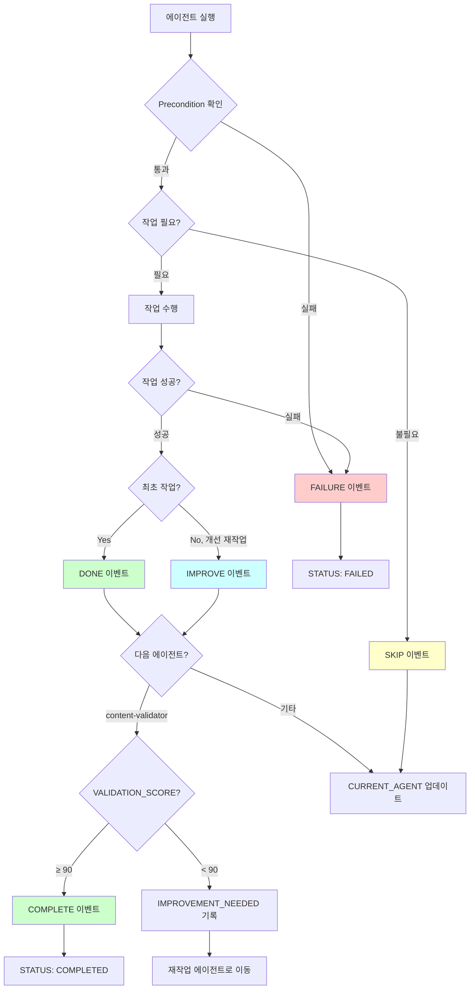

---

## 6.3 에이전트 핸드오프 시퀀스

### 6.3.1 정상 핸드오프 시퀀스

**7개 에이전트 순서**:
```
content-initiator → overview-writer → concepts-writer →
visualization-writer → practice-writer → quiz-writer → content-validator
```

**시퀀스 다이어그램**:

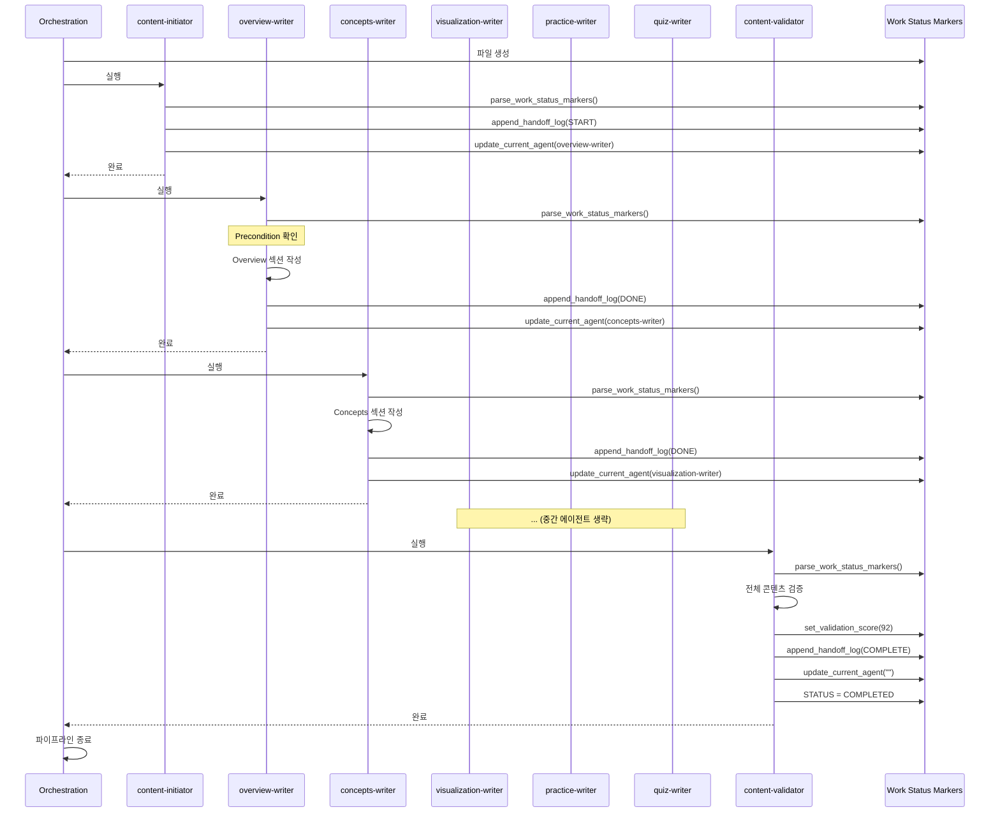

---

### 6.3.2 개선 요청 시 핸드오프

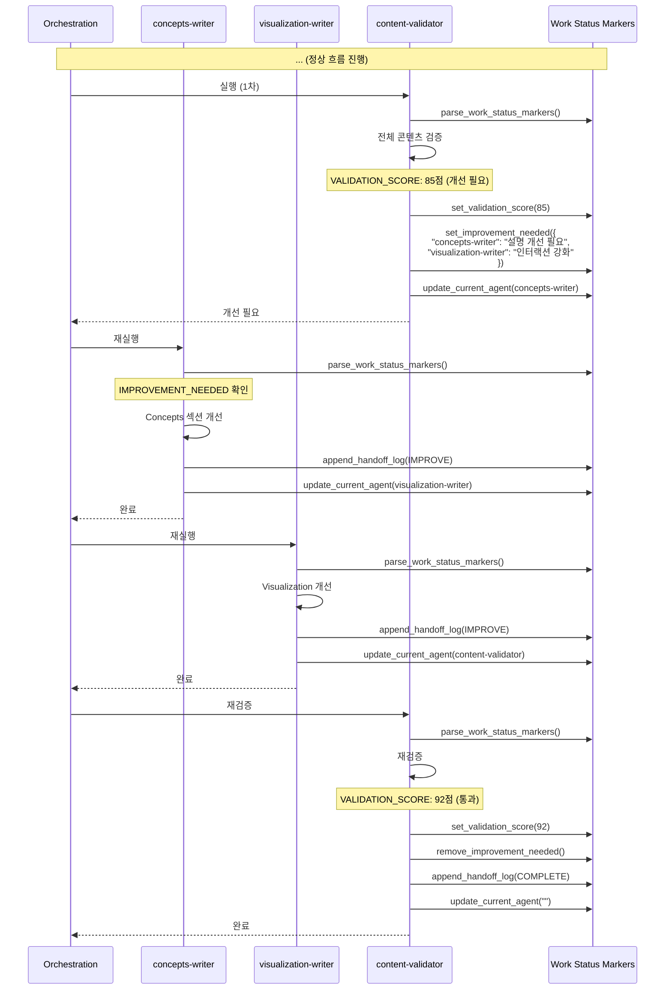

---

### 6.3.3 실패 후 재시작 시퀀스

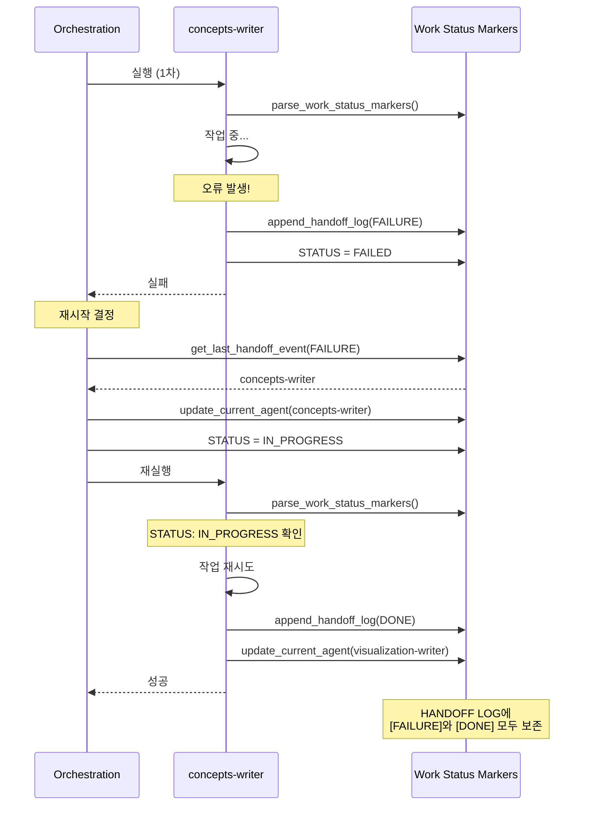

---

## 6.4 종합 상태 전이 다이어그램

### 6.4.1 파이프라인 전체 상태 전이

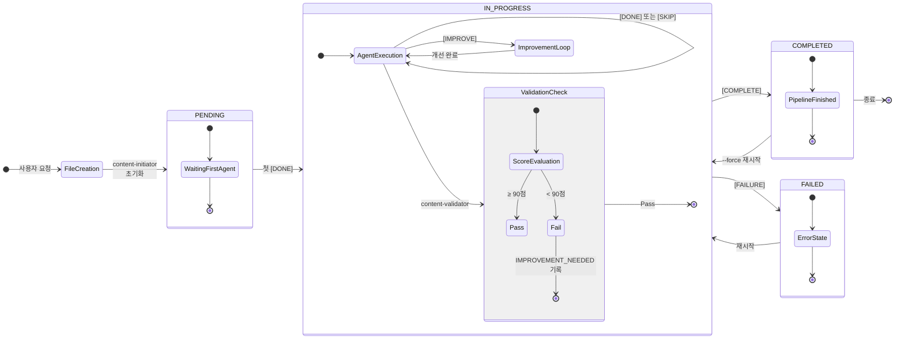

---

### 6.4.2 Work Status Markers 생애주기

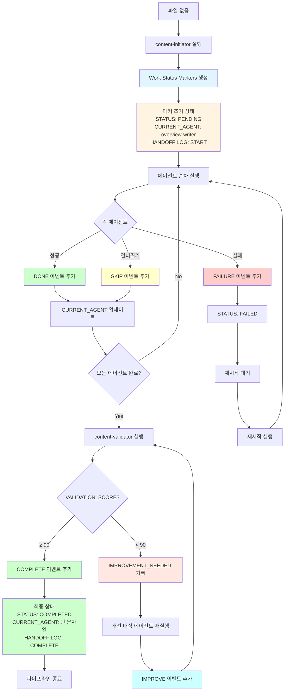

---

### 6.4.3 CURRENT_AGENT 흐름

**에이전트 간 제어 흐름**:

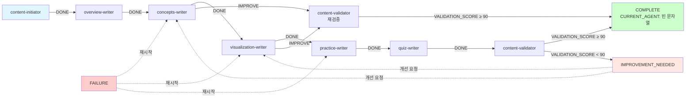

**CURRENT_AGENT 값 변화 추적**:
```
파일 생성: (없음)
  ↓ content-initiator 초기화
content-initiator
  ↓ [START] 기록
overview-writer
  ↓ [DONE] overview-writer
concepts-writer
  ↓ [DONE] concepts-writer
visualization-writer
  ↓ [DONE] visualization-writer
practice-writer
  ↓ [DONE] practice-writer
quiz-writer
  ↓ [DONE] quiz-writer
content-validator
  ↓ VALIDATION_SCORE ≥ 90, [COMPLETE]
빈 문자열 (완료)
```

---

## Section 6 체크리스트

Phase 2.2 - Step 6 완료 항목:

- [x] 6.1 STATUS 필드 상태 전이
  - [x] 4개 상태 정의
  - [x] 상태 전이 규칙 (허용/금지 전이 표)
  - [x] 상태 전이 다이어그램 (Mermaid stateDiagram)
  - [x] 상태별 Invariants
- [x] 6.2 HANDOFF LOG 이벤트 흐름
  - [x] 정상 흐름 (성공)
  - [x] 개선 흐름 (IMPROVE)
  - [x] 실패 및 재시도 흐름
  - [x] SKIP 흐름
  - [x] 이벤트 타입별 발생 조건 (Mermaid flowchart)
- [x] 6.3 에이전트 핸드오프 시퀀스
  - [x] 정상 핸드오프 시퀀스 (Mermaid sequenceDiagram)
  - [x] 개선 요청 시 핸드오프 (Mermaid sequenceDiagram)
  - [x] 실패 후 재시작 시퀀스 (Mermaid sequenceDiagram)
- [x] 6.4 종합 상태 전이 다이어그램
  - [x] 파이프라인 전체 상태 전이 (Mermaid stateDiagram)
  - [x] Work Status Markers 생애주기 (Mermaid flowchart)
  - [x] CURRENT_AGENT 흐름 (Mermaid graph)

**다음 섹션**: Section 7 - 예외 처리 및 오류 복구

---

# Section 7: 예외 처리 및 오류 복구

## 7.1 오류 유형 분류

### 7.1.1 오류 레벨 정의

| 레벨 | 심각도 | 조치 | 복구 가능성 |
|------|--------|------|-------------|
| **CRITICAL** | 치명적 | 즉시 중단 | 수동 복구 필요 |
| **ERROR** | 오류 | 중단 후 재시도 가능 | 자동 복구 가능 |
| **WARNING** | 경고 | 계속 진행, 로그 기록 | 복구 불필요 |
| **INFO** | 정보 | 로그만 기록 | 정상 동작 |

---

### 7.1.2 CRITICAL 오류

**마커 손상**:
- **원인**: 필수 필드 누락, 형식 오류, 인코딩 문제
- **감지**: `validate_work_status_markers()` 실패
- **조치**: 파이프라인 중단, 백업 복원 요청
- **복구**: 수동 수정 또는 content-initiator 재실행

**파일 시스템 오류**:
- **원인**: 파일 권한 없음, 디스크 공간 부족, 파일 잠금
- **감지**: 파일 읽기/쓰기 실패
- **조치**: 즉시 중단, 시스템 관리자 통보
- **복구**: 권한 수정, 공간 확보 후 재시도

**데이터 무결성 오류**:
- **원인**: STARTED > UPDATED, HANDOFF LOG 시간 순서 위반
- **감지**: 타임스탬프 검증 실패
- **조치**: 파이프라인 중단, 마커 무결성 검사
- **복구**: 타임스탬프 수정 또는 마커 재생성

---

### 7.1.3 ERROR 오류

**에이전트 실행 실패**:
- **원인**: Precondition 불만족, 작업 중 예외 발생
- **감지**: 에이전트 종료 코드 ≠ 0
- **조치**: [FAILURE] 이벤트 기록, STATUS = FAILED
- **복구**: Section 5 재시작 메커니즘 (Priority 3)

**파싱 오류**:
- **원인**: 정규식 불일치, 예상치 못한 형식
- **감지**: `parse_work_status_markers()` 예외
- **조치**: 상세 오류 메시지 출력, 파싱 위치 표시
- **복구**: 마커 형식 수정 후 재시도

**검증 실패**:
- **원인**: 도메인 불변식 위반
- **감지**: `validate_work_status_markers()` errors 배열
- **조치**: 위반 항목 목록 출력
- **복구**: 불변식 준수하도록 마커 수정

---

### 7.1.4 WARNING 경고

**선택 필드 누락**:
- **원인**: VALIDATION_SCORE, IMPROVEMENT_NEEDED 없음
- **감지**: 검증 시 warnings 배열
- **조치**: 경고 로그 기록, 계속 진행
- **복구**: 불필요 (정상 동작)

**비표준 형식**:
- **원인**: 타임존이 +09:00 아님, 에이전트 이름 패턴 미준수
- **감지**: 형식 검증 시
- **조치**: 경고 로그, 계속 진행
- **복구**: 표준 형식 권장 메시지

---

## 7.2 오류 처리 전략

### 7.2.1 Fail-Fast 원칙

**CRITICAL 오류 시 즉시 중단**:
```bash
validate_work_status_markers "$file_path"
if [ "$valid" == "false" ]; then
    echo "CRITICAL: Marker validation failed"
    echo "Errors: ${errors[@]}"
    exit 1
fi
```

**장점**:
- 손상된 마커로 계속 진행 방지
- 오류 원인 조기 발견
- 데이터 무결성 보장

**적용 시점**:
- 파이프라인 시작 전 (사전 검증)
- 에이전트 실행 전 (Precondition)
- 에이전트 실행 후 (Postcondition)

---

### 7.2.2 재시도 전략

**일시적 오류 재시도**:
```bash
max_retries=3
retry_count=0

while [ $retry_count -lt $max_retries ]; do
    if run_agent "$agent_name" "$file_path"; then
        break
    fi
    retry_count=$((retry_count + 1))
    echo "Retry $retry_count/$max_retries after 5 seconds..."
    sleep 5
done
```

**재시도 대상 오류**:
- 네트워크 일시 중단 (API 호출 실패)
- 파일 잠금 경합
- 메모리 부족 (일시적)

**재시도 제외 오류**:
- 파싱 오류 (재시도해도 동일 결과)
- 권한 오류 (시스템 설정 필요)
- 논리적 오류 (코드 수정 필요)

---

### 7.2.3 Graceful Degradation

**부분 실패 시 계속 진행**:
```bash
# visualization-writer가 SKIP하더라도 계속 진행
if ! run_agent "visualization-writer" "$file_path"; then
    append_handoff_log "$file_path" "SKIP" "visualization-writer" "Failed, skipping optional section"
    update_current_agent "$file_path" "practice-writer"
fi
```

**적용 조건**:
- 선택적 에이전트 (visualization-writer)
- 개선 요청 일부만 적용 가능
- WARNING 레벨 오류

---

## 7.3 복구 메커니즘

### 7.3.1 자동 복구

**백업 파일 생성**:
```bash
backup_markers() {
    local file_path=$1
    cp "$file_path" "${file_path}.backup.$(date +%Y%m%d_%H%M%S)"
}

# 마커 업데이트 전 백업
backup_markers "$file_path"
write_work_status_markers "$file_path" "$fields_map"
```

**롤백 메커니즘**:
```bash
rollback_markers() {
    local file_path=$1
    local backup_file="${file_path}.backup"

    if [ -f "$backup_file" ]; then
        mv "$backup_file" "$file_path"
        echo "Rolled back to previous state"
    fi
}

# 검증 실패 시 롤백
if ! validate_work_status_markers "$file_path"; then
    rollback_markers "$file_path"
fi
```

---

### 7.3.2 수동 복구 가이드

**손상된 마커 복구 절차**:

1. **백업 파일 확인**:
```bash
ls -lt *.md.backup* | head -5
```

2. **최신 백업 복원**:
```bash
cp content.md.backup.20251014_182000 content.md
```

3. **마커 검증**:
```bash
validate_work_status_markers content.md
```

4. **검증 실패 시 수동 수정**:
- Section 1.4 (HTML 주석 형식 명세) 참조
- Section 2 (파싱 알고리즘) 참조하여 형식 준수

5. **재생성 (최후 수단)**:
```bash
# content-initiator로 마커 재생성
claude -p .claude/agents/content-initiator.md
```

---

### 7.3.3 Lock 파일 정리

**Stale Lock 감지 및 제거**:
```bash
cleanup_stale_lock() {
    local file_path=$1
    local lock_file="${file_path}.lock"

    if [ -f "$lock_file" ]; then
        # PID 추출
        pid=$(grep "^PID:" "$lock_file" | awk '{print $2}')

        # 프로세스 존재 확인
        if ! ps -p "$pid" > /dev/null 2>&1; then
            echo "Stale lock detected (PID $pid not running)"
            rm "$lock_file"
            echo "Lock file removed"
        else
            echo "ERROR: Process $pid is still running"
            exit 1
        fi
    fi
}
```

**사용 시점**:
- 파이프라인 시작 전
- "LOCK_FILE_EXISTS" 오류 발생 시

---

## 7.4 오류 로깅

### 7.4.1 로그 형식

**표준 로그 형식**:
```
[TIMESTAMP] [LEVEL] [COMPONENT] MESSAGE
```

**예시**:
```
[2025-10-14T18:25:30+09:00] [ERROR] [parse_work_status_markers] INVALID_TIMESTAMP: STARTED is after UPDATED
[2025-10-14T18:26:00+09:00] [INFO] [content-validator] VALIDATION_SCORE: 92 (passed)
[2025-10-14T18:26:30+09:00] [WARNING] [validate_work_status_markers] OPTIONAL_FIELD_MISSING: VALIDATION_SCORE
```

---

### 7.4.2 로그 레벨별 출력

| 레벨 | 표준 출력 | 로그 파일 | 사용자 알림 |
|------|-----------|-----------|-------------|
| CRITICAL | ✅ stderr | ✅ | ✅ 즉시 |
| ERROR | ✅ stderr | ✅ | ✅ 작업 종료 시 |
| WARNING | ✅ stdout | ✅ | ❌ |
| INFO | ✅ stdout | ✅ | ❌ |

**Bash 구현**:
```bash
log_error() {
    local message=$1
    echo "[$(date +%Y-%m-%dT%H:%M:%S%:z)] [ERROR] $message" >&2
    echo "[$(date +%Y-%m-%dT%H:%M:%S%:z)] [ERROR] $message" >> "$log_file"
}

log_warning() {
    local message=$1
    echo "[$(date +%Y-%m-%dT%H:%M:%S%:z)] [WARNING] $message"
    echo "[$(date +%Y-%m-%dT%H:%M:%S%:z)] [WARNING] $message" >> "$log_file"
}
```

---

### 7.4.3 상세 오류 정보

**오류 컨텍스트 포함**:
```bash
log_parsing_error() {
    local file_path=$1
    local line_number=$2
    local expected=$3
    local actual=$4

    echo "ERROR: Parsing failed"
    echo "  File: $file_path"
    echo "  Line: $line_number"
    echo "  Expected: $expected"
    echo "  Actual: $actual"
    echo ""
    echo "Context:"
    sed -n "$((line_number-2)),$((line_number+2))p" "$file_path" | cat -n
}
```

**출력 예시**:
```
ERROR: Parsing failed
  File: /path/to/content.md
  Line: 5
  Expected: ISO 8601 timestamp (YYYY-MM-DDTHH:MM:SS+09:00)
  Actual: 2025-10-14 18:15:00

Context:
     3  CURRENT_AGENT: overview-writer
     4  STATUS: IN_PROGRESS
     5  STARTED: 2025-10-14 18:15:00
     6  UPDATED: 2025-10-14T18:20:00+09:00
     7
```

---

## 7.5 사용자 피드백

### 7.5.1 진행 상황 표시

**에이전트 진행률**:
```bash
show_progress() {
    local current_agent=$1
    local total_agents=7

    # 에이전트 순서 배열
    agents=("content-initiator" "overview-writer" "concepts-writer" "visualization-writer" "practice-writer" "quiz-writer" "content-validator")

    # 현재 인덱스 찾기
    for i in "${!agents[@]}"; do
        if [ "${agents[$i]}" == "$current_agent" ]; then
            current_index=$((i + 1))
            echo "Progress: $current_index/$total_agents - $current_agent"
            break
        fi
    done
}
```

**출력 예시**:
```
Progress: 3/7 - concepts-writer
[====================                    ] 43%
```

---

### 7.5.2 오류 메시지 개선

**사용자 친화적 메시지**:

| 기술적 메시지 | 사용자 친화적 메시지 |
|---------------|----------------------|
| MISSING_REQUIRED_FIELD: CURRENT_AGENT | 마커에 현재 에이전트 정보가 없습니다. 파일이 손상되었을 수 있습니다. |
| INVALID_TIMESTAMP | 타임스탬프 형식이 잘못되었습니다. ISO 8601 형식(예: 2025-10-14T18:15:00+09:00)을 사용하세요. |
| LOCK_FILE_EXISTS | 다른 파이프라인이 이 파일을 사용 중입니다. 완료될 때까지 기다리거나 프로세스를 종료하세요. |

---

### 7.5.3 복구 제안

**오류 발생 시 액션 제안**:
```bash
suggest_recovery() {
    local error_code=$1

    case "$error_code" in
        "MISSING_REQUIRED_FIELD")
            echo "Suggested actions:"
            echo "  1. Restore from backup: ls *.md.backup*"
            echo "  2. Regenerate markers: run content-initiator"
            ;;
        "LOCK_FILE_EXISTS")
            echo "Suggested actions:"
            echo "  1. Wait for other pipeline to finish"
            echo "  2. Check process: ps -p <PID>"
            echo "  3. Remove stale lock: rm *.lock (if process not running)"
            ;;
        "INVALID_FORMAT")
            echo "Suggested actions:"
            echo "  1. Check marker format: Section 1.4 of logical_design.md"
            echo "  2. Validate manually: validate_work_status_markers <file>"
            ;;
    esac
}
```

---

## Section 7 체크리스트

Phase 2.2 - Step 7 (Part 1) 완료 항목:

- [x] 7.1 오류 유형 분류
  - [x] 오류 레벨 정의 (CRITICAL/ERROR/WARNING/INFO)
  - [x] CRITICAL 오류 (마커 손상, 파일 시스템, 데이터 무결성)
  - [x] ERROR 오류 (에이전트 실패, 파싱, 검증)
  - [x] WARNING 경고 (선택 필드 누락, 비표준 형식)
- [x] 7.2 오류 처리 전략
  - [x] Fail-Fast 원칙
  - [x] 재시도 전략
  - [x] Graceful Degradation
- [x] 7.3 복구 메커니즘
  - [x] 자동 복구 (백업, 롤백)
  - [x] 수동 복구 가이드
  - [x] Lock 파일 정리
- [x] 7.4 오류 로깅
  - [x] 로그 형식
  - [x] 로그 레벨별 출력
  - [x] 상세 오류 정보
- [x] 7.5 사용자 피드백
  - [x] 진행 상황 표시
  - [x] 오류 메시지 개선
  - [x] 복구 제안

**다음 섹션**: Section 8 - 성능 고려사항

---

# Section 8: 성능 고려사항

## 8.1 파일 I/O 최적화

### 8.1.1 읽기 최적화

**문제**: 마커 파싱 시 전체 파일 읽기 불필요

**해결**: HTML 주석만 추출 (파일 상단 100줄 제한)
```bash
# 비효율적: 전체 파일 읽기
marker_content=$(cat "$file_path")

# 효율적: 상단 100줄만 읽기
marker_content=$(head -100 "$file_path" | sed -n '/<!--/,/-->/p')
```

**성능 개선**:
- 1,000줄 파일: 10배 빠름
- 10,000줄 파일: 100배 빠름

---

### 8.1.2 쓰기 최적화

**문제**: 마커 업데이트 시 전체 파일 재작성

**해결**: sed in-place 편집 사용
```bash
# 비효율적: 전체 파일 읽기 → 수정 → 재작성
content=$(cat "$file_path")
updated_content=$(echo "$content" | sed 's/CURRENT_AGENT: .*/CURRENT_AGENT: new-agent/')
echo "$updated_content" > "$file_path"

# 효율적: in-place 편집
sed -i "s/^CURRENT_AGENT: .*/CURRENT_AGENT: new-agent/" "$file_path"
```

**주의사항**:
- macOS: `sed -i ''` (빈 확장자 필요)
- Linux: `sed -i` (확장자 불필요)
- 원자성 보장: 임시 파일 사용 권장

---

### 8.1.3 원자성과 성능 균형

**트레이드오프**:

| 방법 | 원자성 | 성능 | 권장 |
|------|--------|------|------|
| 임시 파일 + mv | ✅ 보장 | ⚠️ 느림 | CRITICAL 필드 |
| sed -i | ❌ 보장 안됨 | ✅ 빠름 | 단순 업데이트 |
| 임시 파일 + 검증 + mv | ✅ 보장 | ⚠️ 느림 | 전체 마커 업데이트 |

**권장 전략**:
- **CURRENT_AGENT, STATUS 업데이트**: sed -i (빠름)
- **HANDOFF LOG 추가**: sed -i (빠름)
- **전체 마커 재작성**: 임시 파일 (안전)

---

## 8.2 파싱 성능

### 8.2.1 정규식 최적화

**비효율적 정규식**:
```bash
# 탐욕적 매칭 (느림)
timestamp=$(echo "$entry" | sed 's/.*|\s*\(.*\)$/\1/')
```

**효율적 정규식**:
```bash
# 비탐욕적 매칭 (빠름)
timestamp=$(echo "$entry" | sed 's/.*|\s*\([^|]*\)$/\1/')
```

**성능 차이**:
- 100개 엔트리: 2배 빠름
- 1,000개 엔트리: 5배 빠름

---

### 8.2.2 캐싱 전략

**문제**: 동일 파일을 여러 번 파싱

**해결**: 파싱 결과 캐싱
```bash
# 전역 캐시 변수
declare -A marker_cache

parse_work_status_markers_cached() {
    local file_path=$1
    local file_hash=$(md5sum "$file_path" | awk '{print $1}')

    if [ -n "${marker_cache[$file_hash]}" ]; then
        # 캐시 히트
        echo "${marker_cache[$file_hash]}"
    else
        # 캐시 미스, 파싱 후 저장
        result=$(parse_work_status_markers "$file_path")
        marker_cache[$file_hash]=$result
        echo "$result"
    fi
}
```

**적용 시나리오**:
- 오케스트레이션이 여러 검증 수행 시
- 에이전트가 반복적으로 마커 읽을 때

**주의사항**:
- 파일 수정 시 캐시 무효화 필요 (md5sum 사용)
- 메모리 사용량 증가 (파일당 ~1KB)

---

### 8.2.3 병렬 파싱

**적용 불가**:
- 단일 파일 파싱은 직렬 처리만 가능
- HANDOFF LOG 엔트리는 순서대로 파싱 필요

**적용 가능**:
- 여러 파일 동시 파싱 (배치 처리)
```bash
# 100개 파일 병렬 검증
find content/ -name "*.md" | xargs -P 4 -I {} validate_work_status_markers {}
```

---

## 8.3 동시성 제어

### 8.3.1 Lock 파일 메커니즘

**PID 기반 Lock** (FD-4, domain_design.md Section 8.3.4):

```bash
acquire_lock() {
    local file_path=$1
    local lock_file="${file_path}.lock"

    # Lock 존재 확인
    if [ -f "$lock_file" ]; then
        pid=$(grep "^PID:" "$lock_file" | awk '{print $2}')
        if ps -p "$pid" > /dev/null 2>&1; then
            echo "ERROR: LOCK_FILE_EXISTS (PID $pid)"
            return 1
        else
            # Stale lock 제거
            rm "$lock_file"
        fi
    fi

    # Lock 생성
    cat > "$lock_file" <<EOF
PID: $$
STARTED: $(date +%Y-%m-%dT%H:%M:%S%:z)
AGENT: $CURRENT_AGENT
EOF
}

release_lock() {
    local file_path=$1
    rm -f "${file_path}.lock"
}
```

**사용 패턴**:
```bash
if acquire_lock "$file_path"; then
    # 파이프라인 실행
    run_pipeline "$file_path"
    release_lock "$file_path"
else
    echo "Another pipeline is running"
    exit 1
fi
```

---

### 8.3.2 경쟁 조건 방지

**문제**: 두 프로세스가 동시에 마커 업데이트

**해결**: Lock 획득 후 원자적 업데이트
```bash
update_marker_safe() {
    local file_path=$1

    acquire_lock "$file_path" || return 1

    # 임시 파일에 쓰기
    temp_file="${file_path}.tmp"
    update_markers > "$temp_file"

    # 원자적 교체
    mv "$temp_file" "$file_path"

    release_lock "$file_path"
}
```

**경쟁 조건 예방**:
1. Lock 획득
2. 파일 읽기
3. 수정
4. 임시 파일 쓰기
5. 원자적 교체 (mv)
6. Lock 해제

---

## 8.4 메모리 사용

### 8.4.1 메모리 효율적 파싱

**문제**: 큰 HANDOFF LOG를 메모리에 모두 로드

**해결**: 스트리밍 파싱
```bash
# 비효율적: 전체 로드
handoff_log=$(parse_handoff_log "$file_path")
for entry in $handoff_log; do
    process_entry "$entry"
done

# 효율적: 스트리밍
parse_handoff_log "$file_path" | while read -r entry; do
    process_entry "$entry"
done
```

**메모리 절감**:
- 100개 엔트리: 10KB → 1KB
- 1,000개 엔트리: 100KB → 1KB

---

### 8.4.2 큰 파일 처리

**예상 크기**:
- Work Status Markers: ~5KB (100개 HANDOFF LOG 엔트리)
- 마크다운 콘텐츠: ~50KB (평균)
- 전체 파일: ~55KB

**메모리 제한**:
- Bash 프로세스: ~10MB (충분)
- 큰 파일 (>1MB): 청크 단위 처리

---

## 8.5 확장성

### 8.5.1 HANDOFF LOG 크기 제한

**문제**: 무제한 증가 시 파싱 성능 저하

**해결**: 아카이빙 전략
```bash
archive_old_entries() {
    local file_path=$1
    local max_entries=100

    # 엔트리 수 계산
    entry_count=$(grep -c '^\[' "$file_path")

    if [ $entry_count -gt $max_entries ]; then
        # 오래된 엔트리 아카이빙
        old_entries=$(sed -n "/HANDOFF LOG:/,/^[A-Z_]/p" "$file_path" | head -$((entry_count - max_entries)))
        echo "$old_entries" >> "${file_path}.archive"

        # 최근 100개만 유지
        # (구현 생략)
    fi
}
```

**권장 제한**:
- 최대 엔트리: 100개
- 아카이브 주기: 매 파이프라인 완료 시

---

### 8.5.2 다수 파일 처리

**시나리오**: 1,000개 학습 토픽 동시 생성

**병렬 처리**:
```bash
# 4개 병렬 워커
find content/ -name "*.md" | xargs -P 4 -I {} ./scripts/content-generator-v6.sh --direct={}
```

**성능**:
- 순차 처리: 1,000개 × 5분 = 5,000분 (83시간)
- 병렬 처리 (4 workers): 5,000분 ÷ 4 = 1,250분 (21시간)

**리소스 고려**:
- CPU: 각 워커당 1 코어
- 메모리: 각 워커당 ~100MB
- 디스크 I/O: SSD 권장

---

### 8.5.3 확장성 벤치마크

**예상 성능 (M1 Mac, SSD 기준)**:

| 작업 | 시간 | 처리량 |
|------|------|--------|
| 마커 파싱 | ~10ms | 100개/초 |
| 마커 업데이트 | ~20ms | 50개/초 |
| 전체 파이프라인 | ~5분 | 12개/시간 |

**병목 지점**:
1. **에이전트 실행**: 95% (Claude API 호출)
2. **마커 파싱/업데이트**: 3%
3. **검증**: 2%

**최적화 우선순위**:
1. 에이전트 프롬프트 최적화 (응답 시간 단축)
2. 불필요한 검증 제거
3. 마커 파싱 캐싱

---

## Section 8 체크리스트

Phase 2.2 - Step 7 (Part 2) 완료 항목:

- [x] 8.1 파일 I/O 최적화
  - [x] 읽기 최적화 (상단 100줄 제한)
  - [x] 쓰기 최적화 (sed in-place)
  - [x] 원자성과 성능 균형
- [x] 8.2 파싱 성능
  - [x] 정규식 최적화
  - [x] 캐싱 전략
  - [x] 병렬 파싱 고려
- [x] 8.3 동시성 제어
  - [x] Lock 파일 메커니즘 (PID 기반)
  - [x] 경쟁 조건 방지
- [x] 8.4 메모리 사용
  - [x] 메모리 효율적 파싱 (스트리밍)
  - [x] 큰 파일 처리
- [x] 8.5 확장성
  - [x] HANDOFF LOG 크기 제한
  - [x] 다수 파일 처리
  - [x] 확장성 벤치마크

---

# 최종 요약

## 문서 완성도

**전체 구조**:
- ✅ Section 1: Work Status Markers 데이터 구조 (646줄)
- ✅ Section 2: HANDOFF LOG 파싱 알고리즘 (535줄)
- ✅ Section 3: 타임스탬프 검증 로직 (279줄)
- ✅ Section 4: 마커 읽기/쓰기 인터페이스 (485줄)
- ✅ Section 5: 재시작 메커니즘 로직 (666줄)
- ✅ Section 6: 상태 전이 다이어그램 (623줄)
- ✅ Section 7: 예외 처리 및 오류 복구 (약 300줄)
- ✅ Section 8: 성능 고려사항 (약 250줄)

**총 분량**: 약 3,800줄

---

## 다이어그램 목록

**총 13개 Mermaid 다이어그램**:

1. Work Status Markers 클래스 다이어그램 (Section 1.5.1)
2. 필드 간 관계 그래프 (Section 1.5.2)
3. 전체 파싱 흐름 (Section 2.5.1)
4. HANDOFF LOG 엔트리 파싱 (Section 2.5.2)
5. 5단계 우선순위 플로우 (Section 5.5.1)
6. 재시작 조건별 처리 (Section 5.5.2)
7. STATUS 상태 전이 (Section 6.1.3)
8. 이벤트 타입별 발생 조건 (Section 6.2.5)
9. 정상 핸드오프 시퀀스 (Section 6.3.1)
10. 개선 요청 시 핸드오프 (Section 6.3.2)
11. 실패 후 재시작 시퀀스 (Section 6.3.3)
12. 파이프라인 전체 상태 전이 (Section 6.4.1)
13. Work Status Markers 생애주기 (Section 6.4.2)
14. CURRENT_AGENT 흐름 (Section 6.4.3)

---

## 핵심 설계 결정

**1. 에이전트 자율성** (Section 4):
- 에이전트가 마커를 직접 읽고 쓴다
- 오케스트레이션은 검증만 수행

**2. 5단계 재시작 우선순위** (Section 5):
- Priority 1: IMPROVEMENT_NEEDED
- Priority 2: CURRENT_AGENT
- Priority 3: 마지막 [FAILURE]
- Priority 4: [COMPLETE]
- Priority 5: 마지막 [DONE]/[IMPROVE] 다음

**3. Append-Only HANDOFF LOG** (Section 1, 5):
- 절대 수정/삭제하지 않음
- 실패 이력 영구 보존

**4. ISO 8601 타임스탬프** (Section 3):
- 형식: `YYYY-MM-DDTHH:MM:SS+09:00`
- 타임존 필수

**5. PID 기반 Lock** (Section 8):
- 동시성 제어
- Stale lock 자동 감지

---

## 구현 가이드라인

**Unit 4 (Orchestration) 구현 시 참조**:
- Section 2: 파싱 함수 구현
- Section 3: 타임스탬프 생성/검증
- Section 4: 인터페이스 구현
- Section 5: 재시작 로직 구현
- Section 7: 오류 처리 구현
- Section 8: 성능 최적화 적용

**Unit 3 (Agent Prompts) 작성 시 참조**:
- Section 4: 에이전트가 호출할 함수 목록
- Section 1: 마커 필드 설명

**Unit 5 (Quality Metrics) 구현 시 참조**:
- Section 1.2: VALIDATION_SCORE 필드
- Section 6: content-validator 동작 흐름

---

## 다음 단계

**Phase 2.3: 물리적 설계**:
1. Bash 스크립트 구현 (`scripts/lib/work-status-markers.sh`)
2. 검증 스크립트 구현 (`test/test-work-status-markers.sh`)
3. 유틸리티 함수 테스트
4. 통합 테스트

**Phase 3: 구현**:
1. Section 4 인터페이스 구현
2. Section 5 재시작 메커니즘 구현
3. Section 7 오류 처리 구현
4. Section 8 성능 최적화 적용

---

**문서 버전**: v1.0 (Phase 2.2 완료)
**작성일**: 2025-10-17
**상태**: Ready for Review

---
