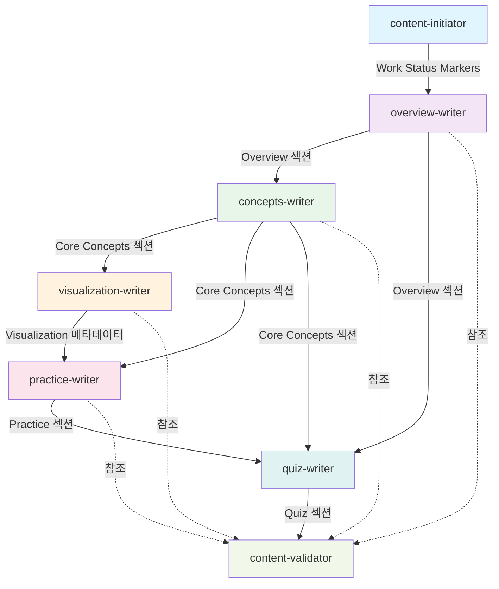

# Unit 2: Filter Contracts 명시화 - Domain Design v1.0

## 문서 정보

**버전**: 1.0
**작성일**: 2025-10-17
**상태**: Draft
**대상 독자**: 에이전트 개발자, 오케스트레이션 구현자

**목적**: 7개 에이전트의 입출력 계약을 명시적으로 정의하여 에이전트 간 결합도를 낮추고 독립적 개발/테스트/개선을 가능하게 합니다.

**참조 문서**:
- `unit-02-filter-contracts.md` - Unit 2 정의 및 범위
- `domain_design.md` (Unit 1) - Pipe 메커니즘 도메인 모델
- `work-status-markers-spec.md` - Work Status Markers 명세

---

## 목차

1. [Bounded Context 정의](#section-1-bounded-context-정의)
2. [Contract Template (계약 구조 표준)](#section-2-contract-template-계약-구조-표준)
3. [Agent Contracts (7개 에이전트 계약)](#section-3-agent-contracts-7개-에이전트-계약)
4. [Contract Validation Strategy](#section-4-contract-validation-strategy)
5. [Dependency Analysis](#section-5-dependency-analysis)
6. [Versioning and Change Management](#section-6-versioning-and-change-management)
7. [Validation](#section-7-validation)
8. [Summary and Next Steps](#section-8-summary-and-next-steps)

---

# Section 1: Bounded Context 정의

## 1.1 Overview

DDD (Domain-Driven Design) 경량화 방식을 적용하여 각 에이전트를 독립적인 Bounded Context로 정의합니다. 이를 통해 에이전트 간 결합도를 낮추고 계약 기반 통신을 명확히 합니다.

## 1.2 Bounded Context 경계 원칙

### 1.2.1 경계 정의 기준

**책임 범위 (Responsibility)**:
- 각 에이전트는 하나의 마크다운 섹션 생성/수정에 대한 책임을 가짐
- 다른 에이전트가 생성한 섹션은 읽기만 가능, 수정 불가 (Anti-Corruption Layer)

**데이터 소유권 (Data Ownership)**:
- **소유 데이터**: 자신이 생성하는 마크다운 섹션
- **공유 데이터 (읽기)**: Work Status Markers (Shared Kernel)
- **공유 데이터 (쓰기)**: Work Status Markers 중 CURRENT_AGENT, HANDOFF LOG, UPDATED 필드

**접근 제어**:
- 자신의 섹션: 전체 쓰기 권한
- 다른 에이전트 섹션: 읽기 전용
- Work Status Markers: 제한적 쓰기 (특정 필드만)

### 1.2.2 Anti-Corruption Layer

**목적**: 다른 에이전트 출력을 직접 수정하지 않고 격리 유지

**구현 방식**:
- 에이전트는 자신의 섹션만 생성/수정
- 다른 섹션은 입력으로 읽기만 함
- 개선 요청은 IMPROVEMENT_NEEDED를 통해 간접 전달

**예외 상황**:
- content-validator는 IMPROVEMENT_NEEDED 필드에 개선 지시를 작성
- 개선 대상 에이전트가 자신의 섹션을 직접 수정

## 1.3 Context Mapping

### 1.3.1 Shared Kernel

**공유 자원**: Work Status Markers

**공유 범위**:
- 모든 에이전트가 읽기 가능
- 특정 필드만 쓰기 가능 (CURRENT_AGENT, HANDOFF LOG, UPDATED)

**공유 규칙**:
- Work Status Markers 형식은 Unit 1 명세를 따름
- 필드 추가/삭제는 모든 에이전트에 영향
- 변경 시 Breaking Change로 간주

### 1.3.2 Published Language

**정의**: 마크다운 섹션 형식

**섹션별 Published Language**:

| 에이전트 | Published Language (출력 형식) |
|----------|-------------------------------|
| content-initiator | Work Status Markers 초기화 |
| overview-writer | `# Overview` 섹션 |
| concepts-writer | `# Core Concepts` 섹션 |
| visualization-writer | Visualization 메타데이터 (각 Concept에 임베딩) |
| practice-writer | `# Code Patterns` + `# Experiments` 섹션 |
| quiz-writer | `# Quiz` 섹션 |
| content-validator | VALIDATION_SCORE + IMPROVEMENT_NEEDED 필드 |

**형식 표준**:
- 각 섹션은 마크다운 헤더로 구분
- 하위 구조는 에이전트 프롬프트에 정의
- 파서 호환성 보장

### 1.3.3 Customer-Supplier Relationship

**파이프라인 흐름**:
```
content-initiator (Supplier)
    ↓
overview-writer (Customer → Supplier)
    ↓
concepts-writer (Customer → Supplier)
    ↓
visualization-writer (Customer → Supplier)
    ↓
practice-writer (Customer → Supplier)
    ↓
quiz-writer (Customer → Supplier)
    ↓
content-validator (Customer)
```

**관계 정의**:
- **Supplier**: 출력을 생성하여 다음 에이전트에 제공
- **Customer**: 이전 에이전트 출력을 입력으로 사용
- **양방향**: 중간 에이전트는 Customer이면서 Supplier

**의존성 방향**:
- 단방향 데이터 흐름 (content-initiator → content-validator)
- 역방향 의존 금지 (순환 의존 방지)

## 1.4 7개 Bounded Context 정의

### 1.4.1 Content Initiator Context

**Bounded Context 이름**: Content Initialization

**책임 범위**:
- Work Status Markers 초기화
- frontmatter 자동 생성 (category.yaml 기반)
- 파일 초기 상태 준비

**소유 데이터**:
- Work Status Markers (초기 상태)
- frontmatter (category.yaml에서 자동 복사)

**접근 가능 자원**:
- 파일 시스템 (읽기/쓰기)
- category.yaml (읽기 전용 - single source of truth)

**Ubiquitous Language**:
- **Initialize**: 마커와 파일 초기 상태 설정
- **Handoff**: 다음 에이전트(overview-writer)로 제어 이전

---

### 1.4.2 Overview Writer Context

**Bounded Context 이름**: Overview Section Generation

**책임 범위**:
- `# Overview` 섹션 생성
- 학습 동기 부여 및 주제 소개

**소유 데이터**:
- Overview 섹션 전체 (헤더부터 다음 섹션 직전까지)

**접근 가능 자원**:
- Work Status Markers (읽기/쓰기)
- frontmatter (읽기)
- category.yaml 메타데이터 (읽기)

**Ubiquitous Language**:
- **Overview**: 학습 주제 개요 및 동기 부여
- **Motivation**: 왜 배워야 하는가
- **Key Features**: 핵심 특징 또는 문제점

---

### 1.4.3 Concepts Writer Context

**Bounded Context 이름**: Core Concepts Section Generation

**책임 범위**:
- `# Core Concepts` 섹션 생성
- Easy/Normal/Expert 3단계 설명

**소유 데이터**:
- Core Concepts 섹션 전체
- 각 Concept 내 Easy/Normal/Expert 하위 섹션

**접근 가능 자원**:
- Work Status Markers (읽기/쓰기)
- Overview 섹션 (읽기)
- category.yaml 메타데이터 (읽기)

**Ubiquitous Language**:
- **Concept**: 학습해야 할 핵심 개념
- **Difficulty Level**: Easy (초급), Normal (일반), Expert (전문가)
- **Analogy**: 비유를 통한 설명 (Easy)
- **Technical Term**: 기술 용어 (Normal/Expert)

---

### 1.4.4 Visualization Writer Context

**Bounded Context 이름**: Visualization Component Generation

**책임 범위**:
- Visualization 메타데이터 생성 (Core Concepts 내 임베딩)
- React 시각화 컴포넌트 생성

**소유 데이터**:
- Visualization 메타데이터 (각 Concept 내)
- React 컴포넌트 파일 (`src/components/visualizations/`)

**접근 가능 자원**:
- Work Status Markers (읽기/쓰기)
- Core Concepts 섹션 (읽기)
- 컴포넌트 파일 시스템 (읽기/쓰기)

**Ubiquitous Language**:
- **Visualization**: 개념의 시각적 표현
- **Interactive**: 사용자 상호작용 가능
- **Component**: React 컴포넌트

**중요 결정 (Unit 2 Question 3)**:
- visualization-writer는 **필수 에이전트**
- 모든 콘텐츠에 시각화 컴포넌트 생성
- SKIP 불가

---

### 1.4.5 Practice Writer Context

**Bounded Context 이름**: Practice Section Generation

**책임 범위**:
- `# Code Patterns` 섹션 생성
- `# Experiments` 섹션 생성

**소유 데이터**:
- Code Patterns 섹션 전체
- Experiments 섹션 전체

**접근 가능 자원**:
- Work Status Markers (읽기/쓰기)
- Core Concepts 섹션 (읽기)

**Ubiquitous Language**:
- **Pattern**: 코드 패턴 (문제 → 해결 구조)
- **Experiment**: 직접 실험하며 체득
- **Short Code**: 핵심만 표현
- **Full Code**: 완전한 예시

---

### 1.4.6 Quiz Writer Context

**Bounded Context 이름**: Quiz Section Generation

**책임 범위**:
- `# Quiz` 섹션 생성
- 다양한 문항 유형 (객관식, 주관식, 코드 리뷰, 출력 예측 등)

**소유 데이터**:
- Quiz 섹션 전체

**접근 가능 자원**:
- Work Status Markers (읽기/쓰기)
- Overview, Core Concepts, Practice 섹션 (읽기)

**Ubiquitous Language**:
- **Question Type**: 문항 유형
- **Difficulty**: 난이도 (1-5)
- **Hint**: 단계별 힌트

---

### 1.4.7 Content Validator Context

**Bounded Context 이름**: Content Quality Validation

**책임 범위**:
- 전체 콘텐츠 품질 검증
- VALIDATION_SCORE 설정
- IMPROVEMENT_NEEDED 생성

**소유 데이터**:
- VALIDATION_SCORE 필드
- IMPROVEMENT_NEEDED 필드

**접근 가능 자원**:
- Work Status Markers (읽기/쓰기)
- 모든 섹션 (읽기)

**Ubiquitous Language**:
- **Validation**: 품질 검증
- **Score**: 점수 (0-100)
- **Improvement**: 개선 필요 항목

---

## 1.5 Context Integration

### 1.5.1 Integration Pattern

**패턴 선택**:
- **Shared Kernel**: Work Status Markers
- **Published Language**: 마크다운 섹션 형식
- **Conformist**: Downstream 에이전트가 Upstream 출력 형식 준수

**Integration 제약사항**:
- 마커 수정 권한 제한 (특정 필드만)
- 섹션 수정 권한 제한 (자신의 섹션만)
- 동시성 제어 (Lock 파일, Unit 1에서 정의)

### 1.5.2 Integration Points

**핵심 통합 지점**:

| Integration Point | Type | Description |
|-------------------|------|-------------|
| Work Status Markers | Shared Kernel | 모든 에이전트 공유 |
| 마크다운 섹션 | Published Language | 에이전트별 출력 형식 |
| IMPROVEMENT_NEEDED | Message Queue | 개선 요청 전달 |

---

# Section 2: Contract Template (계약 구조 표준)

## 2.1 Template Structure

### 2.1.1 YAML Frontmatter + Markdown Body

**형식 결정** (Question 1 답변: B - 중간 수준, C - YAML frontmatter + 마크다운):

```markdown
---
agent_id: agent-name
version: 1.0
dependencies: [previous-agent]
bounded_context: Context Name
---

# Agent Contract: Agent Name

## Metadata
...

## Responsibility
...

## Input Contract
...

## Output Contract
...

## Preconditions
...

## Postconditions
...

## Error Handling
...

## Examples
...
```

### 2.1.2 Template Sections

#### Metadata (YAML Frontmatter)

| 필드 | 타입 | 설명 |
|------|------|------|
| agent_id | string | 에이전트 식별자 (kebab-case) |
| version | string | 계약 버전 (Semantic Versioning) |
| dependencies | array | 의존하는 에이전트 목록 |
| bounded_context | string | Bounded Context 이름 |

#### Responsibility (마크다운 본문)

**목적**: 에이전트의 본질적 책임을 한 문장으로 표현

**형식**:
```markdown
## Responsibility

[에이전트가 담당하는 작업의 본질적 목적을 한 문장으로 설명]
```

**예시**:
```markdown
## Responsibility

Generate the Overview section that motivates learners and introduces the learning topic.
```

#### Input Contract

**목적**: 에이전트 실행 전 기대하는 상태 정의

**하위 섹션**:

1. **File State**: 파일 존재 여부, 인코딩, frontmatter
2. **Work Status Markers**: 기대하는 마커 상태
   - CURRENT_AGENT: 자신의 이름
   - STATUS: PENDING 또는 IN_PROGRESS
   - HANDOFF LOG: 이전 에이전트 [DONE] 엔트리 존재
3. **Section Dependencies**: 의존하는 다른 섹션

**형식**:
```markdown
## Input Contract

### File State
- Required Files: [파일 경로]
- File Encoding: UTF-8
- Frontmatter: Required/Optional
- Existing Sections: [이미 존재해야 하는 섹션]

### Work Status Markers
- CURRENT_AGENT: [자신의 에이전트 이름]
- STATUS: PENDING 또는 IN_PROGRESS
- HANDOFF LOG: 이전 에이전트 [DONE] 엔트리 존재

### Section Dependencies
- [이 에이전트가 읽어야 하는 섹션 목록]
```

#### Output Contract

**목적**: 에이전트 완료 후 보장하는 상태 정의

**하위 섹션**:

1. **File State**: 수정된 파일, 추가된 섹션
2. **Work Status Markers**: 업데이트된 마커 상태
   - CURRENT_AGENT: 다음 에이전트 이름
   - HANDOFF LOG: 자신의 [DONE] 엔트리 추가
3. **Content Guarantees**: 생성 콘텐츠의 보장 사항

**형식**:
```markdown
## Output Contract

### File State
- Modified Files: [수정하는 파일]
- New Sections: [추가하는 섹션 목록]
- Section Structure: [섹션 구조 명세]

### Work Status Markers
- CURRENT_AGENT: [다음 에이전트 이름]
- STATUS: IN_PROGRESS
- HANDOFF LOG: [DONE] entry added

### Content Guarantees
- [생성하는 콘텐츠의 보장 사항]
```

#### Preconditions

**목적**: 실행 전 검증 조건

**형식**:
```markdown
## Preconditions

1. CURRENT_AGENT == "[자신의 에이전트 이름]"
2. STATUS == PENDING 또는 IN_PROGRESS
3. 필수 섹션 존재: [섹션 목록]
4. (추가 조건...)
```

#### Postconditions

**목적**: 실행 후 보장 조건

**형식**:
```markdown
## Postconditions

1. [자신의 섹션] 섹션 생성 완료
2. CURRENT_AGENT == "[다음 에이전트 이름]"
3. HANDOFF LOG에 [DONE] 엔트리 추가
4. (추가 조건...)
```

#### Error Handling

**목적**: 에러 발생 시 처리 방법

**형식**:
```markdown
## Error Handling

### Precondition 실패 시
- HANDOFF LOG에 [FAILURE] 엔트리 추가
- STATUS: FAILED
- 에러 메시지 출력

### 작업 중 오류 시
- 부분 작업 롤백
- [FAILURE] 엔트리 기록
```

#### Examples

**목적**: 입출력 예시 제공

**형식**:
```markdown
## Examples

### Example 1: Normal Flow

#### Input:
[Work Status Markers 예시]

#### Output:
[업데이트된 Work Status Markers + 생성된 섹션]
```

### 2.1.3 Implementation References

**목적**: 에이전트가 계약을 준수하기 위해 사용할 수 있는 Unit 1 헬퍼 함수 및 가이드 문서 참조를 제공합니다.

**중요**: 이 섹션은 계약 자체(what)가 아닌 구현 방법(how)에 대한 참조입니다. 각 에이전트 계약의 Output Contract는 순수하게 "무엇을 보장하는가"만 명시하고, 구현 방법은 이 섹션을 참조합니다.

#### Work Status Markers 조작 함수 (Unit 1 제공)

**파일 위치**: `scripts/lib/work-status-markers.sh` (Unit 1 Phase 3에서 구현 예정)

**제공 함수**:

```bash
# 마커 파싱
parse_work_status_markers() {
    local file_path=$1
    # HTML 주석에서 Work Status Markers 추출
    # 반환: KEY=VALUE 형식 출력
}

# HANDOFF LOG 추가
append_handoff_log() {
    local file_path=$1
    local status=$2        # START, DONE, FAILURE, SKIP, COMPLETE, IMPROVE
    local agent_name=$3
    local message=$4
    local timestamp=$(date -u +"%Y-%m-%dT%H:%M:%S%z" | sed 's/\([0-9]\{2\}\)$/:\1/')

    # 형식: [STATUS] agent-name | message | timestamp
    # 파일의 HANDOFF LOG 섹션에 엔트리 추가
}

# CURRENT_AGENT 업데이트
update_current_agent() {
    local file_path=$1
    local next_agent=$2
    # CURRENT_AGENT 필드를 next_agent로 변경
}

# STATUS 업데이트
update_status() {
    local file_path=$1
    local new_status=$2  # PENDING, IN_PROGRESS, COMPLETED, FAILED
    # STATUS 필드 변경
}

# UPDATED 필드 갱신
update_timestamp() {
    local file_path=$1
    # UPDATED 필드를 현재 시각으로 갱신
}

# VALIDATION_SCORE 설정 (content-validator 전용)
set_validation_score() {
    local file_path=$1
    local score=$2  # 0-100
    # VALIDATION_SCORE 필드 설정
}

# IMPROVEMENT_NEEDED 설정 (content-validator 전용)
set_improvement_needed() {
    local file_path=$1
    local improvements=$2  # "agent-name: message" 형식의 개선 항목 (여러 줄)
    # IMPROVEMENT_NEEDED 필드 설정
}

# IMPROVEMENT_NEEDED에서 특정 에이전트 항목 제거 (개선 완료 시)
remove_improvement_item() {
    local file_path=$1
    local agent_name=$2
    # IMPROVEMENT_NEEDED에서 해당 에이전트 항목 제거
}

# IMPROVEMENT_NEEDED에서 자신의 항목 확인 (Improvement Mode 감지)
get_improvement_for_agent() {
    local file_path=$1
    local agent_name=$2
    # 해당 에이전트의 개선 항목 반환 (없으면 빈 문자열)
}
```

#### 에이전트가 정상 완료 시 호출 패턴

**모든 에이전트 (content-initiator 제외, content-validator는 다름)**:

```bash
# 1. 자신의 작업 완료 (섹션 생성 등)
# ...

# 2. HANDOFF LOG에 [DONE] 엔트리 추가
append_handoff_log "$file_path" "DONE" "$AGENT_NAME" "$completion_message"

# 3. CURRENT_AGENT를 다음 에이전트로 업데이트
update_current_agent "$file_path" "$NEXT_AGENT"

# 4. STATUS를 IN_PROGRESS로 업데이트 (이미 IN_PROGRESS면 생략 가능)
update_status "$file_path" "IN_PROGRESS"

# 5. UPDATED 타임스탬프 갱신
update_timestamp "$file_path"
```

**content-initiator 특수 케이스**:

```bash
# 1. frontmatter 자동 생성 (category.yaml 기반)
# 2. Work Status Markers 초기화
# 3. HANDOFF LOG에 [START] 엔트리 추가
append_handoff_log "$file_path" "START" "content-initiator" "파이프라인 시작"

# 4. CURRENT_AGENT를 overview-writer로 설정
update_current_agent "$file_path" "overview-writer"

# 5. STATUS를 PENDING으로 설정
update_status "$file_path" "PENDING"

# 6. STARTED, UPDATED 타임스탬프 설정
update_timestamp "$file_path"
```

**content-validator 특수 케이스 (90-100점)**:

```bash
# 1. 전체 콘텐츠 품질 검증
# ...

# 2. VALIDATION_SCORE 설정
set_validation_score "$file_path" "$score"

# 3. HANDOFF LOG에 [COMPLETE] 엔트리 추가
append_handoff_log "$file_path" "COMPLETE" "content-validator" "All content validated and approved"

# 4. CURRENT_AGENT를 빈 문자열로 설정
update_current_agent "$file_path" ""

# 5. STATUS를 COMPLETED로 설정
update_status "$file_path" "COMPLETED"

# 6. UPDATED 타임스탬프 갱신
update_timestamp "$file_path"
```

**content-validator 특수 케이스 (90점 미만)**:

```bash
# 1. 전체 콘텐츠 품질 검증 및 개선 항목 식별
# ...

# 2. VALIDATION_SCORE 설정
set_validation_score "$file_path" "$score"

# 3. IMPROVEMENT_NEEDED 설정
improvements="concepts-writer: Easy 설명이 너무 짧음, 비유 추가 필요 (-8점)
practice-writer: Pattern 2의 코드 실행 오류 수정 필요 (-5점)"
set_improvement_needed "$file_path" "$improvements"

# 4. HANDOFF LOG에 [DONE] 엔트리 추가
append_handoff_log "$file_path" "DONE" "content-validator" "검증 완료 - ${score}점 (개선 필요)"

# 5. CURRENT_AGENT를 첫 번째 개선 대상 에이전트로 설정
update_current_agent "$file_path" "$first_improvement_agent"

# 6. STATUS는 IN_PROGRESS 유지 (변경 없음)

# 7. UPDATED 타임스탬프 갱신
update_timestamp "$file_path"
```

#### Improvement Mode 에이전트 호출 패턴

**개선 모드 감지 및 처리**:

```bash
# 1. Improvement Mode 감지
improvement_message=$(get_improvement_for_agent "$file_path" "$AGENT_NAME")

if [[ -n "$improvement_message" ]]; then
    # 2. 개선 작업 수행 (해당 부분만 수정)
    # ...

    # 3. HANDOFF LOG에 [IMPROVE] 엔트리 추가
    append_handoff_log "$file_path" "IMPROVE" "$AGENT_NAME" "$improvement_message"

    # 4. IMPROVEMENT_NEEDED에서 자신의 항목 제거
    remove_improvement_item "$file_path" "$AGENT_NAME"

    # 5. CURRENT_AGENT를 다음 에이전트로 업데이트
    update_current_agent "$file_path" "$NEXT_AGENT"

    # 6. UPDATED 타임스탬프 갱신
    update_timestamp "$file_path"
else
    # 정상 모드: 위의 "정상 완료 시 호출 패턴" 따름
fi
```

#### 오케스트레이션 호출 패턴 (Unit 4 연계)

**Precondition 실패 시** (Section 4.4.3 참조):

```bash
# 오케스트레이션이 FAILURE 기록
if ! validate_preconditions "$agent_name" "$file_path"; then
    append_handoff_log "$file_path" "FAILURE" "$agent_name" "Precondition validation failed"
    update_status "$file_path" "FAILED"
    update_timestamp "$file_path"
    exit 1
fi
```

**에이전트 실행 실패 시** (Section 4.4.3 참조):

```bash
# 에이전트 실행
run_agent "$agent_name" "$file_path"

# exit code 확인
if [ $? -ne 0 ]; then
    append_handoff_log "$file_path" "FAILURE" "$agent_name" "Agent execution failed (attempt $attempt/$max_attempts)"
    update_status "$file_path" "FAILED"
    update_timestamp "$file_path"
    exit 1
fi
```

**SKIP 처리** (Section 4.4.3 참조):

```bash
# 사용자가 --skip-visualization 옵션 사용
if [[ "$skip_visualization" == "true" ]]; then
    append_handoff_log "$file_path" "SKIP" "visualization-writer" "User requested skip (--skip-visualization)"
    update_current_agent "$file_path" "practice-writer"  # 다음 에이전트로 건너뜀
    update_timestamp "$file_path"
fi
```

#### 참조 가이드 문서

**Unit 1 Specifications**:
- `work-status-markers-spec.md`: Work Status Markers 명세 (필드 정의, 형식)
- `agent-handoff-guide.md`: 에이전트 핸드오프 프로토콜 가이드

**Unit 2 Specifications** (Phase 2.2에서 생성 예정):
- `agent-contract-template.md`: 계약 템플릿 (Section 2.2)
- `contracts/*.md`: 7개 에이전트별 계약 명세 (Section 3)

**에이전트 구현 시 권장 사항**:
1. **계약 우선**: 에이전트는 자신의 계약(Section 3.x)만 보고 구현 가능해야 함
2. **헬퍼 함수 사용**: Work Status Markers 조작 시 위의 헬퍼 함수 사용 (직접 조작 금지)
3. **에러 처리**: 에이전트는 성공/실패 exit code만 반환, FAILURE는 오케스트레이션이 기록
4. **Improvement Mode**: `get_improvement_for_agent()` 결과에 따라 개선 모드 자동 전환

---

## 2.2 Contract Template 문서 생성

**파일 위치**: `docs/aidlc-docs/specifications/agent-contract-template.md`

**내용**:
- 위 2.1의 Template Structure 전체
- 각 섹션 설명 및 예시
- 작성 가이드라인

---

# Section 3: Agent Contracts (7개 에이전트 계약)

## 3.1 content-initiator Contract

### Metadata

```yaml
---
agent_id: content-initiator
version: 1.0
dependencies: []
bounded_context: Content Initialization
---
```

### Responsibility

Initialize Work Status Markers and create frontmatter populated with topic metadata from category.yaml for content generation pipeline.

### Input Contract

#### File State
- Required Files: Target markdown file path (provided by orchestration)
- File Encoding: UTF-8
- Frontmatter: May exist (created by script) or empty
- Existing Sections: None (파일이 비어있거나 frontmatter만 존재)

#### Category Metadata (from category.yaml)
- topic.id (required) - 토픽 식별자
- topic.title (required) - 토픽 제목
- topic.description (required) - 토픽 설명
- topic.difficulty (required, 1-5) - 난이도
- topic.prerequisites (optional, array) - 선수 학습 토픽
- topic.estimatedTime (optional, minutes) - 예상 학습 시간
- category, subcategory (derived from file path) - 카테고리 정보

#### Work Status Markers
- No markers (첫 실행) 또는 CURRENT_AGENT: content-initiator (재시작)

#### Section Dependencies
- None

### Output Contract

#### File State
- Modified Files: Target markdown file
- New Sections:
  - frontmatter (populated with topic metadata)
  - Work Status Markers (HTML 주석)
- Section Structure:
  ```markdown
  ---
  id: var-problems
  title: var 키워드의 문제점
  description: var의 호이스팅과 스코프 문제 이해
  difficulty: 2
  prerequisites:
    - variables-basics
  estimatedTime: 30
  category: javascript-core-concepts
  subcategory: 01-variables
  # Auto-generated from category.yaml - DO NOT EDIT MANUALLY
  ---

  <!--
  CURRENT_AGENT: overview-writer
  STATUS: PENDING
  STARTED: [timestamp]
  UPDATED: [timestamp]
  HANDOFF LOG:
  [START] pipeline | Content generation started | [timestamp]
  -->
  ```

#### Work Status Markers
- CURRENT_AGENT: overview-writer
- STATUS: PENDING
- STARTED: 현재 시각
- UPDATED: 현재 시각
- HANDOFF LOG:
  - `[START] pipeline | Content generation started | [timestamp]`

#### Content Guarantees
- Work Status Markers가 파일 최상단에 존재 (frontmatter 다음)
- frontmatter는 category.yaml의 토픽 메타데이터로 채워짐
- frontmatter에 자동 생성 주석 포함 ("Auto-generated from category.yaml")
- category.yaml이 single source of truth로 유지됨

#### Implementation
**Work Status Markers 업데이트 방법**: Section 2.1.3 "Implementation References" 참조
- 정상 완료 시: "content-initiator 특수 케이스" 패턴 사용

### Preconditions

1. 파일 경로가 유효함
2. 파일이 존재하지 않거나 빈 파일 또는 frontmatter만 존재
3. (재시작 시) CURRENT_AGENT == "content-initiator"

### Postconditions

1. Work Status Markers 생성 완료
2. CURRENT_AGENT == "overview-writer"
3. STATUS == PENDING
4. HANDOFF LOG에 [START] 엔트리 존재

### Error Handling

#### Precondition 실패 시
- 파일 경로 무효: 에러 메시지 출력, 종료
- 파일이 이미 콘텐츠 포함: 경고 메시지, 마커만 추가

#### 작업 중 오류 시
- 파일 쓰기 실패: [FAILURE] 엔트리 기록, STATUS: FAILED

### Examples

#### Example 1: 파일 초기화 및 frontmatter 자동 생성

**Input**:
- 파일 경로: `public/content/ko/javascript/01-variables/01-var-problems.md`
- category.yaml의 해당 토픽:
  ```yaml
  topics:
    - id: var-problems
      title: var 키워드의 문제점
      description: var의 호이스팅과 스코프 문제 이해
      difficulty: 2
      prerequisites:
        - variables-basics
      estimatedTime: 30
  ```
- 파일 내용: 빈 파일 또는 `---\n---\n` (빈 frontmatter)

**Output**:
```markdown
---
id: var-problems
title: var 키워드의 문제점
description: var의 호이스팅과 스코프 문제 이해
difficulty: 2
prerequisites:
  - variables-basics
estimatedTime: 30
category: javascript-core-concepts
subcategory: 01-variables
# Auto-generated from category.yaml - DO NOT EDIT MANUALLY
---

<!--
CURRENT_AGENT: overview-writer
STATUS: PENDING
STARTED: 2025-10-17T10:00:00+09:00
UPDATED: 2025-10-17T10:00:00+09:00
HANDOFF LOG:
[START] pipeline | Content generation started | 2025-10-17T10:00:00+09:00
-->
```

**Note**: category와 subcategory는 파일 경로에서 자동 추출됨 (`public/content/ko/{category}/{subcategory}/{topic-id}.md`)

---

## 3.2 overview-writer Contract

### Metadata

```yaml
---
agent_id: overview-writer
version: 1.0
dependencies: [content-initiator]
bounded_context: Overview Section Generation
---
```

### Responsibility

Generate the Overview section that motivates learners and introduces the learning topic with key features and practical impact.

### Input Contract

#### File State
- Required Files: Target markdown file with frontmatter and Work Status Markers
- File Encoding: UTF-8
- Frontmatter: Required (populated by content-initiator)
- Existing Sections: Work Status Markers only

#### Work Status Markers
- CURRENT_AGENT: overview-writer
- STATUS: PENDING
- HANDOFF LOG: [START] 엔트리 존재

#### Section Dependencies
- None (첫 번째 콘텐츠 섹션)

### Output Contract

#### File State
- Modified Files: Target markdown file
- New Sections: `# Overview` 섹션 추가
- Section Structure:
  ```markdown
  # Overview

  [Introduction paragraph(s)]

  ## 핵심 특징 (또는 핵심 문제점)
  - [Feature 1]
  - [Feature 2]
  ...

  ## 실무에서의 영향 (또는 왜 중요한가?)
  [Practical impact paragraph]
  ```

#### Work Status Markers
- CURRENT_AGENT: concepts-writer
- STATUS: IN_PROGRESS
- UPDATED: 현재 시각
- HANDOFF LOG:
  - 기존 엔트리 유지
  - `[DONE] overview-writer | Overview section completed | [timestamp]` 추가

#### Content Guarantees
- Overview 섹션 길이: 50-100줄
- Introduction paragraph: 3-5문장
- 핵심 특징/문제점: 4-5개 bullet points
- 실무 영향: 4-6문장

#### Implementation
**Work Status Markers 업데이트 방법**: Section 2.1.3 "Implementation References" 참조
- 정상 완료 시: "모든 에이전트 (content-initiator 제외)" 패턴 사용
- Improvement Mode: "개선 모드 감지 및 처리" 패턴 사용

### Preconditions

1. CURRENT_AGENT == "overview-writer"
2. STATUS == PENDING
3. frontmatter 존재
4. HANDOFF LOG에 [START] 엔트리 존재

### Postconditions

1. `# Overview` 섹션 생성 완료
2. CURRENT_AGENT == "concepts-writer"
3. STATUS == IN_PROGRESS
4. HANDOFF LOG에 [DONE] overview-writer 엔트리 추가

### Error Handling

#### Precondition 실패 시
- CURRENT_AGENT 불일치: Fail-Fast, 에러 메시지 출력
- [FAILURE] 엔트리 추가, STATUS: FAILED

#### 작업 중 오류 시
- 콘텐츠 생성 실패: 부분 작업 롤백, [FAILURE] 기록

### Improvement Mode

**Improvement Mode Detection**:
- IMPROVEMENT_NEEDED 필드에 `- overview-writer: [개선 설명]` 존재 확인
- 개선 항목에 해당하는 부분만 수정
- 수정 완료 후 IMPROVEMENT_NEEDED에서 해당 항목 제거
- HANDOFF LOG에 `[IMPROVE] overview-writer | [개선 설명] | [timestamp]` 추가

### Examples

#### Example 1: Normal Flow

**Input (Work Status Markers)**:
```markdown
<!--
CURRENT_AGENT: overview-writer
STATUS: PENDING
STARTED: 2025-10-17T10:00:00+09:00
UPDATED: 2025-10-17T10:00:00+09:00
HANDOFF LOG:
[START] pipeline | Content generation started | 2025-10-17T10:00:00+09:00
-->
```

**Output**:
```markdown
<!--
CURRENT_AGENT: concepts-writer
STATUS: IN_PROGRESS
STARTED: 2025-10-17T10:00:00+09:00
UPDATED: 2025-10-17T10:15:00+09:00
HANDOFF LOG:
[START] pipeline | Content generation started | 2025-10-17T10:00:00+09:00
[DONE] overview-writer | Overview section completed | 2025-10-17T10:15:00+09:00
-->

# Overview

var 키워드는 JavaScript에서 변수를 선언하는 초기 방법입니다. 그러나 호이스팅과 스코프 문제로 인해 현대 JavaScript 개발에서는 바람직하지 않은 결과를 초래하는 경우가 많습니다.

## 핵심 문제점

- **호이스팅**: var 선언이 스코프 맨 위로 끌어올려짐
- **함수 스코프**: 블록 스코프를 무시하여 예상치 못한 동작 야기
- **중복 선언**: 같은 스코프에서 중복 선언 허용
- **루프 클로저**: 루프 내에서의 변수 사용 시 예상치 못한 값 참조

## 실무에서의 영향

var의 예측할 수 없는 동작은 실제 프로젝트에서 버그와 유지보수 문제를 야기합니다. 특히 비동기 코드나 이벤트 핸들러에서 예상치 못한 변수 값을 참조하거나, 의도하지 않은 전역 변수를 생성할 수 있습니다. ES6+에서 도입된 let과 const를 사용하면 이러한 문제들을 예방하고 더 예측 가능한 코드를 작성할 수 있습니다.
```

---

## 3.3 concepts-writer Contract

### Metadata

```yaml
---
agent_id: concepts-writer
version: 1.0
dependencies: [overview-writer]
bounded_context: Core Concepts Section Generation
---
```

### Responsibility

Generate the Core Concepts section with multi-level explanations (Easy/Normal/Expert) for 3-5 key concepts related to the learning topic.

### Input Contract

#### File State
- Required Files: Target markdown file
- File Encoding: UTF-8
- Frontmatter: Required
- Existing Sections:
  - Work Status Markers
  - `# Overview` 섹션

#### Work Status Markers
- CURRENT_AGENT: concepts-writer
- STATUS: IN_PROGRESS
- HANDOFF LOG: [DONE] overview-writer 엔트리 존재

#### Section Dependencies
- Overview 섹션 (읽기 전용, 참조용)

### Output Contract

#### File State
- Modified Files: Target markdown file
- New Sections: `# Core Concepts` 섹션 추가
- Section Structure:
  ```markdown
  # Core Concepts

  ## Concept: [Concept Name]

  **ID**: concept-id

  ### Easy
  [중학생도 이해 가능한 설명, 일상적 비유, 이모지 사용, 코드 없음]

  ### Normal
  #### Text
  [기술 용어 + 간단한 설명]

  #### Code: [Example Title]
  [3-8줄 실행 가능 코드]

  #### Text
  [추가 설명]

  ### Expert
  #### ECMAScript Specification
  [명세 섹션 번호 및 인용]

  #### Performance
  [성능 및 최적화 관련 설명]

  ### Visualization (optional)
  component: [Concept]Visualization
  type: interactive/static/animation
  data: {
    [visualization options]
  }
  ```

#### Work Status Markers
- CURRENT_AGENT: visualization-writer
- STATUS: IN_PROGRESS
- UPDATED: 현재 시각
- HANDOFF LOG:
  - 기존 엔트리 유지
  - `[DONE] concepts-writer | Core concepts section completed | [timestamp]` 추가

#### Content Guarantees
- 3-5개 Concept 생성
- 각 Concept은 Easy/Normal/Expert 3단계 포함
- Normal 섹션: #### Text와 #### Code 교차 구조
- Expert 섹션: ECMAScript 명세 인용 포함

#### Implementation
**Work Status Markers 업데이트 방법**: Section 2.1.3 "Implementation References" 참조
- 정상 완료 시: "모든 에이전트 (content-initiator 제외)" 패턴 사용
- Improvement Mode: "개선 모드 감지 및 처리" 패턴 사용

### Preconditions

1. CURRENT_AGENT == "concepts-writer"
2. STATUS == IN_PROGRESS
3. Overview 섹션 존재
4. HANDOFF LOG에 [DONE] overview-writer 엔트리 존재

### Postconditions

1. `# Core Concepts` 섹션 생성 완료
2. CURRENT_AGENT == "visualization-writer"
3. STATUS == IN_PROGRESS
4. HANDOFF LOG에 [DONE] concepts-writer 엔트리 추가

### Error Handling

#### Precondition 실패 시
- Overview 섹션 없음: Fail-Fast, [FAILURE] 기록
- CURRENT_AGENT 불일치: Fail-Fast, 에러 메시지

#### 작업 중 오류 시
- Concept 생성 실패: 부분 작업 롤백, [FAILURE] 기록

### Improvement Mode

**Improvement Mode Detection**:
- IMPROVEMENT_NEEDED 필드에 `- concepts-writer: [개선 설명]` 존재 확인
- 개선 대상 Concept 또는 난이도 섹션만 수정
- 수정 완료 후 IMPROVEMENT_NEEDED에서 해당 항목 제거
- HANDOFF LOG에 `[IMPROVE] concepts-writer | [개선 설명] | [timestamp]` 추가

### Examples

#### Example 1: Normal Flow

**Input (Work Status Markers)**:
```markdown
<!--
CURRENT_AGENT: concepts-writer
STATUS: IN_PROGRESS
STARTED: 2025-10-17T10:00:00+09:00
UPDATED: 2025-10-17T10:15:00+09:00
HANDOFF LOG:
[START] pipeline | Content generation started | 2025-10-17T10:00:00+09:00
[DONE] overview-writer | Overview section completed | 2025-10-17T10:15:00+09:00
-->
```

**Output (Work Status Markers)**:
```markdown
<!--
CURRENT_AGENT: visualization-writer
STATUS: IN_PROGRESS
STARTED: 2025-10-17T10:00:00+09:00
UPDATED: 2025-10-17T10:45:00+09:00
HANDOFF LOG:
[START] pipeline | Content generation started | 2025-10-17T10:00:00+09:00
[DONE] overview-writer | Overview section completed | 2025-10-17T10:15:00+09:00
[DONE] concepts-writer | Core concepts section completed | 2025-10-17T10:45:00+09:00
-->

# Core Concepts

## Concept: 호이스팅

**ID**: var-hoisting

### Easy

🎈 var로 선언한 변수는 "위로 올라가는" 마법을 부립니다!

마치 교실에서 선생님이 "오늘 수업에서 이 단어들을 사용할 거야"라고 미리 칠판에 적어두는 것과 같습니다. var 변수는 코드를 실행하기 전에 JavaScript가 "이 변수가 있을 거야"라고 미리 알려주는 겁니다.

...

### Normal

#### Text

호이스팅(Hoisting)은 변수 선언이 스코프의 최상단으로 이동하는 JavaScript의 동작입니다. var로 선언된 변수는 선언부만 호이스팅되고, 할당은 원래 위치에 남습니다.

#### Code: 호이스팅 예시

console.log(name) // undefined
var name = "Alice"
console.log(name) // "Alice"

...

### Expert

#### ECMAScript Specification

ECMAScript 2015 (ES6) 명세 13.3.2절에 따르면, var 선언은 VariableDeclaration으로 처리되어 호이스팅이 발생합니다. 엔진은 실행 컨텍스트 생성 단계에서 변수를 undefined로 초기화합니다.

...

### Visualization

component: VarHoistingVisualization
type: interactive
data: {
  showMemory: true,
  showSteps: true,
  interactive: true
}
```

---

## 3.4 visualization-writer Contract

### Metadata

```yaml
---
agent_id: visualization-writer
version: 1.0
dependencies: [concepts-writer]
bounded_context: Visualization Component Generation
---
```

### Responsibility

Create React visualization components based on Visualization metadata in Core Concepts section and export them to index.ts.

### Input Contract

#### File State
- Required Files: Target markdown file
- File Encoding: UTF-8
- Frontmatter: Required
- Existing Sections:
  - Work Status Markers
  - Overview
  - Core Concepts (with Visualization metadata)

#### Work Status Markers
- CURRENT_AGENT: visualization-writer
- STATUS: IN_PROGRESS
- HANDOFF LOG: [DONE] concepts-writer 엔트리 존재

#### Section Dependencies
- Core Concepts 섹션 (읽기, Visualization metadata 추출)

### Output Contract

#### File State
- Modified Files:
  - Target markdown file (마커 업데이트)
  - React 컴포넌트 파일 (`src/components/visualizations/[category]/[ComponentName].tsx`)
  - index.ts (`src/components/visualizations/index.ts`)

- New Sections: None (마커만 업데이트)

- Component File Structure:
  ```typescript
  import React, { useState } from 'react';

  interface ComponentNameProps {
    data?: any;
    isFullScreen?: boolean;
  }

  export const ComponentName: React.FC<ComponentNameProps> = ({ data }) => {
    // Implementation
    return (
      <div style={{ /* styles */ }}>
        {/* Visualization content */}
      </div>
    );
  };
  ```

#### Work Status Markers
- CURRENT_AGENT: practice-writer
- STATUS: IN_PROGRESS
- UPDATED: 현재 시각
- HANDOFF LOG:
  - 기존 엔트리 유지
  - `[DONE] visualization-writer | [ComponentName] 생성 | [timestamp]` 추가

#### Content Guarantees
- React 컴포넌트 파일 생성 (빈 파일 아님, 최소 20줄)
- index.ts에 export 추가 필수
- TypeScript 컴파일 오류 없음

#### Implementation
**Work Status Markers 업데이트 방법**: Section 2.1.3 "Implementation References" 참조
- 정상 완료 시: "모든 에이전트 (content-initiator 제외)" 패턴 사용
- Improvement Mode: "개선 모드 감지 및 처리" 패턴 사용

### Preconditions

1. CURRENT_AGENT == "visualization-writer"
2. STATUS == IN_PROGRESS
3. Core Concepts 섹션 존재
4. Visualization metadata 존재 (각 Concept 내)
5. HANDOFF LOG에 [DONE] concepts-writer 엔트리 존재

### Postconditions

1. React 컴포넌트 파일 생성 완료
2. index.ts에 export 추가 완료
3. CURRENT_AGENT == "practice-writer"
4. STATUS == IN_PROGRESS
5. HANDOFF LOG에 [DONE] visualization-writer 엔트리 추가

### Error Handling

#### Precondition 실패 시
- Visualization metadata 없음: Fail-Fast, [FAILURE] 기록
- CURRENT_AGENT 불일치: Fail-Fast, 에러 메시지

#### 작업 중 오류 시
- 컴포넌트 생성 실패: [FAILURE] 기록, 부분 작업 유지 (디버깅용)
- index.ts 업데이트 실패: [FAILURE] 기록 (가장 중요한 단계)

### Critical Requirements

**반드시 완료해야 할 사항**:
1. 컴포넌트 파일 생성 (빈 파일 아님)
2. **index.ts에 export 추가** (가장 중요, 누락 시 UI에 "준비중" 표시)

**검증 절차**:
1. Read 도구로 컴포넌트 파일 내용 확인 (20줄 이상, import React, export const 포함)
2. Grep 도구로 index.ts에 export 존재 확인

### Improvement Mode

**Improvement Mode Detection**:
- IMPROVEMENT_NEEDED 필드에 `- visualization-writer: [개선 설명]` 존재 확인
- 컴포넌트 파일 수정
- 수정 완료 후 IMPROVEMENT_NEEDED에서 해당 항목 제거
- HANDOFF LOG에 `[IMPROVE] visualization-writer | [개선 설명] | [timestamp]` 추가

### Examples

#### Example 1: Normal Flow

**Input (Work Status Markers)**:
```markdown
<!--
CURRENT_AGENT: visualization-writer
STATUS: IN_PROGRESS
...
HANDOFF LOG:
...
[DONE] concepts-writer | Core concepts section completed | 2025-10-17T10:45:00+09:00
-->
```

**Output (Work Status Markers)**:
```markdown
<!--
CURRENT_AGENT: practice-writer
STATUS: IN_PROGRESS
...
UPDATED: 2025-10-17T11:15:00+09:00
HANDOFF LOG:
...
[DONE] concepts-writer | Core concepts section completed | 2025-10-17T10:45:00+09:00
[DONE] visualization-writer | VarHoistingVisualization 생성 | 2025-10-17T11:15:00+09:00
-->
```

**생성된 파일**:
- `src/components/visualizations/variables/VarHoistingVisualization.tsx` (80줄)
- `src/components/visualizations/index.ts` (export 추가)

---

## 3.5 practice-writer Contract

### Metadata

```yaml
---
agent_id: practice-writer
version: 1.0
dependencies: [concepts-writer]
bounded_context: Practice Section Generation
---
```

### Responsibility

Generate Code Patterns and Experiments sections to provide hands-on practice for learners.

### Input Contract

#### File State
- Required Files: Target markdown file
- File Encoding: UTF-8
- Frontmatter: Required
- Existing Sections:
  - Work Status Markers
  - Overview
  - Core Concepts

#### Work Status Markers
- CURRENT_AGENT: practice-writer
- STATUS: IN_PROGRESS
- HANDOFF LOG: [DONE] visualization-writer 엔트리 존재 (또는 [SKIP])

#### Section Dependencies
- Core Concepts 섹션 (읽기, 실습할 개념 파악)

### Output Contract

#### File State
- Modified Files: Target markdown file
- New Sections:
  - `# Code Patterns` 섹션
  - `# Experiments` 섹션

- Section Structure:
  ```markdown
  # Code Patterns

  ## Pattern: [Problem → Solution]

  **ID**: pattern-id

  ### Description
  [1문장 설명]

  ### Short Code
  [3-5줄 핵심 코드]

  ### Full Code
  [10-20줄 완전한 예시]

  ### Explanation
  **Easy**: [이모지 + 일상 비유]

  **Normal**: [기술 용어 + 인과관계 설명]

  **Expert**: [ECMAScript 명세 + 엔진 동작 + 성능]

  ---

  # Experiments

  ## Experiment: [Title]

  **ID**: experiment-id

  ### Description
  [1문장 설명]

  ### Instructions
  1. [명령형 동사로 시작하는 단계]
  2. ...

  ### Initial Code
  [10-25줄 즉시 실행 가능 코드, TODO 없음]
  ```

#### Work Status Markers
- CURRENT_AGENT: quiz-writer
- STATUS: IN_PROGRESS
- UPDATED: 현재 시각
- HANDOFF LOG:
  - 기존 엔트리 유지
  - `[DONE] practice-writer | Practice content completed | [timestamp]` 추가

#### Content Guarantees
- Code Patterns: 2-4개
- Experiments: 1-3개
- 모든 코드 즉시 실행 가능 (구문 오류 없음)
- ES6+ 문법 사용

#### Implementation
**Work Status Markers 업데이트 방법**: Section 2.1.3 "Implementation References" 참조
- 정상 완료 시: "모든 에이전트 (content-initiator 제외)" 패턴 사용
- Improvement Mode: "개선 모드 감지 및 처리" 패턴 사용

### Preconditions

1. CURRENT_AGENT == "practice-writer"
2. STATUS == IN_PROGRESS
3. Core Concepts 섹션 존재
4. HANDOFF LOG에 [DONE] visualization-writer 또는 [SKIP] 엔트리 존재

### Postconditions

1. `# Code Patterns` 섹션 생성 완료
2. `# Experiments` 섹션 생성 완료
3. CURRENT_AGENT == "quiz-writer"
4. STATUS == IN_PROGRESS
5. HANDOFF LOG에 [DONE] practice-writer 엔트리 추가

### Error Handling

#### Precondition 실패 시
- Core Concepts 섹션 없음: Fail-Fast, [FAILURE] 기록
- CURRENT_AGENT 불일치: Fail-Fast, 에러 메시지

#### 작업 중 오류 시
- 코드 생성 실패: 부분 작업 롤백, [FAILURE] 기록

### Improvement Mode

**Improvement Mode Detection**:
- IMPROVEMENT_NEEDED 필드에 `- practice-writer: [개선 설명]` 존재 확인
- 개선 대상 Pattern 또는 Experiment만 수정
- 수정 완료 후 IMPROVEMENT_NEEDED에서 해당 항목 제거
- HANDOFF LOG에 `[IMPROVE] practice-writer | [개선 설명] | [timestamp]` 추가

### Examples

(생략 - 위 패턴과 동일)

---

## 3.6 quiz-writer Contract

### Metadata

```yaml
---
agent_id: quiz-writer
version: 1.0
dependencies: [overview-writer, concepts-writer, practice-writer]
bounded_context: Quiz Section Generation
---
```

### Responsibility

Generate Quiz section with diverse question types (8-12 questions) to validate learning outcomes.

### Input Contract

#### File State
- Required Files: Target markdown file
- File Encoding: UTF-8
- Frontmatter: Required
- Existing Sections:
  - Work Status Markers
  - Overview
  - Core Concepts
  - Code Patterns
  - Experiments

#### Work Status Markers
- CURRENT_AGENT: quiz-writer
- STATUS: IN_PROGRESS
- HANDOFF LOG: [DONE] practice-writer 엔트리 존재

#### Section Dependencies
- Overview 섹션 (읽기)
- Core Concepts 섹션 (읽기)
- Practice 섹션 (읽기)

### Output Contract

#### File State
- Modified Files: Target markdown file
- New Sections: `# Quiz` 섹션

- Section Structure:
  ```markdown
  # Quiz

  ## Question 1: [Title]

  **ID**: question-id
  **Type**: multiple-choice | true-false | text-fill-in-blank | fill-in-the-blank | code-review | output-prediction
  **Difficulty**: 1-5

  ### Question
  [문제]

  ### Options (for multiple-choice, code-review)
  - [Option 1]
  - [Option 2]
  - [Option 3]
  - [Option 4]

  ### Correct Answer
  - [정답]

  ### Explanation
  [2-3문장 인과관계 설명]

  ### Hints
  1. [방향 제시]
  2. [구체적 단서]
  3. [거의 정답 수준]
  ```

#### Work Status Markers
- CURRENT_AGENT: content-validator
- STATUS: IN_PROGRESS
- UPDATED: 현재 시각
- HANDOFF LOG:
  - 기존 엔트리 유지
  - `[DONE] quiz-writer | Quiz section completed | [timestamp]` 추가

#### Content Guarantees
- 8-12개 문제
- 6개 문항 유형 중 최소 1개씩 포함
- 난이도 분포: 1-2 (30%), 3 (40%), 4-5 (30%)
- 모든 코드 실행 가능

#### Implementation
**Work Status Markers 업데이트 방법**: Section 2.1.3 "Implementation References" 참조
- 정상 완료 시: "모든 에이전트 (content-initiator 제외)" 패턴 사용
- Improvement Mode: "개선 모드 감지 및 처리" 패턴 사용

### Preconditions

1. CURRENT_AGENT == "quiz-writer"
2. STATUS == IN_PROGRESS
3. Overview, Core Concepts, Practice 섹션 존재
4. HANDOFF LOG에 [DONE] practice-writer 엔트리 존재

### Postconditions

1. `# Quiz` 섹션 생성 완료
2. CURRENT_AGENT == "content-validator"
3. STATUS == IN_PROGRESS
4. HANDOFF LOG에 [DONE] quiz-writer 엔트리 추가

### Error Handling

(위 패턴과 동일)

### Improvement Mode

(위 패턴과 동일)

### Examples

(생략)

---

## 3.7 content-validator Contract

### Metadata

```yaml
---
agent_id: content-validator
version: 1.0
dependencies: [overview-writer, concepts-writer, visualization-writer, practice-writer, quiz-writer]
bounded_context: Content Quality Validation
---
```

### Responsibility

Validate overall content quality, assign VALIDATION_SCORE, and generate IMPROVEMENT_NEEDED directives when necessary.

### Input Contract

#### File State
- Required Files: Target markdown file
- File Encoding: UTF-8
- Frontmatter: Required
- Existing Sections:
  - Work Status Markers
  - Overview
  - Core Concepts
  - Code Patterns
  - Experiments
  - Quiz

#### Work Status Markers
- CURRENT_AGENT: content-validator
- STATUS: IN_PROGRESS
- HANDOFF LOG: [DONE] quiz-writer 엔트리 존재

#### Section Dependencies
- All sections (읽기 전용, 품질 검증용)

### Output Contract

#### File State
- Modified Files: Target markdown file (마커만 업데이트)
- New Sections: None

#### Work Status Markers

**90-100점 (완료 기준)**:
```markdown
CURRENT_AGENT:
STATUS: COMPLETED
UPDATED: [timestamp]
HANDOFF LOG:
[기존 엔트리]
[COMPLETE] content-validator | All content validated and approved | [timestamp]
VALIDATION_SCORE: [90-100]
```

**90점 미만 (개선 필요)**:
```markdown
CURRENT_AGENT: [first_improvement_target_agent]
STATUS: IN_PROGRESS
UPDATED: [timestamp]
HANDOFF LOG:
[기존 엔트리]
[DONE] content-validator | 검증 완료 - [점수]점 (개선 필요) | [timestamp]
VALIDATION_SCORE: [0-89]
IMPROVEMENT_NEEDED:
- [agent-name]: [개선 설명] (-[감점]점)
- [agent-name]: [개선 설명] (-[감점]점)
```

#### Content Guarantees
- VALIDATION_SCORE 설정 (0-100)
- 90점 미만 시 IMPROVEMENT_NEEDED 생성

#### Implementation
**Work Status Markers 업데이트 방법**: Section 2.1.3 "Implementation References" 참조
- 90-100점 시: "content-validator 특수 케이스 (90-100점)" 패턴 사용
- 90점 미만 시: "content-validator 특수 케이스 (90점 미만)" 패턴 사용

### Preconditions

1. CURRENT_AGENT == "content-validator"
2. STATUS == IN_PROGRESS
3. All sections (Overview, Core Concepts, Practice, Quiz) 존재
4. HANDOFF LOG에 [DONE] quiz-writer 엔트리 존재

### Postconditions

**90-100점 시**:
1. STATUS == COMPLETED
2. CURRENT_AGENT == "" (빈 문자열)
3. HANDOFF LOG에 [COMPLETE] 엔트리 추가
4. VALIDATION_SCORE 설정

**90점 미만 시**:
1. STATUS == IN_PROGRESS
2. CURRENT_AGENT == [first_improvement_target_agent]
3. HANDOFF LOG에 [DONE] content-validator 엔트리 추가
4. IMPROVEMENT_NEEDED 필드 생성

### Validation Criteria

| Section | 배점 | 평가 항목 |
|---------|------|-----------|
| Overview | 20점 | 주제 정의, 학습 동기, 핵심 특징, 실무 영향 |
| Core Concepts | 25점 | 개념 선택, Easy/Normal/Expert 설명, 시각화 |
| Code Patterns | 20점 | 패턴 선택, shortCode/fullCode, 코드 실행 가능성 |
| Experiments | 15점 | 실습 목표, 단계별 지시, 코드 완성도 |
| Quiz | 20점 | 문항 유형 다양성, 난이도 분포, 정답 정확성 |

**판정 기준**:
- 100점: Perfect
- 95-99점: Excellent [COMPLETE]
- 90-94점: Good [COMPLETE]
- 85-89점: Acceptable (개선 권장)
- 85점 미만: Needs Improvement (개선 필수)

### Error Handling

#### Precondition 실패 시
- 필수 섹션 없음: Fail-Fast, [FAILURE] 기록

#### 작업 중 오류 시
- 검증 실패: [FAILURE] 기록

### Examples

#### Example 1: Perfect Score (100점)

**Output (Work Status Markers)**:
```markdown
<!--
CURRENT_AGENT:
STATUS: COMPLETED
STARTED: 2025-10-17T10:00:00+09:00
UPDATED: 2025-10-17T13:00:00+09:00
HANDOFF LOG:
[START] pipeline | Content generation started | 2025-10-17T10:00:00+09:00
[DONE] content-initiator | Initialized content structure | 2025-10-17T10:05:00+09:00
[DONE] overview-writer | Overview section completed | 2025-10-17T10:30:00+09:00
[DONE] concepts-writer | Core concepts section completed | 2025-10-17T11:00:00+09:00
[DONE] visualization-writer | Visualization components created | 2025-10-17T11:30:00+09:00
[DONE] practice-writer | Practice content completed | 2025-10-17T12:00:00+09:00
[DONE] quiz-writer | Quiz section completed | 2025-10-17T12:30:00+09:00
[COMPLETE] content-validator | Excellent quality - no improvements needed | 2025-10-17T13:00:00+09:00
VALIDATION_SCORE: 100
-->
```

#### Example 2: Needs Improvement (87점)

**Output (Work Status Markers)**:
```markdown
<!--
CURRENT_AGENT: concepts-writer
STATUS: IN_PROGRESS
STARTED: 2025-10-17T10:00:00+09:00
UPDATED: 2025-10-17T13:00:00+09:00
HANDOFF LOG:
[START] pipeline | Content generation started | 2025-10-17T10:00:00+09:00
[DONE] content-initiator | Initialized content structure | 2025-10-17T10:05:00+09:00
[DONE] overview-writer | Overview section completed | 2025-10-17T10:30:00+09:00
[DONE] concepts-writer | Core concepts section completed | 2025-10-17T11:00:00+09:00
[DONE] visualization-writer | Visualization components created | 2025-10-17T11:30:00+09:00
[DONE] practice-writer | Practice content completed | 2025-10-17T12:00:00+09:00
[DONE] quiz-writer | Quiz section completed | 2025-10-17T12:30:00+09:00
[DONE] content-validator | 검증 완료 - 87점 (개선 필요) | 2025-10-17T13:00:00+09:00
VALIDATION_SCORE: 87
IMPROVEMENT_NEEDED:
- concepts-writer: Easy 설명이 너무 짧음, 비유 추가 필요 (-8점)
- practice-writer: Pattern 2의 코드 실행 오류 수정 필요 (-5점)
-->
```

---

# Section 4: Contract Validation Strategy

## 4.1 Validation Overview

계약 검증은 에이전트 실행 전 Precondition 검증과 실행 후 Postcondition 검증으로 구성됩니다.

## 4.2 Precondition Validation

### 4.2.1 검증 시점

에이전트 실행 **직전** (오케스트레이션 스크립트에서 호출)

### 4.2.2 검증 항목

**필수 검증**:
1. **CURRENT_AGENT 일치**: Work Status Markers의 CURRENT_AGENT == 에이전트 이름
2. **STATUS 확인**: PENDING 또는 IN_PROGRESS
3. **필수 섹션 존재**: 에이전트가 의존하는 섹션 존재 여부

**예시**:
```bash
# overview-writer Precondition 검증
validate_preconditions() {
    local agent_name="overview-writer"
    local file_path=$1

    # CURRENT_AGENT 확인
    current_agent=$(parse_work_status_markers "$file_path" | grep CURRENT_AGENT)
    if [[ "$current_agent" != "overview-writer" ]]; then
        echo "❌ Precondition Failed: CURRENT_AGENT mismatch"
        echo "   Expected: overview-writer"
        echo "   Actual: $current_agent"
        return 1
    fi

    # STATUS 확인
    status=$(parse_work_status_markers "$file_path" | grep STATUS)
    if [[ "$status" != "PENDING" && "$status" != "IN_PROGRESS" ]]; then
        echo "❌ Precondition Failed: Invalid STATUS"
        return 1
    fi

    # frontmatter 존재 확인
    if ! grep -q "^---$" "$file_path"; then
        echo "❌ Precondition Failed: frontmatter missing"
        return 1
    fi

    return 0
}
```

### 4.2.3 검증 실패 시 동작

**Fail-Fast 전략** (Question 2 답변: A):
1. 검증 실패 시 즉시 중단
2. 명확한 오류 메시지 출력:
   ```
   ❌ Precondition Failed: overview-writer
   - Expected: CURRENT_AGENT=overview-writer
   - Actual: CURRENT_AGENT=concepts-writer
   - Fix: Check Work Status Markers
   ```
3. Exit code 1로 종료
4. HANDOFF LOG에 FAILURE 기록 (오케스트레이션에서 처리)

## 4.3 Postcondition Validation

### 4.3.1 검증 시점

에이전트 실행 **직후** (오케스트레이션 스크립트에서 호출)

### 4.3.2 검증 항목

**필수 검증**:
1. **출력 섹션 생성**: 에이전트가 생성해야 하는 섹션 존재
2. **Work Status Markers 업데이트**:
   - CURRENT_AGENT: 다음 에이전트로 변경
   - UPDATED: 갱신됨
   - HANDOFF LOG: [DONE] 엔트리 추가
3. **섹션 구조 검증**: 파서 호환 여부 (선택적, test 스크립트 활용)

**예시**:
```bash
# overview-writer Postcondition 검증
validate_postconditions() {
    local agent_name="overview-writer"
    local file_path=$1

    # Overview 섹션 존재 확인
    if ! grep -q "^# Overview$" "$file_path"; then
        echo "❌ Postcondition Failed: Overview section missing"
        return 1
    fi

    # CURRENT_AGENT 업데이트 확인
    current_agent=$(parse_work_status_markers "$file_path" | grep CURRENT_AGENT)
    if [[ "$current_agent" != "concepts-writer" ]]; then
        echo "❌ Postcondition Failed: CURRENT_AGENT not updated"
        echo "   Expected: concepts-writer"
        echo "   Actual: $current_agent"
        return 1
    fi

    # HANDOFF LOG [DONE] 엔트리 확인
    if ! grep -q "\[DONE\] overview-writer" "$file_path"; then
        echo "❌ Postcondition Failed: [DONE] entry missing in HANDOFF LOG"
        return 1
    fi

    return 0
}
```

### 4.3.3 검증 실패 시 동작

1. 에이전트 작업 롤백 (선택적, 복잡도 고려)
2. [FAILURE] 엔트리 기록
3. STATUS: FAILED
4. 오류 메시지 출력

## 4.4 Validation Interface

### 4.4.1 함수 명세

**validate_preconditions**

| 속성 | 값 |
|------|-----|
| **함수명** | validate_preconditions |
| **목적** | 에이전트 실행 전 Precondition 검증 |
| **Parameters** | agent_name (string), file_path (string) |
| **Returns** | 0 (성공), 1 (실패) |
| **Side Effects** | 오류 메시지 출력 (stderr) |

**validate_postconditions**

| 속성 | 값 |
|------|-----|
| **함수명** | validate_postconditions |
| **목적** | 에이전트 실행 후 Postcondition 검증 |
| **Parameters** | agent_name (string), file_path (string) |
| **Returns** | 0 (성공), 1 (실패) |
| **Side Effects** | 오류 메시지 출력 (stderr) |

### 4.4.2 Integration with Orchestration

**오케스트레이션 통합**:
```bash
# 에이전트 실행 전
if ! validate_preconditions "overview-writer" "$file_path"; then
    append_handoff_log "$file_path" "FAILURE" "overview-writer" "Precondition validation failed"
    exit 1
fi

# 에이전트 실행
run_agent "overview-writer" "$file_path"

# 에이전트 실행 후
if ! validate_postconditions "overview-writer" "$file_path"; then
    append_handoff_log "$file_path" "FAILURE" "overview-writer" "Postcondition validation failed"
    exit 1
fi
```

### 4.4.3 마커 조작 주체 명확화

**배경**: Unit 1 domain_design.md에서 Work Status Markers 업데이트 책임을 명확히 정의하고 있습니다. Unit 2 계약에서도 이 원칙을 명시적으로 반영하여 혼란을 방지합니다.

#### 일반 원칙 (Unit 1 Section 1.1)

**에이전트가 마커를 직접 업데이트**:
- 각 에이전트는 자신의 작업 완료 시 Work Status Markers를 직접 읽고 업데이트합니다
- 오케스트레이션은 마커를 **검증만** 수행하며, 직접 조작하지 않습니다

**권한 매트릭스** (Unit 1 Section 6.3.1):

| 주체 | Work Status Markers 업데이트 권한 |
|------|----------------------------------|
| 각 에이전트 | ✅ (DONE, IMPROVE 엔트리 추가) |
| content-validator | ✅ (COMPLETE, VALIDATION_SCORE, IMPROVEMENT_NEEDED) |
| **Orchestration** | **⚠️ (FAILURE, SKIP만)** |

#### 명시적 예외: FAILURE와 SKIP 이벤트

**Unit 1 Section 3.1: Domain Event 정의** (domain_design.md:856-857)에서 명시:

| Event Type | 발행자 | 이유 |
|-----------|--------|------|
| AgentFailedEvent (FAILURE) | **Orchestration** | 에이전트는 자신의 실패를 감지할 수 없음 (외부 감지) |
| AgentSkippedEvent (SKIP) | **Orchestration** | 사용자 요청으로 에이전트 건너뛰기 |

**Unit 1 Section 4.3.1: 작업 실패 시 FAILURE 엔트리 기록** (domain_design.md:1465):
```markdown
**규칙**: Orchestration이 에이전트 실행 실패를 감지하면 HANDOFF LOG에 **FAILURE 엔트리를 기록**합니다.
```

#### Unit 2 계약에서의 적용

**정상 흐름** (에이전트 성공):
```bash
# 에이전트가 직접 마커 업데이트
# (에이전트 프롬프트 내에서 수행)
update_work_status_markers() {
    # CURRENT_AGENT 업데이트
    # HANDOFF LOG에 [DONE] 또는 [IMPROVE] 추가
    # UPDATED 갱신
}
```

**예외 흐름** (Precondition 실패, 에이전트 오류):
```bash
# 오케스트레이션이 FAILURE 기록
if ! validate_preconditions "overview-writer" "$file_path"; then
    append_handoff_log "$file_path" "FAILURE" "overview-writer" "Precondition validation failed"
    exit 1
fi

# 에이전트 실행
run_agent "overview-writer" "$file_path"

# 에이전트 실행 실패 시 (exit code != 0)
if [ $? -ne 0 ]; then
    append_handoff_log "$file_path" "FAILURE" "overview-writer" "Agent execution failed"
    exit 1
fi
```

**SKIP 흐름** (사용자 요청):
```bash
# 오케스트레이션이 SKIP 기록
if [[ "$skip_visualization" == "true" ]]; then
    append_handoff_log "$file_path" "SKIP" "visualization-writer" "User requested skip (--skip-visualization)"
    # CURRENT_AGENT를 다음 에이전트로 업데이트
    update_current_agent "$file_path" "practice-writer"
fi
```

#### 계약 명세에서의 반영

**Error Handling 섹션 표준 형식** (모든 에이전트 계약에 적용):

```markdown
### Error Handling

#### Precondition 실패 시
- **주체**: Orchestration
- **동작**:
  1. Fail-Fast (즉시 중단)
  2. HANDOFF LOG에 [FAILURE] 엔트리 추가
  3. STATUS: FAILED
  4. Exit code 1

#### 작업 중 오류 시
- **주체**: Orchestration (에이전트 exit code != 0 감지)
- **동작**:
  1. HANDOFF LOG에 [FAILURE] 엔트리 추가
  2. STATUS: FAILED
  3. 오류 메시지 출력

#### 정상 완료 시
- **주체**: Agent
- **동작**:
  1. HANDOFF LOG에 [DONE] 또는 [IMPROVE] 엔트리 추가
  2. CURRENT_AGENT 업데이트 (다음 에이전트)
  3. UPDATED 갱신
```

#### 설계 근거

**에이전트 자율성 원칙**:
- 에이전트는 자신의 작업 범위 내에서 완전히 자율적으로 동작
- 성공 시 자신이 직접 다음 에이전트로 핸드오프

**외부 감지 예외**:
- 에이전트는 자신의 실행 실패를 감지할 수 없음 (프로세스 exit)
- 오케스트레이션이 외부에서 실패를 감지하고 기록

**사용자 제어**:
- SKIP은 사용자의 명시적 요청으로 에이전트 실행을 건너뜀
- 오케스트레이션이 사용자 의도를 마커에 반영

#### 참조

- **Unit 1 domain_design.md**:
  - Section 1.1: Context 경계 정의 (lines 30-39)
  - Section 3.1: Domain Event 정의 (lines 851-858)
  - Section 4.3.1: 작업 실패 시 FAILURE 엔트리 기록 (lines 1463-1486)
  - Section 6.3.1: 에이전트별 권한 매트릭스 (lines 2270-2283)

---

# Section 5: Dependency Analysis

## 5.1 Agent Dependency Graph

### 5.1.1 파이프라인 순서

```
content-initiator
    ↓ (Work Status Markers)
overview-writer
    ↓ (Overview 섹션)
concepts-writer
    ↓ (Core Concepts 섹션)
visualization-writer
    ↓ (Visualization 컴포넌트)
practice-writer
    ↓ (Code Patterns + Experiments 섹션)
quiz-writer
    ↓ (Quiz 섹션)
content-validator
    ↓ (VALIDATION_SCORE + IMPROVEMENT_NEEDED)
```

### 5.1.2 의존성 유형

**Hard Dependency** (필수):
- overview-writer → concepts-writer (Core Concepts는 Overview 참조)
- concepts-writer → visualization-writer (Visualization은 Concepts 필요)
- concepts-writer → practice-writer (Practice는 Concepts 기반)
- overview-writer, concepts-writer, practice-writer → quiz-writer (Quiz는 모든 학습 섹션 필요)
- all agents → content-validator (Validator는 모든 섹션 검증)

**Data Dependency** (데이터 의존):
- visualization-writer는 Core Concepts 섹션의 Visualization 메타데이터 필요
- quiz-writer는 Overview, Core Concepts, Practice 섹션의 학습 내용 필요
- content-validator는 모든 섹션의 품질 평가

### 5.1.3 의존성 그래프 (Mermaid)



### 5.1.4 순환 의존 검증

**순환 의존 금지**:
- 파이프라인은 단방향 흐름 (content-initiator → content-validator)
- 역방향 의존 없음
- content-validator의 IMPROVEMENT_NEEDED는 파이프라인 재시작이지 순환 아님

**예외 상황**:
- IMPROVEMENT_NEEDED로 인한 재실행은 새로운 파이프라인 실행으로 간주
- HANDOFF LOG에 [IMPROVE] 엔트리로 구분

## 5.2 Dependency Matrix

### 5.2.1 입출력 의존성 매트릭스

| Upstream (출력) | Downstream (입력) | Dependency Type | Data |
|----------------|------------------|-----------------|------|
| content-initiator | overview-writer | Hard | Work Status Markers |
| overview-writer | concepts-writer | Hard | Overview 섹션 |
| concepts-writer | visualization-writer | Hard | Core Concepts 섹션 |
| concepts-writer | practice-writer | Hard | Core Concepts 섹션 |
| overview-writer | quiz-writer | Data | Overview 섹션 |
| concepts-writer | quiz-writer | Data | Core Concepts 섹션 |
| practice-writer | quiz-writer | Data | Practice 섹션 |
| all agents | content-validator | Data | 모든 섹션 |

### 5.2.2 계약 호환성 검증

**Upstream Output = Downstream Input 검증**:

| 검증 항목 | Upstream | Downstream | 호환성 |
|-----------|----------|------------|--------|
| Work Status Markers | content-initiator | overview-writer | ✅ (CURRENT_AGENT=overview-writer) |
| Overview 섹션 | overview-writer | concepts-writer | ✅ (섹션 존재) |
| Core Concepts 섹션 | concepts-writer | visualization-writer | ✅ (Visualization 메타데이터 포함) |
| Core Concepts 섹션 | concepts-writer | practice-writer | ✅ (개념 참조) |
| Practice 섹션 | practice-writer | quiz-writer | ✅ (실습 내용 참조) |

---

# Section 6: Versioning and Change Management

## 6.1 Contract Versioning Strategy

### 6.1.1 Semantic Versioning 적용

**버전 형식**: MAJOR.MINOR.PATCH

**버전 증가 규칙**:
- **MAJOR**: Breaking Change (에이전트 프롬프트 수정 필요)
  - 예: 필수 필드 추가/삭제, 섹션 구조 변경
- **MINOR**: 하위 호환 추가 (선택 필드 추가)
  - 예: 새로운 선택 필드 추가, 기존 동작 확장
- **PATCH**: 문서 수정 (설명 개선, 오타 수정)
  - 예: Examples 추가, 설명 명확화

**예시**:
- v1.0 → v1.1: IMPROVEMENT_NEEDED 형식 개선 (선택 필드, 하위 호환)
- v1.1 → v2.0: CURRENT_AGENT 필드 enum 값 변경 (Breaking Change)

### 6.1.2 개별 버전 관리 (Question 3 답변: A)

**에이전트별 독립 버전 관리**:
- 각 에이전트 계약은 독립적인 버전 보유
- overview-writer v1.2, concepts-writer v1.0 등 개별 관리
- 에이전트 개선 시 해당 계약만 버전 업데이트

**장점**:
- 에이전트별 독립적 개선 가능
- 복잡도 낮음
- 변경 영향 범위 명확

**관리 방법**:
- YAML frontmatter에 버전 명시
- 계약 파일명에 버전 포함하지 않음 (파일은 최신 버전 유지)
- 변경 이력은 문서 하단 "변경 이력" 섹션에 기록

## 6.2 Breaking Change 정의

### 6.2.1 Breaking Change 유형

**1. 필수 필드 추가/삭제**:
- Input Contract에 새 필수 필드 추가
- Output Contract에서 기존 필드 삭제

**2. 필드 형식 변경**:
- STATUS enum 값 변경 (예: PENDING → WAITING)
- 타임스탬프 형식 변경

**3. 섹션 구조 변경**:
- Core Concepts에 새 하위 섹션 필수화
- 헤더 레벨 변경 (예: `## Concept:` → `### Concept:`)

**4. 의미적 변경**:
- Preconditions 조건 추가
- Postconditions 보장 사항 제거

### 6.2.2 Breaking Change 회피 전략

**원칙**:
1. 기존 필드 삭제 금지 → Deprecated 표시 후 다음 메이저 버전에서 삭제
2. 새 필드는 선택 필드로 추가
3. 기본값 제공으로 하위 호환 유지

**예시**:
```yaml
# Bad (Breaking Change)
---
agent_id: overview-writer
version: 2.0
required_fields: [new_field]  # 새 필수 필드 추가
---

# Good (하위 호환)
---
agent_id: overview-writer
version: 1.1
optional_fields: [new_field]  # 선택 필드로 추가
---
```

## 6.3 Change Impact Analysis

### 6.3.1 영향 분석 절차

**1. 계약 변경 식별**:
- 변경된 필드, 섹션 구조 파악
- Breaking Change 여부 판단

**2. 의존성 그래프 참조**:
- Dependency Matrix (Section 5.2) 확인
- Downstream 에이전트 식별

**3. 영향 받는 에이전트 목록 생성**:
- Direct Impact: Output Contract 변경 → Downstream Input Contract 영향
- Indirect Impact: Shared Kernel (Work Status Markers) 변경 → 모든 에이전트 영향

**예시**:
```
concepts-writer Output Contract 변경:
- Core Concepts 섹션에 새 하위 섹션 "### Prerequisites" 추가

영향 받는 에이전트:
- Direct: visualization-writer, practice-writer (Core Concepts 읽기)
- Indirect: quiz-writer (Core Concepts 참조)
```

### 6.3.2 Change Notification

**변경 통지 방법**:
1. 계약 문서 "변경 이력" 섹션 업데이트
2. Breaking Change 시 MAJOR 버전 증가
3. 영향 받는 에이전트 목록 명시
4. 마이그레이션 가이드 제공

**변경 이력 형식**:
```markdown
## 변경 이력

| 버전 | 날짜 | 변경 유형 | 변경 사항 | 영향 에이전트 |
|------|------|-----------|-----------|---------------|
| 2.0 | 2025-10-20 | Breaking | Core Concepts에 Prerequisites 섹션 추가 | visualization-writer, practice-writer, quiz-writer |
| 1.1 | 2025-10-18 | Minor | Visualization metadata 형식 개선 | - |
| 1.0 | 2025-10-17 | - | 초안 작성 | - |
```

## 6.4 Versioning Guide 문서

**파일 위치**: `docs/aidlc-docs/guides/contract-versioning-guide.md`

**내용**:
- Semantic Versioning 규칙
- Breaking Change 정의 및 회피 전략
- 계약 변경 시 영향 분석 절차
- 변경 이력 작성 가이드
- 마이그레이션 예시

---

# Section 7: Validation

## 7.1 시나리오 기반 검증

### 7.1.1 정상 흐름: content-initiator → content-validator

**시나리오**: 모든 에이전트가 성공적으로 실행되어 100점 획득

**Work Status Markers 변화 추적**:

1. **content-initiator 완료 후**:
   ```markdown
   CURRENT_AGENT: overview-writer
   STATUS: PENDING
   HANDOFF LOG:
   [START] pipeline | Content generation started | 2025-10-17T10:00:00+09:00
   ```

2. **overview-writer 완료 후**:
   ```markdown
   CURRENT_AGENT: concepts-writer
   STATUS: IN_PROGRESS
   HANDOFF LOG:
   [START] pipeline | Content generation started | 2025-10-17T10:00:00+09:00
   [DONE] overview-writer | Overview section completed | 2025-10-17T10:15:00+09:00
   ```

3. **concepts-writer 완료 후**:
   ```markdown
   CURRENT_AGENT: visualization-writer
   STATUS: IN_PROGRESS
   HANDOFF LOG:
   ...
   [DONE] concepts-writer | Core concepts section completed | 2025-10-17T10:45:00+09:00
   ```

4. **visualization-writer 완료 후**:
   ```markdown
   CURRENT_AGENT: practice-writer
   STATUS: IN_PROGRESS
   HANDOFF LOG:
   ...
   [DONE] visualization-writer | VarHoistingVisualization 생성 | 2025-10-17T11:15:00+09:00
   ```

5. **practice-writer 완료 후**:
   ```markdown
   CURRENT_AGENT: quiz-writer
   STATUS: IN_PROGRESS
   HANDOFF LOG:
   ...
   [DONE] practice-writer | Practice content completed | 2025-10-17T11:45:00+09:00
   ```

6. **quiz-writer 완료 후**:
   ```markdown
   CURRENT_AGENT: content-validator
   STATUS: IN_PROGRESS
   HANDOFF LOG:
   ...
   [DONE] quiz-writer | Quiz section completed | 2025-10-17T12:15:00+09:00
   ```

7. **content-validator 완료 후 (100점)**:
   ```markdown
   CURRENT_AGENT:
   STATUS: COMPLETED
   HANDOFF LOG:
   ...
   [COMPLETE] content-validator | Excellent quality - no improvements needed | 2025-10-17T12:45:00+09:00
   VALIDATION_SCORE: 100
   ```

**검증 결과**: ✅ 모든 계약 준수, 파이프라인 정상 완료

---

### 7.1.2 실패 흐름: concepts-writer Precondition 실패

**시나리오**: overview-writer가 Overview 섹션을 생성하지 않고 CURRENT_AGENT만 업데이트

**Work Status Markers 상태**:
```markdown
CURRENT_AGENT: concepts-writer
STATUS: IN_PROGRESS
HANDOFF LOG:
[START] pipeline | Content generation started | 2025-10-17T10:00:00+09:00
[DONE] overview-writer | Overview section completed | 2025-10-17T10:15:00+09:00
```

**파일 내용**: Overview 섹션 없음 (Postcondition 위반)

**concepts-writer Precondition 검증**:
```bash
validate_preconditions "concepts-writer" "$file_path"
# 결과: 실패 (Overview 섹션 없음)
```

**처리**:
1. Fail-Fast: 즉시 중단
2. 오류 메시지 출력:
   ```
   ❌ Precondition Failed: concepts-writer
   - Expected: Overview section exists
   - Actual: Overview section missing
   - Fix: Check overview-writer output
   ```
3. HANDOFF LOG에 [FAILURE] 기록:
   ```markdown
   [FAILURE] concepts-writer | Precondition validation failed - Overview section missing | 2025-10-17T10:46:00+09:00
   ```
4. STATUS: FAILED
5. Exit code 1

**검증 결과**: ✅ Precondition 검증이 계약 위반 감지

---

### 7.1.3 개선 흐름: content-validator → IMPROVEMENT_NEEDED

**시나리오**: content-validator가 87점 판정, concepts-writer와 practice-writer에 개선 요청

**content-validator 출력**:
```markdown
CURRENT_AGENT: concepts-writer
STATUS: IN_PROGRESS
HANDOFF LOG:
...
[DONE] content-validator | 검증 완료 - 87점 (개선 필요) | 2025-10-17T13:00:00+09:00
VALIDATION_SCORE: 87
IMPROVEMENT_NEEDED:
- concepts-writer: Easy 설명이 너무 짧음, 비유 추가 필요 (-8점)
- practice-writer: Pattern 2의 코드 실행 오류 수정 필요 (-5점)
```

**재시작 흐름**:
1. 오케스트레이션이 IMPROVEMENT_NEEDED 감지
2. concepts-writer 재실행 (Improvement Mode)
   - IMPROVEMENT_NEEDED에서 자신의 항목 확인
   - Easy 설명 수정
   - 항목 제거 + [IMPROVE] 엔트리 추가
3. visualization-writer ~ quiz-writer 순차 실행
4. practice-writer 재실행 (Improvement Mode)
   - Pattern 2 코드 수정
   - 항목 제거 + [IMPROVE] 엔트리 추가
5. quiz-writer 재실행
6. content-validator 재검증

**최종 Work Status Markers**:
```markdown
CURRENT_AGENT:
STATUS: COMPLETED
HANDOFF LOG:
...
[DONE] content-validator | 검증 완료 - 87점 (개선 필요) | 2025-10-17T13:00:00+09:00
[IMPROVE] concepts-writer | Improved Easy explanation | 2025-10-17T14:00:00+09:00
[DONE] visualization-writer | ... | 2025-10-17T14:15:00+09:00
[DONE] practice-writer | ... | 2025-10-17T14:30:00+09:00
[IMPROVE] practice-writer | Fixed Pattern 2 code error | 2025-10-17T14:30:00+09:00
[DONE] quiz-writer | ... | 2025-10-17T14:45:00+09:00
[COMPLETE] content-validator | All improvements applied and validated | 2025-10-17T15:00:00+09:00
VALIDATION_SCORE: 95
```

**검증 결과**: ✅ 개선 흐름이 계약을 통해 정상 작동

---

## 7.2 계약 일관성 검증

### 7.2.1 Upstream Output = Downstream Input

**검증 항목**:

| Upstream | Downstream | 호환성 검증 |
|----------|------------|-------------|
| content-initiator Output: CURRENT_AGENT=overview-writer | overview-writer Input: CURRENT_AGENT=overview-writer | ✅ 일치 |
| overview-writer Output: Overview 섹션 | concepts-writer Input: Overview 섹션 존재 (선택적 참조) | ✅ 호환 |
| concepts-writer Output: Core Concepts 섹션 | visualization-writer Input: Core Concepts 섹션 (Visualization 메타데이터 포함) | ✅ 호환 |
| visualization-writer Output: Visualization 컴포넌트 | practice-writer Input: Core Concepts 섹션 (읽기) | ✅ 호환 (컴포넌트는 파일 시스템에 별도 저장) |
| practice-writer Output: Practice 섹션 | quiz-writer Input: Practice 섹션 | ✅ 일치 |

**불일치 예시 (없음)**: 모든 계약이 상호 호환됩니다.

---

## 7.3 용어 일관성 검증

### 7.3.1 Ubiquitous Language 일관성

**검증 대상**: 모든 계약에서 동일한 용어 사용

**핵심 용어 검증**:

| 용어 | 정의 | 모든 계약 일관성 |
|------|------|------------------|
| **Bounded Context** | 에이전트의 책임 경계 | ✅ |
| **Published Language** | 마크다운 섹션 형식 | ✅ |
| **Shared Kernel** | Work Status Markers | ✅ |
| **Precondition** | 실행 전 검증 조건 | ✅ |
| **Postcondition** | 실행 후 보장 조건 | ✅ |
| **HANDOFF LOG** | 파이프라인 실행 이력 | ✅ |
| **IMPROVEMENT_NEEDED** | 개선 요청 필드 | ✅ |
| **Fail-Fast** | Precondition 실패 시 즉시 중단 | ✅ |

**모호한 용어 없음**: 모든 용어가 Section 1 (Bounded Context)에서 명확히 정의됨

---

# Section 8: Summary and Next Steps

## 8.1 핵심 결정 사항 요약

### 8.1.1 Architecture Decisions

**AD-1: 계약 명세 형식** (Question 1):
- **결정**: B - 중간 수준 (섹션 구조, 필수 필드 정의)
- **형식**: YAML frontmatter + 마크다운 본문
- **근거**: 기계 파싱 가능 + 사람이 읽기 쉬운 설명

**AD-2: 의존성 그래프 표현** (Question 2):
- **결정**: C - Mermaid flowchart + 계약 요약
- **근거**: 전체 파이프라인 구조를 한눈에 파악 가능

**AD-3: 계약 버전 관리** (Question 3):
- **결정**: A - 개별 버전 관리
- **근거**: 에이전트별 독립적 개선 가능, 복잡도 낮음

**AD-4: Precondition 위반 처리**:
- **결정**: Fail-Fast (즉시 실패)
- **근거**: 명확한 오류 메시지, 디버깅 용이

**AD-5: visualization-writer 의존성**:
- **결정**: 필수 에이전트 (SKIP 불가)
- **근거**: 모든 콘텐츠에 시각화 컴포넌트 필수

### 8.1.2 Domain Design Decisions

**DD-1: Bounded Context 경계**:
- 각 에이전트 = 독립 Bounded Context
- 자신의 섹션만 수정, 다른 섹션은 읽기 전용

**DD-2: Context Integration Pattern**:
- Shared Kernel: Work Status Markers
- Published Language: 마크다운 섹션 형식
- Anti-Corruption Layer: 다른 섹션 직접 수정 금지

**DD-3: Contract Structure**:
- Metadata (YAML) + 8개 섹션 (마크다운)
- Responsibility, Input/Output Contract, Preconditions/Postconditions 필수

**DD-4: Validation Strategy**:
- Precondition: 에이전트 실행 전 (오케스트레이션)
- Postcondition: 에이전트 실행 후 (오케스트레이션)
- Fail-Fast on violation

**DD-5: Dependency Analysis**:
- 단방향 흐름 (순환 의존 금지)
- Hard Dependency vs Data Dependency 구분

**DD-6: Versioning**:
- Semantic Versioning (MAJOR.MINOR.PATCH)
- Breaking Change 회피 전략 (선택 필드 추가, Deprecated 표시)

---

## 8.2 Implementation Checklist

### 8.2.1 문서 작성 (Phase 2.2: Logical Design)

- [ ] `agent-contract-template.md` 작성
- [ ] 7개 에이전트 계약 작성:
  - [ ] `content-initiator-contract.md`
  - [ ] `overview-writer-contract.md`
  - [ ] `concepts-writer-contract.md`
  - [ ] `visualization-writer-contract.md`
  - [ ] `practice-writer-contract.md`
  - [ ] `quiz-writer-contract.md`
  - [ ] `content-validator-contract.md`
- [ ] `contract-versioning-guide.md` 작성

### 8.2.2 검증 스크립트 개발 (Phase 2.3: Physical Design)

- [ ] `scripts/lib/contract-validator.sh` 생성
- [ ] `validate_preconditions()` 함수 구현 (7개 에이전트별)
- [ ] `validate_postconditions()` 함수 구현 (7개 에이전트별)
- [ ] 오케스트레이션 통합 (Unit 4에서 처리)

### 8.2.3 에이전트 프롬프트 개선 (Unit 3)

- [ ] 각 에이전트 프롬프트에 계약 준수 조항 추가
- [ ] Preconditions 확인 로직 명시
- [ ] Postconditions 보장 로직 명시
- [ ] IMPROVEMENT_NEEDED 처리 로직 추가

---

## 8.3 Next Steps

### Step 1: Unit 2 Phase 2.2 (Logical Design) 완료
- 계약 템플릿 문서 작성
- 7개 에이전트 계약 문서 작성
- 계약 버전 관리 가이드 작성

### Step 2: Unit 2 Phase 2.3 (Physical Design) 시작
- 검증 스크립트 개발
- 테스트 케이스 작성

### Step 3: Unit 3 (Agent Prompts) 준비
- 계약 기반 에이전트 프롬프트 개선

### Step 4: Unit 4 (Orchestration) 통합
- 오케스트레이션에 계약 검증 로직 통합

---

## 8.4 Open Questions

**OQ-1: 계약 변경 시 자동 알림 메커니즘**
- 계약 버전 변경 시 영향 받는 에이전트에 자동 알림할 방법은?
- 현재: 수동으로 문서 "변경 이력" 섹션 확인

**OQ-2: 계약 검증 자동화**
- 계약 명세를 기계 판독 가능한 형식으로 변환?
- 현재: Bash 스크립트로 수동 구현

**OQ-3: 계약 테스트**
- 계약 자체를 테스트하는 방법은?
- 현재: 시나리오 기반 검증으로 간접 테스트

**OQ-4: Improvement Mode 우선순위**
- IMPROVEMENT_NEEDED에 여러 에이전트 항목 시 실행 순서는?
- 현재: 파이프라인 순서대로 (첫 번째 에이전트부터)

**OQ-5: 계약 위반 복구**
- Postcondition 위반 시 자동 롤백 구현 여부?
- 현재: [FAILURE] 기록 후 수동 복구

---

## 변경 이력

| 버전 | 날짜 | 변경 사항 |
|------|------|----------|
| 1.0 | 2025-10-17 | 초안 작성 - 8개 섹션 완료 |

---

**작성자**: AI System Architect
**검토자**: Unit 2 Implementation Team
**승인자**: Project Lead
