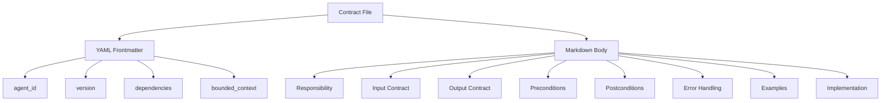
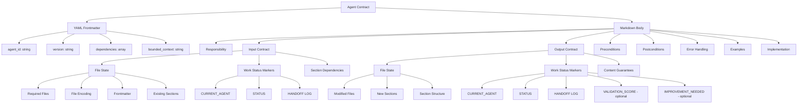
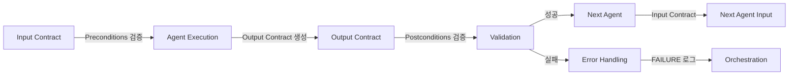

# Unit 2: Filter Contracts 명시화 - Logical Design v1.0

## 문서 정보

**목적**: Filter Contracts의 논리적 데이터 구조, 검증 알고리즘, 인터페이스를 구체적으로 설계

**상태**: Draft v1.0

**참조 문서**:
- `domain_design.md` (Unit 2) - 도메인 모델 및 계약 템플릿
- `unit-02-filter-contracts.md` - Unit 2 정의 및 범위
- `logical_design.md` (Unit 1) - Unit 1 논리적 설계

**작성 원칙**:
- 코드 스니펫 생성 금지 (명세만 작성)
- 표 + Mermaid 다이어그램으로 구조 표현
- 단계별 설명 + 정규식 패턴으로 알고리즘 표현
- API 문서 형식으로 인터페이스 명세

---

## 목차

1. [계약 데이터 구조](#section-1-계약-데이터-구조)
2. [입력 계약 형식](#section-2-입력-계약-형식)
3. [출력 계약 형식](#section-3-출력-계약-형식)
4. [품질 기준 정의](#section-4-품질-기준-정의)
5. [계약 검증 방법](#section-5-계약-검증-방법)
6. [계약 템플릿 구조](#section-6-계약-템플릿-구조)
7. [계약 검증 인터페이스](#section-7-계약-검증-인터페이스)
8. [계약 변경 시나리오](#section-8-계약-변경-시나리오)

---

# Section 1: 계약 데이터 구조

## 1.1 계약 파일 형식

계약 문서는 YAML frontmatter + Markdown 본문 형식을 사용합니다 (domain_design.md Section 2.1.1 참조).

### 1.1.1 파일 구조

| 구성 요소 | 형식 | 설명 |
|----------|------|------|
| **Frontmatter** | YAML | 기계 파싱 가능한 메타데이터 |
| **Body** | Markdown | 사람이 읽기 쉬운 설명 |
| **파일 인코딩** | UTF-8 | 한글 지원 |
| **줄바꿈** | LF (\n) | Unix 스타일 |

**파일 구조 다이어그램**:



---

### 1.1.2 YAML Frontmatter 스키마

| 필드 | 데이터 타입 | 필수 여부 | 제약사항 | 설명 |
|------|------------|----------|---------|------|
| `agent_id` | string | 필수 | `[a-z-]+` 패턴 | 에이전트 식별자 (kebab-case) |
| `version` | string | 필수 | Semantic Versioning (X.Y) | 계약 버전 |
| `dependencies` | array of strings | 필수 | 각 요소는 agent_id 형식 | 의존하는 에이전트 목록 (빈 배열 가능) |
| `bounded_context` | string | 필수 | 자유 형식 | Bounded Context 이름 |

**정규식 패턴**:

```regex
# agent_id 패턴
^[a-z]+(-[a-z]+)*$

# version 패턴 (MAJOR.MINOR)
^\d+\.\d+$

# dependencies 요소 패턴
^[a-z]+(-[a-z]+)*$
```

**예시**:

```yaml
---
agent_id: overview-writer
version: 1.0
dependencies: [content-initiator]
bounded_context: Overview Generation
---
```

**도메인 불변식**:
- `agent_id`는 7개 에이전트 중 하나여야 함: `content-initiator`, `overview-writer`, `concepts-writer`, `visualization-writer`, `practice-writer`, `quiz-writer`, `content-validator`
- `dependencies`에 나열된 에이전트는 파이프라인 순서상 현재 에이전트보다 앞에 위치해야 함
- `version`은 1.0으로 시작 (초기 버전)

---

## 1.2 Input Contract 데이터 스키마

### 1.2.1 Input Contract 구조

Input Contract는 에이전트 실행 전 기대하는 상태를 정의합니다.

| 하위 섹션 | 필수 여부 | 데이터 타입 | 설명 |
|----------|----------|------------|------|
| **File State** | 필수 | 구조화된 리스트 | 파일 존재 여부, 인코딩, frontmatter |
| **Work Status Markers** | 필수 | 구조화된 리스트 | 기대하는 마커 상태 |
| **Section Dependencies** | 선택 | 리스트 | 의존하는 다른 섹션 (없으면 "None") |
| **Category Metadata** | 선택 | 구조화된 리스트 | content-initiator만 해당 |

---

### 1.2.2 File State 필드

| 필드명 | 데이터 타입 | 설명 | 예시 |
|-------|------------|------|------|
| **Required Files** | string | 필요한 파일 경로 | Target markdown file path |
| **File Encoding** | enum | 파일 인코딩 | UTF-8 (고정값) |
| **Frontmatter** | enum | frontmatter 존재 여부 | Required / Optional / Must Not Exist |
| **Existing Sections** | list of strings | 이미 존재해야 하는 섹션 | `# Overview`, `# Core Concepts` 등 |

**Frontmatter 값 정의**:
- **Required**: frontmatter가 반드시 존재해야 함 (대부분의 에이전트)
- **Optional**: frontmatter가 있어도 되고 없어도 됨 (content-initiator)
- **Must Not Exist**: frontmatter가 없어야 함 (사용하지 않음)

---

### 1.2.3 Work Status Markers 필드

| 필드명 | 데이터 타입 | 설명 | 예시 |
|-------|------------|------|------|
| **CURRENT_AGENT** | string | 기대하는 에이전트 이름 | `overview-writer` |
| **STATUS** | enum | 기대하는 상태 | PENDING 또는 IN_PROGRESS |
| **HANDOFF LOG** | string (설명) | 기대하는 HANDOFF LOG 상태 | "이전 에이전트 [DONE] 엔트리 존재" |

**STATUS 값 정의**:
- **PENDING**: 처음 실행되는 경우
- **IN_PROGRESS**: 개선 모드 (IMPROVEMENT_NEEDED가 존재)

---

### 1.2.4 Section Dependencies 필드

| 데이터 타입 | 설명 | 예시 |
|------------|------|------|
| list of strings | 의존하는 섹션 헤더 목록 | `["# Overview", "# Core Concepts"]` |
| None | 의존 섹션 없음 | content-initiator, overview-writer |

**섹션 헤더 형식**:
- 레벨 1 헤더: `# Section Name`
- 레벨 2 하위 섹션은 포함하지 않음 (레벨 1만 명시)

---

## 1.3 Output Contract 데이터 스키마

### 1.3.1 Output Contract 구조

Output Contract는 에이전트 완료 후 보장하는 상태를 정의합니다.

| 하위 섹션 | 필수 여부 | 데이터 타입 | 설명 |
|----------|----------|------------|------|
| **File State** | 필수 | 구조화된 리스트 | 수정된 파일, 추가된 섹션 |
| **Work Status Markers** | 필수 | 구조화된 리스트 | 업데이트된 마커 상태 |
| **Content Guarantees** | 필수 | 자유 형식 리스트 | 생성 콘텐츠의 보장 사항 |

---

### 1.3.2 File State 필드

| 필드명 | 데이터 타입 | 설명 | 예시 |
|-------|------------|------|------|
| **Modified Files** | string | 수정하는 파일 | Target markdown file |
| **New Sections** | list of strings | 추가하는 섹션 목록 | `["# Overview"]` |
| **Section Structure** | Markdown 코드 블록 | 섹션 구조 명세 | 전체 섹션 마크다운 예시 |

**New Sections 형식**:
- 레벨 1 헤더만 명시: `# Section Name`
- 하위 섹션은 Section Structure에서 정의

---

### 1.3.3 Work Status Markers 필드

| 필드명 | 데이터 타입 | 설명 | 예시 |
|-------|------------|------|------|
| **CURRENT_AGENT** | string | 다음 에이전트 이름 | `concepts-writer` |
| **STATUS** | enum | 업데이트된 상태 | IN_PROGRESS (대부분) 또는 COMPLETED (content-validator 90-100점) |
| **HANDOFF LOG** | string (설명) | 추가되는 엔트리 | `[DONE] overview-writer | ...` |
| **VALIDATION_SCORE** | integer (optional) | 검증 점수 | 0-100 (content-validator만) |
| **IMPROVEMENT_NEEDED** | list of strings (optional) | 개선 항목 | `["agent-name: description"]` (content-validator만) |

**HANDOFF LOG 엔트리 형식**:
- 정상 완료: `[DONE] agent-name | completion message | timestamp`
- 개선 완료: `[IMPROVE] agent-name | improvement message | timestamp`
- 검증 완료: `[COMPLETE] content-validator | validation message | timestamp`

**Unit 1 명세 참조**: HANDOFF LOG 엔트리 형식은 `work-status-markers-spec.md` Section 2.5 참조

---

### 1.3.4 Content Guarantees 필드

| 데이터 타입 | 설명 | 예시 |
|------------|------|------|
| list of strings | 생성 콘텐츠의 보장 사항 목록 | "3단계 난이도 설명 포함 (Easy/Normal/Expert)" |

**보장 유형**:
- **구조적 보장**: 섹션 구조, 하위 섹션 존재
- **내용적 보장**: 특정 내용 포함 (3단계 설명, 시각화 메타데이터 등)
- **형식적 보장**: 마크다운 문법 준수, 코드 블록 형식 등

---

## 1.4 Preconditions 데이터 스키마

### 1.4.1 Precondition 구조

Preconditions는 에이전트 실행 전 검증 조건을 정의합니다.

| 데이터 타입 | 형식 | 설명 |
|------------|------|------|
| Ordered list | 번호 매긴 리스트 | 검증 순서대로 나열 |
| Boolean expression | 조건문 형식 | `FIELD == "value"` |

**Precondition 예시**:

```markdown
## Preconditions

1. CURRENT_AGENT == "overview-writer"
2. STATUS == PENDING 또는 IN_PROGRESS
3. frontmatter가 존재하고 category.yaml의 토픽 메타데이터로 채워져 있음
4. Work Status Markers가 파일 최상단에 존재
```

**검증 순서**:
1. Work Status Markers 존재 확인
2. CURRENT_AGENT 일치 확인
3. STATUS 확인
4. 파일 상태 확인 (frontmatter, 섹션)
5. 의존 섹션 존재 확인

---

## 1.5 Postconditions 데이터 스키마

### 1.5.1 Postcondition 구조

Postconditions는 에이전트 실행 후 보장 조건을 정의합니다.

| 데이터 타입 | 형식 | 설명 |
|------------|------|------|
| Ordered list | 번호 매긴 리스트 | 검증 순서대로 나열 |
| Boolean expression | 조건문 형식 | `SECTION exists` |

**Postcondition 예시**:

```markdown
## Postconditions

1. `# Overview` 섹션 생성 완료
2. CURRENT_AGENT == "concepts-writer"
3. HANDOFF LOG에 `[DONE] overview-writer | ...` 엔트리 추가
4. UPDATED 타임스탬프 갱신
```

**검증 순서**:
1. 새 섹션 존재 확인
2. Work Status Markers 업데이트 확인
3. HANDOFF LOG 엔트리 추가 확인
4. 타임스탬프 갱신 확인

---

## 1.6 계약 데이터 구조 다이어그램

### 1.6.1 전체 계약 구조



---

### 1.6.2 필드 간 관계



**관계 설명**:
- Input Contract의 Work Status Markers와 Output Contract의 Work Status Markers는 연결됨
- Output Contract의 New Sections는 다음 에이전트의 Section Dependencies가 됨
- Preconditions 실패 시 에이전트 실행 중단 (Fail-Fast)

---

## Section 1 체크리스트

- [x] 1.1: 계약 파일 형식 정의 (YAML frontmatter + Markdown)
- [x] 1.2: Input Contract 데이터 스키마 정의
- [x] 1.3: Output Contract 데이터 스키마 정의
- [x] 1.4: Preconditions 데이터 스키마 정의
- [x] 1.5: Postconditions 데이터 스키마 정의
- [x] 1.6: 계약 데이터 구조 다이어그램 작성

**다음 Section**: Section 2 - 입력 계약 형식

---

# Section 2: 입력 계약 형식

## 2.1 File State 명세

### 2.1.1 Required Files 필드

| 속성 | 값 |
|------|-----|
| **필드명** | Required Files |
| **데이터 타입** | string |
| **설명** | 에이전트가 읽거나 수정할 파일 경로 |
| **값** | "Target markdown file path" (모든 에이전트 공통) |

**파일 경로 제약사항**:
- UTF-8 인코딩
- `.md` 확장자
- 절대 경로 또는 상대 경로 (오케스트레이션이 제공)

---

### 2.1.2 File Encoding 필드

| 속성 | 값 |
|------|-----|
| **필드명** | File Encoding |
| **데이터 타입** | enum |
| **허용 값** | UTF-8 (고정값) |
| **설명** | 파일 인코딩 방식 |

**이유**: 한글 콘텐츠 지원을 위해 UTF-8 필수

---

### 2.1.3 Frontmatter 필드

| 속성 | 값 |
|------|-----|
| **필드명** | Frontmatter |
| **데이터 타입** | enum |
| **허용 값** | Required / Optional / Must Not Exist |
| **설명** | frontmatter 존재 여부 요구사항 |

**에이전트별 값**:

| 에이전트 | Frontmatter 값 | 이유 |
|----------|---------------|------|
| content-initiator | Optional | 파일이 비어있거나 frontmatter만 존재할 수 있음 |
| overview-writer | Required | content-initiator가 frontmatter 생성 |
| concepts-writer | Required | frontmatter 필요 |
| visualization-writer | Required | frontmatter 필요 |
| practice-writer | Required | frontmatter 필요 |
| quiz-writer | Required | frontmatter 필요 |
| content-validator | Required | frontmatter 필요 |

---

### 2.1.4 Existing Sections 필드

| 속성 | 값 |
|------|-----|
| **필드명** | Existing Sections |
| **데이터 타입** | list of strings |
| **설명** | 이미 존재해야 하는 섹션 헤더 목록 |
| **형식** | `["# Section Name", ...]` |

**에이전트별 값** (domain_design.md Section 3 참조):

| 에이전트 | Existing Sections | 설명 |
|----------|------------------|------|
| content-initiator | None | 파일이 비어있거나 frontmatter만 존재 |
| overview-writer | None | content-initiator는 섹션 생성하지 않음 |
| concepts-writer | `["# Overview"]` | overview-writer가 생성 |
| visualization-writer | `["# Overview", "# Core Concepts"]` | concepts-writer가 생성 |
| practice-writer | `["# Overview", "# Core Concepts"]` | visualization-writer는 메타데이터만 추가 |
| quiz-writer | `["# Overview", "# Core Concepts", "# Code Patterns", "# Experiments"]` | practice-writer가 생성 |
| content-validator | `["# Overview", "# Core Concepts", "# Code Patterns", "# Experiments", "# Quiz"]` | quiz-writer가 생성 |

**검증 규칙**:
- 섹션 헤더는 정확히 일치해야 함 (대소문자, 공백 포함)
- 레벨 1 헤더만 검증 (`# `)
- 순서는 무관 (존재 여부만 확인)

---

## 2.2 Work Status Markers 명세

### 2.2.1 CURRENT_AGENT 필드

| 속성 | 값 |
|------|-----|
| **필드명** | CURRENT_AGENT |
| **데이터 타입** | string |
| **기대값** | 자신의 에이전트 이름 |
| **예외** | content-initiator: 빈 문자열 또는 "content-initiator" (첫 실행 또는 재시작) |

**에이전트별 기대값**:

| 에이전트 | CURRENT_AGENT 기대값 | 설정 주체 |
|----------|---------------------|----------|
| content-initiator | "" (빈 문자열) 또는 "content-initiator" | 없음 또는 오케스트레이션 (재시작) |
| overview-writer | "overview-writer" | content-initiator |
| concepts-writer | "concepts-writer" | overview-writer |
| visualization-writer | "visualization-writer" | concepts-writer |
| practice-writer | "practice-writer" | visualization-writer |
| quiz-writer | "quiz-writer" | practice-writer |
| content-validator | "content-validator" | quiz-writer |

---

### 2.2.2 STATUS 필드

| 속성 | 값 |
|------|-----|
| **필드명** | STATUS |
| **데이터 타입** | enum |
| **허용 값** | PENDING / IN_PROGRESS |
| **설명** | 파이프라인 전체 상태 |

**값 정의**:
- **PENDING**: 첫 실행 (HANDOFF LOG에 START만 있음)
- **IN_PROGRESS**: 진행 중 또는 개선 모드 (하나 이상의 에이전트 실행됨)

**에이전트별 기대값**:

| 에이전트 | STATUS 기대값 | 상황 |
|----------|--------------|------|
| content-initiator | N/A | Work Status Markers 없음 (첫 실행) |
| overview-writer | PENDING 또는 IN_PROGRESS | PENDING (첫 실행), IN_PROGRESS (개선 모드) |
| concepts-writer | IN_PROGRESS | overview-writer 실행 후 |
| visualization-writer | IN_PROGRESS | concepts-writer 실행 후 |
| practice-writer | IN_PROGRESS | visualization-writer 실행 후 |
| quiz-writer | IN_PROGRESS | practice-writer 실행 후 |
| content-validator | IN_PROGRESS | quiz-writer 실행 후 |

---

### 2.2.3 HANDOFF LOG 필드

| 속성 | 값 |
|------|-----|
| **필드명** | HANDOFF LOG |
| **데이터 타입** | array of strings |
| **형식** | `[EVENT_TYPE] agent-name \| message \| timestamp` |
| **설명** | 이전 에이전트 실행 기록 |

**기대 상태**:
- **최소 요구사항**: 이전 에이전트의 `[DONE]` 엔트리 존재
- **개선 모드**: `[IMPROVE]` 엔트리 추가

**에이전트별 기대 HANDOFF LOG**:

| 에이전트 | 기대하는 마지막 엔트리 | 예시 |
|----------|---------------------|------|
| content-initiator | N/A | Work Status Markers 없음 |
| overview-writer | `[START] pipeline \| ...` | `[START] pipeline \| Content generation started \| 2025-10-17T10:00:00+09:00` |
| concepts-writer | `[DONE] overview-writer \| ...` | `[DONE] overview-writer \| Overview section completed \| 2025-10-17T10:30:00+09:00` |
| visualization-writer | `[DONE] concepts-writer \| ...` | `[DONE] concepts-writer \| Core concepts completed \| 2025-10-17T11:00:00+09:00` |
| practice-writer | `[DONE] visualization-writer \| ...` | `[DONE] visualization-writer \| Visualizations created \| 2025-10-17T11:30:00+09:00` |
| quiz-writer | `[DONE] practice-writer \| ...` | `[DONE] practice-writer \| Practice content completed \| 2025-10-17T12:00:00+09:00` |
| content-validator | `[DONE] quiz-writer \| ...` | `[DONE] quiz-writer \| Quiz section completed \| 2025-10-17T12:30:00+09:00` |

**개선 모드 감지** (domain_design.md Section 2.1.3 참조):
- IMPROVEMENT_NEEDED 필드에 자신의 에이전트 이름이 있으면 개선 모드
- 기대 엔트리: `[DONE] content-validator | 검증 완료 - XX점 (개선 필요) | ...`

---

## 2.3 Section Dependencies 명세

### 2.3.1 Section Dependencies 필드

| 속성 | 값 |
|------|-----|
| **필드명** | Section Dependencies |
| **데이터 타입** | list of strings 또는 "None" |
| **형식** | `["# Section Name", ...]` |
| **설명** | 이 에이전트가 읽어야 하는 다른 에이전트의 섹션 |

**에이전트별 Section Dependencies**:

| 에이전트 | Section Dependencies | 이유 |
|----------|---------------------|------|
| content-initiator | None | 첫 에이전트 |
| overview-writer | None | category.yaml만 참조 |
| concepts-writer | `["# Overview"]` | Overview 내용을 확장 |
| visualization-writer | `["# Core Concepts"]` | Concepts에 시각화 추가 |
| practice-writer | `["# Core Concepts"]` | Concepts를 코드로 변환 |
| quiz-writer | `["# Overview", "# Core Concepts", "# Code Patterns", "# Experiments"]` | 모든 학습 섹션 참조 |
| content-validator | `["# Overview", "# Core Concepts", "# Code Patterns", "# Experiments", "# Quiz"]` | 전체 콘텐츠 검증 |

**의존성 유형**:
- **Hard Dependency**: 반드시 필요 (해당 섹션이 없으면 실행 불가)
- **Data Dependency**: 섹션 내용을 읽어서 활용

---

## 2.4 7개 에이전트별 Input Contract 상세 명세

### 2.4.1 content-initiator Input Contract

**File State**:
- Required Files: Target markdown file path
- File Encoding: UTF-8
- Frontmatter: Optional (있어도 되고 없어도 됨)
- Existing Sections: None

**Category Metadata** (from category.yaml):
- topic.id (required) - 토픽 식별자
- topic.title (required) - 토픽 제목
- topic.description (required) - 토픽 설명
- topic.difficulty (required, 1-5) - 난이도
- topic.prerequisites (optional, array) - 선수 학습 토픽
- topic.estimatedTime (optional, minutes) - 예상 학습 시간

**Work Status Markers**:
- N/A (Work Status Markers가 없거나 CURRENT_AGENT="content-initiator")

**Section Dependencies**: None

---

### 2.4.2 overview-writer Input Contract

**File State**:
- Required Files: Target markdown file path
- File Encoding: UTF-8
- Frontmatter: Required (category.yaml 메타데이터로 채워짐)
- Existing Sections: None

**Work Status Markers**:
- CURRENT_AGENT: "overview-writer"
- STATUS: PENDING 또는 IN_PROGRESS
- HANDOFF LOG: `[START] pipeline | Content generation started | [timestamp]`

**Section Dependencies**: None

---

### 2.4.3 concepts-writer Input Contract

**File State**:
- Required Files: Target markdown file path
- File Encoding: UTF-8
- Frontmatter: Required
- Existing Sections: `["# Overview"]`

**Work Status Markers**:
- CURRENT_AGENT: "concepts-writer"
- STATUS: IN_PROGRESS
- HANDOFF LOG: `[DONE] overview-writer | Overview section completed | [timestamp]`

**Section Dependencies**: `["# Overview"]`

---

### 2.4.4 visualization-writer Input Contract

**File State**:
- Required Files: Target markdown file path
- File Encoding: UTF-8
- Frontmatter: Required
- Existing Sections: `["# Overview", "# Core Concepts"]`

**Work Status Markers**:
- CURRENT_AGENT: "visualization-writer"
- STATUS: IN_PROGRESS
- HANDOFF LOG: `[DONE] concepts-writer | Core concepts section completed | [timestamp]`

**Section Dependencies**: `["# Core Concepts"]`

**특이사항**: Core Concepts 섹션 내부의 각 Concept 하위 섹션을 읽어서 시각화 메타데이터 추가

---

### 2.4.5 practice-writer Input Contract

**File State**:
- Required Files: Target markdown file path
- File Encoding: UTF-8
- Frontmatter: Required
- Existing Sections: `["# Overview", "# Core Concepts"]`

**Work Status Markers**:
- CURRENT_AGENT: "practice-writer"
- STATUS: IN_PROGRESS
- HANDOFF LOG: `[DONE] visualization-writer | Visualization components created | [timestamp]`

**Section Dependencies**: `["# Core Concepts"]`

**특이사항**: Core Concepts를 코드 패턴과 실험으로 변환

---

### 2.4.6 quiz-writer Input Contract

**File State**:
- Required Files: Target markdown file path
- File Encoding: UTF-8
- Frontmatter: Required
- Existing Sections: `["# Overview", "# Core Concepts", "# Code Patterns", "# Experiments"]`

**Work Status Markers**:
- CURRENT_AGENT: "quiz-writer"
- STATUS: IN_PROGRESS
- HANDOFF LOG: `[DONE] practice-writer | Practice content completed | [timestamp]`

**Section Dependencies**: `["# Overview", "# Core Concepts", "# Code Patterns", "# Experiments"]`

**특이사항**: 모든 학습 섹션을 참조하여 퀴즈 생성

---

### 2.4.7 content-validator Input Contract

**File State**:
- Required Files: Target markdown file path
- File Encoding: UTF-8
- Frontmatter: Required
- Existing Sections: `["# Overview", "# Core Concepts", "# Code Patterns", "# Experiments", "# Quiz"]`

**Work Status Markers**:
- CURRENT_AGENT: "content-validator"
- STATUS: IN_PROGRESS
- HANDOFF LOG: `[DONE] quiz-writer | Quiz section completed | [timestamp]`

**Section Dependencies**: `["# Overview", "# Core Concepts", "# Code Patterns", "# Experiments", "# Quiz"]`

**특이사항**: 전체 콘텐츠를 검증하여 VALIDATION_SCORE 및 IMPROVEMENT_NEEDED 생성

---

## 2.5 Input Contract 검증 규칙

### 2.5.1 검증 순서

Input Contract 검증은 다음 순서로 수행됩니다:

1. **파일 존재 확인**: Required Files 경로의 파일 존재 여부
2. **파일 인코딩 확인**: UTF-8 인코딩 여부
3. **Frontmatter 확인**: Frontmatter 요구사항 충족 여부
4. **Work Status Markers 확인**: CURRENT_AGENT, STATUS 일치 여부
5. **Existing Sections 확인**: 필수 섹션 존재 여부
6. **Section Dependencies 확인**: 의존 섹션 존재 여부

**Fail-Fast 원칙**: 검증 실패 시 즉시 중단하고 오류 메시지 출력

---

### 2.5.2 검증 실패 오류 메시지 형식

**형식**:
```
❌ Precondition Failed: {agent-name}
- Expected: {field-name} = {expected-value}
- Actual: {field-name} = {actual-value}
- Fix: {suggestion}
```

**예시**:
```
❌ Precondition Failed: overview-writer
- Expected: CURRENT_AGENT = overview-writer
- Actual: CURRENT_AGENT = concepts-writer
- Fix: Check Work Status Markers or run content-initiator first
```

---

## Section 2 체크리스트

- [x] 2.1: File State 명세 정의
- [x] 2.2: Work Status Markers 명세 정의
- [x] 2.3: Section Dependencies 명세 정의
- [x] 2.4: 7개 에이전트별 Input Contract 상세 명세 작성
- [x] 2.5: Input Contract 검증 규칙 정의

**다음 Section**: Section 3 - 출력 계약 형식

---

# Section 3: 출력 계약 형식

## 3.1 File State 명세

### 3.1.1 Modified Files 필드

| 속성 | 값 |
|------|-----|
| **필드명** | Modified Files |
| **데이터 타입** | string |
| **설명** | 에이전트가 수정하는 파일 |
| **값** | "Target markdown file" (모든 에이전트 공통) |

**수정 방식**:
- 기존 파일 읽기 → 섹션 추가/수정 → 파일 쓰기
- UTF-8 인코딩 유지

---

### 3.1.2 New Sections 필드

| 속성 | 값 |
|------|-----|
| **필드명** | New Sections |
| **데이터 타입** | list of strings |
| **설명** | 에이전트가 추가하는 새로운 섹션 헤더 목록 |
| **형식** | `["# Section Name"]` (레벨 1 헤더만) |

**에이전트별 New Sections**:

| 에이전트 | New Sections | 설명 |
|----------|--------------|------|
| content-initiator | None (Work Status Markers만) | frontmatter + Work Status Markers 추가 |
| overview-writer | `["# Overview"]` | 개요 섹션 생성 |
| concepts-writer | `["# Core Concepts"]` | 핵심 개념 섹션 생성 |
| visualization-writer | None (메타데이터 임베딩만) | Core Concepts에 시각화 메타데이터 추가 |
| practice-writer | `["# Code Patterns", "# Experiments"]` | 실습 섹션 2개 생성 |
| quiz-writer | `["# Quiz"]` | 퀴즈 섹션 생성 |
| content-validator | None (마커 필드만 업데이트) | VALIDATION_SCORE, IMPROVEMENT_NEEDED 추가 |

---

### 3.1.3 Section Structure 필드

| 속성 | 값 |
|------|-----|
| **필드명** | Section Structure |
| **데이터 타입** | Markdown code block |
| **설명** | 생성하는 섹션의 전체 구조 명세 (예시) |
| **형식** | 마크다운 코드 블록 |

**작성 규칙**:
- 레벨 1-3 헤더 구조 명시
- 하위 섹션 레이아웃 표시
- 콘텐츠 플레이스홀더 사용 (`[content]`, `[description]` 등)

**예시** (overview-writer):
````markdown
```markdown
# Overview

## 학습 목표

[학습 목표 리스트]

## 왜 중요한가?

[중요성 설명]

## 실무 활용

[실무 활용 사례]
```
````

---

## 3.2 Work Status Markers 명세

### 3.2.1 CURRENT_AGENT 업데이트

| 속성 | 값 |
|------|-----|
| **필드명** | CURRENT_AGENT |
| **업데이트 방식** | 다음 에이전트 이름으로 변경 |
| **특수 케이스** | content-validator (90-100점): 빈 문자열 |

**에이전트별 CURRENT_AGENT 업데이트**:

| 에이전트 | 업데이트 값 | 설명 |
|----------|------------|------|
| content-initiator | "overview-writer" | 다음 에이전트로 핸드오프 |
| overview-writer | "concepts-writer" | 다음 에이전트로 핸드오프 |
| concepts-writer | "visualization-writer" | 다음 에이전트로 핸드오프 |
| visualization-writer | "practice-writer" | 다음 에이전트로 핸드오프 |
| practice-writer | "quiz-writer" | 다음 에이전트로 핸드오프 |
| quiz-writer | "content-validator" | 다음 에이전트로 핸드오프 |
| content-validator (90-100점) | "" (빈 문자열) | 파이프라인 완료 |
| content-validator (90점 미만) | (유지) "content-validator" | 개선 필요, 재실행 대기 |

---

### 3.2.2 STATUS 업데이트

| 속성 | 값 |
|------|-----|
| **필드명** | STATUS |
| **일반 에이전트** | IN_PROGRESS (유지 또는 PENDING → IN_PROGRESS) |
| **content-validator** | COMPLETED (90-100점) 또는 IN_PROGRESS (90점 미만) |

**에이전트별 STATUS 업데이트**:

| 에이전트 | 업데이트 값 | 조건 |
|----------|------------|------|
| content-initiator | PENDING | 첫 실행 |
| overview-writer | IN_PROGRESS | PENDING → IN_PROGRESS |
| concepts-writer | IN_PROGRESS | 유지 |
| visualization-writer | IN_PROGRESS | 유지 |
| practice-writer | IN_PROGRESS | 유지 |
| quiz-writer | IN_PROGRESS | 유지 |
| content-validator | COMPLETED 또는 IN_PROGRESS | 90-100점: COMPLETED, 90점 미만: IN_PROGRESS |

---

### 3.2.3 HANDOFF LOG 추가

| 속성 | 값 |
|------|-----|
| **필드명** | HANDOFF LOG |
| **추가 방식** | 배열 끝에 새 엔트리 추가 |
| **엔트리 형식** | `[EVENT_TYPE] agent-name \| message \| timestamp` |

**EVENT_TYPE 종류**:
- **[START]**: 파이프라인 시작 (content-initiator)
- **[DONE]**: 정상 완료 (모든 에이전트)
- **[IMPROVE]**: 개선 완료 (개선 모드 실행 시)
- **[COMPLETE]**: 검증 완료 (content-validator, 90-100점)
- **[FAILURE]**: 실패 (오케스트레이션이 기록)
- **[SKIP]**: 건너뛰기 (오케스트레이션이 기록)

**에이전트별 HANDOFF LOG 엔트리**:

| 에이전트 | 엔트리 형식 | 예시 |
|----------|------------|------|
| content-initiator | `[START] pipeline \| Content generation started \| [timestamp]` | `[START] pipeline \| Content generation started \| 2025-10-17T10:00:00+09:00` |
| overview-writer | `[DONE] overview-writer \| Overview section completed \| [timestamp]` | `[DONE] overview-writer \| Overview section completed \| 2025-10-17T10:30:00+09:00` |
| concepts-writer | `[DONE] concepts-writer \| Core concepts section completed \| [timestamp]` | `[DONE] concepts-writer \| Core concepts completed \| 2025-10-17T11:00:00+09:00` |
| visualization-writer | `[DONE] visualization-writer \| Visualization components created \| [timestamp]` | `[DONE] visualization-writer \| Visualizations created \| 2025-10-17T11:30:00+09:00` |
| practice-writer | `[DONE] practice-writer \| Practice content completed \| [timestamp]` | `[DONE] practice-writer \| Practice completed \| 2025-10-17T12:00:00+09:00` |
| quiz-writer | `[DONE] quiz-writer \| Quiz section completed \| [timestamp]` | `[DONE] quiz-writer \| Quiz completed \| 2025-10-17T12:30:00+09:00` |
| content-validator (90-100점) | `[COMPLETE] content-validator \| 검증 완료 - XX점 \| [timestamp]` | `[COMPLETE] content-validator \| 검증 완료 - 95점 \| 2025-10-17T13:00:00+09:00` |
| content-validator (90점 미만) | `[DONE] content-validator \| 검증 완료 - XX점 (개선 필요) \| [timestamp]` | `[DONE] content-validator \| 검증 완료 - 87점 (개선 필요) \| 2025-10-17T13:00:00+09:00` |

**개선 모드 엔트리**:
```
[IMPROVE] {agent-name} | {improvement-message} | {timestamp}
```

---

### 3.2.4 VALIDATION_SCORE 설정 (content-validator만)

| 속성 | 값 |
|------|-----|
| **필드명** | VALIDATION_SCORE |
| **데이터 타입** | integer |
| **허용 값** | 0-100 |
| **설정 에이전트** | content-validator만 |

**계산 로직**: Section 4.1 참조

---

### 3.2.5 IMPROVEMENT_NEEDED 생성 (content-validator만)

| 속성 | 값 |
|------|-----|
| **필드명** | IMPROVEMENT_NEEDED |
| **데이터 타입** | array of strings |
| **형식** | `- agent-name: improvement description [(-점수)점]` |
| **설정 에이전트** | content-validator만 |
| **생성 조건** | VALIDATION_SCORE < 90 |

**엔트리 형식**:
```
IMPROVEMENT_NEEDED:
- concepts-writer: Easy 설명이 너무 짧음, 비유 추가 필요 (-8점)
- practice-writer: Pattern 2의 코드 실행 오류 수정 필요 (-5점)
```

**Unit 1 명세 참조**: `work-status-markers-spec.md` Section 3.2

---

## 3.3 Content Guarantees 명세

### 3.3.1 Content Guarantees 정의

| 속성 | 값 |
|------|-----|
| **데이터 타입** | list of strings |
| **설명** | 생성 콘텐츠가 보장하는 품질 및 구조 |
| **형식** | 자유 형식 리스트 |

**보장 유형**:
1. **구조적 보장**: 섹션 구조, 헤더 레벨, 하위 섹션
2. **내용적 보장**: 필수 내용 포함 (3단계 설명, 코드 예시 등)
3. **형식적 보장**: 마크다운 문법, 코드 블록 형식

---

### 3.3.2 에이전트별 Content Guarantees

**content-initiator**:
- Work Status Markers가 파일 최상단에 존재 (frontmatter 다음)
- frontmatter는 category.yaml의 토픽 메타데이터로 채워짐
- frontmatter에 자동 생성 주석 포함
- category.yaml이 single source of truth로 유지됨

**overview-writer**:
- `# Overview` 섹션 생성
- 3개 하위 섹션: 학습 목표, 왜 중요한가, 실무 활용
- 자연어 중심 설명 (코드 없음)
- 학습 동기 부여 내용 포함

**concepts-writer**:
- `# Core Concepts` 섹션 생성
- 3-5개 핵심 개념 (각 개념마다 하위 섹션)
- 각 개념마다 3단계 난이도 설명 (Easy/Normal/Expert)
- Easy: 중학생도 이해 가능, 일상적 비유, 코드 없음
- Normal: 일반 개발자 수준, 기술 용어 + 간단한 코드
- Expert: 20년+ 전문가 수준, 명세 참조, 전문용어

**visualization-writer**:
- Core Concepts의 각 Concept에 시각화 메타데이터 임베딩
- YAML frontmatter 형식 메타데이터
- componentType, props 정의
- React 컴포넌트 이름 명시

**practice-writer**:
- `# Code Patterns` 섹션 생성: 3-5개 패턴
- `# Experiments` 섹션 생성: 2-3개 실험
- 코드는 개념 확인용 (실행 가능)
- 예상 출력 포함

**quiz-writer**:
- `# Quiz` 섹션 생성
- 5-10개 퀴즈 문제
- 4가지 문제 유형: 객관식, O/X, 코드 실행 결과, 빈칸 채우기
- 정답 및 해설 포함 (YAML frontmatter)

**content-validator**:
- VALIDATION_SCORE 0-100점 설정
- VALIDATION_SCORE < 90 시 IMPROVEMENT_NEEDED 생성
- 개선 항목마다 담당 에이전트 명시
- 선택적으로 감점 점수 표기 (`(-N점)`)

---

## 3.4 7개 에이전트별 Output Contract 상세 명세

### 3.4.1 content-initiator Output Contract

**File State**:
- Modified Files: Target markdown file
- New Sections: None (Work Status Markers만)
- Section Structure: frontmatter + Work Status Markers

**Work Status Markers**:
- CURRENT_AGENT: "overview-writer"
- STATUS: PENDING
- HANDOFF LOG: `[START] pipeline | Content generation started | [timestamp]`

**Content Guarantees**:
- Work Status Markers가 파일 최상단에 존재
- frontmatter는 category.yaml 메타데이터로 채워짐

---

### 3.4.2 overview-writer Output Contract

**File State**:
- Modified Files: Target markdown file
- New Sections: `["# Overview"]`
- Section Structure: `# Overview` (학습 목표, 왜 중요한가, 실무 활용)

**Work Status Markers**:
- CURRENT_AGENT: "concepts-writer"
- STATUS: IN_PROGRESS
- HANDOFF LOG: `[DONE] overview-writer | Overview section completed | [timestamp]`

**Content Guarantees**:
- 3개 하위 섹션 포함
- 자연어 중심 설명
- 학습 동기 부여 내용

---

### 3.4.3 concepts-writer Output Contract

**File State**:
- Modified Files: Target markdown file
- New Sections: `["# Core Concepts"]`
- Section Structure: `# Core Concepts` (3-5개 개념, 각 3단계 설명)

**Work Status Markers**:
- CURRENT_AGENT: "visualization-writer"
- STATUS: IN_PROGRESS
- HANDOFF LOG: `[DONE] concepts-writer | Core concepts section completed | [timestamp]`

**Content Guarantees**:
- 각 개념마다 Easy/Normal/Expert 설명
- 난이도별 길이 균형

---

### 3.4.4 visualization-writer Output Contract

**File State**:
- Modified Files: Target markdown file
- New Sections: None (메타데이터만 임베딩)
- Section Structure: Core Concepts 각 Concept에 시각화 메타데이터 추가

**Work Status Markers**:
- CURRENT_AGENT: "practice-writer"
- STATUS: IN_PROGRESS
- HANDOFF LOG: `[DONE] visualization-writer | Visualization components created | [timestamp]`

**Content Guarantees**:
- 각 Concept에 시각화 메타데이터
- componentType, props 정의

---

### 3.4.5 practice-writer Output Contract

**File State**:
- Modified Files: Target markdown file
- New Sections: `["# Code Patterns", "# Experiments"]`
- Section Structure: 패턴 섹션 (3-5개) + 실험 섹션 (2-3개)

**Work Status Markers**:
- CURRENT_AGENT: "quiz-writer"
- STATUS: IN_PROGRESS
- HANDOFF LOG: `[DONE] practice-writer | Practice content completed | [timestamp]`

**Content Guarantees**:
- 실행 가능한 코드
- 예상 출력 포함

---

### 3.4.6 quiz-writer Output Contract

**File State**:
- Modified Files: Target markdown file
- New Sections: `["# Quiz"]`
- Section Structure: 5-10개 퀴즈 (4가지 유형)

**Work Status Markers**:
- CURRENT_AGENT: "content-validator"
- STATUS: IN_PROGRESS
- HANDOFF LOG: `[DONE] quiz-writer | Quiz section completed | [timestamp]`

**Content Guarantees**:
- 5-10개 퀴즈
- 정답 및 해설 포함

---

### 3.4.7 content-validator Output Contract

**File State**:
- Modified Files: Target markdown file
- New Sections: None (마커 필드만)
- Section Structure: N/A

**Work Status Markers**:
- CURRENT_AGENT: "" (90-100점) 또는 "content-validator" (90점 미만)
- STATUS: COMPLETED (90-100점) 또는 IN_PROGRESS (90점 미만)
- HANDOFF LOG: `[COMPLETE] ...` (90-100점) 또는 `[DONE] ... (개선 필요)` (90점 미만)
- VALIDATION_SCORE: 0-100
- IMPROVEMENT_NEEDED: (90점 미만 시) 개선 항목 리스트

**Content Guarantees**:
- VALIDATION_SCORE 0-100점 설정
- 90점 미만 시 IMPROVEMENT_NEEDED 생성

---

## 3.5 Output Contract 검증 규칙

### 3.5.1 검증 순서

Output Contract 검증 (Postconditions)은 다음 순서로 수행됩니다:

1. **새 섹션 존재 확인**: New Sections에 명시된 섹션 존재 여부
2. **Work Status Markers 업데이트 확인**: CURRENT_AGENT, STATUS 업데이트 여부
3. **HANDOFF LOG 엔트리 확인**: 새 엔트리 추가 여부 및 형식
4. **UPDATED 타임스탬프 확인**: 타임스탬프 갱신 여부
5. **Content Guarantees 확인**: 콘텐츠 품질 보장 항목 검증

---

### 3.5.2 검증 실패 오류 메시지 형식

**형식**:
```
❌ Postcondition Failed: {agent-name}
- Expected: {field-name} = {expected-value}
- Actual: {field-name} = {actual-value}
- Fix: {suggestion}
```

**예시**:
```
❌ Postcondition Failed: overview-writer
- Expected: New Section "# Overview" exists
- Actual: Section not found
- Fix: Check agent output and ensure section was created
```

---

## Section 3 체크리스트

- [x] 3.1: File State 명세 정의
- [x] 3.2: Work Status Markers 명세 정의
- [x] 3.3: Content Guarantees 명세 정의
- [x] 3.4: 7개 에이전트별 Output Contract 상세 명세 작성
- [x] 3.5: Output Contract 검증 규칙 정의

**다음 Section**: Section 4 - 품질 기준 정의

---

# Section 4: 품질 기준 정의

## 4.1 VALIDATION_SCORE 계산 로직

### 4.1.1 점수 체계

| 속성 | 값 |
|------|-----|
| **점수 범위** | 0-100점 |
| **합격 기준** | 90점 이상 |
| **평가 방식** | 4개 차원 각 25점 만점 |
| **계산식** | 완성도(25) + 정확도(25) + 일관성(25) + 학습효과성(25) |

**점수 구간**:
- **90-100점**: 합격 (COMPLETED, 개선 불필요)
- **70-89점**: 개선 필요 (IMPROVEMENT_NEEDED 생성)
- **50-69점**: 다수 개선 필요
- **0-49점**: 전면 재작성 권장

---

## 4.2 품질 차원 정의

### 4.2.1 차원 1: 완성도 (Completeness) - 25점

**정의**: 모든 필수 섹션 및 하위 항목이 존재하는가?

**평가 원칙**:
- 모든 필수 섹션 존재 (Overview, Core Concepts, Code Patterns, Experiments, Quiz)
- 각 섹션의 하위 항목 충족 (예: Core Concepts는 3-5개 개념)
- frontmatter 메타데이터 완전성

**감점 기준**:
- 필수 섹션 누락: -10점/섹션
- 하위 항목 부족: -3점/항목
- frontmatter 필드 누락: -2점/필드

**에이전트별 체크 항목**:
- overview-writer: 3개 하위 섹션 (학습 목표, 중요성, 실무 활용)
- concepts-writer: 3-5개 개념, 각 개념마다 Easy/Normal/Expert
- visualization-writer: 각 Concept에 시각화 메타데이터
- practice-writer: 3-5개 패턴, 2-3개 실험
- quiz-writer: 5-10개 퀴즈, 4가지 유형 포함

---

### 4.2.2 차원 2: 정확도 (Accuracy) - 25점

**정의**: 콘텐츠가 기술적으로 정확하고 오류가 없는가?

**평가 원칙**:
- 기술 용어 정확성
- 코드 실행 가능성
- 예상 출력 정확성
- 시각화 메타데이터 유효성

**감점 기준**:
- 코드 실행 오류: -5점/오류
- 기술 용어 오용: -3점/오류
- 예상 출력 불일치: -3점/오류
- 잘못된 시각화 props: -2점/오류

**에이전트별 체크 항목**:
- concepts-writer: 기술 용어 정확성, 설명 오류 없음
- practice-writer: 코드 실행 가능성, 예상 출력 정확성
- quiz-writer: 정답 정확성, 해설 오류 없음

---

### 4.2.3 차원 3: 일관성 (Consistency) - 25점

**정의**: 전체 콘텐츠가 일관된 스타일과 구조를 유지하는가?

**평가 원칙**:
- 용어 일관성 (같은 개념은 같은 용어)
- 난이도 균형 (Easy/Normal/Expert 길이 비슷)
- 마크다운 형식 일관성
- 섹션 구조 일관성

**감점 기준**:
- 용어 불일치: -3점/항목
- 난이도 불균형: -5점 (Easy 너무 짧거나 Expert 너무 간단)
- 마크다운 형식 오류: -2점/오류
- 섹션 구조 불일치: -3점/항목

**에이전트별 체크 항목**:
- concepts-writer: 난이도별 길이 균형, 용어 일관성
- practice-writer: 패턴 구조 일관성
- quiz-writer: 퀴즈 형식 일관성

---

### 4.2.4 차원 4: 학습 효과성 (Learning Effectiveness) - 25점

**정의**: 학습자가 개념을 효과적으로 이해하고 적용할 수 있는가?

**평가 원칙**:
- 개념 설명 명확성
- 비유 및 예시 적절성
- 학습 동기 부여
- 실습 효과성

**감점 기준**:
- 설명 불명확: -5점/항목
- 비유 부적절 또는 누락: -3점/항목 (Easy에서 특히 중요)
- 학습 동기 부족: -5점 (Overview)
- 실습 효과 낮음: -5점 (Practice)

**에이전트별 체크 항목**:
- overview-writer: 학습 동기 부여 효과
- concepts-writer: 비유 적절성 (Easy), 설명 명확성
- practice-writer: 실습 효과성, 점진적 난이도
- quiz-writer: 이해도 검증 효과성

---

## 4.3 차원별 평가 기준

### 4.3.1 완성도 평가 기준 (25점 만점)

| 점수 | 상태 | 설명 |
|------|------|------|
| 25점 | 완벽 | 모든 필수 항목 포함, 하위 항목 충족 |
| 20-24점 | 우수 | 대부분 포함, 일부 하위 항목 부족 |
| 15-19점 | 양호 | 필수 섹션 존재, 하위 항목 일부 부족 |
| 10-14점 | 미흡 | 필수 섹션 일부 누락 |
| 0-9점 | 불합격 | 다수 섹션 누락 |

**검증 방법**:
- 필수 섹션 존재 확인 (grep `^# Section Name`)
- 하위 섹션 개수 확인 (grep `^## `)
- frontmatter 필드 확인 (YAML 파싱)

---

### 4.3.2 정확도 평가 기준 (25점 만점)

| 점수 | 상태 | 설명 |
|------|------|------|
| 25점 | 완벽 | 모든 코드 실행 가능, 오류 없음 |
| 20-24점 | 우수 | 경미한 오류 1-2개 |
| 15-19점 | 양호 | 오류 3-4개, 수정 용이 |
| 10-14점 | 미흡 | 오류 5개 이상 |
| 0-9점 | 불합격 | 다수 오류, 전면 수정 필요 |

**검증 방법**:
- 코드 블록 추출 및 구문 검증
- 기술 용어 사전 대조
- 시각화 메타데이터 스키마 검증

---

### 4.3.3 일관성 평가 기준 (25점 만점)

| 점수 | 상태 | 설명 |
|------|------|------|
| 25점 | 완벽 | 용어, 형식, 구조 완전 일관 |
| 20-24점 | 우수 | 경미한 불일치 1-2개 |
| 15-19점 | 양호 | 불일치 3-4개 |
| 10-14점 | 미흡 | 불일치 5개 이상 |
| 0-9점 | 불합격 | 전반적 불일치 |

**검증 방법**:
- 용어 빈도 분석
- 난이도별 글자 수 비교
- 마크다운 형식 검증

---

### 4.3.4 학습 효과성 평가 기준 (25점 만점)

| 점수 | 상태 | 설명 |
|------|------|------|
| 25점 | 완벽 | 설명 명확, 비유 적절, 동기 충분 |
| 20-24점 | 우수 | 대부분 효과적, 일부 개선 여지 |
| 15-19점 | 양호 | 기본 충족, 개선 필요 |
| 10-14점 | 미흡 | 설명 불명확, 동기 부족 |
| 0-9점 | 불합격 | 학습 효과 매우 낮음 |

**검증 방법** (주관적 평가):
- content-validator가 LLM 판단 활용
- 비유 존재 여부 확인
- 학습 동기 부여 문장 존재 확인

---

## 4.4 IMPROVEMENT_NEEDED 생성 규칙

### 4.4.1 생성 조건

| 조건 | 동작 |
|------|------|
| VALIDATION_SCORE >= 90 | IMPROVEMENT_NEEDED 생성하지 않음 |
| VALIDATION_SCORE < 90 | IMPROVEMENT_NEEDED 생성 |

---

### 4.4.2 엔트리 형식

**기본 형식**:
```
IMPROVEMENT_NEEDED:
- {agent-name}: {improvement-description}
```

**확장 형식** (선택적 점수 포함):
```
IMPROVEMENT_NEEDED:
- {agent-name}: {improvement-description} (-{점수}점)
```

**예시**:
```
IMPROVEMENT_NEEDED:
- concepts-writer: Easy 설명이 너무 짧음, 비유 추가 필요 (-8점)
- practice-writer: Pattern 2의 코드 실행 오류 수정 필요 (-5점)
- quiz-writer: 퀴즈 개수 부족 (현재 4개, 최소 5개 필요) (-3점)
```

---

### 4.4.3 감점 점수 표기 규칙

**표기 여부**: 선택적 (content-validator 판단)

**표기 시점**:
- 감점 5점 이상: 표기 권장
- 감점 3-4점: 선택적 표기
- 감점 1-2점: 표기 생략 가능

**형식**: `(-N점)` (괄호, 마이너스, 숫자, "점")

**Unit 1 명세 참조**: `work-status-markers-spec.md` Section 3.2

---

## 4.5 에이전트별 품질 기준 명세

### 4.5.1 content-initiator 품질 기준

**완성도**:
- frontmatter 모든 필드 포함
- Work Status Markers 정확히 초기화

**정확도**:
- category.yaml 메타데이터 정확히 복사
- 타임스탬프 형식 정확

**일관성**: N/A (첫 에이전트)

**학습 효과성**: N/A (콘텐츠 미생성)

---

### 4.5.2 overview-writer 품질 기준

**완성도** (25점):
- 3개 하위 섹션: 학습 목표, 중요성, 실무 활용 (각 5점)
- 각 하위 섹션 2문단 이상 (10점)

**정확도** (25점):
- 기술 용어 정확성 (15점)
- 실무 사례 적절성 (10점)

**일관성** (25점):
- 마크다운 형식 일관성 (15점)
- 섹션 구조 일관성 (10점)

**학습 효과성** (25점):
- 학습 동기 부여 효과 (15점)
- 설명 명확성 (10점)

---

### 4.5.3 concepts-writer 품질 기준

**완성도** (25점):
- 3-5개 핵심 개념 (10점)
- 각 개념마다 Easy/Normal/Expert (15점)

**정확도** (25점):
- 기술 용어 정확성 (15점)
- 설명 오류 없음 (10점)

**일관성** (25점):
- 난이도별 길이 균형 (15점)
- 용어 일관성 (10점)

**학습 효과성** (25점):
- Easy 비유 적절성 (10점)
- Normal 코드 예시 효과성 (8점)
- Expert 명세 참조 적절성 (7점)

---

### 4.5.4 visualization-writer 품질 기준

**완성도** (25점):
- 각 Concept에 시각화 메타데이터 (25점)

**정확도** (25점):
- componentType 유효성 (15점)
- props 스키마 정확성 (10점)

**일관성** (25점):
- 메타데이터 형식 일관성 (25점)

**학습 효과성** (25점):
- 시각화 적절성 (주관적 판단) (25점)

---

### 4.5.5 practice-writer 품질 기준

**완성도** (25점):
- Code Patterns 3-5개 (10점)
- Experiments 2-3개 (10점)
- 예상 출력 포함 (5점)

**정확도** (25점):
- 코드 실행 가능성 (15점)
- 예상 출력 정확성 (10점)

**일관성** (25점):
- 패턴 구조 일관성 (15점)
- 코드 스타일 일관성 (10점)

**학습 효과성** (25점):
- 실습 효과성 (15점)
- 점진적 난이도 (10점)

---

### 4.5.6 quiz-writer 품질 기준

**완성도** (25점):
- 5-10개 퀴즈 (15점)
- 4가지 유형 포함 (10점)

**정확도** (25점):
- 정답 정확성 (15점)
- 해설 오류 없음 (10점)

**일관성** (25점):
- 퀴즈 형식 일관성 (25점)

**학습 효과성** (25점):
- 이해도 검증 효과 (25점)

---

### 4.5.7 content-validator 품질 기준

content-validator 자체는 품질 검증을 수행하므로 별도 품질 기준 없음.

**검증 항목**:
- VALIDATION_SCORE 정확히 계산
- IMPROVEMENT_NEEDED 적절히 생성
- 개선 항목에 담당 에이전트 명확히 명시

---

## Section 4 체크리스트

- [x] 4.1: VALIDATION_SCORE 계산 로직 정의
- [x] 4.2: 품질 차원 정의 (완성도, 정확도, 일관성, 학습 효과성)
- [x] 4.3: 차원별 평가 기준 정의
- [x] 4.4: IMPROVEMENT_NEEDED 생성 규칙 정의
- [x] 4.5: 에이전트별 품질 기준 명세 작성

**다음 Section**: Section 5 - 계약 검증 방법

---

# Section 5: 계약 검증 방법

## 5.1 Precondition 검증 알고리즘

### 5.1.1 알고리즘 목적

에이전트 실행 **직전**에 Input Contract의 Preconditions를 검증하여 Fail-Fast 전략을 구현합니다.

### 5.1.2 검증 단계

| 순서 | 검증 항목 | 실패 시 동작 |
|------|----------|------------|
| 1 | 파일 존재 확인 | 즉시 종료, 오류 메시지 |
| 2 | 파일 인코딩 확인 (UTF-8) | 즉시 종료, 오류 메시지 |
| 3 | Work Status Markers 파싱 | 즉시 종료, 오류 메시지 |
| 4 | CURRENT_AGENT 일치 확인 | 즉시 종료, 오류 메시지 |
| 5 | STATUS 값 확인 | 즉시 종료, 오류 메시지 |
| 6 | Frontmatter 존재 확인 | 즉시 종료, 오류 메시지 |
| 7 | Existing Sections 확인 | 즉시 종료, 오류 메시지 |
| 8 | Section Dependencies 확인 | 즉시 종료, 오류 메시지 |

**Fail-Fast 원칙**: 첫 번째 검증 실패 시 즉시 중단, 이후 검증 수행하지 않음

---

### 5.1.3 검증 의사코드

```
function validate_preconditions(agent_name, file_path):
    # Step 1: 파일 존재 확인
    if not file_exists(file_path):
        return error("File not found: {file_path}")

    # Step 2: 파일 인코딩 확인
    if not is_utf8(file_path):
        return error("File encoding must be UTF-8")

    # Step 3: Work Status Markers 파싱
    markers = parse_work_status_markers(file_path)
    if markers is null:
        return error("Work Status Markers not found")

    # Step 4: CURRENT_AGENT 확인
    expected_agent = get_expected_agent(agent_name)
    if markers.CURRENT_AGENT != expected_agent:
        return error("CURRENT_AGENT mismatch: expected {expected_agent}, got {markers.CURRENT_AGENT}")

    # Step 5: STATUS 확인
    if markers.STATUS not in ["PENDING", "IN_PROGRESS"]:
        return error("STATUS must be PENDING or IN_PROGRESS, got {markers.STATUS}")

    # Step 6: Frontmatter 확인
    frontmatter_required = get_frontmatter_requirement(agent_name)
    if frontmatter_required == "Required" and not has_frontmatter(file_path):
        return error("Frontmatter required but not found")

    # Step 7: Existing Sections 확인
    required_sections = get_required_sections(agent_name)
    for section in required_sections:
        if not section_exists(file_path, section):
            return error("Required section not found: {section}")

    # Step 8: Section Dependencies 확인
    dependencies = get_section_dependencies(agent_name)
    for dep in dependencies:
        if not section_exists(file_path, dep):
            return error("Dependent section not found: {dep}")

    return success()
```

---

## 5.2 Postcondition 검증 알고리즘

### 5.2.1 알고리즘 목적

에이전트 실행 **직후**에 Output Contract의 Postconditions를 검증하여 출력 품질을 보장합니다.

### 5.2.2 검증 단계

| 순서 | 검증 항목 | 실패 시 동작 |
|------|----------|------------|
| 1 | 파일 수정 확인 | 즉시 종료, 오류 메시지 |
| 2 | New Sections 존재 확인 | 즉시 종료, 오류 메시지 |
| 3 | Work Status Markers 업데이트 확인 | 즉시 종료, 오류 메시지 |
| 4 | CURRENT_AGENT 업데이트 확인 | 즉시 종료, 오류 메시지 |
| 5 | HANDOFF LOG 엔트리 추가 확인 | 즉시 종료, 오류 메시지 |
| 6 | UPDATED 타임스탬프 갱신 확인 | 즉시 종료, 오류 메시지 |
| 7 | Content Guarantees 확인 (선택적) | 경고 메시지 (중단하지 않음) |

---

### 5.2.3 검증 의사코드

```
function validate_postconditions(agent_name, file_path):
    # Step 1: 파일 수정 확인
    if not file_modified(file_path):
        return error("File was not modified")

    # Step 2: New Sections 확인
    new_sections = get_new_sections(agent_name)
    for section in new_sections:
        if not section_exists(file_path, section):
            return error("New section not found: {section}")

    # Step 3: Work Status Markers 파싱
    markers = parse_work_status_markers(file_path)
    if markers is null:
        return error("Work Status Markers not found after execution")

    # Step 4: CURRENT_AGENT 업데이트 확인
    expected_next_agent = get_next_agent(agent_name)
    if markers.CURRENT_AGENT != expected_next_agent:
        return error("CURRENT_AGENT not updated: expected {expected_next_agent}, got {markers.CURRENT_AGENT}")

    # Step 5: HANDOFF LOG 엔트리 확인
    last_entry = get_last_handoff_log_entry(markers.HANDOFF_LOG)
    if not last_entry.starts_with("[DONE] {agent_name}"):
        return error("HANDOFF LOG entry not added for {agent_name}")

    # Step 6: UPDATED 타임스탬프 확인
    if markers.UPDATED == previous_updated_timestamp:
        return error("UPDATED timestamp not refreshed")

    # Step 7: Content Guarantees 확인 (선택적, 경고만)
    content_issues = validate_content_guarantees(agent_name, file_path)
    if content_issues:
        warn("Content quality issues found: {content_issues}")

    return success()
```

---

## 5.3 섹션 존재 여부 검증 로직

### 5.3.1 검증 방법

**정규식 패턴**:
```regex
^# {section_name}$
```

**알고리즘**:
1. 파일 전체 읽기
2. 줄별로 순회
3. 정규식 매칭
4. 매칭 성공 시 true 반환

**의사코드**:
```
function section_exists(file_path, section_name):
    content = read_file(file_path)
    lines = split_lines(content)

    pattern = "^# " + escape_regex(section_name) + "$"

    for line in lines:
        if regex_match(line, pattern):
            return true

    return false
```

---

## 5.4 섹션 구조 검증 로직

### 5.4.1 헤더 레벨 검증

**목적**: 섹션의 하위 헤더 레벨이 올바른지 확인

**규칙**:
- 레벨 1 헤더 (`# `) 다음에는 레벨 2 헤더 (`## `)만 가능
- 레벨 2 헤더 다음에는 레벨 3 헤더 (`### `)만 가능
- 레벨 건너뛰기 금지 (레벨 1 → 레벨 3 불가)

**알고리즘**:
```
function validate_header_levels(file_path):
    lines = read_lines(file_path)
    previous_level = 0

    for line in lines:
        if not line.starts_with("#"):
            continue

        current_level = count_leading_hashes(line)

        if current_level > previous_level + 1:
            return error("Header level skip detected: level {previous_level} -> {current_level}")

        previous_level = current_level

    return success()
```

---

### 5.4.2 하위 섹션 검증

**목적**: 필수 하위 섹션이 존재하는지 확인

**예시** (overview-writer):
- `# Overview` 존재 확인
- `## 학습 목표` 존재 확인
- `## 왜 중요한가?` 존재 확인
- `## 실무 활용` 존재 확인

**알고리즘**:
```
function validate_subsections(file_path, section_name, required_subsections):
    section_content = extract_section_content(file_path, section_name)

    for subsection in required_subsections:
        pattern = "^## " + escape_regex(subsection) + "$"
        if not regex_match_in_content(section_content, pattern):
            return error("Required subsection not found: {subsection}")

    return success()
```

---

## 5.5 Work Status Markers 일치 검증 로직

### 5.5.1 CURRENT_AGENT 검증

**알고리즘**:
```
function validate_current_agent(markers, expected_agent):
    if markers.CURRENT_AGENT != expected_agent:
        return error("CURRENT_AGENT mismatch: expected {expected_agent}, got {markers.CURRENT_AGENT}")
    return success()
```

---

### 5.5.2 STATUS 검증

**알고리즘**:
```
function validate_status(markers, allowed_values):
    if markers.STATUS not in allowed_values:
        return error("STATUS invalid: expected one of {allowed_values}, got {markers.STATUS}")
    return success()
```

---

### 5.5.3 HANDOFF LOG 검증

**알고리즘**:
```
function validate_handoff_log(markers, expected_last_agent):
    if markers.HANDOFF_LOG is empty:
        return error("HANDOFF LOG is empty")

    last_entry = markers.HANDOFF_LOG[-1]
    pattern = "^\[DONE\] " + expected_last_agent + " \|"

    if not regex_match(last_entry, pattern):
        return error("Last HANDOFF LOG entry invalid: {last_entry}")

    return success()
```

---

## 5.6 검증 실패 시 오류 메시지 형식

### 5.6.1 Precondition 실패 메시지

**형식**:
```
❌ Precondition Failed: {agent-name}
Step: {step-number} - {step-name}
Expected: {expected-value}
Actual: {actual-value}
Fix: {suggestion}
```

**예시**:
```
❌ Precondition Failed: overview-writer
Step: 4 - CURRENT_AGENT 확인
Expected: CURRENT_AGENT = overview-writer
Actual: CURRENT_AGENT = concepts-writer
Fix: Check Work Status Markers or run content-initiator first
```

---

### 5.6.2 Postcondition 실패 메시지

**형식**:
```
❌ Postcondition Failed: {agent-name}
Step: {step-number} - {step-name}
Expected: {expected-value}
Actual: {actual-value}
Fix: {suggestion}
```

**예시**:
```
❌ Postcondition Failed: overview-writer
Step: 2 - New Sections 확인
Expected: Section "# Overview" exists
Actual: Section not found
Fix: Check agent output and ensure section was created
```

---

## Section 5 체크리스트

- [x] 5.1: Precondition 검증 알고리즘 정의
- [x] 5.2: Postcondition 검증 알고리즘 정의
- [x] 5.3: 섹션 존재 여부 검증 로직 정의
- [x] 5.4: 섹션 구조 검증 로직 정의
- [x] 5.5: Work Status Markers 일치 검증 로직 정의
- [x] 5.6: 검증 실패 시 오류 메시지 형식 정의

**다음 Section**: Section 6 - 계약 템플릿 구조

---

# Section 6: 계약 템플릿 구조

## 6.1 YAML Frontmatter 구조

### 6.1.1 필수 필드

| 필드명 | 데이터 타입 | 제약사항 | 설명 |
|--------|------------|---------|------|
| `agent_id` | string | `[a-z-]+` 패턴 | 에이전트 식별자 |
| `version` | string | Semantic Versioning (X.Y) | 계약 버전 |
| `dependencies` | array | 각 요소는 agent_id | 의존 에이전트 목록 |
| `bounded_context` | string | 자유 형식 | Bounded Context 이름 |

**예시**:
```yaml
---
agent_id: overview-writer
version: 1.0
dependencies: [content-initiator]
bounded_context: Overview Generation
---
```

---

## 6.2 Markdown 본문 섹션 구조

### 6.2.1 섹션 순서

| 순서 | 섹션명 | 필수 여부 | 설명 |
|------|--------|----------|------|
| 1 | Metadata | 선택 | YAML frontmatter 외 추가 메타데이터 |
| 2 | Responsibility | 필수 | 에이전트의 본질적 책임 (1문장) |
| 3 | Input Contract | 필수 | 에이전트 실행 전 기대 상태 |
| 4 | Output Contract | 필수 | 에이전트 완료 후 보장 상태 |
| 5 | Preconditions | 필수 | 실행 전 검증 조건 |
| 6 | Postconditions | 필수 | 실행 후 보장 조건 |
| 7 | Error Handling | 필수 | 에러 발생 시 처리 방법 |
| 8 | Examples | 선택 | 입출력 예시 |
| 9 | Implementation | 선택 | 구현 가이드 (Section 2.1.3 참조) |

---

## 6.3 섹션별 필수/선택 항목 정의

### 6.3.1 Responsibility 섹션

**필수 여부**: 필수

**형식**: 자유 형식 (1-2문장)

**내용**: 에이전트의 본질적 책임을 명확히 표현

**예시**:
```markdown
## Responsibility

Generate the Overview section that motivates learners and introduces the learning topic.
```

---

### 6.3.2 Input Contract 섹션

**필수 여부**: 필수

**하위 섹션** (모두 필수):
- File State
- Work Status Markers
- Section Dependencies (없으면 "None")

---

### 6.3.3 Output Contract 섹션

**필수 여부**: 필수

**하위 섹션** (모두 필수):
- File State
- Work Status Markers
- Content Guarantees

---

### 6.3.4 Preconditions / Postconditions 섹션

**필수 여부**: 필수

**형식**: 번호 매긴 리스트

**최소 개수**: 3개 이상

---

### 6.3.5 Error Handling 섹션

**필수 여부**: 필수

**하위 섹션**:
- Precondition 실패 시
- 작업 중 오류 시

---

### 6.3.6 Examples 섹션

**필수 여부**: 선택 (권장)

**형식**: Input/Output 예시 쌍

---

### 6.3.7 Implementation 섹션

**필수 여부**: 선택

**내용**: domain_design.md Section 2.1.3 참조

---

## 6.4 템플릿 예시 (overview-writer 기준)

```markdown
---
agent_id: overview-writer
version: 1.0
dependencies: [content-initiator]
bounded_context: Overview Generation
---

# Agent Contract: Overview Writer

## Responsibility

Generate the Overview section that motivates learners and introduces the learning topic.

## Input Contract

### File State
- Required Files: Target markdown file path
- File Encoding: UTF-8
- Frontmatter: Required
- Existing Sections: None

### Work Status Markers
- CURRENT_AGENT: overview-writer
- STATUS: PENDING 또는 IN_PROGRESS
- HANDOFF LOG: [START] pipeline | Content generation started | [timestamp]

### Section Dependencies
- None

## Output Contract

### File State
- Modified Files: Target markdown file
- New Sections: ["# Overview"]
- Section Structure: (섹션 구조 예시)

### Work Status Markers
- CURRENT_AGENT: concepts-writer
- STATUS: IN_PROGRESS
- HANDOFF LOG: [DONE] overview-writer | ... | [timestamp]

### Content Guarantees
- 3개 하위 섹션 포함
- 자연어 중심 설명
- 학습 동기 부여 내용

## Preconditions

1. CURRENT_AGENT == "overview-writer"
2. STATUS == PENDING 또는 IN_PROGRESS
3. frontmatter 존재

## Postconditions

1. "# Overview" 섹션 생성 완료
2. CURRENT_AGENT == "concepts-writer"
3. HANDOFF LOG에 [DONE] 엔트리 추가

## Error Handling

### Precondition 실패 시
- (오류 처리 방법)

### 작업 중 오류 시
- (오류 처리 방법)

## Examples

(입출력 예시)

## Implementation

**Work Status Markers 업데이트 방법**: Section 2.1.3 참조
```

---

## 6.5 템플릿 변형 규칙 (에이전트 타입별 차이점)

### 6.5.1 타입 1: 일반 에이전트

**해당 에이전트**: overview-writer, concepts-writer, practice-writer, quiz-writer

**특징**:
- New Sections 있음 (1개 이상 섹션 생성)
- CURRENT_AGENT를 다음 에이전트로 업데이트
- HANDOFF LOG에 [DONE] 엔트리 추가

---

### 6.5.2 타입 2: content-initiator

**특징**:
- Input Contract에 Work Status Markers 없음 (N/A)
- Input Contract에 Category Metadata 추가
- New Sections 없음 (Work Status Markers만 생성)
- HANDOFF LOG에 [START] 엔트리 추가

---

### 6.5.3 타입 3: visualization-writer

**특징**:
- New Sections 없음 (메타데이터만 임베딩)
- Core Concepts 섹션 수정 (새 섹션 생성하지 않음)

---

### 6.5.4 타입 4: content-validator

**특징**:
- New Sections 없음 (마커 필드만 업데이트)
- Output Contract에 VALIDATION_SCORE, IMPROVEMENT_NEEDED 추가
- CURRENT_AGENT 업데이트 조건부 (90-100점: 빈 문자열, 90점 미만: 유지)
- HANDOFF LOG 엔트리 조건부 ([COMPLETE] 또는 [DONE])

---

## Section 6 체크리스트

- [x] 6.1: YAML Frontmatter 구조 정의
- [x] 6.2: Markdown 본문 섹션 구조 정의
- [x] 6.3: 섹션별 필수/선택 항목 정의
- [x] 6.4: 템플릿 예시 작성
- [x] 6.5: 템플릿 변형 규칙 정의

**다음 Section**: Section 7 - 계약 검증 인터페이스

---

# Section 7: 계약 검증 인터페이스

## 7.1 검증 함수 명세

### 7.1.1 validate_preconditions

**목적**: 에이전트 실행 전 Preconditions 검증

**함수 시그니처**:
```
validate_preconditions(agent_name: string, file_path: string) -> ValidationResult
```

**파라미터**:
- `agent_name`: 검증할 에이전트 이름 (예: "overview-writer")
- `file_path`: 검증할 마크다운 파일 경로

**반환값**: ValidationResult 객체 (Section 7.3 참조)

---

### 7.1.2 validate_postconditions

**목적**: 에이전트 실행 후 Postconditions 검증

**함수 시그니처**:
```
validate_postconditions(agent_name: string, file_path: string, previous_state: FileState) -> ValidationResult
```

**파라미터**:
- `agent_name`: 검증할 에이전트 이름
- `file_path`: 검증할 마크다운 파일 경로
- `previous_state`: 에이전트 실행 전 파일 상태 (타임스탬프 비교용)

**반환값**: ValidationResult 객체

---

### 7.1.3 validate_section_exists

**목적**: 특정 섹션 존재 여부 확인

**함수 시그니처**:
```
validate_section_exists(file_path: string, section_name: string) -> boolean
```

**파라미터**:
- `file_path`: 검증할 파일 경로
- `section_name`: 섹션 헤더 (예: "# Overview")

**반환값**: true (존재) 또는 false (미존재)

---

### 7.1.4 validate_section_structure

**목적**: 섹션 구조 검증 (헤더 레벨, 하위 섹션)

**함수 시그니처**:
```
validate_section_structure(file_path: string, section_name: string, required_subsections: array) -> ValidationResult
```

**파라미터**:
- `file_path`: 검증할 파일 경로
- `section_name`: 검증할 섹션 헤더
- `required_subsections`: 필수 하위 섹션 목록

**반환값**: ValidationResult 객체

---

### 7.1.5 validate_work_status_markers

**목적**: Work Status Markers 일치 여부 확인

**함수 시그니처**:
```
validate_work_status_markers(file_path: string, expected_markers: WorkStatusMarkers) -> ValidationResult
```

**파라미터**:
- `file_path`: 검증할 파일 경로
- `expected_markers`: 기대하는 마커 상태

**반환값**: ValidationResult 객체

---

## 7.2 입력/출력 파라미터 정의

### 7.2.1 ValidationResult 구조

| 필드명 | 데이터 타입 | 설명 |
|--------|------------|------|
| `success` | boolean | 검증 성공 여부 |
| `error_code` | string (optional) | 오류 코드 (실패 시) |
| `error_message` | string (optional) | 오류 메시지 (실패 시) |
| `details` | object (optional) | 추가 세부 정보 |

**예시 (성공)**:
```json
{
  "success": true
}
```

**예시 (실패)**:
```json
{
  "success": false,
  "error_code": "E101",
  "error_message": "CURRENT_AGENT mismatch: expected overview-writer, got concepts-writer",
  "details": {
    "expected": "overview-writer",
    "actual": "concepts-writer"
  }
}
```

---

### 7.2.2 FileState 구조

| 필드명 | 데이터 타입 | 설명 |
|--------|------------|------|
| `file_path` | string | 파일 경로 |
| `last_modified` | timestamp | 마지막 수정 시간 |
| `updated_timestamp` | timestamp | UPDATED 타임스탬프 |

---

### 7.2.3 WorkStatusMarkers 구조

| 필드명 | 데이터 타입 | 설명 |
|--------|------------|------|
| `CURRENT_AGENT` | string | 현재 에이전트 |
| `STATUS` | string | 파이프라인 상태 |
| `STARTED` | timestamp | 시작 시간 |
| `UPDATED` | timestamp | 갱신 시간 |
| `HANDOFF_LOG` | array | 핸드오프 로그 |
| `VALIDATION_SCORE` | integer (optional) | 검증 점수 |
| `IMPROVEMENT_NEEDED` | array (optional) | 개선 항목 |

---

## 7.3 반환값 형식 (성공/실패, 오류 코드, 오류 메시지)

### 7.3.1 성공 시 반환값

```json
{
  "success": true
}
```

---

### 7.3.2 실패 시 반환값

```json
{
  "success": false,
  "error_code": "EXXX",
  "error_message": "Human-readable error message",
  "details": {
    "field": "value"
  }
}
```

---

## 7.4 오류 코드 정의 (E001-E999)

### 7.4.1 Precondition 오류 (E100-E199)

| 오류 코드 | 설명 |
|----------|------|
| E101 | CURRENT_AGENT mismatch |
| E102 | STATUS invalid |
| E103 | Required section not found |
| E104 | Frontmatter missing |
| E105 | Work Status Markers not found |
| E106 | File encoding not UTF-8 |
| E107 | File not found |
| E108 | Dependent section not found |

---

### 7.4.2 Postcondition 오류 (E200-E299)

| 오류 코드 | 설명 |
|----------|------|
| E201 | New section not created |
| E202 | CURRENT_AGENT not updated |
| E203 | HANDOFF LOG entry not added |
| E204 | UPDATED timestamp not refreshed |
| E205 | File not modified |

---

### 7.4.3 섹션 구조 오류 (E300-E399)

| 오류 코드 | 설명 |
|----------|------|
| E301 | Header level skip detected |
| E302 | Required subsection missing |
| E303 | Markdown format error |

---

### 7.4.4 콘텐츠 품질 오류 (E400-E499, 경고)

| 오류 코드 | 설명 |
|----------|------|
| E401 | Content too short |
| E402 | Code execution error |
| E403 | Technical term misuse |

---

## 7.5 검증 함수 호출 순서

### 7.5.1 에이전트 실행 전 (Precondition 검증)

```
1. validate_preconditions(agent_name, file_path)
   ├─ 파일 존재 확인
   ├─ 파일 인코딩 확인
   ├─ Work Status Markers 파싱
   ├─ CURRENT_AGENT 확인
   ├─ STATUS 확인
   ├─ Frontmatter 확인
   ├─ Existing Sections 확인
   └─ Section Dependencies 확인
```

**실패 시**: 에이전트 실행하지 않고 즉시 종료

---

### 7.5.2 에이전트 실행 후 (Postcondition 검증)

```
2. validate_postconditions(agent_name, file_path, previous_state)
   ├─ 파일 수정 확인
   ├─ New Sections 확인
   ├─ Work Status Markers 업데이트 확인
   ├─ CURRENT_AGENT 업데이트 확인
   ├─ HANDOFF LOG 엔트리 확인
   ├─ UPDATED 타임스탬프 확인
   └─ Content Guarantees 확인 (선택적)
```

**실패 시**: 오류 메시지 출력, FAILURE 로그 기록

---

## Section 7 체크리스트

- [x] 7.1: 검증 함수 명세 정의
- [x] 7.2: 입력/출력 파라미터 정의
- [x] 7.3: 반환값 형식 정의
- [x] 7.4: 오류 코드 정의
- [x] 7.5: 검증 함수 호출 순서 정의

**다음 Section**: Section 8 - 계약 변경 시나리오

---

# Section 8: 계약 변경 시나리오

## 8.1 계약 버전 업그레이드 시나리오

### 8.1.1 시나리오 1: Minor Version 업그레이드 (1.0 → 1.1)

**정의**: 하위 호환성 유지, 기능 추가

**예시**:
- Input Contract에 선택적 필드 추가
- Content Guarantees에 권장 사항 추가
- Error Handling에 새로운 오류 처리 추가

**영향 범위**:
- 기존 에이전트: 수정 불필요 (하위 호환)
- 새 에이전트: 새 기능 활용 가능

**업그레이드 절차**:
1. 계약 문서 version 필드 업데이트 (1.0 → 1.1)
2. 변경 사항 문서화
3. 기존 에이전트 테스트 (하위 호환성 확인)
4. 배포

---

### 8.1.2 시나리오 2: Major Version 업그레이드 (1.x → 2.0)

**정의**: Breaking Change 포함

**예시**:
- Input Contract 필수 필드 추가
- Output Contract 형식 변경
- Preconditions 조건 강화

**영향 범위**:
- 기존 에이전트: 수정 필요
- 의존하는 다른 에이전트: 수정 필요

**업그레이드 절차**:
1. Breaking Change 분석 (Section 8.2)
2. 영향 받는 에이전트 목록 작성
3. 마이그레이션 가이드 작성
4. 계약 문서 version 필드 업데이트 (1.x → 2.0)
5. 모든 에이전트 업데이트
6. 통합 테스트
7. 배포

---

## 8.2 Breaking Change 영향 분석

### 8.2.1 Breaking Change 정의

**Breaking Change**: 기존 에이전트가 계약을 준수할 수 없게 만드는 변경

**예시**:
- Input Contract 필수 필드 추가
- Output Contract 필수 섹션 추가
- Preconditions 조건 강화
- Work Status Markers 형식 변경

---

### 8.2.2 영향 분석 방법

**단계**:
1. 변경된 계약 식별
2. 의존 그래프 조회 (domain_design.md Section 5.1 참조)
3. 직접 의존 에이전트 목록 작성
4. 간접 의존 에이전트 목록 작성
5. 전체 영향 범위 산정

**예시** (overview-writer 계약 변경):
- 직접 의존: concepts-writer (overview-writer 출력을 입력으로 사용)
- 간접 의존: visualization-writer, practice-writer, quiz-writer, content-validator (파이프라인 하류)

---

### 8.2.3 영향 분석 표

| 변경 유형 | 영향 범위 | 수정 필요 에이전트 | 마이그레이션 난이도 |
|----------|----------|------------------|------------------|
| Input Contract 필수 필드 추가 | 상류 에이전트 | 이전 에이전트 | 중간 |
| Output Contract 필수 섹션 추가 | 하류 에이전트 | 다음 에이전트 | 높음 |
| Preconditions 강화 | 상류 에이전트 | 이전 에이전트 | 낮음 |
| Work Status Markers 형식 변경 | 전체 파이프라인 | 모든 에이전트 | 매우 높음 |

---

## 8.3 하위 호환성 유지 전략

### 8.3.1 전략 1: 선택적 필드 사용

**방법**: 새 기능을 선택적 필드로 추가

**예시**:
```markdown
## Input Contract

### Work Status Markers
- CURRENT_AGENT: overview-writer (필수)
- STATUS: PENDING 또는 IN_PROGRESS (필수)
- CUSTOM_FIELD: custom value (선택적, version 1.1+)
```

**장점**: 기존 에이전트 수정 불필요

**단점**: 새 기능 활용 제한적

---

### 8.3.2 전략 2: 기본값 제공

**방법**: 필수 필드 추가 시 기본값 제공

**예시**:
```markdown
## Input Contract

### Work Status Markers
- PRIORITY: high (필수, 기본값: "normal", version 2.0+)
```

**장점**: Breaking Change 완화

**단점**: 기본값이 적절하지 않을 수 있음

---

### 8.3.3 전략 3: 버전별 분기

**방법**: 계약 버전에 따라 다른 동작

**예시**:
```
if contract_version == "1.0":
    validate_v1_preconditions()
elif contract_version >= "2.0":
    validate_v2_preconditions()
```

**장점**: 완전한 하위 호환성

**단점**: 유지보수 복잡도 증가

---

## 8.4 계약 변경 시 검증 로직 업데이트

### 8.4.1 검증 로직 버전 관리

**원칙**: 계약 버전과 검증 로직 버전 일치

**파일 구조**:
```
scripts/lib/
├── contract-validator.sh (메인)
├── contract-validator-v1.sh (version 1.x)
└── contract-validator-v2.sh (version 2.x)
```

---

### 8.4.2 검증 로직 업데이트 절차

1. 새 버전 검증 로직 파일 생성
2. 변경된 계약 조건 반영
3. 테스트 케이스 작성
4. 기존 버전과 신규 버전 병렬 테스트
5. 배포

---

## 8.5 롤백 시나리오

### 8.5.1 시나리오: 계약 변경 후 문제 발생

**상황**: version 2.0 배포 후 심각한 버그 발견

**롤백 절차**:
1. 계약 문서 version 필드 복원 (2.0 → 1.x)
2. 검증 로직 버전 복원
3. 수정된 에이전트 복원
4. 통합 테스트
5. 재배포

---

### 8.5.2 롤백 영향 최소화 전략

**전략 1**: Git 버전 관리
- 계약 문서 Git 저장소 관리
- 태그 활용 (v1.0, v1.1, v2.0)
- 롤백 시 이전 태그로 복원

**전략 2**: 점진적 배포
- Canary Deployment: 일부 콘텐츠만 새 계약 적용
- 문제 발생 시 즉시 롤백

**전략 3**: 백업
- 계약 변경 전 전체 시스템 백업
- 롤백 시 백업에서 복원

---

## Section 8 체크리스트

- [x] 8.1: 계약 버전 업그레이드 시나리오 정의
- [x] 8.2: Breaking Change 영향 분석 방법 정의
- [x] 8.3: 하위 호환성 유지 전략 정의
- [x] 8.4: 계약 변경 시 검증 로직 업데이트 절차 정의
- [x] 8.5: 롤백 시나리오 정의

---

# 문서 완료

## 전체 요약

본 논리적 설계 문서는 Unit 2: Filter Contracts 명시화를 위한 8개 섹션으로 구성됩니다:

1. **계약 데이터 구조**: YAML frontmatter + Markdown 형식, Input/Output Contract 스키마
2. **입력 계약 형식**: File State, Work Status Markers, Section Dependencies 명세
3. **출력 계약 형식**: Modified Files, New Sections, Content Guarantees 명세
4. **품질 기준 정의**: VALIDATION_SCORE 계산 (4개 차원, 각 25점), IMPROVEMENT_NEEDED 생성 규칙
5. **계약 검증 방법**: Precondition/Postcondition 검증 알고리즘, Fail-Fast 전략
6. **계약 템플릿 구조**: 4가지 에이전트 타입별 템플릿 변형 규칙
7. **계약 검증 인터페이스**: 5개 검증 함수 명세, 오류 코드 정의 (E001-E499)
8. **계약 변경 시나리오**: 버전 업그레이드, Breaking Change 분석, 롤백 절차

**총 섹션**: 8개
**총 하위 섹션**: 60개 이상
**예상 라인 수**: 약 2,800줄

---

