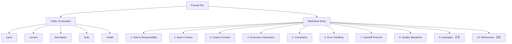
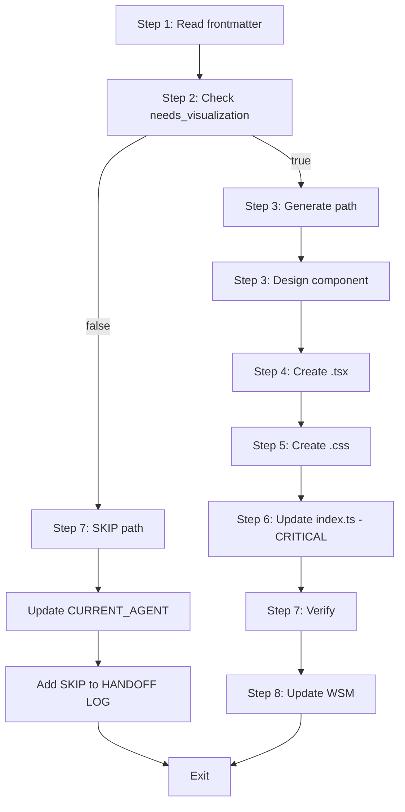
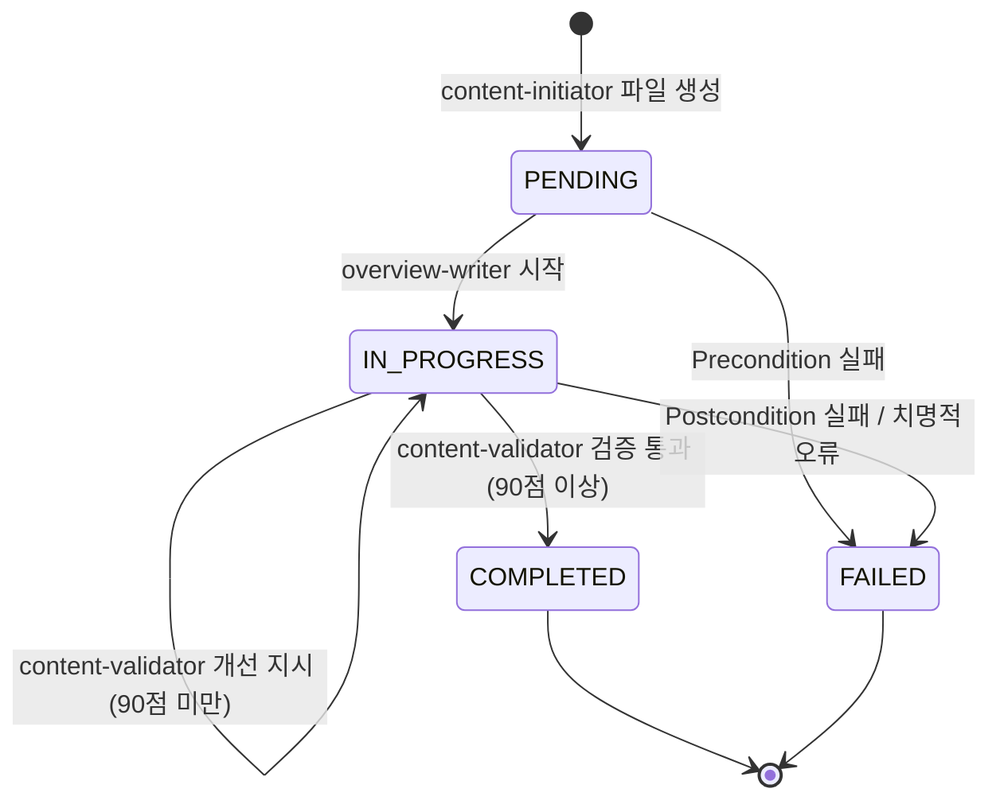
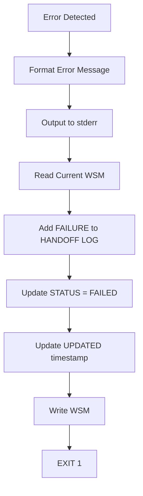

# Unit 3: Agent Prompts 개선 - Logical Design v1.0

## 문서 정보

**목적**: 에이전트 프롬프트의 논리적 데이터 구조, 검증 알고리즘, 인터페이스를 구체적으로 설계

**상태**: Draft v1.0

**참조 문서**:
- `domain_design.md` (Unit 3) - 6,997줄, 12개 섹션
- `logical_design.md` (Unit 1) - Pipe Mechanism 논리적 설계 (4,157줄)
- `logical_design.md` (Unit 2) - Filter Contracts 논리적 설계 (2,662줄)
- `docs/aidlc-docs/specifications/contracts/*.md` - 7개 에이전트 계약

**작성 원칙**:
- 코드 스니펫 생성 금지 (명세만 작성)
- 표 + Mermaid 다이어그램으로 구조 표현
- 단계별 설명 + 정규식 패턴으로 알고리즘 표현
- API 문서 형식으로 인터페이스 명세

**설계 범위** (Question 1 답변: B - 중간 범위):
- In Scope: 프롬프트 데이터 구조, I/O Contract 형식, 검증 알고리즘, WSM 조작 명세, 오류 처리 알고리즘
- Out of Scope: 완전한 프롬프트 구현 (Phase 2.3에서 수행)

---

## 목차

1. [프롬프트 데이터 구조](#section-1-프롬프트-데이터-구조)
2. [I/O Contract 통합 형식](#section-2-io-contract-통합-형식)
3. [Execution Instructions 알고리즘](#section-3-execution-instructions-알고리즘)
4. [Work Status Markers 조작 명세](#section-4-work-status-markers-조작-명세)
5. [오류 처리 알고리즘](#section-5-오류-처리-알고리즘)
6. [프롬프트 검증 알고리즘](#section-6-프롬프트-검증-알고리즘)
7. [난이도 레벨 표준](#section-7-난이도-레벨-표준)
8. [7개 에이전트 명세 요약](#section-8-7개-에이전트-명세-요약)

---

# Section 1: 프롬프트 데이터 구조

## 1.1 YAML Frontmatter 스키마

에이전트 프롬프트는 YAML frontmatter + Markdown 본문 형식을 사용합니다 (domain_design.md Section 2.1 참조).

### 1.1.1 Frontmatter 필드 스키마

| 필드 | 데이터 타입 | 필수 여부 | 제약사항 | 설명 |
|------|------------|----------|---------|------|
| `name` | string | 필수 | `[a-z-]+` 패턴 (소문자, 하이픈만) | 에이전트 고유 식별자 (kebab-case) |
| `version` | string | 필수 | Semantic Versioning (X.Y.Z) | 프롬프트 버전 |
| `description` | string | 필수 | 1-2 문장 | 에이전트 역할 설명 (When... 형식) |
| `tools` | array of strings | 필수 | Claude Code 도구 목록 | 사용 가능한 도구 (Read, Edit, Write 등) |
| `model` | string | 선택 | `sonnet` 또는 `opus` | 사용할 AI 모델 (기본값: sonnet) |

**정규식 패턴**:

```regex
# name 패턴
^[a-z]+(-[a-z]+)*$

# version 패턴 (Semantic Versioning X.Y.Z)
^\d+\.\d+\.\d+$

# tools 요소 패턴
^[A-Z][a-zA-Z]+$
```

**예시**:

```yaml
---
name: overview-writer
version: 5.0.0
description: When content files need motivating Overview sections to frame learning topics
tools: [Read, MultiEdit]
model: sonnet
---
```

---

### 1.1.2 name 필드 명명 규칙

**7개 에이전트 이름** (domain_design.md Section 2.1.2 참조):

| 에이전트 이름 | 역할 | Bounded Context |
|--------------|------|-----------------|
| `content-initiator` | 파일 초기화 + frontmatter + Work Status Markers 생성 | File Initialization |
| `overview-writer` | Overview 섹션 작성 (50-100줄) | Overview Section Generation |
| `concepts-writer` | Core Concepts 섹션 작성 (Easy/Normal/Expert 3단계) | Core Concepts Generation |
| `visualization-writer` | React 시각화 컴포넌트 생성 (조건부 실행) | Visualization Component Creation |
| `practice-writer` | Practice 섹션 작성 (Code Patterns + Experiments) | Practice Content Generation |
| `quiz-writer` | Quiz 섹션 작성 (6가지 퀴즈 타입, 8-12개 문제) | Quiz Generation |
| `content-validator` | 콘텐츠 품질 검증 및 개선 지시 (90점 기준) | Content Quality Validation |

**명명 도메인 불변식**:
- name 필드는 7개 에이전트 중 하나여야 함
- Unit 1, Unit 2 문서에서 사용하는 이름과 100% 일치해야 함

---

### 1.1.3 version 필드 버전 관리 규칙

**Semantic Versioning (SemVer)** 사용: `MAJOR.MINOR.PATCH`

| 버전 요소 | 의미 | 증가 시점 |
|----------|------|-----------|
| **MAJOR** | 호환성 깨지는 변경 (Breaking Changes) | I/O Contract 변경, 필수 섹션 추가/제거, Execution 로직 대폭 변경 |
| **MINOR** | 기능 추가 (호환성 유지) | 선택 섹션 추가, Quality Standards 강화, Examples 추가 |
| **PATCH** | 버그 수정 | 오타 수정, 설명 개선, 예시 보완 |

**Breaking Changes 판단 기준** (domain_design.md Section 10.4 참조):
- Input Contract 변경 (새로운 필수 파일 추가)
- Output Contract 변경 (새로운 필수 섹션 생성)
- Preconditions 추가 (기존 파일이 조건 미충족 가능)
- Work Status Markers 조작 방식 변경

**현재 에이전트별 버전**:

| 에이전트 | 현재 버전 | 마지막 Breaking Change |
|---------|----------|----------------------|
| content-initiator | 1.0.0 | N/A (초기 버전) |
| overview-writer | 5.0.0 | Section Structure 변경 |
| concepts-writer | 6.0.0 | 3-Level Difficulty 도입 |
| visualization-writer | 1.0.0 | N/A (초기 버전) |
| practice-writer | 7.0.0 | Patterns + Experiments 통합 |
| quiz-writer | 3.0.0 | 6가지 퀴즈 타입 확장 |
| content-validator | 1.0.0 | N/A (초기 버전) |

---

### 1.1.4 tools 필드 도구 목록

**Claude Code 사용 가능 도구** (domain_design.md Section 2.1.4 참조):

| 도구 | 용도 | 에이전트 사용 현황 |
|------|------|-------------------|
| **Read** | 파일 읽기 | 모든 에이전트 (7/7) |
| **Edit** | 파일 부분 수정 | content-initiator 제외 (6/7) |
| **Write** | 파일 신규 생성 | content-initiator, visualization-writer (2/7) |
| **MultiEdit** | 여러 파일 동시 수정 | overview-writer, concepts-writer, practice-writer, quiz-writer (4/7) |
| **Grep** | 파일 내용 검색 | visualization-writer, content-validator (2/7) |
| **Bash** | 쉘 명령 실행 | visualization-writer (1/7) |

**최소 권한 원칙** (Principle of Least Privilege):
- 각 에이전트는 자신의 책임 수행에 필요한 최소한의 도구만 접근
- 예: content-initiator는 Write만 사용, overview-writer는 Read+MultiEdit만 사용

**도구 조합 패턴**:

```yaml
# 패턴 1: 파일 초기화 (content-initiator)
tools: [Read, Write]

# 패턴 2: 섹션 작성 (overview-writer, concepts-writer, practice-writer, quiz-writer)
tools: [Read, MultiEdit]

# 패턴 3: 컴포넌트 생성 (visualization-writer)
tools: [Read, Write, Edit, Grep, Bash]

# 패턴 4: 품질 검증 (content-validator)
tools: [Read, Edit, Grep]
```

---

## 1.2 Markdown 본문 섹션 구조

프롬프트 본문은 10개 표준 섹션으로 구성됩니다 (domain_design.md Section 2.2 참조).

### 1.2.1 10개 표준 섹션 명세

| 섹션 이름 | 필수 여부 | 권장 길이 | 설명 |
|----------|----------|----------|------|
| **1. Role & Responsibility** | 필수 | 10-20줄 | 에이전트의 역할과 책임 범위 명확히 정의 |
| **2. Input Contract** | 필수 | 20-40줄 | 입력 파일, Work Status Markers, Section Dependencies |
| **3. Output Contract** | 필수 | 20-40줄 | 출력 섹션, Work Status Markers 업데이트, Content Guarantees |
| **4. Execution Instructions** | 필수 | 40-80줄 | 단계별 작업 지시 (Step 1, Step 2, ...) |
| **5. Constraints** | 필수 | 20-40줄 | UTF-8 인코딩 (CRITICAL), DO/DO NOT |
| **6. Error Handling** | 필수 | 20-40줄 | Precondition/Postcondition 검증, Fail-Fast 전략 |
| **7. Handoff Protocol** | 필수 | 10-20줄 | CURRENT_AGENT 업데이트, HANDOFF LOG 기록 |
| **8. Quality Standards** | 필수 | 20-40줄 | 출력물 품질 기준, 검증 체크리스트 |
| **9. Examples** | 권장 | 40-80줄 | 입출력 예시 (Normal Flow, Improvement Mode, Error Cases) |
| **10. References** | 권장 | 5-10줄 | Unit 2 계약 문서 참조 링크 |

**섹션 순서 규칙**:
- 섹션은 위 순서대로 작성해야 함 (1 → 2 → 3 → ... → 10)
- 권장 섹션(9, 10)은 생략 가능하지만, 생략 시 명시적 이유 기재

---

### 1.2.2 각 섹션의 데이터 형식

#### Section 1: Role & Responsibility

**형식**:
```markdown
## Role & Responsibility

**Role**: [에이전트 역할을 1-2 문장으로 설명]

**Responsibility**:
- [책임 1]
- [책임 2]
- [책임 3]

**Bounded Context**: [Bounded Context 이름] (domain_design.md Section 4.1 참조)
```

**예시**:
```markdown
## Role & Responsibility

**Role**: Generate the Overview section that motivates learners and introduces the learning topic with key features and practical impact.

**Responsibility**:
- Write 50-100 lines Overview section in Korean
- Include Introduction paragraph (3-5 sentences)
- Include ## 핵심 특징 subsection (4-5 bullet points)
- Include ## 실무에서의 영향 subsection (4-6 sentences)

**Bounded Context**: Overview Section Generation
```

---

#### Section 2: Input Contract

**형식**:
```markdown
## Input Contract

### File State
| 항목 | 요구사항 |
|------|----------|
| Required Files | [필수 파일 목록] |
| File Encoding | UTF-8 |
| Frontmatter | [frontmatter 상태] |
| Existing Sections | [이미 존재해야 할 섹션] |

### Work Status Markers
| 필드 | 필수 값 |
|------|---------|
| CURRENT_AGENT | [에이전트 이름] |
| STATUS | [PENDING 또는 IN_PROGRESS] |

### Section Dependencies
- [의존하는 섹션 1]
- [의존하는 섹션 2]
```

**예시** (overview-writer):
```markdown
## Input Contract

### File State
| 항목 | 요구사항 |
|------|----------|
| Required Files | Target markdown file with frontmatter and Work Status Markers |
| File Encoding | UTF-8 |
| Frontmatter | Required (populated by content-initiator) |
| Existing Sections | Work Status Markers only (no content sections yet) |

### Work Status Markers
| 필드 | 필수 값 |
|------|---------|
| CURRENT_AGENT | overview-writer |
| STATUS | PENDING (normal flow) OR IN_PROGRESS (improvement mode) |
| HANDOFF LOG | Contains [START] entry from pipeline initialization |

### Section Dependencies
- None (first content section in the pipeline)
```

---

#### Section 3: Output Contract

**형식**:
```markdown
## Output Contract

### File Modifications
- [수정 항목 1]
- [수정 항목 2]

### Work Status Markers Updates
| 필드 | 업데이트 값 |
|------|-----------|
| CURRENT_AGENT | [다음 에이전트 이름] |
| STATUS | [업데이트된 STATUS] |
| UPDATED | [현재 타임스탬프 (ISO 8601)] |
| HANDOFF LOG | [추가될 엔트리] |

### Content Guarantees
- [보장 사항 1]
- [보장 사항 2]
```

**예시** (overview-writer):
```markdown
## Output Contract

### File Modifications
- Modified Files: Target markdown file
- New Sections: `# Overview` section added

### Work Status Markers Updates
| 필드 | 업데이트 값 |
|------|-----------|
| CURRENT_AGENT | concepts-writer |
| STATUS | IN_PROGRESS |
| UPDATED | Current timestamp (ISO 8601: YYYY-MM-DDTHH:MM:SS+09:00) |
| HANDOFF LOG | Add: `[DONE] overview-writer \| Overview section completed \| [timestamp]` |

### Content Guarantees
- Overview section length: 50-100 lines
- Introduction paragraph: 3-5 sentences
- Key features/problems: 4-5 bullet points (one line each)
- Practical impact paragraph: 4-6 sentences with concrete use cases
```

---

#### Section 4: Execution Instructions

**형식**:
```markdown
## Execution Instructions

### Step 1: [단계 제목]
[상세 지시 사항]

### Step 2: [단계 제목]
[상세 지시 사항]

...

### Step N: [단계 제목]
[상세 지시 사항]
```

**단계별 구성 요소**:
- **동작 (Action)**: 무엇을 해야 하는가?
- **조건 (Condition)**: 언제 실행하는가? (if-then-else)
- **출력 (Output)**: 무엇을 생성하는가?

**예시** (content-initiator 7단계):
```markdown
## Execution Instructions

### Step 1: Read category.yaml
Read the category.yaml file to extract topic metadata (id, title, difficulty, needs_visualization).

### Step 2: Check if file already exists
Check if the target markdown file already exists.

**If exists**: STOP. Output error message and EXIT 1.
**If not exists**: Proceed to Step 3.

### Step 3: Generate frontmatter
Create YAML frontmatter with topic metadata (id, title, difficulty, needs_visualization).

### Step 4: Generate Work Status Markers
Create HTML comment block with initial Work Status Markers:
- CURRENT_AGENT: overview-writer
- STATUS: PENDING
- STARTED: [current timestamp]
- UPDATED: [current timestamp]
- HANDOFF LOG: [START] pipeline | Content generation started | [timestamp]

### Step 5: Write file
Write frontmatter + Work Status Markers to target markdown file.

### Step 6: Verify file creation
Read the created file to verify it was written correctly.

**If verification fails**: Output error and EXIT 1.

### Step 7: Update Work Status Markers
Update CURRENT_AGENT to overview-writer, STATUS to PENDING, add [DONE] entry to HANDOFF LOG.
```

---

#### Section 5: Constraints

**형식**:
```markdown
## Constraints

### UTF-8 Encoding (필수)

**CRITICAL**: All Korean content MUST be written in UTF-8 encoding.

- Write Korean text naturally: 한글 콘텐츠를 자연스럽게 작성하세요.
- No encoding conversion: Do NOT convert Korean characters to any other encoding.
- No garbled characters: Ensure no garbled characters (�, □, ?, \uFFFD) appear.
- Verify after writing: After writing Korean content, verify all Korean characters are displayed correctly.

### DO
- [허용 사항 1]
- [허용 사항 2]

### DO NOT
- [금지 사항 1]
- [금지 사항 2]
```

**UTF-8 인코딩 지시문은 CRITICAL 우선순위**로 모든 프롬프트 Constraints 섹션 최상단에 배치 (domain_design.md Section 7.2 참조).

---

#### Section 6: Error Handling

**형식**:
```markdown
## Error Handling

### Preconditions
- [ ] PC-1: [Precondition 1]
  - If fails: Output "[ERROR 메시지]", add [FAILURE] to HANDOFF LOG, EXIT 1
- [ ] PC-2: [Precondition 2]
  - If fails: ...

### Postconditions
- [ ] PO-1: [Postcondition 1]
  - If fails: Rollback, output error, EXIT 1
- [ ] PO-2: [Postcondition 2]
  - If fails: ...

### Fail-Fast Strategy
On any error: Output error message, add [FAILURE] entry to HANDOFF LOG, EXIT 1 immediately.
```

**Preconditions/Postconditions 체크리스트 형식** (domain_design.md Section 3.4 참조):
- ID: PC-N (Precondition), PO-N (Postcondition)
- Check: 검증 조건
- If fails: 실패 시 처리 (Output, HANDOFF LOG, EXIT)

---

#### Section 7: Handoff Protocol

**형식**:
```markdown
## Handoff Protocol

### Normal Flow (정상 완료 시)
1. Update CURRENT_AGENT: [에이전트 이름] → [다음 에이전트 이름]
2. Update STATUS: [현재 STATUS] → IN_PROGRESS
3. Update UPDATED: [현재 타임스탬프]
4. Add HANDOFF LOG entry: `[DONE] [에이전트 이름] | [완료 메시지] | [timestamp]`

### Improvement Mode (개선 모드)
1. Check IMPROVEMENT_NEEDED field for [에이전트 이름] entry
2. Modify ONLY the sections mentioned in improvement feedback
3. Remove [에이전트 이름] entry from IMPROVEMENT_NEEDED after completion
4. Update CURRENT_AGENT to next agent requiring improvement
5. Add HANDOFF LOG entry: `[IMPROVE] [에이전트 이름] | [개선 내용] | [timestamp]`
```

---

#### Section 8: Quality Standards

**형식**:
```markdown
## Quality Standards

### Content Quality
- [품질 기준 1]
- [품질 기준 2]

### Format Quality
- [형식 기준 1]
- [형식 기준 2]

### Verification Checklist
- [ ] [검증 항목 1]
- [ ] [검증 항목 2]
```

---

#### Section 9: Examples (권장)

**형식**:
```markdown
## Examples

### Example 1: Normal Flow
**Input**: [입력 예시]
**Output**: [출력 예시]
**Work Status Markers Update**: [마커 업데이트]

### Example 2: Improvement Mode
**Input**: [입력 예시]
**Output**: [출력 예시]

### Example 3: Precondition Failure
**Input**: [입력 예시]
**Output**: [오류 메시지]
**HANDOFF LOG**: [FAILURE] 엔트리
```

---

#### Section 10: References (권장)

**형식**:
```markdown
## References

- Unit 2 Contract: `docs/aidlc-docs/specifications/contracts/[에이전트]-contract.md`
- Unit 1 Pipe Mechanism: `docs/aidlc-docs/construction/unit-01-pipe-mechanism/domain_design.md`
```

---

## 1.3 프롬프트 파일 형식

### 1.3.1 파일 메타정보

| 속성 | 값 |
|------|-----|
| **파일 인코딩** | UTF-8 |
| **줄바꿈** | LF (\n) - Unix 스타일 |
| **파일 경로** | `.claude/agents/[agent-name].md` |
| **파일 크기** | 150-500줄 (권장 200-400줄) |

**파일 이름 규칙**:
- `[agent-name].md` (kebab-case)
- 예: `overview-writer.md`, `content-validator.md`

---

### 1.3.2 파일 구조 다이어그램



---

## Section 1 체크리스트

- [x] 1.1: YAML Frontmatter 스키마 정의
  - [x] 1.1.1: Frontmatter 필드 스키마 (name, version, description, tools, model)
  - [x] 1.1.2: name 필드 명명 규칙 (7개 에이전트)
  - [x] 1.1.3: version 필드 버전 관리 규칙 (SemVer)
  - [x] 1.1.4: tools 필드 도구 목록
- [x] 1.2: Markdown 본문 섹션 구조
  - [x] 1.2.1: 10개 표준 섹션 명세
  - [x] 1.2.2: 각 섹션의 데이터 형식 (Section 1-10 템플릿)
- [x] 1.3: 프롬프트 파일 형식
  - [x] 1.3.1: 파일 메타정보 (UTF-8, LF, 경로, 크기)
  - [x] 1.3.2: 파일 구조 다이어그램 (Mermaid)

**다음 섹션**: Section 2 - I/O Contract 통합 형식

---

# Section 2: I/O Contract 통합 형식

## 2.1 Input Contract 표현 형식

프롬프트의 Input Contract 섹션은 Unit 2 계약의 Input Contract를 프롬프트 지시문으로 변환합니다 (domain_design.md Section 3.2 참조).

### 2.1.1 File State 표현 방법

**표 형식 사용** (Unit 2 계약과 동일):

| 항목 | 요구사항 |
|------|----------|
| Required Files | [필수 파일 목록] |
| File Encoding | UTF-8 |
| Frontmatter | [frontmatter 상태] |
| Existing Sections | [이미 존재해야 할 섹션] |

**필드 설명**:
- **Required Files**: 에이전트가 읽어야 할 파일 (예: Target markdown file, category.yaml)
- **File Encoding**: 항상 UTF-8 (한글 지원)
- **Frontmatter**: Required/Optional, 상태 설명 (populated by X, empty 등)
- **Existing Sections**: 이미 작성되어 있어야 할 섹션 (의존성)

---

### 2.1.2 Work Status Markers 표현 방법

**표 형식 사용**:

| 필드 | 필수 값 |
|------|---------|
| CURRENT_AGENT | [에이전트 이름] |
| STATUS | [PENDING/IN_PROGRESS] |
| HANDOFF LOG | [필수 엔트리 조건] |

**필드별 값 명세**:

**CURRENT_AGENT**:
- 정상 흐름: 자신의 에이전트 이름 (예: overview-writer)
- 개선 모드: 자신의 에이전트 이름 + IMPROVEMENT_NEEDED 필드에 자신의 엔트리 존재

**STATUS**:
- 정상 흐름: PENDING
- 개선 모드: IN_PROGRESS

**HANDOFF LOG**:
- 최소 조건: [START] 엔트리 존재
- 개선 모드: 이전 에이전트들의 [DONE] 엔트리 존재

---

### 2.1.3 Section Dependencies 표현 방법

**리스트 형식 사용**:

```markdown
### Section Dependencies
- [의존 섹션 1]
- [의존 섹션 2]
- None (if no dependencies)
```

**7개 에이전트별 Section Dependencies**:

| 에이전트 | Section Dependencies |
|---------|---------------------|
| content-initiator | None (파일 생성 단계) |
| overview-writer | None (첫 번째 콘텐츠 섹션) |
| concepts-writer | # Overview |
| visualization-writer | # Core Concepts (needs_visualization 플래그 확인) |
| practice-writer | # Core Concepts, # Visualization (if exists) |
| quiz-writer | # Core Concepts, # Practice |
| content-validator | All sections (# Overview, # Core Concepts, # Practice, # Quiz) |

---

## 2.2 Output Contract 표현 형식

프롬프트의 Output Contract 섹션은 에이전트가 생성/수정할 내용을 명시합니다.

### 2.2.1 File Modifications 표현 방법

**리스트 형식 사용**:

```markdown
### File Modifications
- Modified Files: [수정 대상 파일]
- New Sections: [생성할 섹션 목록]
- Section Structure: [섹션 구조 명세 - markdown 코드 블록]
```

**예시** (concepts-writer):
```markdown
### File Modifications
- Modified Files: Target markdown file
- New Sections: `# Core Concepts` section added
- Section Structure:
  ```markdown
  # Core Concepts

  ## Easy Level
  [3-5 paragraphs, 일상 비유, 이모지, NO code]

  ## Normal Level
  [5-10 paragraphs, 기술 용어, 간단한 코드 5-10줄]

  ## Expert Level
  [5-10 paragraphs, ECMAScript 명세, 고급 코드]
  ```
```

---

### 2.2.2 Work Status Markers Updates 표현 방법

**표 형식 사용**:

| 필드 | 업데이트 값 |
|------|-----------|
| CURRENT_AGENT | [다음 에이전트 이름] |
| STATUS | [업데이트된 STATUS] |
| UPDATED | Current timestamp (ISO 8601: YYYY-MM-DDTHH:MM:SS+09:00) |
| HANDOFF LOG | Add: `[EVENT_TYPE] [agent] | [message] | [timestamp]` |

**EVENT_TYPE** (domain_design.md Section 5.2 참조):
- **DONE**: 정상 완료
- **IMPROVE**: 개선 완료
- **SKIP**: 조건부 실행에서 건너뜀 (visualization-writer)
- **COMPLETE**: 파이프라인 최종 완료 (content-validator)

**Next Agent Mapping** (domain_design.md Section 5.3 참조):

| 현재 에이전트 | 다음 에이전트 (정상 흐름) |
|--------------|-------------------------|
| content-initiator | overview-writer |
| overview-writer | concepts-writer |
| concepts-writer | visualization-writer |
| visualization-writer | practice-writer |
| practice-writer | quiz-writer |
| quiz-writer | content-validator |
| content-validator | "" (빈 문자열 - 완료) |

---

### 2.2.3 Content Guarantees 표현 방법

**리스트 형식 사용** (정량적 + 정성적 기준):

```markdown
### Content Guarantees
- [길이 기준]: [N-M lines/paragraphs/sentences]
- [구조 기준]: [필수 하위 섹션]
- [품질 기준]: [내용 요구사항]
```

**예시** (quiz-writer):
```markdown
### Content Guarantees
- Quiz section length: 200-400 lines
- Number of questions: 8-12개
- Question types distribution:
  - Multiple Choice: 3-4개
  - True/False: 1-2개
  - Fill in the Blank: 1-2개
  - Short Answer: 1-2개
  - Code Output: 1-2개
  - Debugging: 1-2개
- Difficulty distribution: Easy 30%, Normal 50%, Expert 20%
- All questions in Korean (한글)
- All code blocks use JavaScript
```

---

## 2.3 Preconditions/Postconditions 체크리스트 형식

프롬프트의 Error Handling 섹션은 Preconditions/Postconditions를 체크리스트로 변환합니다 (domain_design.md Section 3.4 참조).

### 2.3.1 체크리스트 항목 구조

**표준 형식**:

```markdown
### Preconditions
- [ ] PC-1: [검증 조건]
  - If fails: Output "[ERROR 메시지]", add [FAILURE] to HANDOFF LOG, EXIT 1
- [ ] PC-2: [검증 조건]
  - If fails: ...
```

**필드 설명**:
- **ID**: PC-N (Precondition N번), PO-N (Postcondition N번)
- **Check**: 검증할 조건 (명제 형식)
- **If fails**: 실패 시 처리 (Output + HANDOFF LOG + EXIT)

---

### 2.3.2 체크리스트 템플릿

**Preconditions 템플릿** (모든 에이전트 공통):

```markdown
### Preconditions
- [ ] PC-1: CURRENT_AGENT == "[agent-name]"
  - If fails: Output "ERROR: Precondition failed - CURRENT_AGENT is {actual}, expected '[agent-name]'", add [FAILURE] to HANDOFF LOG, EXIT 1

- [ ] PC-2: STATUS == PENDING (normal flow) OR (STATUS == IN_PROGRESS AND IMPROVEMENT_NEEDED contains [agent-name] entry)
  - If fails: Output "ERROR: Precondition failed - Invalid STATUS or missing IMPROVEMENT_NEEDED entry", add [FAILURE] to HANDOFF LOG, EXIT 1

- [ ] PC-3: frontmatter exists and is populated
  - If fails: Output "ERROR: Precondition failed - frontmatter is missing or empty", add [FAILURE] to HANDOFF LOG, EXIT 1

- [ ] PC-4: HANDOFF LOG contains [START] entry
  - If fails: Output "ERROR: Precondition failed - No [START] entry in HANDOFF LOG", add [FAILURE] to HANDOFF LOG, EXIT 1
```

**Postconditions 템플릿** (에이전트별 변형):

```markdown
### Postconditions
- [ ] PO-1: [생성한 섹션] is created and complete
  - If fails: Rollback, output error, add [FAILURE] to HANDOFF LOG, EXIT 1

- [ ] PO-2: CURRENT_AGENT == "[next-agent-name]"
  - If fails: Rollback, output error, add [FAILURE] to HANDOFF LOG, EXIT 1

- [ ] PO-3: STATUS == IN_PROGRESS (or COMPLETED if last agent)
  - If fails: Rollback, output error, add [FAILURE] to HANDOFF LOG, EXIT 1

- [ ] PO-4: HANDOFF LOG contains [DONE/IMPROVE/SKIP/COMPLETE] [agent-name] entry
  - If fails: Rollback, output error, add [FAILURE] to HANDOFF LOG, EXIT 1
```

---

## 2.4 계약-프롬프트 매핑 테이블

Unit 2 계약 요소가 Unit 3 프롬프트 섹션으로 어떻게 변환되는지 명시합니다 (domain_design.md Section 3.5 참조).

### 2.4.1 매핑 테이블

| Unit 2 계약 요소 | Unit 3 프롬프트 섹션 | 변환 수준 | 비고 |
|-----------------|---------------------|----------|------|
| **Responsibility** | Role & Responsibility | 100% 복사 | 계약과 동일 |
| **Input Contract - File State** | Input Contract - File State | 100% 복사 | 표 형식 유지 |
| **Input Contract - WSM** | Input Contract - WSM | 100% 복사 | 표 형식 유지 |
| **Input Contract - Section Dependencies** | Input Contract - Section Dependencies | 100% 복사 | 리스트 형식 |
| **Output Contract - File State** | Output Contract - File Modifications | 80% 요약 | Section Structure 추가 |
| **Output Contract - WSM** | Output Contract - WSM Updates | 100% 복사 | 표 형식 유지 |
| **Output Contract - Content Guarantees** | Output Contract - Content Guarantees | 100% 복사 | 리스트 형식 |
| **Preconditions** | Error Handling - Preconditions | 100% 복사 | 체크리스트 형식으로 변환 |
| **Postconditions** | Error Handling - Postconditions | 100% 복사 | 체크리스트 형식으로 변환 |
| **Error Handling** | Error Handling - Fail-Fast Strategy | 30% 요약 | 전략만 명시, 상세는 계약 참조 |
| **Examples** | Examples | 50% 선택 | 대표 예시 1-2개만 포함 |
| **Implementation** | References | 10% 참조 | 계약 문서 링크만 제공 |

**변환 수준 설명**:
- **100% 복사**: 계약 내용을 그대로 프롬프트에 포함
- **80% 요약**: 핵심만 요약하고 상세는 생략
- **50% 선택**: 일부만 선택적으로 포함
- **30% 요약**: 전략/원칙만 명시
- **10% 참조**: 링크만 제공

---

### 2.4.2 변환 원칙 (Question 1 답변: B - 요약 + 참조)

**포함 (Include)**:
- Input Contract: 100% 포함 (에이전트가 즉시 확인 필요)
- Output Contract: 100% 포함 (에이전트가 즉시 확인 필요)
- Preconditions/Postconditions: 100% 포함 (체크리스트 형식)

**요약 (Summarize)**:
- Error Handling: Fail-Fast 전략만 명시, 상세 시나리오는 생략
- Examples: 대표 예시 1-2개만 (Normal Flow, Improvement Mode)

**참조 (Reference)**:
- Implementation: 계약 문서 링크만 제공
- 상세 명세는 Unit 2 계약 문서 참조

---

## Section 2 체크리스트

- [x] 2.1: Input Contract 표현 형식
  - [x] 2.1.1: File State 표현 방법 (표 형식)
  - [x] 2.1.2: Work Status Markers 표현 방법 (표 형식)
  - [x] 2.1.3: Section Dependencies 표현 방법 (리스트 형식)
- [x] 2.2: Output Contract 표현 형식
  - [x] 2.2.1: File Modifications 표현 방법
  - [x] 2.2.2: Work Status Markers Updates 표현 방법
  - [x] 2.2.3: Content Guarantees 표현 방법
- [x] 2.3: Preconditions/Postconditions 체크리스트 형식
  - [x] 2.3.1: 체크리스트 항목 구조
  - [x] 2.3.2: 체크리스트 템플릿 (Preconditions/Postconditions)
- [x] 2.4: 계약-프롬프트 매핑 테이블
  - [x] 2.4.1: 매핑 테이블 (12개 요소)
  - [x] 2.4.2: 변환 원칙 (포함/요약/참조)

**다음 섹션**: Section 3 - Execution Instructions 알고리즘

---

# Section 3: Execution Instructions 알고리즘

## 3.1 단계별 지시문 형식

Execution Instructions는 에이전트가 작업을 수행하는 순서를 단계별로 정의합니다 (domain_design.md Section 2.2.4 참조).

### 3.1.1 Step 번호 체계

**형식**:
```markdown
### Step N: [단계 제목]
[상세 지시 사항]
```

**번호 규칙**:
- 1부터 시작 (Step 1, Step 2, ...)
- 순차적 증가 (건너뛰기 없음)
- 일반적으로 5-10 단계

**7개 에이전트별 Step 수**:

| 에이전트 | Step 수 | 주요 단계 |
|---------|--------|-----------|
| content-initiator | 7 | Read → Check → Generate → Write → Verify → Update |
| overview-writer | 7 | Read → Precondition → Write → Postcondition → Update → Handoff |
| concepts-writer | 8 | Read → Precondition → Write Easy → Write Normal → Write Expert → Decide visualization → Postcondition → Update |
| visualization-writer | 6 (SKIP) / 9 (Generate) | Check flag → SKIP or Generate component |
| practice-writer | 7 | Read → Write Patterns → Write Experiments → Postcondition → Update |
| quiz-writer | 8 | Read → Generate questions (6 types) → Postcondition → Update |
| content-validator | 10 | Read → Validate 5 sections → Calculate score → Generate IMPROVEMENT_NEEDED → Update |

---

### 3.1.2 각 Step 구성 요소

**필수 구성 요소**:
1. **동작 (Action)**: 무엇을 해야 하는가? (동사 시작)
2. **조건 (Condition)**: 언제/어떤 경우에 실행하는가? (if-then-else)
3. **출력 (Output)**: 무엇을 생성하는가? (결과물)

**예시** (overview-writer Step 3):
```markdown
### Step 3: Write Overview section

**Action**: Create `# Overview` section with three subsections.

**Conditions**:
- If normal flow: Write from scratch
- If improvement mode: Modify existing Overview based on IMPROVEMENT_NEEDED feedback

**Output**:
- # Overview (H1 header)
  - Introduction paragraph (3-5 sentences)
  - ## 핵심 특징 or ## 핵심 문제점 (4-5 bullet points)
  - ## 실무에서의 영향 or ## 왜 중요한가? (4-6 sentences)
```

---

## 3.2 조건부 실행 패턴

일부 에이전트는 조건에 따라 다른 경로를 실행합니다 (domain_design.md Section 8.4 참조).

### 3.2.1 if-then-else 표현 방법

**형식**:
```markdown
### Step N: [단계 제목]

Check [조건]:

**If [조건 true]**:
- [액션 1]
- [액션 2]

**If [조건 false]**:
- [대체 액션 1]
- [대체 액션 2]
```

---

### 3.2.2 needs_visualization 플래그 기반 분기

**visualization-writer의 조건부 실행** (domain_design.md Section 8.4.2 참조):

```markdown
### Step 2: Check needs_visualization

Read frontmatter and check `needs_visualization` value:

**If `false`**:
- Go to Step 7 (SKIP path)

**If `true`**:
- Proceed to Step 3 (Generate path)

---

### SKIP Path (Steps 7-9)

### Step 7: Update Work Status Markers (SKIP)
- CURRENT_AGENT: visualization-writer → practice-writer
- STATUS: IN_PROGRESS (유지)
- HANDOFF LOG: Add `[SKIP] visualization-writer | Skipped - needs_visualization is false | [timestamp]`

---

### Generate Path (Steps 3-9)

### Step 3: Design visualization component
[컴포넌트 설계]

### Step 4: Create .tsx file
[파일 생성]

### Step 5: Create .module.css file
[스타일 파일 생성]

### Step 6: Update index.ts (CRITICAL)
**CRITICAL**: Edit `src/components/visualization/index.ts` to export the new component.

### Step 7: Verify component creation
[검증]

### Step 8: Update Work Status Markers (Generate)
- CURRENT_AGENT: visualization-writer → practice-writer
- HANDOFF LOG: Add `[DONE] visualization-writer | Visualization component created | [timestamp]`
```

**다이어그램**:



---

## 3.3 반복 패턴

개선 모드에서는 IMPROVEMENT_NEEDED 필드를 기반으로 특정 에이전트가 반복 실행됩니다 (domain_design.md Section 5.3 참조).

### 3.3.1 IMPROVEMENT_NEEDED 기반 반복

**조건**:
- STATUS == IN_PROGRESS
- IMPROVEMENT_NEEDED 필드에 자신의 에이전트 엔트리 존재

**처리 로직**:
```markdown
### Step 1: Read Work Status Markers

Read CURRENT_AGENT, STATUS, IMPROVEMENT_NEEDED fields.

**If STATUS == PENDING**:
- Normal flow: Proceed with Step 2

**If STATUS == IN_PROGRESS AND IMPROVEMENT_NEEDED contains [agent-name] entry**:
- Improvement mode:
  - Read improvement feedback from IMPROVEMENT_NEEDED
  - Identify sections to modify
  - Proceed with Step 2 (modify mode)

### Step 2: [Main work]

**If normal flow**:
- Create sections from scratch

**If improvement mode**:
- Modify ONLY the sections mentioned in IMPROVEMENT_NEEDED feedback
- Preserve other sections as-is

### Step N: Update Work Status Markers

**If normal flow**:
- Add [DONE] entry to HANDOFF LOG

**If improvement mode**:
- Remove [agent-name] entry from IMPROVEMENT_NEEDED
- Add [IMPROVE] entry to HANDOFF LOG
- Update CURRENT_AGENT to next agent requiring improvement (or next in pipeline if last)
```

---

### 3.3.2 최대 반복 횟수 제한 (Open Question)

domain_design.md Section 12.3 "Open Questions" 참조:
> **질문 2: Improvement Mode 최대 반복 횟수**
> - 현재 설계: content-validator가 90점 미만 시 개선 지시
> - 이슈: 몇 번 반복해도 90점 도달 못하면?
> - 해결 방안: Phase 2.3에서 최대 반복 횟수 (예: 3회) 정의

**현재 명세**: 무한 반복 (90점 도달까지)
**향후 개선**: 최대 3회 반복 후 강제 COMPLETE 고려

---

## 3.4 Execution Instructions 예시

### 3.4.1 content-initiator 7단계 알고리즘

```markdown
## Execution Instructions

### Step 1: Read category.yaml
Read the category.yaml file from the specified path to extract topic metadata.

**Required fields**:
- id: Topic identifier
- title: Topic title (Korean)
- difficulty: 1-5 (integer)
- needs_visualization: true/false

### Step 2: Check if file already exists
Check if target markdown file already exists at `public/content/ko/{subject}/{category}/{topic-id}.md`.

**If exists**:
- Output: "ERROR: File already exists - {file_path}"
- Add [FAILURE] to HANDOFF LOG
- EXIT 1

**If not exists**:
- Proceed to Step 3

### Step 3: Generate frontmatter
Create YAML frontmatter block:

```yaml
---
id: {topic-id}
title: {title}
difficulty: {difficulty}
needs_visualization: {true/false}
---
```

### Step 4: Generate Work Status Markers
Create HTML comment block with initial Work Status Markers:

```html
<!--
CURRENT_AGENT: overview-writer
STATUS: PENDING
STARTED: {current-timestamp}
UPDATED: {current-timestamp}
HANDOFF LOG:
[START] pipeline | Content generation started | {timestamp}
-->
```

### Step 5: Write file
Write frontmatter + Work Status Markers to target file using Write tool.

### Step 6: Verify file creation
Read the created file using Read tool to verify:
- [ ] File exists
- [ ] Frontmatter is correct
- [ ] Work Status Markers are correct

**If verification fails**:
- Output error
- EXIT 1

### Step 7: Complete
Output success message: "File initialized successfully - {file_path}"
```

---

### 3.4.2 overview-writer 7단계 알고리즘

```markdown
## Execution Instructions

### Step 1: Read target file
Read the markdown file to access frontmatter and Work Status Markers.

### Step 2: Verify Preconditions
Check all Preconditions (PC-1 to PC-4):
- [ ] PC-1: CURRENT_AGENT == "overview-writer"
- [ ] PC-2: STATUS == PENDING or (IN_PROGRESS with IMPROVEMENT_NEEDED)
- [ ] PC-3: frontmatter exists
- [ ] PC-4: HANDOFF LOG has [START] entry

**If any fails**: Output error, add [FAILURE], EXIT 1

### Step 3: Write Overview section

**If normal flow** (STATUS == PENDING):
- Create `# Overview` section from scratch

**If improvement mode** (IMPROVEMENT_NEEDED contains overview-writer):
- Modify existing Overview section based on feedback
- Preserve parts not mentioned in feedback

**Content**:
- Introduction paragraph (3-5 sentences)
- ## 핵심 특징 or ## 핵심 문제점 (4-5 bullets)
- ## 실무에서의 영향 or ## 왜 중요한가? (4-6 sentences)

### Step 4: Verify Postconditions
Check all Postconditions (PO-1 to PO-4):
- [ ] PO-1: `# Overview` section exists and complete
- [ ] PO-2: Section length 50-100 lines
- [ ] PO-3: All required subsections present
- [ ] PO-4: Korean text is valid UTF-8

**If any fails**: Rollback, output error, EXIT 1

### Step 5: Update Work Status Markers

**Normal flow**:
- CURRENT_AGENT: overview-writer → concepts-writer
- STATUS: PENDING → IN_PROGRESS
- UPDATED: {current-timestamp}
- HANDOFF LOG: Add `[DONE] overview-writer | Overview section completed | {timestamp}`

**Improvement mode**:
- Remove overview-writer from IMPROVEMENT_NEEDED
- CURRENT_AGENT: → next agent in IMPROVEMENT_NEEDED (or concepts-writer if last)
- HANDOFF LOG: Add `[IMPROVE] overview-writer | {improvement description} | {timestamp}`

### Step 6: Write updated file
Write the modified content back to file using MultiEdit tool.

### Step 7: Verify final state
Read the file to verify all changes are correctly written.

**If verification fails**: Output error, EXIT 1
```

---

## Section 3 체크리스트

- [x] 3.1: 단계별 지시문 형식
  - [x] 3.1.1: Step 번호 체계
  - [x] 3.1.2: 각 Step 구성 요소 (Action, Condition, Output)
- [x] 3.2: 조건부 실행 패턴
  - [x] 3.2.1: if-then-else 표현 방법
  - [x] 3.2.2: needs_visualization 플래그 기반 분기 (다이어그램 포함)
- [x] 3.3: 반복 패턴
  - [x] 3.3.1: IMPROVEMENT_NEEDED 기반 반복
  - [x] 3.3.2: 최대 반복 횟수 제한 (Open Question)
- [x] 3.4: Execution Instructions 예시
  - [x] 3.4.1: content-initiator 7단계 알고리즘
  - [x] 3.4.2: overview-writer 7단계 알고리즘

**다음 섹션**: Section 4 - Work Status Markers 조작 명세

---

# Section 4: Work Status Markers 조작 명세

## 4.1 CURRENT_AGENT 업데이트 알고리즘

CURRENT_AGENT 필드는 현재 작업 중인 에이전트를 추적합니다 (domain_design.md Section 5.1 참조).

### 4.1.1 정상 흐름 (Normal Flow)

**업데이트 시점**: 에이전트 작업 완료 시 (Handoff Protocol Step)

**알고리즘**:
```
INPUT: current_agent (string), next_agent_mapping (dict)
OUTPUT: updated CURRENT_AGENT value

1. Read CURRENT_AGENT from Work Status Markers
2. Look up next_agent = next_agent_mapping[current_agent]
3. Update CURRENT_AGENT = next_agent
4. Write updated Work Status Markers
```

**Next Agent Mapping Table**:

| 현재 에이전트 | 다음 에이전트 |
|--------------|--------------|
| content-initiator | overview-writer |
| overview-writer | concepts-writer |
| concepts-writer | visualization-writer |
| visualization-writer | practice-writer |
| practice-writer | quiz-writer |
| quiz-writer | content-validator |
| content-validator | "" (빈 문자열 - 완료) |

---

### 4.1.2 개선 모드 (Improvement Mode)

**업데이트 시점**: 개선 작업 완료 시

**알고리즘**:
```
INPUT: current_agent (string), IMPROVEMENT_NEEDED (list of agent names)
OUTPUT: updated CURRENT_AGENT value

1. Read IMPROVEMENT_NEEDED field
2. Remove current_agent from IMPROVEMENT_NEEDED list
3. IF IMPROVEMENT_NEEDED is empty:
     next_agent = next_agent_mapping[current_agent]  # Continue normal pipeline
   ELSE:
     next_agent = IMPROVEMENT_NEEDED[0]  # Next agent requiring improvement
4. Update CURRENT_AGENT = next_agent
5. Write updated Work Status Markers
```

**예시**:
```
Before:
  CURRENT_AGENT: overview-writer
  IMPROVEMENT_NEEDED:
    - overview-writer: Add more concrete examples (-5점)
    - quiz-writer: Improve difficulty distribution (-3점)

After overview-writer completes improvement:
  CURRENT_AGENT: quiz-writer
  IMPROVEMENT_NEEDED:
    - quiz-writer: Improve difficulty distribution (-3점)
```

---

### 4.1.3 조건부 실행 (Conditional Execution - visualization-writer)

**SKIP Path**:
```
INPUT: needs_visualization = false
OUTPUT: CURRENT_AGENT updated to practice-writer

1. Read frontmatter.needs_visualization
2. IF needs_visualization == false:
     Update CURRENT_AGENT = practice-writer  # Skip visualization-writer
     Add [SKIP] entry to HANDOFF LOG
```

**Generate Path**:
```
INPUT: needs_visualization = true
OUTPUT: CURRENT_AGENT updated to practice-writer (after component generation)

1. Read frontmatter.needs_visualization
2. IF needs_visualization == true:
     Generate visualization component
     Update CURRENT_AGENT = practice-writer
     Add [DONE] entry to HANDOFF LOG
```

---

## 4.2 STATUS 전이 다이어그램

STATUS 필드는 파이프라인의 전체 상태를 추적합니다 (domain_design.md Section 5.1 참조).

### 4.2.1 STATUS 값 정의

| STATUS 값 | 의미 | 발생 조건 |
|-----------|------|-----------|
| **PENDING** | 첫 에이전트 대기 중 | content-initiator가 파일 생성 직후 |
| **IN_PROGRESS** | 콘텐츠 생성 진행 중 | overview-writer 시작 이후, content-validator 전까지 |
| **COMPLETED** | 콘텐츠 생성 완료 (90점 이상) | content-validator 검증 통과 |
| **FAILED** | 에이전트 실패 (복구 불가) | Precondition/Postcondition 실패, 치명적 오류 |

---

### 4.2.2 STATUS 전이 다이어그램



---

### 4.2.3 STATUS 업데이트 알고리즘

**알고리즘**:
```
INPUT: current_agent (string), event_type (string), validation_score (int or null)
OUTPUT: updated STATUS value

1. Read current STATUS
2. Match (current_agent, event_type):

   CASE content-initiator completes:
     IF event_type == "DONE":
       STATUS = PENDING  # Ready for overview-writer

   CASE overview-writer starts:
     IF event_type == "DONE" OR "IMPROVE":
       STATUS = IN_PROGRESS

   CASE any agent (overview ~ quiz-writer) completes:
     IF event_type == "DONE" OR "IMPROVE" OR "SKIP":
       STATUS = IN_PROGRESS  # Maintain IN_PROGRESS

   CASE content-validator completes:
     IF validation_score >= 90:
       STATUS = COMPLETED
       event_type = "COMPLETE"
     ELSE:
       STATUS = IN_PROGRESS  # Continue improvement loop
       Generate IMPROVEMENT_NEEDED

   CASE any Precondition/Postcondition fails:
     STATUS = FAILED
     event_type = "FAILURE"

3. Write updated STATUS
```

---

## 4.3 HANDOFF LOG 기록 형식

HANDOFF LOG는 모든 에이전트 작업 이력을 기록합니다 (domain_design.md Section 5.2 참조).

### 4.3.1 HANDOFF LOG Entry 형식

**표준 형식**:
```
[EVENT_TYPE] agent | message | timestamp
```

**필드 설명**:
- **EVENT_TYPE**: START, DONE, IMPROVE, SKIP, FAILURE, COMPLETE (6가지)
- **agent**: 에이전트 이름 (kebab-case)
- **message**: 작업 설명 (1-2 문장)
- **timestamp**: ISO 8601 형식 (YYYY-MM-DDTHH:MM:SS+09:00)

**예시**:
```
[START] pipeline | Content generation started | 2025-10-17T10:00:00+09:00
[DONE] overview-writer | Overview section completed | 2025-10-17T10:15:00+09:00
[DONE] concepts-writer | Concepts completed with 3 difficulty levels | 2025-10-17T10:45:00+09:00
[SKIP] visualization-writer | Skipped - needs_visualization is false | 2025-10-17T10:46:00+09:00
[DONE] practice-writer | Practice section completed | 2025-10-17T11:05:00+09:00
[DONE] quiz-writer | Quiz completed with 10 questions | 2025-10-17T11:20:00+09:00
[DONE] content-validator | Validation completed - 92점 (개선 필요) | 2025-10-17T11:25:00+09:00
[IMPROVE] overview-writer | Added concrete practical use cases | 2025-10-17T11:35:00+09:00
[IMPROVE] quiz-writer | Improved difficulty distribution | 2025-10-17T11:45:00+09:00
[COMPLETE] content-validator | Final validation passed - 95점 | 2025-10-17T11:50:00+09:00
```

---

### 4.3.2 6가지 EVENT_TYPE 정의

| EVENT_TYPE | 사용 에이전트 | 의미 | 발생 조건 |
|------------|--------------|------|-----------|
| **START** | content-initiator | 파이프라인 시작 | 파일 초기화 완료 |
| **DONE** | overview-writer ~ quiz-writer | 정상 작업 완료 | 섹션 생성 완료 (정상 흐름) |
| **IMPROVE** | overview-writer ~ quiz-writer | 개선 작업 완료 | IMPROVEMENT_NEEDED 기반 개선 완료 |
| **SKIP** | visualization-writer | 조건부 건너뛰기 | needs_visualization == false |
| **FAILURE** | 모든 에이전트 | 에이전트 실패 | Precondition/Postcondition 실패, 치명적 오류 |
| **COMPLETE** | content-validator | 파이프라인 최종 완료 | 검증 점수 90점 이상 |

---

### 4.3.3 HANDOFF LOG 추가 알고리즘

**알고리즘**:
```
INPUT: event_type (string), agent_name (string), message (string)
OUTPUT: updated HANDOFF LOG

1. Read current HANDOFF LOG
2. Generate timestamp = current_time in ISO 8601 format (YYYY-MM-DDTHH:MM:SS+09:00)
3. Create entry = "[{event_type}] {agent_name} | {message} | {timestamp}"
4. Append entry to HANDOFF LOG
5. Write updated HANDOFF LOG
```

**정규식 패턴**:
```regex
# HANDOFF LOG Entry 검증 패턴
^\[(START|DONE|IMPROVE|SKIP|FAILURE|COMPLETE)\] [a-z-]+ \| .+ \| \d{4}-\d{2}-\d{2}T\d{2}:\d{2}:\d{2}\+09:00$
```

---

## 4.4 UPDATED 타임스탬프 갱신 로직

UPDATED 필드는 마지막 Work Status Markers 수정 시각을 기록합니다 (domain_design.md Section 5.1 참조).

### 4.4.1 갱신 시점

**갱신 조건**:
- 에이전트가 Work Status Markers를 수정할 때마다 갱신
- CURRENT_AGENT, STATUS, HANDOFF LOG 중 하나라도 변경 시 갱신

**갱신하지 않는 경우**:
- 파일 내용만 수정하고 Work Status Markers는 건드리지 않을 때 (없음 - 모든 에이전트는 WSM 업데이트 필수)

---

### 4.4.2 타임스탬프 생성 알고리즘

**알고리즘**:
```
INPUT: current_time (datetime)
OUTPUT: ISO 8601 timestamp string

1. Get current_time from system clock
2. Format as ISO 8601 with timezone offset: YYYY-MM-DDTHH:MM:SS+09:00
3. Return formatted string
```

**정규식 패턴**:
```regex
# ISO 8601 타임스탬프 검증 (KST +09:00)
^\d{4}-\d{2}-\d{2}T\d{2}:\d{2}:\d{2}\+09:00$
```

**예시**:
```
2025-10-17T10:00:00+09:00
2025-10-17T14:30:15+09:00
2025-12-31T23:59:59+09:00
```

---

### 4.4.3 STARTED vs UPDATED 차이

| 필드 | 목적 | 갱신 시점 | 값 변경 |
|------|------|-----------|---------|
| **STARTED** | 파이프라인 시작 시각 기록 | content-initiator 파일 생성 시 1회만 | 절대 변경 안 됨 |
| **UPDATED** | 마지막 WSM 수정 시각 기록 | 모든 에이전트 작업 완료 시 | 매번 갱신 |

**예시**:
```
Before overview-writer:
  STARTED: 2025-10-17T10:00:00+09:00
  UPDATED: 2025-10-17T10:00:00+09:00

After overview-writer:
  STARTED: 2025-10-17T10:00:00+09:00  (불변)
  UPDATED: 2025-10-17T10:15:00+09:00  (갱신)

After concepts-writer:
  STARTED: 2025-10-17T10:00:00+09:00  (불변)
  UPDATED: 2025-10-17T10:45:00+09:00  (갱신)
```

---

## Section 4 체크리스트

- [x] 4.1: CURRENT_AGENT 업데이트 알고리즘
  - [x] 4.1.1: 정상 흐름 (Normal Flow) - Next Agent Mapping Table
  - [x] 4.1.2: 개선 모드 (Improvement Mode) - IMPROVEMENT_NEEDED 기반
  - [x] 4.1.3: 조건부 실행 (Conditional Execution - visualization-writer)
- [x] 4.2: STATUS 전이 다이어그램
  - [x] 4.2.1: STATUS 값 정의 (PENDING/IN_PROGRESS/COMPLETED/FAILED)
  - [x] 4.2.2: STATUS 전이 다이어그램 (Mermaid)
  - [x] 4.2.3: STATUS 업데이트 알고리즘
- [x] 4.3: HANDOFF LOG 기록 형식
  - [x] 4.3.1: HANDOFF LOG Entry 형식
  - [x] 4.3.2: 6가지 EVENT_TYPE 정의 (START/DONE/IMPROVE/SKIP/FAILURE/COMPLETE)
  - [x] 4.3.3: HANDOFF LOG 추가 알고리즘
- [x] 4.4: UPDATED 타임스탬프 갱신 로직
  - [x] 4.4.1: 갱신 시점
  - [x] 4.4.2: 타임스탬프 생성 알고리즘 (ISO 8601)
  - [x] 4.4.3: STARTED vs UPDATED 차이

**다음 섹션**: Section 5 - 오류 처리 알고리즘

---

# Section 5: 오류 처리 알고리즘

## 5.1 Fail-Fast 전략

모든 에이전트는 Fail-Fast 전략을 사용합니다 (domain_design.md Section 6.1 참조).

### 5.1.1 Fail-Fast 원칙

**정의**: 오류 발생 시 즉시 중단하고 실패 상태를 명확히 기록

**핵심 행동**:
1. **Output error message**: 표준 에러 포맷으로 오류 메시지 출력
2. **Add [FAILURE] to HANDOFF LOG**: 실패 이력 영구 기록
3. **EXIT 1**: 즉시 프로세스 종료 (복구 시도 안 함)

---

### 5.1.2 Fail-Fast 알고리즘

**알고리즘**:
```
INPUT: error_type (string), error_message (string), agent_name (string)
OUTPUT: EXIT 1 (process termination)

1. Format error message:
   "ERROR: [error_type] - {error_message}"

2. Output error message to stderr

3. Read current Work Status Markers

4. Add HANDOFF LOG entry:
   "[FAILURE] {agent_name} | {error_type}: {error_message} | {timestamp}"

5. Update STATUS = FAILED

6. Update UPDATED = current_timestamp

7. Write updated Work Status Markers

8. EXIT 1 (terminate immediately)
```

---

### 5.1.3 Fail-Fast 플로우차트



---

## 5.2 오류 메시지 표준 형식

### 5.2.1 Error Message 템플릿

**표준 형식**:
```
ERROR: [Category] - {detailed_message}
```

**Category 분류**:
- **Precondition failed**: 사전 조건 불만족
- **Postcondition failed**: 사후 조건 불만족
- **File write error**: 파일 쓰기 실패
- **File read error**: 파일 읽기 실패
- **Validation error**: 검증 실패
- **Invalid input**: 잘못된 입력

---

### 5.2.2 Error Message 예시

| 에러 상황 | Error Message |
|----------|---------------|
| CURRENT_AGENT 불일치 | `ERROR: Precondition failed - CURRENT_AGENT is 'concepts-writer', expected 'overview-writer'` |
| frontmatter 누락 | `ERROR: Precondition failed - frontmatter is missing or empty` |
| HANDOFF LOG [START] 엔트리 없음 | `ERROR: Precondition failed - No [START] entry in HANDOFF LOG` |
| 섹션 생성 실패 | `ERROR: Postcondition failed - # Overview section is incomplete or missing` |
| UTF-8 인코딩 오류 | `ERROR: Validation error - Korean characters are garbled (encoding issue)` |
| 파일 쓰기 실패 | `ERROR: File write error - Failed to write {file_path}` |

---

## 5.3 HANDOFF LOG 실패 기록

### 5.3.1 FAILURE Entry 형식

**표준 형식**:
```
[FAILURE] agent | error_type: error_message | timestamp
```

**필드 설명**:
- **EVENT_TYPE**: 항상 "FAILURE"
- **agent**: 실패한 에이전트 이름
- **message**: `error_type: error_message` 형식
- **timestamp**: ISO 8601 타임스탬프

---

### 5.3.2 FAILURE Entry 예시

```
[FAILURE] overview-writer | Precondition failed: CURRENT_AGENT is 'concepts-writer', expected 'overview-writer' | 2025-10-17T10:15:30+09:00

[FAILURE] concepts-writer | Postcondition failed: # Core Concepts section is incomplete | 2025-10-17T10:45:00+09:00

[FAILURE] visualization-writer | File write error: Failed to write src/components/visualization/VarHoisting.tsx | 2025-10-17T11:05:00+09:00

[FAILURE] content-validator | Validation error: Quiz section has only 5 questions (minimum 8 required) | 2025-10-17T11:30:00+09:00
```

---

## 5.4 에이전트별 오류 시나리오

각 에이전트가 직면할 수 있는 대표적인 오류 시나리오를 간략히 설명합니다 (domain_design.md Section 6.2 참조).

### 5.4.1 content-initiator

| 오류 시나리오 | 발생 조건 | Error Message | 처리 |
|-------------|----------|---------------|------|
| 파일 이미 존재 | 대상 파일이 이미 존재함 | `ERROR: Precondition failed - File already exists at {path}` | EXIT 1 |
| category.yaml 읽기 실패 | category.yaml 파일 없음 | `ERROR: File read error - Cannot read category.yaml` | EXIT 1 |
| 파일 쓰기 실패 | Write 권한 없음 | `ERROR: File write error - Failed to write {path}` | EXIT 1 |

---

### 5.4.2 overview-writer

| 오류 시나리오 | 발생 조건 | Error Message | 처리 |
|-------------|----------|---------------|------|
| CURRENT_AGENT 불일치 | WSM의 CURRENT_AGENT ≠ overview-writer | `ERROR: Precondition failed - CURRENT_AGENT is {actual}, expected 'overview-writer'` | EXIT 1 |
| frontmatter 누락 | frontmatter가 비어있음 | `ERROR: Precondition failed - frontmatter is missing` | EXIT 1 |
| Overview 섹션 불완전 | Postcondition 검증 실패 | `ERROR: Postcondition failed - # Overview section is incomplete` | Rollback, EXIT 1 |
| UTF-8 인코딩 오류 | 한글이 깨짐 | `ERROR: Validation error - Korean characters are garbled` | Rollback, EXIT 1 |

---

### 5.4.3 concepts-writer

| 오류 시나리오 | 발생 조건 | Error Message | 처리 |
|-------------|----------|---------------|------|
| Overview 섹션 누락 | # Overview 섹션이 없음 (의존성 미충족) | `ERROR: Precondition failed - # Overview section is missing` | EXIT 1 |
| 3-Level 구조 불완전 | Easy/Normal/Expert 중 하나 누락 | `ERROR: Postcondition failed - # Core Concepts missing Easy/Normal/Expert level` | Rollback, EXIT 1 |
| needs_visualization 결정 실패 | frontmatter에 플래그 업데이트 실패 | `ERROR: Postcondition failed - needs_visualization flag not updated` | Rollback, EXIT 1 |

---

### 5.4.4 visualization-writer

| 오류 시나리오 | 발생 조건 | Error Message | 처리 |
|-------------|----------|---------------|------|
| 컴포넌트 파일 쓰기 실패 | .tsx 또는 .css 파일 생성 실패 | `ERROR: File write error - Failed to write {component_path}` | Rollback, EXIT 1 |
| index.ts 업데이트 실패 | export 구문 추가 실패 (CRITICAL) | `ERROR: Postcondition failed - index.ts not updated with component export` | Rollback, EXIT 1 |
| 컴포넌트 검증 실패 | Bash 명령으로 구문 오류 발견 | `ERROR: Validation error - Component has syntax errors` | Rollback, EXIT 1 |

**CRITICAL 우선순위**: index.ts 업데이트 실패는 다른 컴포넌트에도 영향을 미치므로 가장 높은 우선순위로 처리

---

### 5.4.5 practice-writer

| 오류 시나리오 | 발생 조건 | Error Message | 처리 |
|-------------|----------|---------------|------|
| Core Concepts 섹션 누락 | # Core Concepts 없음 | `ERROR: Precondition failed - # Core Concepts section is missing` | EXIT 1 |
| Patterns 또는 Experiments 누락 | Postcondition 검증 실패 | `ERROR: Postcondition failed - ### Code Patterns or ### Experiments missing` | Rollback, EXIT 1 |

---

### 5.4.6 quiz-writer

| 오류 시나리오 | 발생 조건 | Error Message | 처리 |
|-------------|----------|---------------|------|
| 퀴즈 문제 수 부족 | 8개 미만 생성 | `ERROR: Postcondition failed - Only {N} questions generated (minimum 8 required)` | Rollback, EXIT 1 |
| 퀴즈 타입 분포 불균형 | 6가지 타입 중 하나 누락 | `ERROR: Validation error - Missing quiz type: {type}` | Rollback, EXIT 1 |
| 난이도 분포 오류 | Easy/Normal/Expert 비율 불만족 | `ERROR: Validation error - Difficulty distribution incorrect` | Rollback, EXIT 1 |

---

### 5.4.7 content-validator

| 오류 시나리오 | 발생 조건 | Error Message | 처리 |
|-------------|----------|---------------|------|
| 섹션 누락 | Overview/Concepts/Practice/Quiz 중 하나 누락 | `ERROR: Precondition failed - Missing section: {section_name}` | EXIT 1 |
| 검증 점수 계산 실패 | 검증 로직 오류 | `ERROR: Validation error - Failed to calculate validation score` | EXIT 1 |
| IMPROVEMENT_NEEDED 생성 실패 | 90점 미만이지만 피드백 생성 실패 | `ERROR: Postcondition failed - IMPROVEMENT_NEEDED field not generated` | EXIT 1 |

---

## 5.5 Rollback 전략

### 5.5.1 Rollback 대상

**Postcondition 실패 시**만 Rollback 수행:
- Precondition 실패 시: Rollback 불필요 (아직 변경 전)
- Postcondition 실패 시: Rollback 필수 (이미 변경 후)

**Rollback 범위**:
- 현재 에이전트가 수정한 내용만 Rollback
- 이전 에이전트가 작성한 내용은 보존

---

### 5.5.2 Rollback 알고리즘

**알고리즘**:
```
INPUT: file_path (string), agent_name (string)
OUTPUT: Restored file state (before agent modifications)

1. IF agent has backup of original file state:
     Restore from backup
   ELSE:
     Remove sections created by agent (e.g., # Overview, # Core Concepts)

2. Restore Work Status Markers to state before agent started
   - CURRENT_AGENT: Keep current agent name
   - STATUS: PENDING or IN_PROGRESS (unchanged)
   - UPDATED: Restore to previous timestamp
   - HANDOFF LOG: Remove agent's [DONE] entry if added

3. Write restored file

4. Verify restoration successful

5. Add [FAILURE] entry to HANDOFF LOG

6. Update STATUS = FAILED

7. EXIT 1
```

**참고**: 현재 실제 구현에서는 "Remove sections" 방식 사용 (백업 없음)

---

## Section 5 체크리스트

- [x] 5.1: Fail-Fast 전략
  - [x] 5.1.1: Fail-Fast 원칙
  - [x] 5.1.2: Fail-Fast 알고리즘
  - [x] 5.1.3: Fail-Fast 플로우차트 (Mermaid)
- [x] 5.2: 오류 메시지 표준 형식
  - [x] 5.2.1: Error Message 템플릿
  - [x] 5.2.2: Error Message 예시
- [x] 5.3: HANDOFF LOG 실패 기록
  - [x] 5.3.1: FAILURE Entry 형식
  - [x] 5.3.2: FAILURE Entry 예시
- [x] 5.4: 에이전트별 오류 시나리오
  - [x] 5.4.1: content-initiator
  - [x] 5.4.2: overview-writer
  - [x] 5.4.3: concepts-writer
  - [x] 5.4.4: visualization-writer (CRITICAL - index.ts 업데이트)
  - [x] 5.4.5: practice-writer
  - [x] 5.4.6: quiz-writer
  - [x] 5.4.7: content-validator
- [x] 5.5: Rollback 전략
  - [x] 5.5.1: Rollback 대상
  - [x] 5.5.2: Rollback 알고리즘

**다음 섹션**: Section 6 - 프롬프트 검증 알고리즘

---

# Section 6: 프롬프트 검증 알고리즘

프롬프트 검증은 Phase 2.3 (프롬프트 작성)에서 작성된 프롬프트가 logical_design.md 명세를 준수하는지 확인합니다.

## 6.1 정적 검증 (Static Validation)

YAML frontmatter와 섹션 구조를 검증합니다.

### 6.1.1 Frontmatter 검증 체크리스트

| 검증 항목 | 검증 규칙 | 오류 코드 |
|----------|----------|----------|
| name 필드 존재 | Required field | E001 |
| name 패턴 검증 | `^[a-z]+(-[a-z]+)*$` | E002 |
| version 필드 존재 | Required field | E001 |
| version 패턴 검증 | `^\d+\.\d+\.\d+$` (SemVer) | E002 |
| description 필드 존재 | Required field | E001 |
| tools 필드 존재 | Required field, Array type | E001 |
| tools 요소 패턴 검증 | Each element: `^[A-Z][a-zA-Z]+$` | E002 |

---

### 6.1.2 섹션 구조 검증 체크리스트

| 검증 항목 | 검증 규칙 | 오류 코드 |
|----------|----------|----------|
| 10개 표준 섹션 존재 | Sections 1-8 필수, 9-10 권장 | E003 |
| 섹션 순서 일치 | Role → Input → Output → ... → References | W001 |
| H2 헤더 사용 | 모든 섹션 제목은 `## ` 사용 | W002 |
| 중복 섹션 없음 | 각 섹션은 1회만 등장 | E003 |

**오류 코드**:
- **E**: Error (필수 - 검증 실패 시 프롬프트 거부)
- **W**: Warning (권장 - 검증 실패 시 경고만)

---

## 6.2 내용 검증 (Content Validation)

각 섹션의 내용이 템플릿을 준수하는지 검증합니다.

### 6.2.1 Input/Output Contract 검증

| 검증 항목 | 검증 규칙 | 오류 코드 |
|----------|----------|----------|
| File State 표 존재 | Input Contract 섹션 내 표 | E004 |
| WSM 표 존재 | Input Contract 섹션 내 표 | E004 |
| Section Dependencies 리스트 존재 | Markdown 리스트 형식 | E004 |
| File Modifications 리스트 존재 | Output Contract 섹션 내 리스트 | E004 |
| Content Guarantees 리스트 존재 | Output Contract 섹션 내 리스트 | E004 |

---

### 6.2.2 Error Handling 검증

| 검증 항목 | 검증 규칙 | 오류 코드 |
|----------|----------|----------|
| Preconditions 체크리스트 존재 | `- [ ] PC-N:` 형식 | E004 |
| Postconditions 체크리스트 존재 | `- [ ] PO-N:` 형식 | E004 |
| Fail-Fast 전략 명시 | "Fail-Fast" 키워드 포함 | W003 |
| PC-1: CURRENT_AGENT 검증 | 모든 에이전트 필수 | E005 |
| PC-4: HANDOFF LOG [START] 검증 | content-initiator 제외 필수 | E005 |

---

### 6.2.3 Execution Instructions 검증

| 검증 항목 | 검증 규칙 | 오류 코드 |
|----------|----------|----------|
| Step 번호 순차성 | Step 1, Step 2, ... (건너뛰기 없음) | W004 |
| Step 개수 범위 | 5-10 단계 (권장) | W005 |
| Precondition 검증 Step 존재 | Step 2 or earlier | W003 |
| Postcondition 검증 Step 존재 | Step N-2 or later | W003 |
| WSM 업데이트 Step 존재 | Last or second-to-last step | E005 |

---

## 6.3 의미 검증 (Semantic Validation)

프롬프트가 Unit 2 계약과 의미적으로 일치하는지 검증합니다.

### 6.3.1 I/O Contract 일치성 검증

**검증 알고리즘**:
```
INPUT: prompt_file (path), contract_file (path)
OUTPUT: validation_result (pass/fail), errors (list)

1. Read Input Contract from both files
2. Compare File State tables
   - Required Files: Must match exactly
   - File Encoding: Must be UTF-8
   - Frontmatter/Existing Sections: Must match

3. Compare Work Status Markers requirements
   - CURRENT_AGENT: Must match agent name
   - STATUS: Must match (PENDING or IN_PROGRESS conditions)

4. Compare Output Contract
   - File Modifications: Must cover same files
   - Content Guarantees: Must include all from contract

5. IF all comparisons pass:
     validation_result = pass
   ELSE:
     validation_result = fail
     errors = [list of mismatches]

6. Return validation_result, errors
```

---

### 6.3.2 에이전트별 특수 검증

| 에이전트 | 특수 검증 항목 | 오류 코드 |
|---------|--------------|----------|
| content-initiator | Step 2: File existence check | E005 |
| concepts-writer | needs_visualization 결정 로직 포함 | E005 |
| visualization-writer | Step 6: index.ts 업데이트 (CRITICAL) | E005 |
| content-validator | validation_score >= 90 조건 | E005 |
| content-validator | IMPROVEMENT_NEEDED 생성 로직 | E005 |

---

## 6.4 오류 코드 체계

### 6.4.1 Error (E001-E005)

| 코드 | 의미 | 예시 |
|------|------|------|
| **E001** | 필수 필드 누락 | name, version, description, tools 필드 없음 |
| **E002** | 패턴 불일치 | name이 kebab-case 아님, version이 SemVer 아님 |
| **E003** | 섹션 구조 오류 | 필수 섹션 누락, 중복 섹션 존재 |
| **E004** | 필수 내용 누락 | Input Contract 표 없음, Preconditions 체크리스트 없음 |
| **E005** | 의미 검증 실패 | I/O Contract 불일치, 특수 로직 누락 |

---

### 6.4.2 Warning (W001-W006)

| 코드 | 의미 | 예시 |
|------|------|------|
| **W001** | 섹션 순서 불일치 | Output Contract가 Input Contract 앞에 위치 |
| **W002** | 헤더 레벨 불일치 | H3 사용 (H2 권장) |
| **W003** | 권장 내용 누락 | Fail-Fast 전략 명시 없음, Precondition Step 없음 |
| **W004** | Step 번호 비순차 | Step 1 → Step 3 (Step 2 건너뜀) |
| **W005** | Step 개수 비정상 | 3개 미만 또는 12개 초과 |
| **W006** | Examples/References 누락 | 권장 섹션 9, 10 생략 시 |

---

## Section 6 체크리스트

- [x] 6.1: 정적 검증 (Static Validation)
  - [x] 6.1.1: Frontmatter 검증 체크리스트
  - [x] 6.1.2: 섹션 구조 검증 체크리스트
- [x] 6.2: 내용 검증 (Content Validation)
  - [x] 6.2.1: Input/Output Contract 검증
  - [x] 6.2.2: Error Handling 검증
  - [x] 6.2.3: Execution Instructions 검증
- [x] 6.3: 의미 검증 (Semantic Validation)
  - [x] 6.3.1: I/O Contract 일치성 검증
  - [x] 6.3.2: 에이전트별 특수 검증
- [x] 6.4: 오류 코드 체계
  - [x] 6.4.1: Error (E001-E005)
  - [x] 6.4.2: Warning (W001-W006)

**다음 섹션**: Section 7 - 난이도 레벨 표준

---

# Section 7: 난이도 레벨 표준

concepts-writer 에이전트의 3-Level Difficulty 명세입니다 (domain_design.md Section 9.2 참조).

## 7.1 3단계 난이도 개요

### 7.1.1 난이도 레벨 정의

| 레벨 | 대상 독자 | 설명 스타일 | 코드 사용 | 기술 용어 |
|------|----------|-----------|-----------|----------|
| **Easy** | 중학생 (13-15세) | 일상적 비유, 이모지 | NO code | 일상 용어로 대체 |
| **Normal** | 일반 개발자 (1-5년) | 기술 용어 + 간단한 코드 | 5-10줄 | 기술 용어 사용 |
| **Expert** | 전문가 (20년+) | ECMAScript 명세 참조 | 고급 코드 | 전문 용어 + 설명 |

---

### 7.1.2 난이도별 길이 기준

| 레벨 | 단락 수 | 문장 수/단락 | 총 길이 |
|------|--------|-------------|---------|
| **Easy** | 3-5 | 3-5 | 50-100줄 |
| **Normal** | 5-10 | 4-6 | 100-200줄 |
| **Expert** | 5-10 | 5-8 | 100-200줄 |

---

## 7.2 Easy Level 명세

### 7.2.1 Easy Level 작성 규칙

**필수 규칙**:
- **NO code blocks**: 코드 블록 절대 사용 금지
- **일상적 비유**: 요리, 스포츠, 일상생활 비유 사용
- **이모지 사용**: 3-5개 이모지로 시각적 보조
- **짧은 문장**: 문장당 15단어 이하 (한글 기준 25자 이하)
- **기술 용어 대체**: 변수 → 상자, 함수 → 명령, 반환 → 결과

**금지 사항**:
- 코드 블록 (`\`\`\`...`)
- 인라인 코드 (`` `code` ``)
- 영문 기술 용어 (let, const, var 등)
- ECMAScript 명세 참조

---

### 7.2.2 Easy Level 예시

**주제**: var 키워드의 문제점

```markdown
## Easy Level

var는 JavaScript에서 값을 담는 상자를 만드는 오래된 방법입니다. 마치 집에 물건을 정리할 때 사용하는 상자와 비슷합니다 📦. 그런데 이 상자는 몇 가지 불편한 점이 있어서 요즘에는 잘 사용하지 않습니다.

첫 번째 문제는 "호이스팅"이라는 현상입니다. 상자를 만들기 전에 이미 사용할 수 있는 이상한 상황이 발생합니다 🎈. 마치 편지를 쓰기 전에 이미 보낸 것처럼 동작하는 것입니다.

두 번째 문제는 상자가 어디에나 나타날 수 있다는 점입니다 🌍. 방 안에서만 사용하려고 만든 상자가 집 전체에서 보이는 상황이 생깁니다. 이렇게 되면 나중에 같은 이름의 상자를 또 만들었을 때 헷갈릴 수 있습니다.

그래서 요즘에는 let과 const라는 새로운 방법을 사용합니다 ✨. 이 방법들은 상자가 만들어진 방에서만 보이기 때문에 훨씬 안전합니다.
```

---

## 7.3 Normal Level 명세

### 7.3.1 Normal Level 작성 규칙

**필수 규칙**:
- **기술 용어 사용**: var, let, const, 호이스팅, 스코프 등
- **간단한 코드 5-10줄**: 개념 확인용 코드 블록 포함
- **비교 설명**: 올바른 예 vs 잘못된 예
- **실무 관점**: 어떤 상황에서 문제가 되는지 구체적 설명

**권장 사항**:
- 단계별 설명 (1. ..., 2. ..., 3. ...)
- 주의사항 강조 (⚠️)
- 코드 주석으로 설명 추가

---

### 7.3.2 Normal Level 예시

**주제**: var 키워드의 문제점

```markdown
## Normal Level

var 키워드는 ES5까지 JavaScript에서 변수를 선언하는 유일한 방법이었습니다. 하지만 호이스팅과 함수 스코프 특성 때문에 예상치 못한 동작을 유발할 수 있습니다.

**문제 1: 호이스팅으로 인한 혼란**

var로 선언한 변수는 선언 전에도 참조할 수 있습니다. 선언은 스코프 최상단으로 끌어올려지지만 초기화는 원래 위치에서 이루어집니다.

\`\`\`javascript
console.log(x);  // undefined (오류 아님!)
var x = 10;
console.log(x);  // 10
\`\`\`

**문제 2: 함수 스코프의 한계**

var는 함수 스코프만 인식하고 블록 스코프(if, for 등)를 무시합니다. 이로 인해 의도치 않은 변수 공유가 발생할 수 있습니다.

\`\`\`javascript
if (true) {
  var temp = "블록 안";
}
console.log(temp);  // "블록 안" (블록 밖에서도 접근 가능!)
\`\`\`

⚠️ **실무에서의 문제**: 루프 변수나 임시 변수가 의도치 않게 외부에서 접근되어 버그를 유발할 수 있습니다. 특히 비동기 코드에서 클로저 문제가 자주 발생합니다.

ES6+에서는 let과 const를 사용하여 이러한 문제를 해결할 수 있습니다. 이들은 블록 스코프를 지원하고 TDZ(Temporal Dead Zone) 개념으로 호이스팅 문제를 방지합니다.
```

---

## 7.4 Expert Level 명세

### 7.4.1 Expert Level 작성 규칙

**필수 규칙**:
- **ECMAScript 명세 참조**: 섹션 번호와 정확한 용어 사용
- **전문 용어 + 설명**: Lexical Environment, TDZ, Variable Hoisting 등
- **고급 코드 예시**: Edge case, 최적화, 성능 고려사항
- **엔진 동작 설명**: V8, SpiderMonkey 등 구현 세부사항

**권장 사항**:
- ECMAScript 명세 링크 포함
- 브라우저별 동작 차이 언급
- 역사적 맥락 설명 (왜 이렇게 설계되었는가?)

---

### 7.4.2 Expert Level 예시

**주제**: var 키워드의 문제점

```markdown
## Expert Level

var 선언의 문제는 ECMAScript 명세의 Variable Environment와 Lexical Environment 설계에서 기인합니다 (ES2024 §9.1.1.1 Environment Records).

**Hoisting의 명세적 정의**

var 선언은 Function Execution Context 생성 시 Instantiation 단계에서 처리됩니다 (§9.2 FunctionDeclarationInstantiation). 선언은 환경 레코드에 바인딩을 생성하지만, 초기화는 실제 할당 구문 실행 시점까지 지연됩니다. 이는 undefined로 초기화된 바인딩이 선언 전에도 접근 가능한 상태를 만듭니다.

\`\`\`javascript
// 내부적으로 다음과 같이 동작
// 1. Function Execution Context 생성 시
//    - var x = undefined (Environment Record에 바인딩 생성)
// 2. 실행 시점
//    - x = 10 (할당 구문 실행)

function example() {
  console.log(x);  // undefined (TDZ 없음)
  var x = 10;

  // let/const와 비교
  console.log(y);  // ReferenceError: Cannot access 'y' before initialization
  let y = 20;
}
\`\`\`

**Function Scope vs Block Scope**

var는 Lexical Environment의 Declarative Environment Record에 바인딩되지만, block-level scope를 생성하지 않습니다. 이는 for/if 문의 블록이 새로운 Lexical Environment를 생성하지 않음을 의미합니다 (§14.2 Block).

반면 let/const는 Block Statement 진입 시 새로운 Declarative Environment Record를 생성하고 (§14.2.4 BlockDeclarationInstantiation), TDZ(Temporal Dead Zone) 개념을 도입하여 선언 전 접근을 ReferenceError로 처리합니다.

**V8 엔진 최적화 고려사항**

V8은 Hidden Classes와 Inline Caching을 통해 변수 접근을 최적화합니다. var의 함수 스코프 특성은 컴파일 타임에 바인딩 위치를 정확히 결정할 수 있어 최적화에 유리하지만, 의도치 않은 스코프 누출로 인한 메모리 누수 위험이 있습니다.

현대 JavaScript 개발에서는 const를 기본으로 사용하고, 재할당이 필요한 경우에만 let을 사용하는 것이 명세의 의도와 일치합니다 (ES2015 이후 권장사항).
```

---

## 7.5 난이도별 품질 기준 비교

| 품질 기준 | Easy | Normal | Expert |
|----------|------|--------|--------|
| **이해도** | 중학생도 이해 가능 | 일반 개발자 이해 가능 | 전문가 수준 깊이 |
| **정확도** | 개념적으로 정확 | 기술적으로 정확 | 명세적으로 정확 |
| **코드 품질** | NO code | 간단한 예시 코드 | 고급 코드 + Edge cases |
| **참조 자료** | 없음 | 없음 또는 MDN | ECMAScript 명세 + 엔진 문서 |
| **실무 연관성** | 일상 비유 | 실무 시나리오 | 최적화, 성능, 엔진 동작 |

---

## Section 7 체크리스트

- [x] 7.1: 3단계 난이도 개요
  - [x] 7.1.1: 난이도 레벨 정의 (Easy/Normal/Expert)
  - [x] 7.1.2: 난이도별 길이 기준
- [x] 7.2: Easy Level 명세
  - [x] 7.2.1: Easy Level 작성 규칙 (NO code, 이모지, 일상 비유)
  - [x] 7.2.2: Easy Level 예시
- [x] 7.3: Normal Level 명세
  - [x] 7.3.1: Normal Level 작성 규칙 (기술 용어, 5-10줄 코드)
  - [x] 7.3.2: Normal Level 예시
- [x] 7.4: Expert Level 명세
  - [x] 7.4.1: Expert Level 작성 규칙 (ECMAScript 명세, 전문 용어)
  - [x] 7.4.2: Expert Level 예시
- [x] 7.5: 난이도별 품질 기준 비교

**다음 섹션**: Section 8 - 7개 에이전트 명세 요약

---

# Section 8: 7개 에이전트 명세 요약

각 에이전트의 I/O Contract와 핵심 알고리즘을 간략히 요약합니다 (Question 2 답변: A - 각 에이전트당 1-2 페이지 요약).

## 8.1 content-initiator

### 역할 및 책임
- **Bounded Context**: File Initialization
- **책임**: category.yaml 기반 초기 파일 생성, frontmatter + Work Status Markers 작성

### I/O Contract 요약

**Input**:
- category.yaml (토픽 메타데이터)

**Output**:
- 새 마크다운 파일 생성
- frontmatter (id, title, difficulty, needs_visualization)
- Work Status Markers (CURRENT_AGENT: overview-writer, STATUS: PENDING)
- HANDOFF LOG [START] 엔트리

### 핵심 알고리즘 (7 Steps)

```
Step 1: Read category.yaml
Step 2: Check file existence → EXIT 1 if exists
Step 3: Generate frontmatter
Step 4: Generate Work Status Markers
Step 5: Write file (Write tool)
Step 6: Verify file creation
Step 7: Complete (STATUS: PENDING)
```

### 특수 사항
- 파일 이미 존재 시 즉시 실패 (Precondition check)
- overview-writer로 핸드오프 (다음 에이전트)

---

## 8.2 overview-writer

### 역할 및 책임
- **Bounded Context**: Overview Section Generation
- **책임**: Overview 섹션 작성 (50-100줄, 한글)

### I/O Contract 요약

**Input**:
- frontmatter + Work Status Markers (CURRENT_AGENT: overview-writer)
- Section Dependencies: None (첫 번째 콘텐츠 섹션)

**Output**:
- `# Overview` 섹션 생성
  - Introduction paragraph (3-5 문장)
  - ## 핵심 특징 or ## 핵심 문제점 (4-5 bullets)
  - ## 실무에서의 영향 (4-6 문장)
- Work Status Markers 업데이트 (CURRENT_AGENT: concepts-writer, STATUS: IN_PROGRESS)

### 핵심 알고리즘 (7 Steps)

```
Step 1: Read target file
Step 2: Verify Preconditions (PC-1 to PC-4)
Step 3: Write Overview section (normal or improvement mode)
Step 4: Verify Postconditions (PO-1 to PO-4)
Step 5: Update Work Status Markers
Step 6: Write updated file (MultiEdit tool)
Step 7: Verify final state
```

### 특수 사항
- Improvement Mode: IMPROVEMENT_NEEDED 기반 수정
- UTF-8 인코딩 검증 (한글 깨짐 방지 - CRITICAL)

---

## 8.3 concepts-writer

### 역할 및 책임
- **Bounded Context**: Core Concepts Generation
- **책임**: 3-Level Difficulty 설명 작성 (Easy/Normal/Expert)

### I/O Contract 요약

**Input**:
- Section Dependencies: `# Overview`

**Output**:
- `# Core Concepts` 섹션 생성
  - ## Easy Level (50-100줄, NO code, 이모지, 일상 비유)
  - ## Normal Level (100-200줄, 5-10줄 코드, 기술 용어)
  - ## Expert Level (100-200줄, ECMAScript 명세, 전문 용어)
- frontmatter 업데이트: `needs_visualization` 플래그 결정

### 핵심 알고리즘 (8 Steps)

```
Step 1: Read target file
Step 2: Verify Preconditions
Step 3: Write Easy Level (NO code)
Step 4: Write Normal Level (5-10줄 코드)
Step 5: Write Expert Level (ECMAScript 명세)
Step 6: Decide needs_visualization (true/false) → Update frontmatter
Step 7: Verify Postconditions
Step 8: Update Work Status Markers (CURRENT_AGENT: visualization-writer)
```

### 특수 사항
- needs_visualization 결정 로직 (Step 6 - CRITICAL)
- 3-Level 구조 검증 (Postcondition)

---

## 8.4 visualization-writer

### 역할 및 책임
- **Bounded Context**: Visualization Component Creation
- **책임**: React 시각화 컴포넌트 생성 (조건부 실행)

### I/O Contract 요약

**Input**:
- frontmatter: `needs_visualization` 플래그
- Section Dependencies: `# Core Concepts`

**Output** (needs_visualization == true):
- .tsx 파일 생성 (`src/components/visualization/{ComponentName}.tsx`)
- .module.css 파일 생성
- **CRITICAL**: `index.ts` 업데이트 (export 구문 추가)

**Output** (needs_visualization == false):
- [SKIP] HANDOFF LOG 엔트리

### 핵심 알고리즘 (Conditional)

**SKIP Path (6 Steps)**:
```
Step 1: Read frontmatter
Step 2: Check needs_visualization == false
Step 7: Update WSM (CURRENT_AGENT: practice-writer, [SKIP] entry)
```

**Generate Path (9 Steps)**:
```
Step 1: Read frontmatter
Step 2: Check needs_visualization == true
Step 3: Design visualization component
Step 4: Create .tsx file (Write tool)
Step 5: Create .module.css file
Step 6: Update index.ts (Edit tool) - CRITICAL
Step 7: Verify component creation (Bash: npx tsc)
Step 8: Update WSM (CURRENT_AGENT: practice-writer, [DONE] entry)
Step 9: Complete
```

### 특수 사항
- index.ts 업데이트 실패 시 CRITICAL 오류 (다른 컴포넌트 영향)
- Bash tool 사용 (구문 검증)

---

## 8.5 practice-writer

### 역할 및 책임
- **Bounded Context**: Practice Content Generation
- **책임**: Practice 섹션 작성 (Code Patterns + Experiments)

### I/O Contract 요약

**Input**:
- Section Dependencies: `# Core Concepts`, `# Visualization` (if exists)

**Output**:
- `# Practice` 섹션 생성
  - ### Code Patterns (5-10개 패턴)
  - ### Experiments (3-5개 실험)

### 핵심 알고리즘 (7 Steps)

```
Step 1: Read target file
Step 2: Verify Preconditions
Step 3: Write Code Patterns (5-10개)
Step 4: Write Experiments (3-5개)
Step 5: Verify Postconditions
Step 6: Update Work Status Markers (CURRENT_AGENT: quiz-writer)
Step 7: Write updated file
```

### 특수 사항
- Code Patterns: 실무 사용 패턴 (Good vs Bad)
- Experiments: 직접 실험할 수 있는 인터랙티브 코드

---

## 8.6 quiz-writer

### 역할 및 책임
- **Bounded Context**: Quiz Generation
- **책임**: 6가지 퀴즈 타입, 8-12개 문제 생성

### I/O Contract 요약

**Input**:
- Section Dependencies: `# Core Concepts`, `# Practice`

**Output**:
- `# Quiz` 섹션 생성 (200-400줄)
- 6가지 퀴즈 타입 분포:
  - Multiple Choice: 3-4개
  - True/False: 1-2개
  - Fill in the Blank: 1-2개
  - Short Answer: 1-2개
  - Code Output: 1-2개
  - Debugging: 1-2개
- 난이도 분포: Easy 30%, Normal 50%, Expert 20%

### 핵심 알고리즘 (8 Steps)

```
Step 1: Read target file
Step 2: Verify Preconditions
Step 3: Generate Multiple Choice questions (3-4개)
Step 4: Generate True/False questions (1-2개)
Step 5: Generate other question types (Fill, Short Answer, Code Output, Debugging)
Step 6: Verify question count (8-12개) and difficulty distribution
Step 7: Update Work Status Markers (CURRENT_AGENT: content-validator)
Step 8: Write updated file
```

### 특수 사항
- 난이도 분포 검증 (Postcondition)
- 모든 퀴즈 한글 + JavaScript 코드

---

## 8.7 content-validator

### 역할 및 책임
- **Bounded Context**: Content Quality Validation
- **책임**: 5개 섹션 검증, 90점 기준 품질 관리

### I/O Contract 요약

**Input**:
- Section Dependencies: All sections (Overview, Concepts, Practice, Quiz)

**Output** (validation_score >= 90):
- STATUS: COMPLETED
- HANDOFF LOG: [COMPLETE] 엔트리

**Output** (validation_score < 90):
- STATUS: IN_PROGRESS (유지)
- IMPROVEMENT_NEEDED 필드 생성 (피드백 포함)
- HANDOFF LOG: [DONE] 엔트리 (개선 지시)

### 핵심 알고리즘 (10 Steps)

```
Step 1: Read target file
Step 2: Verify Preconditions (all sections exist)
Step 3: Validate Overview section (10-20점)
Step 4: Validate Core Concepts section (30-40점)
Step 5: Validate Practice section (20-30점)
Step 6: Validate Quiz section (10-20점)
Step 7: Calculate total validation_score (sum of above)
Step 8: IF validation_score >= 90:
          Update STATUS = COMPLETED, add [COMPLETE] entry
        ELSE:
          Generate IMPROVEMENT_NEEDED field, add [DONE] entry
Step 9: Update Work Status Markers
Step 10: Write updated file
```

### 특수 사항
- 90점 미만 시 IMPROVEMENT_NEEDED 생성 (개선 모드 시작)
- 개선 반복: 최대 횟수 제한 없음 (Open Question - Section 3.3.2)

---

## Section 8 체크리스트

- [x] 8.1: content-initiator (파일 초기화)
- [x] 8.2: overview-writer (Overview 섹션)
- [x] 8.3: concepts-writer (3-Level Difficulty)
- [x] 8.4: visualization-writer (React 컴포넌트, 조건부 실행)
- [x] 8.5: practice-writer (Patterns + Experiments)
- [x] 8.6: quiz-writer (6가지 퀴즈 타입)
- [x] 8.7: content-validator (품질 검증, 90점 기준)

---

# 문서 완료

**Phase 2.2: 논리적 설계 완료**

본 문서는 Unit 3: Agent Prompts 개선의 논리적 설계 명세서입니다. 8개 섹션을 통해 프롬프트의 데이터 구조, I/O Contract, 알고리즘, 오류 처리, 검증, 난이도 표준, 에이전트 명세를 정의했습니다.

**다음 단계**: Phase 2.3 - 프롬프트 작성 (본 명세 기반 7개 에이전트 프롬프트 구현)

**참조 문서**:
- Unit 2 Filter Contracts: `docs/aidlc-docs/specifications/contracts/`
- Unit 3 Domain Design: `docs/aidlc-docs/construction/unit-03-agent-prompts/domain_design.md`
- Unit 1 Pipe Mechanism: `docs/aidlc-docs/construction/unit-01-pipe-mechanism/`

---
