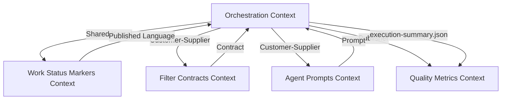
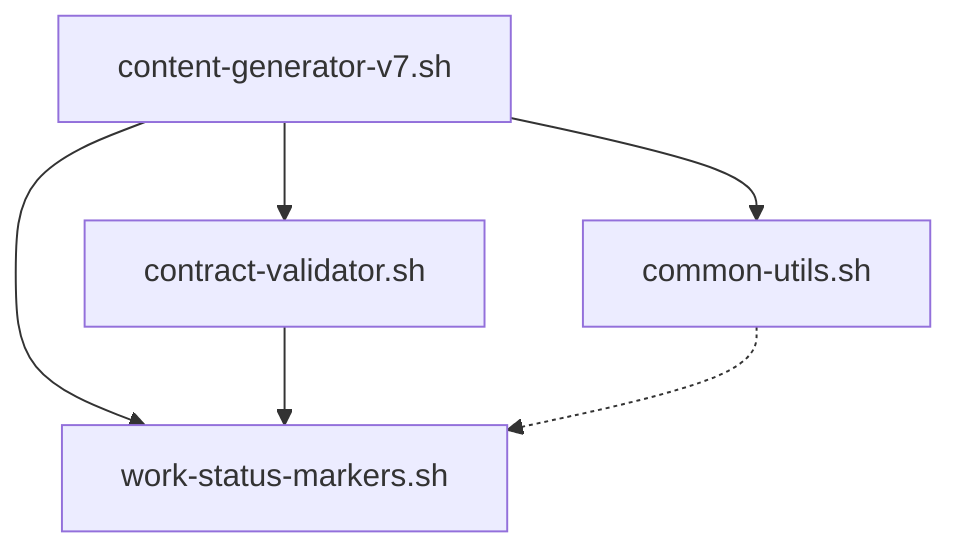
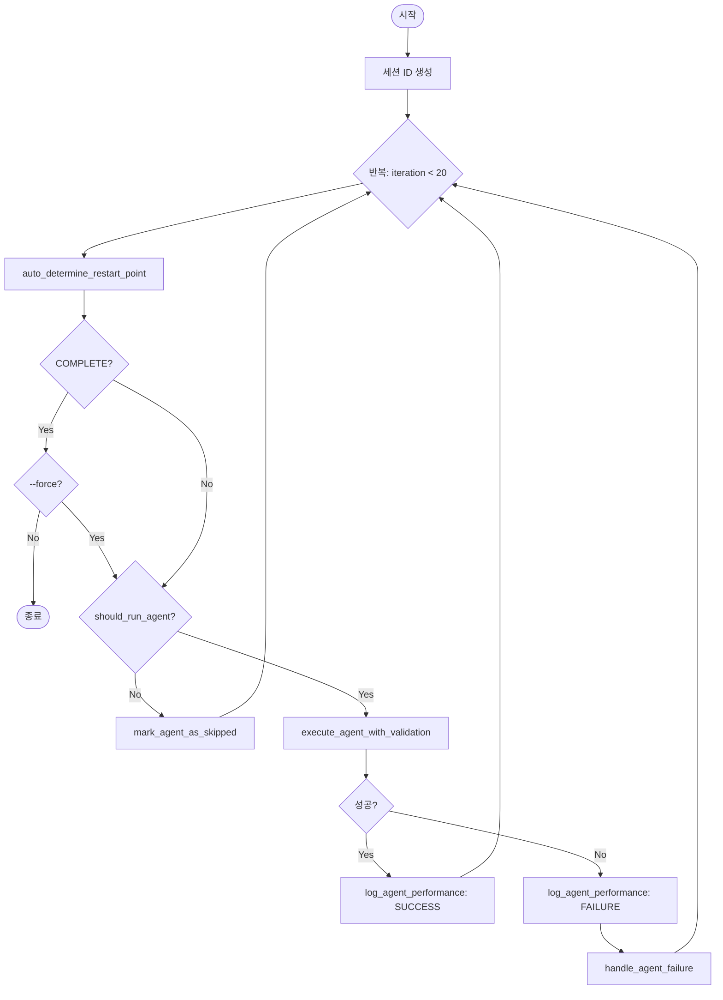

# Unit 4: Orchestration 도메인 설계 (Domain Design)

**버전**: v1.0
**작성일**: 2025-01-18
**상태**: Draft

---

## 문서 개요

**목적**: Unit 4 Orchestration의 도메인 모델을 DDD 경량화 방식으로 설계하여, content-generator-v7.sh의 아키텍처 원칙, 모듈 구조, 핵심 메커니즘을 명확히 정의한다.

**범위**:
- Orchestration의 역할 및 책임 정의
- v6 → v7 마이그레이션 전략
- 스크립트 모듈화 설계
- 재시작 메커니즘 강화 (3단계 → 5단계)
- 계약 검증 통합
- 오류 처리 및 로깅 개선

**참조 문서**:
- `docs/aidlc-docs/inception/units/unit-04-orchestration.md` (Unit 4 정의)
- `docs/aidlc-docs/construction/unit-01-pipe-mechanism/domain_design.md` (Pipe 메커니즘)
- `docs/aidlc-docs/construction/unit-02-filter-contracts/domain_design.md` (Filter 계약)
- `docs/aidlc-docs/construction/unit-03-agent-prompts/domain_design.md` (Agent Prompts)
- `scripts/content-generator-v6.sh` (현재 구현)

---

## 목차

1. [Orchestration 도메인 개요](#section-1-orchestration-도메인-개요)
2. [Ubiquitous Language (Orchestration Context)](#section-2-ubiquitous-language-orchestration-context)
3. [스크립트 모듈화 설계](#section-3-스크립트-모듈화-설계)
4. [재시작 메커니즘 설계](#section-4-재시작-메커니즘-설계)
5. [계약 검증 통합 설계](#section-5-계약-검증-통합-설계)
6. [에이전트 실행 관리](#section-6-에이전트-실행-관리)
7. [오류 처리 및 로깅 설계](#section-7-오류-처리-및-로깅-설계)
8. [Lock 파일 메커니즘](#section-8-lock-파일-메커니즘)
9. [명령줄 인터페이스 설계](#section-9-명령줄-인터페이스-설계)
10. [v6 → v7 마이그레이션 전략](#section-10-v6--v7-마이그레이션-전략)
11. [도메인 모델 검증](#section-11-도메인-모델-검증)
12. [Summary and Next Steps](#section-12-summary-and-next-steps)

---

## Section 1: Orchestration 도메인 개요

### 1.1 Orchestration의 역할 정의

**Orchestration Script**는 DDD 경량화 관점에서 **Application Service Layer** 역할을 수행한다.

#### 1.1.1 Application Service Layer로서의 역할

| 책임 | 설명 | v6 구현 | v7 개선 |
|------|------|---------|---------|
| **Pipeline Orchestration** | 7개 에이전트의 실행 순서 제어 | `execute_comprehensive_mode()` (892-964줄) | 5단계 재시작 메커니즘, 계약 검증 통합 |
| **Work Status Markers 검증** | 마커 파싱 및 다음 에이전트 결정 | `parse_work_status_markers()` (187-224줄) | 모듈화 (`work-status-markers.sh`), 오류 처리 강화 |
| **에이전트 독립성 보장** | 에이전트는 마커 직접 조작, Orchestration은 실행만 | ✅ 구현됨 | 유지 (검증 중심 접근) |
| **Backpressure Handling** | 에이전트 실패 시 파이프라인 중단 및 재시도 | `handle_agent_failure()` (279-311줄) | 구조화된 오류 분류, execution-summary.json |
| **Lock 관리** | 토픽별 파일 잠금으로 병렬 실행 지원 | `acquire_lock()`, `release_lock()` (399-440줄) | PID 기반 Stale lock 제거 유지 |
| **세션 관리** | Claude CLI 세션 ID 생성 및 컨텍스트 보존 | `generate_session_id()` (171-180줄) | 유지, 세션별 로그 디렉터리 추가 |

**핵심 원칙**:
- **에이전트 자율성**: 에이전트는 자신의 Work Status Markers를 직접 업데이트한다 (Unit 1 domain_design.md Section 1.1 참조)
- **검증 중심**: Orchestration은 Precondition/Postcondition만 검증하고, 마커를 직접 수정하지 않는다
- **재시작 가능성**: 중간 실패 시 정확한 지점에서 재시작 가능 (Resumable Pipeline)
- **명확한 오류 보고**: 실패 원인과 복구 방법을 즉시 파악 가능

#### 1.1.2 Pipeline Orchestrator 역할

**파이프라인 아키텍처 관점**:

```
[Orchestrator] → [Filter 1] → [Filter 2] → ... → [Filter 7]
      ↓              ↓             ↓                  ↓
   Lock 관리    Content Init   Overview    ...    Validator
   세션 생성    (에이전트)    (에이전트)         (에이전트)
   검증 수행
```

**Orchestration의 책임**:
1. **순서 제어**: 에이전트 실행 순서 결정 (Work Status Markers 기반)
2. **검증 수행**: Precondition/Postcondition 검증 (에이전트 실행 전후)
3. **성능 추적**: 각 에이전트 실행 시간 기록 및 분석
4. **오류 보고**: 실패 시 원인 분류 및 복구 제안

**Orchestration이 하지 않는 것**:
- ❌ Work Status Markers 직접 조작 (에이전트 책임)
- ❌ 콘텐츠 생성 (에이전트 책임)
- ❌ 마커 수정 (에이전트 책임)

### 1.2 Orchestration 아키텍처 원칙

#### 1.2.1 에이전트 독립성 보장

**원칙**: 에이전트는 Work Status Markers를 직접 조작하며, Orchestration은 실행과 검증만 담당한다.

**에이전트의 책임** (Unit 1 domain_design.md Section 4 참조):
- Precondition 확인 (CURRENT_AGENT 확인)
- Work Status Markers 업데이트 (HANDOFF LOG, CURRENT_AGENT, STATUS, UPDATED)
- Postcondition 보장 (출력 섹션 검증)

**Orchestration의 책임**:
- Precondition 검증 (에이전트 실행 전)
- Postcondition 검증 (에이전트 실행 후)
- 검증 실패 시 [FAILURE] 기록 (Orchestration이 직접 기록)

**v6 구현 현황**:
- ✅ 에이전트가 HANDOFF LOG 업데이트 (에이전트 프롬프트에 명시)
- ✅ Orchestration은 실행만 담당 (`execute_claude_agent`)
- ⚠️ 개선 필요: Precondition/Postcondition 검증 부재

**v7 개선 방향**:
- ✅ Precondition 검증 추가 (`validate_preconditions`)
- ✅ Postcondition 검증 추가 (`validate_postconditions`)
- ✅ 검증 실패 시 명확한 오류 메시지

#### 1.2.2 검증 중심 접근

**원칙**: Orchestration은 "무엇이 되어야 하는가"를 검증하고, "어떻게 달성하는가"는 에이전트에게 위임한다.

**검증 시점**:

| 시점 | 검증 내용 | 검증 실패 시 조치 |
|------|-----------|-------------------|
| **Precondition** | CURRENT_AGENT == agent_name<br/>필수 입력 섹션 존재<br/>STATUS == IN_PROGRESS | 에이전트 실행 중단<br/>[FAILURE] 기록<br/>오류 메시지 출력 |
| **Postcondition** | 출력 섹션 존재<br/>HANDOFF LOG [DONE] 기록됨<br/>CURRENT_AGENT 업데이트됨 | 에이전트 출력 롤백<br/>[FAILURE] 기록<br/>오류 메시지 출력 |

**v6 vs v7**:
- v6: 검증 없음 (에이전트 신뢰 기반)
- v7: Precondition/Postcondition 검증 추가 (계약 기반)

#### 1.2.3 재시작 가능성 (Resumable Pipeline)

**원칙**: 중간 실패 시 정확한 지점에서 재시작 가능해야 한다.

**v6 재시작 메커니즘** (3단계 우선순위):
1. Priority 1: IMPROVEMENT_NEEDED 확인
2. Priority 2: CURRENT_AGENT 확인 + PROGRESS != "완료"
3. Priority 3: Already complete

**v7 재시작 메커니즘** (5단계 우선순위, Unit 1 domain_design.md Section 8.3.3 참조):
1. Priority 1: IMPROVEMENT_NEEDED 확인
2. Priority 2: CURRENT_AGENT 확인
3. Priority 3: HANDOFF LOG 마지막 [FAILURE] 확인
4. Priority 4: [COMPLETE] 확인
5. Priority 5: 마지막 [DONE] 또는 [IMPROVE] 다음 에이전트

**재시작 불가 조건**:
- [COMPLETE] 상태 (재시작 금지, --force로만 가능)
- 손상된 Work Status Markers (복구 필요)

#### 1.2.4 명확한 오류 보고

**원칙**: 오류 발생 시 원인, 위치, 복구 방법을 즉시 파악 가능해야 한다.

**v6 오류 처리**:
- HANDOFF LOG에 [FAILURE] 기록
- `handle_agent_failure()` 함수 사용
- 오류 메시지: 에이전트명, 메시지, 시도 횟수, 타임스탬프

**v7 오류 처리 강화**:
- 오류 분류 (Precondition 실패, Postcondition 실패, 파싱 오류, Lock 충돌)
- 복구 제안 메시지 (예: "Check Work Status Markers", "Check file encoding (UTF-8)")
- execution-summary.json에 오류 상세 기록

### 1.3 Bounded Context 관계

#### 1.3.1 Context Mapping

**Orchestration Context**와 다른 Context의 관계:



#### 1.3.2 Context별 책임

| Context | 역할 | Orchestration과의 관계 | 통합 패턴 |
|---------|------|------------------------|-----------|
| **Work Status Markers** | Pipe 메커니즘 제공 | Shared Kernel | Work Status Markers 형식 공유 |
| **Filter Contracts** | 에이전트 계약 정의 | Customer-Supplier | Precondition/Postcondition 참조 |
| **Agent Prompts** | 에이전트 실행 명세 | Customer-Supplier | 프롬프트 기반 실행 |
| **Quality Metrics** | 품질 분석 수행 | Publisher-Subscriber | execution-summary.json 제공 |

#### 1.3.3 Shared Kernel: Work Status Markers

**공유되는 것**:
- Work Status Markers 형식 (6개 필드)
- HANDOFF LOG 이벤트 타입 (6가지: START, DONE, IMPROVE, FAILURE, SKIP, COMPLETE)
- 타임스탬프 형식 (ISO 8601)

**Orchestration의 책임**:
- Work Status Markers 파싱 (읽기 전용)
- Precondition/Postcondition 검증
- [FAILURE] 기록 (검증 실패 시)

**에이전트의 책임** (Unit 1 domain_design.md Section 1.1 참조):
- Work Status Markers 업데이트
- [DONE], [IMPROVE], [SKIP] 기록

---

## Section 2: Ubiquitous Language (Orchestration Context)

### 2.1 핵심 도메인 용어 정의

| 용어 | 정의 | 예시 |
|------|------|------|
| **Orchestration Script** | 7개 에이전트의 실행을 조율하는 Bash 스크립트 (Application Service Layer) | `content-generator-v7.sh` |
| **Session** | Claude CLI 세션 (에이전트 간 컨텍스트 공유) | `SESSION_ID=uuid-1234` |
| **Execution Mode** | 스크립트 실행 방식 (auto, interactive, direct) | `--auto`, `--direct=file.md` |
| **Restart Point** | 재시작 시 실행을 시작할 에이전트 | `RESUME:concepts-writer` |
| **Lock File** | 토픽별 파일 잠금 (병렬 실행 충돌 방지) | `topic-name.md.lock` |
| **Execution Summary** | 세션별 실행 결과 JSON (Unit 5 품질 분석용) | `execution-summary.json` |
| **Agent Executor** | 에이전트를 실행하는 함수 (Claude CLI 래핑) | `execute_claude_agent()` |
| **Contract Validator** | Precondition/Postcondition 검증 함수 | `validate_preconditions()` |
| **Restart Mechanism** | 재시작 지점 자동 식별 로직 (5단계 우선순위) | `auto_determine_restart_point()` |
| **Session Log** | 세션별 에이전트 실행 로그 | `logs/sessions/[session-id]/` |

### 2.2 v6 → v7 용어 변경 사항

| v6 용어 | v7 용어 | 변경 이유 |
|---------|---------|-----------|
| `PROGRESS` (마커 필드) | `STATUS` | Unit 1 개선안 반영 (명확한 상태 표현) |
| `identify_restart_point()` | `auto_determine_restart_point()` | 함수 역할 명확화 (자동 식별) |
| `determine_next_agent()` | 유지 | 변경 없음 |
| `parse_work_status_markers()` | 유지 (모듈 이동) | `work-status-markers.sh`로 이동 |
| `performance.log` | `execution-summary.json` | 구조화된 로그 (JSON 형식) |
| `validation mode` | 유지 | 변경 없음 (hybrid, immediate, comprehensive) |

**⚠️ 중요**: v6 용어는 v6 스크립트에서 계속 사용됨 (하위 호환성 유지)

### 2.3 실행 모드 용어

#### 2.3.1 Execution Mode (실행 모드)

| 모드 | 설명 | 명령줄 옵션 | 파일 선택 방법 |
|------|------|-------------|----------------|
| **Auto Mode** | content-initiator가 파일 선택 | `--auto` | content-initiator 에이전트가 자동 선택 |
| **Interactive Mode** | 사용자가 카테고리/서브카테고리 선택 | `--interactive` | 대화형 선택 → 불완전 파일 우선 |
| **Direct Mode** | 특정 파일 직접 지정 | `--direct=file.md` | 명령줄 인자로 직접 지정 |
| **Test Mode** | 실제 실행 없이 시뮬레이션 | `--test` | 모든 모드와 조합 가능 |

#### 2.3.2 Validation Mode (검증 모드)

| 모드 | 설명 | v6 구현 | v7 개선 |
|------|------|---------|---------|
| **Immediate** | 섹션별 즉시 검증 (v4/v5 스타일) | `execute_immediate_mode()` | 유지, 계약 검증 추가 |
| **Comprehensive** | Work Status Markers 기반 오케스트레이션 | `execute_comprehensive_mode()` | 5단계 재시작, 계약 검증 추가 |
| **Hybrid** | Immediate + Comprehensive (기본값) | `execute_hybrid_mode()` | 유지 |

#### 2.3.3 Restart Mode (재시작 모드)

| 옵션 | 설명 | v6 구현 | v7 개선 |
|------|------|---------|---------|
| `--resume` | 자동 재시작 지점 식별 | 3단계 우선순위 | 5단계 우선순위 |
| `--from=AGENT` | 특정 에이전트부터 시작 | ❌ 미구현 | ✅ 신규 추가 |
| `--force` | [COMPLETE] 무시하고 재시작 | ✅ 구현됨 | 유지 |

### 2.4 로깅 용어

| 용어 | 설명 | 파일 위치 | 형식 |
|------|------|-----------|------|
| **Session Log** | 세션별 전체 실행 로그 | `logs/content-generator-v7.log` | Plain text |
| **Agent Log** | 에이전트별 실행 로그 | `logs/sessions/[session-id]/[agent].log` | Plain text |
| **Execution Summary** | 세션별 실행 결과 JSON | `logs/sessions/[session-id]/execution-summary.json` | JSON |
| **Performance Log** | 에이전트별 성능 기록 | v7에서 execution-summary.json으로 통합 | JSON |
| **Error Log** | 오류 상세 기록 | execution-summary.json의 errors 배열 | JSON |

---

## Section 3: 스크립트 모듈화 설계

### 3.1 모듈 구조 설계

#### 3.1.1 v7 모듈 구조

```
scripts/
├── content-generator-v7.sh          # 메인 오케스트레이터 (500-800줄 예상)
├── content-generator-v6.sh          # 기존 스크립트 (보존)
└── lib/
    ├── common-utils.sh              # 공통 유틸리티 (200-300줄)
    ├── work-status-markers.sh       # Work Status Markers 유틸리티 (Unit 1에서 생성, 재사용)
    └── contract-validator.sh        # 계약 검증 로직 (선택적, Unit 2에서 생성 가능)
```

**모듈화 원칙**:
- **단일 책임**: 각 모듈은 하나의 명확한 책임만 가짐
- **재사용성**: 여러 스크립트에서 공통 함수 재사용
- **테스트 가능성**: 각 모듈 독립적으로 테스트 가능
- **의존성 최소화**: 모듈 간 의존성 최소화

#### 3.1.2 모듈 간 의존성 다이어그램



**의존성 설명**:
- `content-generator-v7.sh` → `common-utils.sh`: 로깅, Lock, 세션 관리 함수 사용
- `content-generator-v7.sh` → `work-status-markers.sh`: 마커 파싱 함수 사용
- `content-generator-v7.sh` → `contract-validator.sh`: Precondition/Postcondition 검증 함수 사용
- `contract-validator.sh` → `work-status-markers.sh`: 마커 읽기 위해 사용
- `common-utils.sh` -.-> `work-status-markers.sh`: 선택적 의존 (타임스탬프 생성)

### 3.2 common-utils.sh 함수 명세

#### 3.2.1 로깅 함수

| 함수 | 용도 | v6 구현 | v7 변경사항 |
|------|------|---------|-------------|
| `log_info(message)` | 정보 메시지 출력 | `print_info()` (154-156줄) | 이름 변경, 파일 로깅 추가 |
| `log_success(message)` | 성공 메시지 출력 | `print_success()` (158-160줄) | 이름 변경, 파일 로깅 추가 |
| `log_error(message)` | 오류 메시지 출력 | `print_error()` (162-164줄) | 이름 변경, 파일 로깅 추가 |
| `log_warning(message)` | 경고 메시지 출력 | `print_warning()` (166-168줄) | 이름 변경, 파일 로깅 추가 |

**함수 명세 예시** (API 문서 형식):

```bash
# log_info - 정보 메시지 출력 및 로깅
#
# 용도: 일반 정보 메시지를 stdout과 로그 파일에 동시 기록
#
# Parameters:
#   $1 (message): 출력할 메시지 (string)
#
# Returns:
#   0: 성공
#
# Outputs:
#   stdout: "ℹ️  $message"
#   log file: "$LOG_FILE" (tee 사용)
#
# Example:
#   log_info "Executing agent: overview-writer"
#   # 출력: ℹ️  Executing agent: overview-writer
#   # 로그: logs/content-generator-v7.log에 동일 메시지 추가
```

#### 3.2.2 파일 잠금 함수

| 함수 | 용도 | v6 구현 | v7 변경사항 |
|------|------|---------|-------------|
| `acquire_file_lock(file_path, agent_name)` | 파일 잠금 획득 | `acquire_lock()` (399-433줄) | 이름 명확화, PID 기반 Stale lock 제거 유지 |
| `release_file_lock(file_path)` | 파일 잠금 해제 | `release_lock()` (435-440줄) | 이름 명확화 |
| `check_lock_file(lock_file)` | Lock 파일 유효성 확인 | ❌ 미구현 | ✅ 신규 추가 (PID 확인) |

**함수 명세 예시**:

```bash
# check_lock_file - Lock 파일 유효성 확인
#
# 용도: PID 기반으로 프로세스 생존 여부 확인, Stale lock 자동 제거
#
# Parameters:
#   $1 (lock_file): Lock 파일 경로 (string)
#
# Returns:
#   0: Lock 없음 또는 Stale lock 제거됨 (진행 가능)
#   1: Lock 유효 (다른 프로세스 작업 중, 대기 필요)
#
# Side Effects:
#   - Stale lock 파일 삭제
#   - 로그 메시지 출력
#
# Example:
#   if check_lock_file "$lock_file"; then
#       acquire_file_lock "$file_path" "$agent_name"
#   else
#       log_error "File is locked by another process"
#       return 1
#   fi
```

#### 3.2.3 세션 관리 함수

| 함수 | 용도 | v6 구현 | v7 변경사항 |
|------|------|---------|-------------|
| `generate_session_id()` | UUID 세션 ID 생성 | `generate_session_id()` (171-180줄) | 유지 |
| `create_session_dir(session_id)` | 세션별 로그 디렉터리 생성 | ❌ 미구현 | ✅ 신규 추가 |
| `create_execution_summary(session_id)` | execution-summary.json 초기화 | ❌ 미구현 | ✅ 신규 추가 |

#### 3.2.4 타임스탬프 함수

| 함수 | 용도 | v6 구현 | v7 변경사항 |
|------|------|---------|-------------|
| `get_timestamp()` | ISO 8601 타임스탬프 생성 | 인라인 `date` 명령 | ✅ 함수화 |

**함수 명세 예시**:

```bash
# get_timestamp - ISO 8601 타임스탬프 생성
#
# 용도: Work Status Markers 및 로그에 사용할 타임스탬프 생성
#
# Parameters: 없음
#
# Returns:
#   0: 성공
#
# Outputs:
#   stdout: "YYYY-MM-DDTHH:MM:SS+09:00" (ISO 8601 형식)
#
# Example:
#   timestamp=$(get_timestamp)
#   # 출력: "2025-01-18T14:30:00+09:00"
```

### 3.3 v6 기능 매핑

#### 3.3.1 v6 → v7 함수 매핑 테이블

| v6 함수 | v6 위치 | v7 모듈 | v7 함수명 | 변경사항 |
|---------|---------|---------|-----------|----------|
| `print_info()` | 154-156줄 | common-utils.sh | `log_info()` | 파일 로깅 추가 |
| `print_success()` | 158-160줄 | common-utils.sh | `log_success()` | 파일 로깅 추가 |
| `print_error()` | 162-164줄 | common-utils.sh | `log_error()` | 파일 로깅 추가 |
| `print_warning()` | 166-168줄 | common-utils.sh | `log_warning()` | 파일 로깅 추가 |
| `generate_session_id()` | 171-180줄 | common-utils.sh | `generate_session_id()` | 유지 |
| `parse_work_status_markers()` | 187-224줄 | work-status-markers.sh | `parse_work_status_markers()` | 모듈 이동 |
| `determine_next_agent()` | 226-250줄 | content-generator-v7.sh | `determine_next_agent()` | 유지 (메인 스크립트) |
| `identify_restart_point()` | 252-277줄 | content-generator-v7.sh | `auto_determine_restart_point()` | 5단계 우선순위로 확장 |
| `handle_agent_failure()` | 279-311줄 | content-generator-v7.sh | `handle_agent_failure()` | execution-summary.json 통합 |
| `log_agent_performance()` | 313-332줄 | content-generator-v7.sh | `log_agent_performance()` | execution-summary.json 통합 |
| `acquire_lock()` | 399-433줄 | common-utils.sh | `acquire_file_lock()` | 이름 명확화 |
| `release_lock()` | 435-440줄 | common-utils.sh | `release_file_lock()` | 이름 명확화 |
| `execute_claude_agent()` | 622-709줄 | content-generator-v7.sh | `execute_claude_agent()` | 검증 통합, 로깅 추가 |

**총 v6 함수**: 28개
**v7 모듈 분산**:
- `common-utils.sh`: 8개 함수
- `work-status-markers.sh`: 1개 함수 (+ Unit 1 추가 함수)
- `content-generator-v7.sh`: 19개 함수 (메인 로직)

---

## Section 4: 재시작 메커니즘 설계

### 4.1 재시작 지점 자동 식별 알고리즘

#### 4.1.1 5단계 우선순위 (v7)

**v6 → v7 비교**:
- v6: 3단계 우선순위 (`identify_restart_point()`)
- v7: 5단계 우선순위 (`auto_determine_restart_point()`)

**v7 알고리즘 (Unit 1 domain_design.md Section 8.3.3 반영)**:

```bash
auto_determine_restart_point() {
    local file_path=$1

    # Priority 1: IMPROVEMENT_NEEDED 확인
    if has_improvement_needed "$file_path"; then
        local target_agent=$(get_improvement_target_agent "$file_path")
        echo "IMPROVEMENT:$target_agent"
        return
    fi

    # Priority 2: CURRENT_AGENT 확인
    local current_agent=$(get_current_agent "$file_path")
    if [ -n "$current_agent" ]; then
        echo "RESUME:$current_agent"
        return
    fi

    # Priority 3: HANDOFF LOG 마지막 [FAILURE] 확인
    local last_failure=$(grep -o '\[FAILURE\] [^ ]*' "$file_path" | tail -1 | cut -d' ' -f2)
    if [ -n "$last_failure" ]; then
        echo "RETRY:$last_failure"
        return
    fi

    # Priority 4: [COMPLETE] 확인
    if grep -q '\[COMPLETE\]' "$file_path"; then
        echo "COMPLETE"
        return
    fi

    # Priority 5: 마지막 [DONE] 또는 [IMPROVE] 다음 에이전트
    local last_completed=$(grep -E '\[(DONE|IMPROVE)\]' "$file_path" | tail -1 | cut -d' ' -f2)
    if [ -n "$last_completed" ]; then
        local next_agent=$(get_next_agent "$last_completed")
        echo "RESUME:$next_agent"
        return
    fi

    # 기본: 시작점
    echo "START:content-initiator"
}
```

#### 4.1.2 우선순위별 설명

| 우선순위 | 조건 | 재시작 지점 | 사용 시나리오 |
|----------|------|-------------|---------------|
| **Priority 1** | IMPROVEMENT_NEEDED 필드 존재 | IMPROVEMENT_NEEDED의 첫 번째 에이전트 | content-validator가 개선 요청 후 |
| **Priority 2** | CURRENT_AGENT 필드가 비어있지 않음 | CURRENT_AGENT 지정 에이전트 | 에이전트 실행 중 중단된 경우 |
| **Priority 3** | HANDOFF LOG에 [FAILURE] 존재 | 마지막 [FAILURE] 에이전트 | 에이전트 실행 실패 후 재시도 |
| **Priority 4** | HANDOFF LOG에 [COMPLETE] 존재 | 완료 (재시작 불가) | 파이프라인 완료 상태 |
| **Priority 5** | HANDOFF LOG에 [DONE] 또는 [IMPROVE] 존재 | 마지막 완료 에이전트의 다음 에이전트 | 정상 진행 중 중단된 경우 |

#### 4.1.3 IMPROVE vs DONE 구분 처리

**원칙**: DONE과 IMPROVE는 재시작 지점 식별 시 동일하게 처리한다.

| 이벤트 | 의미 | 재시작 시 처리 |
|--------|------|----------------|
| **DONE** | 에이전트의 첫 번째 작업 완료 | 다음 에이전트로 진행 |
| **IMPROVE** | 개선 작업 완료 | 다음 에이전트로 진행 (동일) |

**Priority 5 정규식**:
```bash
grep -E '\[(DONE|IMPROVE)\]' "$file_path"
```

### 4.2 재시작 모드 설계

#### 4.2.1 --resume 옵션

**용도**: 자동으로 재시작 지점 식별 후 실행

**v6 구현**:
```bash
if [ "$RESTART_MODE" = "true" ]; then
    local restart_point=$(identify_restart_point "$target_file")
    # 3단계 우선순위 처리
fi
```

**v7 개선**:
```bash
if [ "$RESUME_MODE" = "true" ]; then
    local restart_point=$(auto_determine_restart_point "$target_file")

    case "$restart_point" in
        IMPROVEMENT:*)
            local agent="${restart_point#IMPROVEMENT:}"
            log_info "🔄 Restarting from improvement target: $agent"
            ;;
        RESUME:*)
            local agent="${restart_point#RESUME:}"
            log_info "▶️  Resuming from: $agent"
            ;;
        RETRY:*)
            local agent="${restart_point#RETRY:}"
            log_warning "⚠️  Retrying failed agent: $agent"
            ;;
        COMPLETE)
            log_success "✅ File already complete"
            [ "$FORCE_MODE" = "true" ] || exit 0
            ;;
        START:*)
            local agent="${restart_point#START:}"
            log_info "🆕 Starting from: $agent"
            ;;
    esac
fi
```

#### 4.2.2 --from=AGENT 옵션 (v7 신규)

**용도**: 특정 에이전트부터 강제 시작

**구현**:
```bash
if [ -n "$FROM_AGENT" ]; then
    log_info "🎯 Starting from specified agent: $FROM_AGENT"
    # CURRENT_AGENT 강제 설정 (검증 우회)
    # 주의: 개발자 전용, Precondition 무시
fi
```

**주의 사항**:
- Precondition 검증 우회 (개발/디버깅 전용)
- 프로덕션 환경에서는 `--resume` 사용 권장

#### 4.2.3 재시작 불가 조건

| 조건 | 설명 | 우회 방법 |
|------|------|-----------|
| **[COMPLETE] 상태** | 파이프라인 완료 | `--force` 옵션 사용 |
| **손상된 Work Status Markers** | 마커 파싱 실패 | 수동 복구 필요 |
| **Lock 파일 충돌** | 다른 프로세스 작업 중 | 대기 또는 `--force` |

### 4.3 상태 복원 전략

#### 4.3.1 HANDOFF LOG 보존 (Append-Only)

**원칙**: 재시작 시 기존 HANDOFF LOG는 절대 수정하지 않는다 (Append-Only).

**보존 항목**:
- 모든 [DONE], [IMPROVE], [FAILURE], [SKIP] 엔트리
- 타임스탬프 순서
- 에이전트 실행 이력

**추가 항목**:
- 새로운 [DONE] 또는 [IMPROVE] 엔트리 (에이전트 재실행 성공 시)

**예시**:
```html
<!-- HANDOFF LOG:
- [START] content-initiator | 파이프라인 시작 | 2025-01-18T10:00:00+09:00
- [DONE] overview-writer | Overview 섹션 작성 완료 | 2025-01-18T10:05:00+09:00
- [FAILURE] concepts-writer | Precondition failed | 2025-01-18T10:10:00+09:00
# --resume 후 재시작
- [DONE] concepts-writer | Core Concepts 섹션 작성 완료 | 2025-01-18T10:15:00+09:00
-->
```

#### 4.3.2 STATUS 복원 로직

**재시작 시 STATUS 업데이트**:
- [COMPLETE] → 변경 없음 (`--force`로만 재시작)
- [FAILURE] → IN_PROGRESS (재시도 시)
- PENDING → IN_PROGRESS (재시작 시)

**Orchestration 책임**:
- STATUS 읽기만 (검증 용도)
- STATUS 업데이트는 에이전트 책임

---

## Section 5: 계약 검증 통합 설계

### 5.1 검증 시점 정의

#### 5.1.1 Precondition 검증 (에이전트 실행 전)

**검증 시점**: `execute_claude_agent()` 호출 직전

**검증 항목** (Unit 2 계약 참조):
1. **CURRENT_AGENT 확인**: `CURRENT_AGENT == agent_name`
2. **필수 입력 섹션 존재**: 에이전트별 Input Contract 확인
3. **STATUS 확인**: `STATUS == IN_PROGRESS`

**v7 구현**:
```bash
execute_agent_with_validation() {
    local agent_name=$1
    local file_path=$2
    local session_id=$3

    # 1. Precondition 검증
    log_info "Validating preconditions for $agent_name..."
    if ! validate_preconditions "$agent_name" "$file_path"; then
        log_error "Precondition validation failed for $agent_name"
        return 1
    fi

    # 2. 에이전트 실행
    # ...
}
```

#### 5.1.2 Postcondition 검증 (에이전트 실행 후)

**검증 시점**: `execute_claude_agent()` 정상 종료 후

**검증 항목** (Unit 2 계약 참조):
1. **출력 섹션 존재**: 에이전트별 Output Contract 확인
2. **HANDOFF LOG [DONE] 기록**: 새로운 [DONE] 엔트리 추가됨
3. **CURRENT_AGENT 업데이트**: 다음 에이전트로 업데이트됨

**v7 구현**:
```bash
execute_agent_with_validation() {
    # ...

    # 2. 에이전트 실행
    execute_claude_agent "$agent_name" "$session_id" "$is_first"
    local exit_code=$?

    # 3. Postcondition 검증
    if [ $exit_code -eq 0 ]; then
        log_info "Validating postconditions for $agent_name..."
        if ! validate_postconditions "$agent_name" "$file_path"; then
            log_error "Postcondition validation failed for $agent_name"
            return 1
        fi
    fi

    return $exit_code
}
```

### 5.2 검증 함수 설계

#### 5.2.1 validate_preconditions 함수

**함수 명세**:
```bash
# validate_preconditions - 에이전트 실행 전 Precondition 검증
#
# 용도: Unit 2 계약의 Precondition 항목 검증
#
# Parameters:
#   $1 (agent_name): 에이전트 이름 (string)
#   $2 (file_path): 마크다운 파일 경로 (string)
#
# Returns:
#   0: 검증 성공
#   1: 검증 실패
#
# Outputs:
#   stderr: 오류 메시지 (검증 실패 시)
#
# Example:
#   if validate_preconditions "overview-writer" "$file_path"; then
#       execute_claude_agent "overview-writer" "$session_id"
#   else
#       log_error "Precondition failed"
#       return 1
#   fi
```

**검증 로직**:
```bash
validate_preconditions() {
    local agent_name=$1
    local file_path=$2

    # PC-1: CURRENT_AGENT 확인
    local current_agent=$(parse_field "CURRENT_AGENT" "$file_path")
    if [ "$current_agent" != "$agent_name" ]; then
        log_error "PC-1 failed: CURRENT_AGENT is '$current_agent', expected '$agent_name'"
        return 1
    fi

    # PC-2: STATUS 확인
    local status=$(parse_field "STATUS" "$file_path")
    if [ "$status" != "IN_PROGRESS" ]; then
        log_error "PC-2 failed: STATUS is '$status', expected 'IN_PROGRESS'"
        return 1
    fi

    # PC-3: 필수 입력 섹션 확인 (에이전트별)
    case "$agent_name" in
        "overview-writer")
            # frontmatter 존재 확인
            ;;
        "concepts-writer")
            # Overview 섹션 존재 확인
            if ! grep -q "^# Overview" "$file_path"; then
                log_error "PC-3 failed: Overview section not found"
                return 1
            fi
            ;;
        # ... 나머지 에이전트
    esac

    return 0
}
```

#### 5.2.2 validate_postconditions 함수

**함수 명세**:
```bash
# validate_postconditions - 에이전트 실행 후 Postcondition 검증
#
# 용도: Unit 2 계약의 Postcondition 항목 검증
#
# Parameters:
#   $1 (agent_name): 에이전트 이름 (string)
#   $2 (file_path): 마크다운 파일 경로 (string)
#
# Returns:
#   0: 검증 성공
#   1: 검증 실패
#
# Outputs:
#   stderr: 오류 메시지 (검증 실패 시)
```

**검증 로직**:
```bash
validate_postconditions() {
    local agent_name=$1
    local file_path=$2

    # PO-1: 출력 섹션 존재 확인 (에이전트별)
    case "$agent_name" in
        "overview-writer")
            if ! grep -q "^# Overview" "$file_path"; then
                log_error "PO-1 failed: Overview section not created"
                return 1
            fi
            ;;
        "concepts-writer")
            if ! grep -q "^# Core Concepts" "$file_path"; then
                log_error "PO-1 failed: Core Concepts section not created"
                return 1
            fi
            ;;
        # ... 나머지 에이전트
    esac

    # PO-2: HANDOFF LOG [DONE] 기록 확인
    local last_entry=$(grep "HANDOFF LOG:" -A 20 "$file_path" | grep "^\[" | tail -1)
    if ! echo "$last_entry" | grep -q "\[DONE\] $agent_name"; then
        log_error "PO-2 failed: [DONE] entry not found for $agent_name"
        return 1
    fi

    # PO-3: CURRENT_AGENT 업데이트 확인
    local next_agent=$(get_next_agent "$agent_name")
    local current_agent=$(parse_field "CURRENT_AGENT" "$file_path")
    if [ "$current_agent" != "$next_agent" ]; then
        log_error "PO-3 failed: CURRENT_AGENT not updated to $next_agent"
        return 1
    fi

    return 0
}
```

### 5.3 검증 실패 처리

#### 5.3.1 Precondition 실패 시

**처리 단계**:
1. 에이전트 실행 중단
2. HANDOFF LOG에 [FAILURE] 기록 (Orchestration이 직접 기록)
3. 오류 메시지 출력
4. execution-summary.json에 오류 기록
5. EXIT 1 (파이프라인 중단)

**HANDOFF LOG 형식**:
```
[FAILURE] overview-writer | Precondition failed: CURRENT_AGENT mismatch | 2025-01-18T10:10:00+09:00
```

#### 5.3.2 Postcondition 실패 시

**처리 단계**:
1. 에이전트 출력 롤백 (선택적, 구현 복잡도 고려)
2. HANDOFF LOG에 [FAILURE] 기록
3. 오류 메시지 출력
4. execution-summary.json에 오류 기록
5. EXIT 1 (파이프라인 중단)

**⚠️ 주의**: 출력 롤백은 구현 복잡도가 높으므로 v7 Phase 2.1에서는 설계만, Phase 2.3에서 구현 여부 결정

### 5.4 선택적 검증 옵션

#### 5.4.1 --skip-validation 옵션

**용도**: 검증 건너뛰기 (빠른 실행, 개발 전용)

**구현**:
```bash
if [ "$SKIP_VALIDATION" = "false" ]; then
    validate_preconditions "$agent_name" "$file_path" || return 1
fi
```

#### 5.4.2 --validate-only 옵션

**용도**: 검증만 수행, 에이전트 실행 없음

**구현**:
```bash
if [ "$VALIDATE_ONLY" = "true" ]; then
    for agent in content-initiator overview-writer ...; do
        validate_preconditions "$agent" "$file_path"
        validate_postconditions "$agent" "$file_path"
    done
    exit 0
fi
```

---

## Section 6: 에이전트 실행 관리

### 6.1 에이전트 실행 함수 설계

#### 6.1.1 execute_agent_with_validation 함수

**v7 신규 함수**: Precondition/Postcondition 검증을 통합한 에이전트 실행 래퍼

**함수 명세**:
```bash
# execute_agent_with_validation - 검증 통합 에이전트 실행
#
# 용도: Precondition 검증 → 에이전트 실행 → Postcondition 검증 순서로 실행
#
# Parameters:
#   $1 (agent_name): 에이전트 이름 (string)
#   $2 (file_path): 마크다운 파일 경로 (string)
#   $3 (session_id): Claude CLI 세션 ID (string)
#   $4 (is_first): 첫 번째 실행 여부 (true/false)
#
# Returns:
#   0: 성공 (Precondition + 실행 + Postcondition 모두 성공)
#   1: 실패 (Precondition, 실행, Postcondition 중 하나라도 실패)
#
# Side Effects:
#   - Lock 파일 획득/해제
#   - 에이전트 실행 로그 기록
#   - execution-summary.json 업데이트
#   - [FAILURE] 기록 (검증 실패 시)
```

**구현 예시** (v7 예상):
```bash
execute_agent_with_validation() {
    local agent_name=$1
    local file_path=$2
    local session_id=$3
    local is_first=$4

    local topic_name=$(basename "$file_path" .md)

    # Step 1: Precondition 검증
    if [ "$SKIP_VALIDATION" = "false" ]; then
        log_info "🔍 Validating preconditions for $agent_name..."
        if ! validate_preconditions "$agent_name" "$file_path"; then
            log_error "❌ Precondition validation failed for $agent_name"
            handle_agent_failure "$file_path" "$agent_name" "Precondition failed" 1
            return 1
        fi
        log_success "✅ Preconditions passed"
    fi

    # Step 2: Lock 획득
    local lock_file=$(acquire_file_lock "$file_path" "$agent_name")
    if [ $? -ne 0 ]; then
        log_error "❌ Failed to acquire lock"
        return 1
    fi

    # Step 3: 에이전트 실행
    log_info "▶️  Executing agent: $agent_name"
    local start_time=$(date +%s)

    execute_claude_agent "$agent_name" "$session_id" "$is_first" "$file_path" "$topic_name"
    local exit_code=$?

    local end_time=$(date +%s)
    local duration=$((end_time - start_time))

    # Step 4: Lock 해제
    release_file_lock "$lock_file"

    # Step 5: 실행 결과 확인
    if [ $exit_code -ne 0 ]; then
        log_error "❌ Agent execution failed (${duration}s)"
        log_agent_performance "$agent_name" "$duration" "FAILURE" "$file_path"
        handle_agent_failure "$file_path" "$agent_name" "Execution failed" 1
        return 1
    fi

    # Step 6: Postcondition 검증
    if [ "$SKIP_VALIDATION" = "false" ]; then
        log_info "🔍 Validating postconditions for $agent_name..."
        if ! validate_postconditions "$agent_name" "$file_path"; then
            log_error "❌ Postcondition validation failed for $agent_name"
            handle_agent_failure "$file_path" "$agent_name" "Postcondition failed" 1
            return 1
        fi
        log_success "✅ Postconditions passed"
    fi

    # Step 7: 성공 로깅
    log_agent_performance "$agent_name" "$duration" "SUCCESS" "$file_path"
    log_success "✅ $agent_name completed (${duration}s)"

    return 0
}
```

#### 6.1.2 execute_claude_agent 함수 (v6 → v7 변경사항)

**v6 구현** (622-709줄):
- Claude CLI 직접 호출: `claude -p "$prompt" --session-id "$session_id"`
- 에이전트별 프롬프트 생성 (case 문)
- UTF-8 환경 변수 설정
- `--session-id` (첫 번째) vs `--resume` (후속)

**v7 개선 방향**:
- ✅ 프롬프트 생성 유지 (에이전트별)
- ✅ Claude CLI 실행 패턴 보존 (`claude -p` 방식)
- ✅ UTF-8 환경 변수 유지
- ✅ 에이전트별 로그 파일 추가 (`logs/sessions/[session-id]/[agent].log`)
- ✅ execution-summary.json에 실행 기록 추가

**함수 명세** (v7 변경사항 포함):
```bash
# execute_claude_agent - Claude CLI 래핑 함수
#
# 용도: Claude CLI를 호출하여 에이전트 실행 (v6 패턴 보존)
#
# Parameters:
#   $1 (agent_name): 에이전트 이름 (string)
#   $2 (session_id): Claude CLI 세션 ID (string)
#   $3 (is_first): 첫 번째 실행 여부 (true/false)
#   $4 (file_path): 마크다운 파일 경로 (optional)
#   $5 (topic_name): 토픽 이름 (optional)
#
# Returns:
#   0: 성공
#   1: 실패
#
# Side Effects:
#   - Claude CLI 실행
#   - 에이전트별 로그 파일 생성 (NEW)
#   - execution-summary.json 업데이트 (NEW)
#
# Example:
#   execute_claude_agent "overview-writer" "$SESSION_ID" "true" "$file_path" "scope"
```

**v7 구현 예시**:
```bash
execute_claude_agent() {
    local agent_name="$1"
    local session_id="$2"
    local is_first_section="$3"
    local target_file="$4"
    local topic_name="$5"

    # 1. 프롬프트 생성 (v6 로직 유지)
    local prompt=""
    case "$agent_name" in
        "content-initiator")
            prompt="content-initiator agent로 Work Status Markers 초기화"
            ;;
        "overview-writer")
            prompt="overview-writer agent로 Overview 섹션 작성"
            ;;
        # ... (나머지 에이전트 동일)
    esac

    # 2. 에이전트별 로그 디렉터리 생성 (NEW)
    local log_dir="$PROJECT_ROOT/logs/sessions/$session_id"
    mkdir -p "$log_dir"
    local agent_log="$log_dir/${agent_name}.log"

    # 3. Claude CLI 실행 (v6 패턴 보존)
    if [ "$is_first_section" = "true" ]; then
        env PYTHONIOENCODING=utf-8 LC_ALL=en_US.UTF-8 LANG=en_US.UTF-8 \
            "$CLAUDE_PATH" -p "$prompt" \
            --session-id "$session_id" \
            --permission-mode bypassPermissions \
            2>&1 | tee -a "$agent_log"
    else
        env PYTHONIOENCODING=utf-8 LC_ALL=en_US.UTF-8 LANG=en_US.UTF-8 \
            "$CLAUDE_PATH" -p "$prompt" \
            --resume "$session_id" \
            --permission-mode bypassPermissions \
            2>&1 | tee -a "$agent_log"
    fi

    # 4. execution-summary.json 업데이트 (NEW)
    local exit_code=${PIPESTATUS[0]}
    update_execution_summary "$session_id" "$agent_name" "$exit_code"

    return $exit_code
}
```

### 6.2 에이전트 실행 흐름

#### 6.2.1 Comprehensive Mode 실행 흐름 (v7)

**v6 실행 흐름** (execute_comprehensive_mode, 272-343줄):
1. `determine_next_agent()` 호출
2. COMPLETE 확인
3. `should_run_agent()` 확인 (조건부 실행)
4. `execute_claude_agent()` 호출
5. `log_agent_performance()` 호출
6. 반복 (max_iterations=20)

**v7 실행 흐름** (개선):
1. `auto_determine_restart_point()` 호출 (5단계 우선순위)
2. COMPLETE 확인 (--force 옵션 체크)
3. `should_run_agent()` 확인 (조건부 실행)
4. **`execute_agent_with_validation()` 호출** (NEW - 검증 통합)
5. execution-summary.json 업데이트
6. 반복 (max_iterations=20)

**Mermaid 다이어그램**:


#### 6.2.2 에이전트별 로그 파일 구조

**로그 디렉터리 구조** (v7 신규):
```
logs/
├── content-generator-v7.log          # 메인 스크립트 로그
└── sessions/
    └── [session-id]/
        ├── content-initiator.log     # 에이전트별 로그
        ├── overview-writer.log
        ├── concepts-writer.log
        ├── visualization-writer.log
        ├── practice-writer.log
        ├── quiz-writer.log
        ├── content-validator.log
        └── execution-summary.json    # 세션 요약 (Unit 5용)
```

**execution-summary.json 형식** (v7 신규):
```json
{
  "session_id": "uuid-1234",
  "file_path": "public/content/ko/javascript-core-concepts/01-variables/05-scope.md",
  "started_at": "2025-01-18T10:00:00+09:00",
  "completed_at": "2025-01-18T10:30:00+09:00",
  "total_duration": 1800,
  "agents": [
    {
      "name": "content-initiator",
      "started_at": "2025-01-18T10:00:00+09:00",
      "completed_at": "2025-01-18T10:02:00+09:00",
      "duration": 120,
      "status": "SUCCESS",
      "exit_code": 0
    },
    {
      "name": "overview-writer",
      "started_at": "2025-01-18T10:02:30+09:00",
      "completed_at": "2025-01-18T10:05:00+09:00",
      "duration": 150,
      "status": "SUCCESS",
      "exit_code": 0
    }
  ],
  "errors": [],
  "final_validation_score": 95
}
```

---

## Section 7: 오류 처리 및 로깅 설계

### 7.1 오류 분류 체계

#### 7.1.1 오류 타입 정의 (v7 신규)

**v6 오류 처리**:
- 단순 [FAILURE] 기록
- 오류 메시지: "에이전트명: 메시지 (attempt N)"

**v7 오류 분류**:

| 오류 타입 | 설명 | 복구 방법 |
|----------|------|-----------|
| **PRECONDITION_FAILED** | Precondition 검증 실패 | Work Status Markers 확인, CURRENT_AGENT 수정 |
| **POSTCONDITION_FAILED** | Postcondition 검증 실패 | 에이전트 출력 확인, 섹션 생성 여부 확인 |
| **EXECUTION_FAILED** | 에이전트 실행 실패 (exit code != 0) | Claude CLI 로그 확인, 에이전트 프롬프트 확인 |
| **PARSING_ERROR** | Work Status Markers 파싱 실패 | 마커 형식 확인, UTF-8 인코딩 확인 |
| **LOCK_CONFLICT** | Lock 파일 충돌 | 다른 프로세스 대기, --force 옵션 사용 |
| **TIMEOUT** | 실행 시간 초과 | 에이전트 복잡도 확인, 타임아웃 설정 증가 |

#### 7.1.2 오류 처리 함수 설계

**v6 함수**: `handle_agent_failure()` (279-311줄)
- HANDOFF LOG에 [FAILURE] 기록
- 파라미터: file_path, agent_name, error_message, attempt_num

**v7 함수**: `handle_agent_failure()` (개선)
- 오류 타입 추가 (error_type 파라미터)
- execution-summary.json에 오류 기록
- 복구 제안 메시지 출력

**함수 명세** (v7):
```bash
# handle_agent_failure - 에이전트 실패 처리 (v7 개선)
#
# 용도: 에이전트 실패 시 오류 기록 및 복구 제안
#
# Parameters:
#   $1 (file_path): 마크다운 파일 경로 (string)
#   $2 (agent_name): 에이전트 이름 (string)
#   $3 (error_type): 오류 타입 (PRECONDITION_FAILED, POSTCONDITION_FAILED, etc.)
#   $4 (error_message): 오류 메시지 (string)
#   $5 (attempt_num): 시도 횟수 (int)
#
# Returns:
#   0: 성공 (로깅 성공)
#
# Side Effects:
#   - HANDOFF LOG에 [FAILURE] 기록
#   - execution-summary.json에 오류 추가
#   - 복구 제안 메시지 출력
```

**구현 예시** (v7):
```bash
handle_agent_failure() {
    local file_path="$1"
    local agent_name="$2"
    local error_type="$3"
    local error_message="$4"
    local attempt_num="$5"

    local timestamp=$(get_timestamp)
    local failure_entry="[FAILURE] $agent_name | $error_type: $error_message (attempt $attempt_num) | $timestamp"

    # 1. HANDOFF LOG 업데이트 (v6 로직 유지)
    # ... (v6 동일)

    # 2. execution-summary.json 업데이트 (NEW)
    if [ -n "$SESSION_ID" ]; then
        local session_dir="$PROJECT_ROOT/logs/sessions/$SESSION_ID"
        local summary_file="$session_dir/execution-summary.json"

        # JSON 파일에 오류 추가 (jq 사용)
        jq --arg agent "$agent_name" \
           --arg type "$error_type" \
           --arg msg "$error_message" \
           --arg ts "$timestamp" \
           '.errors += [{
               "agent": $agent,
               "type": $type,
               "message": $msg,
               "timestamp": $ts
           }]' "$summary_file" > "$summary_file.tmp" && mv "$summary_file.tmp" "$summary_file"
    fi

    # 3. 복구 제안 메시지 출력 (NEW)
    log_error "❌ Agent failed: $agent_name"
    log_error "   Error type: $error_type"
    log_error "   Error message: $error_message"

    case "$error_type" in
        "PRECONDITION_FAILED")
            log_info "💡 Suggestion: Check Work Status Markers (CURRENT_AGENT field)"
            log_info "   Run: grep -A 5 'WORK STATUS MARKERS' \"$file_path\""
            ;;
        "POSTCONDITION_FAILED")
            log_info "💡 Suggestion: Check if agent created output sections"
            log_info "   Run: grep '^#' \"$file_path\" | head -10"
            ;;
        "PARSING_ERROR")
            log_info "💡 Suggestion: Check file encoding (UTF-8 required)"
            log_info "   Run: file -b --mime-encoding \"$file_path\""
            ;;
        "LOCK_CONFLICT")
            log_info "💡 Suggestion: Wait for other process or use --force option"
            ;;
    esac
}
```

### 7.2 로깅 설계

#### 7.2.1 로깅 레벨 정의

**v6 로깅**:
- `print_info()`, `print_success()`, `print_error()`, `print_warning()`
- stdout 출력만 (파일 로깅 없음)

**v7 로깅 개선**:
- 파일 로깅 추가: `logs/content-generator-v7.log`
- 에이전트별 로그: `logs/sessions/[session-id]/[agent].log`
- 구조화된 로그: execution-summary.json

**로깅 레벨**:

| 레벨 | 함수 | 색상 | 출력 대상 | 파일 로깅 |
|------|------|------|-----------|----------|
| INFO | `log_info(msg)` | 파란색 | stdout | Yes |
| SUCCESS | `log_success(msg)` | 녹색 | stdout | Yes |
| WARNING | `log_warning(msg)` | 노란색 | stdout | Yes |
| ERROR | `log_error(msg)` | 빨간색 | stderr | Yes |
| DEBUG | `log_debug(msg)` | 회색 | stdout (DEBUG_MODE=true 시) | Yes |

#### 7.2.2 로그 파일 회전 (선택적)

**v7 Phase 2.1**: 로그 회전 미구현 (단순 append)
**v7 Phase 2.3**: 로그 회전 구현 고려

**로그 회전 전략** (Phase 2.3 고려사항):
- 파일 크기 기반: 10MB 초과 시 회전
- 보존 기간: 최근 7일
- 압축: gzip 사용

#### 7.2.3 로깅 함수 구현 예시

**common-utils.sh의 log_info 함수**:
```bash
# log_info - 정보 메시지 출력 및 로깅
#
# 용도: 일반 정보 메시지를 stdout과 로그 파일에 동시 기록
#
# Parameters:
#   $1 (message): 출력할 메시지 (string)
#
# Returns:
#   0: 성공
log_info() {
    local message="$1"
    local timestamp=$(get_timestamp)
    local log_line="[$timestamp] [INFO] $message"

    # stdout 출력 (색상 포함)
    echo -e "\033[0;34mℹ️  $message\033[0m"

    # 파일 로깅 (색상 제외)
    if [ -n "$LOG_FILE" ]; then
        echo "$log_line" >> "$LOG_FILE"
    fi
}
```

### 7.3 성능 로깅

#### 7.3.1 v6 성능 로깅 (performance.log)

**v6 구현** (`log_agent_performance()`, 313-332줄):
- 로그 형식: `timestamp | agent | duration | status | file`
- 파일 위치: `logs/performance.log`
- Plain text 형식

**v6 예시**:
```
2025-01-18 10:05:00 | overview-writer | 150s | SUCCESS | 05-scope.md
2025-01-18 10:08:00 | concepts-writer | 180s | SUCCESS | 05-scope.md
```

#### 7.3.2 v7 성능 로깅 (execution-summary.json)

**v7 개선**:
- execution-summary.json으로 통합 (JSON 형식)
- 에이전트별 상세 정보 (started_at, completed_at, duration, status, exit_code)
- Unit 5 품질 분석용 데이터 제공

**update_execution_summary 함수** (v7 신규):
```bash
# update_execution_summary - execution-summary.json 업데이트
#
# 용도: 에이전트 실행 결과를 JSON 파일에 기록
#
# Parameters:
#   $1 (session_id): 세션 ID (string)
#   $2 (agent_name): 에이전트 이름 (string)
#   $3 (exit_code): 종료 코드 (int)
#
# Returns:
#   0: 성공
update_execution_summary() {
    local session_id=$1
    local agent_name=$2
    local exit_code=$3

    local summary_file="$PROJECT_ROOT/logs/sessions/$session_id/execution-summary.json"
    local timestamp=$(get_timestamp)
    local status="SUCCESS"
    [ $exit_code -ne 0 ] && status="FAILURE"

    # jq를 사용하여 JSON 업데이트
    jq --arg agent "$agent_name" \
       --arg ts "$timestamp" \
       --arg status "$status" \
       --argjson code "$exit_code" \
       '.agents += [{
           "name": $agent,
           "completed_at": $ts,
           "status": $status,
           "exit_code": $code
       }]' "$summary_file" > "$summary_file.tmp" && mv "$summary_file.tmp" "$summary_file"
}
```

---

## Section 8: Lock 파일 메커니즘

### 8.1 v6 Lock 메커니즘 분석

#### 8.1.1 v6 구현 (399-440줄)

**acquire_lock 함수**:
- Lock 디렉터리: `$LOCK_DIR` (`.locks/`)
- Lock 파일명: `$(basename "$file_path" .md).lock`
- Lock 내용: `PID:timestamp:username`
- 대기 시간: 최대 5분 (300초)
- Force mode: 기존 lock 강제 제거

**release_lock 함수**:
- Lock 파일 삭제

**v6 한계점**:
- ⚠️ Stale lock 확인 미흡: PID 유효성 확인 없음
- ⚠️ Lock 소유권 확인 없음: 다른 프로세스 lock도 제거 가능

### 8.2 v7 Lock 메커니즘 개선

#### 8.2.1 PID 기반 Stale Lock 제거

**v7 개선**: `check_lock_file()` 함수 추가

**함수 명세**:
```bash
# check_lock_file - Lock 파일 유효성 확인
#
# 용도: PID 기반으로 프로세스 생존 여부 확인, Stale lock 자동 제거
#
# Parameters:
#   $1 (lock_file): Lock 파일 경로 (string)
#
# Returns:
#   0: Lock 없음 또는 Stale lock 제거됨 (진행 가능)
#   1: Lock 유효 (다른 프로세스 작업 중, 대기 필요)
#
# Side Effects:
#   - Stale lock 파일 삭제
#   - 로그 메시지 출력
```

**구현 예시** (v7):
```bash
check_lock_file() {
    local lock_file="$1"

    # Lock 파일 없음 → 진행 가능
    if [ ! -f "$lock_file" ]; then
        return 0
    fi

    # Lock 파일 내용 읽기: "PID:timestamp:username"
    local lock_content=$(cat "$lock_file" 2>/dev/null)
    local lock_pid=$(echo "$lock_content" | cut -d: -f1)

    # PID 유효성 확인 (macOS: ps -p, Linux: kill -0)
    if ps -p "$lock_pid" > /dev/null 2>&1; then
        # 프로세스 살아있음 → Lock 유효
        log_warning "Lock held by process $lock_pid"
        return 1
    else
        # 프로세스 죽음 → Stale lock 제거
        log_warning "Removing stale lock (PID $lock_pid not found)"
        rm -f "$lock_file"
        return 0
    fi
}
```

#### 8.2.2 Lock 획득 함수 개선

**v7 acquire_file_lock 함수**:
```bash
acquire_file_lock() {
    local file_path="$1"
    local agent_name="$2"
    local lock_file="$LOCK_DIR/$(basename "$file_path" .md).lock"
    local max_wait=300  # 5 minutes
    local waited=0

    mkdir -p "$LOCK_DIR"

    # Force mode: 기존 lock 강제 제거
    if [ "$FORCE_MODE" = "true" ]; then
        rm -f "$lock_file"
        log_warning "Lock removed (--force mode)"
    fi

    # Lock 대기 루프
    while [ $waited -lt $max_wait ]; do
        # Stale lock 확인 및 제거
        if check_lock_file "$lock_file"; then
            # Lock 획득 가능
            echo "$$:$(get_timestamp):$(whoami):$agent_name" > "$lock_file"
            log_success "Lock acquired by $agent_name (PID: $$)"
            echo "$lock_file"
            return 0
        fi

        # Lock 유효 → 대기
        log_info "Waiting for lock on $(basename "$file_path")... ($waited/$max_wait seconds)"
        sleep 5
        waited=$((waited + 5))
    done

    # Timeout
    log_error "Timeout waiting for lock on $(basename "$file_path")"
    return 1
}
```

### 8.3 Lock 파일 형식

**v6 형식**:
```
PID:timestamp:username
```
예시: `12345:2025-01-18 10:00:00:mzc01-swlee`

**v7 형식** (개선):
```
PID:timestamp:username:agent_name
```
예시: `12345:2025-01-18T10:00:00+09:00:mzc01-swlee:overview-writer`

**변경 사항**:
- ISO 8601 타임스탬프 사용
- 에이전트 이름 추가 (디버깅 용이)

---

## Section 9: 명령줄 인터페이스 설계

### 9.1 v6 CLI 분석

#### 9.1.1 v6 옵션 (51-123줄)

**실행 모드**:
- `-a, --auto`: Auto mode
- `-i, --interactive`: Interactive mode
- `--direct=FILE`: Direct mode
- `-t, --test`: Test mode

**일반 옵션**:
- `-d, --debug`: Debug mode
- `-f, --force`: Force mode
- `-r, --restart`: Restart mode
- `--skip-AGENT`: 특정 에이전트 건너뛰기
- `--only=AGENT`: 특정 에이전트만 실행
- `--validation=MODE`: 검증 모드 (hybrid/immediate/comprehensive)
- `--category=NAME`: 카테고리 자동 선택
- `--subcategory=NAME`: 서브카테고리 자동 선택

### 9.2 v7 CLI 개선

#### 9.2.1 v7 신규 옵션

**v7 추가 옵션**:

| 옵션 | 설명 | 예시 |
|------|------|------|
| `--resume` | 자동 재시작 (v6의 --restart 개선) | `--resume` |
| `--from=AGENT` | 특정 에이전트부터 시작 (NEW) | `--from=concepts-writer` |
| `--skip-validation` | 검증 건너뛰기 (NEW) | `--skip-validation` |
| `--validate-only` | 검증만 수행 (NEW) | `--validate-only` |
| `--log-level=LEVEL` | 로그 레벨 설정 (NEW) | `--log-level=DEBUG` |
| `--output-json` | execution-summary.json 출력 경로 지정 (NEW) | `--output-json=./summary.json` |

#### 9.2.2 v7 Help 메시지

**v7 Help 메시지 예시**:
```
Content Generation System V7
Usage: content-generator-v7.sh [OPTIONS]

Execution Modes:
  -a, --auto           Auto mode (let content-initiator handle file selection)
  -i, --interactive    Interactive mode (manual category/subcategory selection)
  --direct=FILE        Direct mode (work on specific file)
  -t, --test           Test mode (mock execution, no actual Claude calls)

Restart Options:
  --resume             Resume from last checkpoint (auto-detect)
  --from=AGENT         Start from specific agent (bypass preconditions)
  -f, --force          Force processing (ignore locks and [COMPLETE] status)

Agent Execution Options:
  --skip-AGENT         Skip specific agent (e.g., --skip-visualization)
  --only=AGENT         Run only specific agent (e.g., --only=quiz-writer)

Validation Options:
  --validation=MODE    Validation mode: hybrid|immediate|comprehensive (default: hybrid)
  --skip-validation    Skip precondition/postcondition validation (faster, less safe)
  --validate-only      Validate only, do not execute agents

Logging Options:
  -d, --debug          Enable debug mode
  --log-level=LEVEL    Set log level: DEBUG|INFO|WARNING|ERROR (default: INFO)
  --output-json=PATH   Specify execution-summary.json output path

Category Selection:
  --category=NAME      Auto-select category (for auto/interactive modes)
  --subcategory=NAME   Auto-select subcategory (for auto/interactive modes)

Examples:
  # Auto mode with category selection
  ./content-generator-v7.sh -a --category=javascript-core-concepts --subcategory=01-variables

  # Resume from last checkpoint
  ./content-generator-v7.sh --direct=file.md --resume

  # Start from specific agent (debugging)
  ./content-generator-v7.sh --direct=file.md --from=quiz-writer

  # Validate only (no execution)
  ./content-generator-v7.sh --direct=file.md --validate-only

  # Skip validation for faster execution
  ./content-generator-v7.sh --direct=file.md --skip-validation
```

### 9.3 옵션 파싱 로직

**v7 옵션 파싱** (v6 51-123줄 기반):
```bash
# Parse command line options
DEBUG_MODE=false
TEST_MODE=false
AUTO_MODE=false
INTERACTIVE_MODE=false
DIRECT_MODE=false
FORCE_MODE=false
RESUME_MODE=false           # v6: RESTART_MODE
FROM_AGENT=""               # NEW
SKIP_VALIDATION=false       # NEW
VALIDATE_ONLY=false         # NEW
LOG_LEVEL="INFO"            # NEW
OUTPUT_JSON=""              # NEW
VALIDATION_MODE="hybrid"
AUTO_CATEGORY=""
AUTO_SUBCATEGORY=""
DIRECT_FILE=""
SKIP_AGENTS=()
ONLY_AGENT=""

for arg in "$@"; do
    case "$arg" in
        --debug|-d) DEBUG_MODE=true ;;
        --test|-t) TEST_MODE=true ;;
        --auto|-a) AUTO_MODE=true ;;
        --interactive|-i) INTERACTIVE_MODE=true ;;
        --direct=*) DIRECT_MODE=true; DIRECT_FILE="${arg#--direct=}" ;;
        --force|-f) FORCE_MODE=true ;;
        --resume) RESUME_MODE=true ;;  # v6: --restart
        --from=*) FROM_AGENT="${arg#--from=}" ;;  # NEW
        --skip-validation) SKIP_VALIDATION=true ;;  # NEW
        --validate-only) VALIDATE_ONLY=true ;;  # NEW
        --log-level=*) LOG_LEVEL="${arg#--log-level=}" ;;  # NEW
        --output-json=*) OUTPUT_JSON="${arg#--output-json=}" ;;  # NEW
        --skip-*)
            agent_name="${arg#--skip-}"
            SKIP_AGENTS+=("$agent_name")
            ;;
        --only=*) ONLY_AGENT="${arg#--only=}" ;;
        --validation=*) VALIDATION_MODE="${arg#--validation=}" ;;
        --category=*) AUTO_CATEGORY="${arg#--category=}" ;;
        --subcategory=*) AUTO_SUBCATEGORY="${arg#--subcategory=}" ;;
        -h|--help)
            # Help 메시지 출력
            ;;
    esac
done
```

---

## Section 10: v6 → v7 마이그레이션 전략

### 10.1 마이그레이션 원칙

#### 10.1.1 v6/v7 공존 전략

**원칙** (Unit 4 Inception 문서 Question 1):
- ✅ v6 스크립트 보존 (`content-generator-v6.sh`)
- ✅ v7 신규 생성 (`content-generator-v7.sh`)
- ✅ 하위 호환성 유지 (v6 파일은 v7에서도 처리 가능)

**디렉터리 구조**:
```
scripts/
├── content-generator-v6.sh    # 보존 (1,303줄)
├── content-generator-v7.sh    # 신규 (500-800줄 예상)
└── lib/
    ├── common-utils.sh        # 신규 (200-300줄)
    ├── work-status-markers.sh # Unit 1에서 생성, 재사용
    └── contract-validator.sh  # 선택적 (Unit 2에서 생성 가능)
```

#### 10.1.2 하위 호환성 보장

**Work Status Markers 하위 호환**:
- v6 마커 형식: `PROGRESS` 필드 사용
- v7 마커 형식: `STATUS` 필드 사용 (Unit 1 개선안)
- v7는 v6 마커도 읽을 수 있어야 함 (마이그레이션 함수 제공)

**마이그레이션 함수 예시**:
```bash
# migrate_v6_to_v7_markers - v6 마커를 v7 형식으로 변환
#
# 용도: PROGRESS → STATUS 필드 변환
#
# Parameters:
#   $1 (file_path): 마크다운 파일 경로 (string)
#
# Returns:
#   0: 성공
migrate_v6_to_v7_markers() {
    local file_path="$1"

    # PROGRESS 필드를 STATUS로 변환
    if grep -q "^<!-- PROGRESS:" "$file_path"; then
        sed -i.bak 's/<!-- PROGRESS:/<!-- STATUS:/' "$file_path"
        log_info "Migrated PROGRESS → STATUS in $file_path"
    fi

    return 0
}
```

### 10.2 점진적 마이그레이션 계획

#### 10.2.1 Phase 1: v7 베타 (개발/테스트)

**대상 사용자**: 개발자
**실행 방법**: `content-generator-v7.sh --test`
**검증 항목**:
- 5단계 재시작 메커니즘 동작 확인
- Precondition/Postcondition 검증 확인
- execution-summary.json 생성 확인
- Lock 메커니즘 동작 확인

#### 10.2.2 Phase 2: v7 병렬 운영 (A/B 테스트)

**대상 사용자**: 일부 프로덕션 사용자
**실행 방법**:
- v6: 기존 사용자 (기본값)
- v7: 신규 사용자 (옵트인)
**검증 항목**:
- v7 성능 비교 (실행 시간, 성공률)
- v7 품질 비교 (VALIDATION_SCORE)

#### 10.2.3 Phase 3: v7 완전 전환

**대상 사용자**: 모든 사용자
**실행 방법**:
- v7을 기본값으로 설정
- v6는 `--legacy` 옵션으로만 사용 가능
**검증 항목**:
- v6 사용률 < 5%
- v7 성공률 > 95%

### 10.3 롤백 계획

#### 10.3.1 롤백 트리거

**롤백 조건**:
- v7 성공률 < 80% (v6 대비 20% 이상 하락)
- 치명적 버그 발견 (데이터 손실, 무한 루프 등)
- Lock 충돌 빈도 > 10%

#### 10.3.2 롤백 절차

1. v7 스크립트 비활성화 (심볼릭 링크 제거)
2. v6 스크립트로 복구
3. v7 생성 파일 마이그레이션 (STATUS → PROGRESS)
4. 원인 분석 및 수정

**롤백 스크립트 예시**:
```bash
#!/bin/bash
# rollback-to-v6.sh

# 1. v7 비활성화
mv scripts/content-generator-v7.sh scripts/content-generator-v7.sh.disabled

# 2. v6 심볼릭 링크 생성 (선택적)
# ln -sf content-generator-v6.sh content-generator.sh

# 3. v7 파일 마이그레이션
for file in public/content/ko/**/*.md; do
    if grep -q "<!-- STATUS:" "$file"; then
        sed -i.bak 's/<!-- STATUS:/<!-- PROGRESS:/' "$file"
        echo "Rolled back: $file"
    fi
done

echo "✅ Rollback to v6 completed"
```

---

## Section 11: 도메인 모델 검증

### 11.1 검증 기준

#### 11.1.1 설계 완성도 검증

**검증 항목**:

| 항목 | 검증 기준 | 상태 |
|------|-----------|------|
| **역할 정의** | Orchestration의 Application Service Layer 역할 명확히 정의됨 | ✅ Section 1.1 |
| **Ubiquitous Language** | 10개 핵심 용어 정의, v6→v7 변경사항 문서화됨 | ✅ Section 2 |
| **모듈화 설계** | 3개 모듈 구조, 의존성 다이어그램, 함수 매핑 테이블 작성됨 | ✅ Section 3 |
| **재시작 메커니즘** | 5단계 우선순위 알고리즘, --resume/--from 옵션 설계됨 | ✅ Section 4 |
| **계약 검증** | Precondition/Postcondition 검증 함수 설계됨 | ✅ Section 5 |
| **에이전트 실행** | execute_agent_with_validation 함수 설계, 7단계 흐름 정의됨 | ✅ Section 6 |
| **오류 처리** | 6가지 오류 타입 정의, 복구 제안 메시지 설계됨 | ✅ Section 7 |
| **Lock 메커니즘** | PID 기반 Stale lock 제거, check_lock_file 함수 설계됨 | ✅ Section 8 |
| **CLI 설계** | 6개 신규 옵션 추가, Help 메시지 작성됨 | ✅ Section 9 |
| **마이그레이션** | v6/v7 공존 전략, 3단계 마이그레이션 계획 수립됨 | ✅ Section 10 |

#### 11.1.2 Unit 1-3 반영도 검증

**Unit 1 (Pipe Mechanism) 반영**:
- ✅ 5단계 재시작 우선순위 (Section 4.1)
- ✅ PROGRESS → STATUS 용어 변경 (Section 2.2)
- ✅ work-status-markers.sh 재사용 (Section 3.1)

**Unit 2 (Filter Contracts) 반영**:
- ✅ Precondition 검증 (Section 5.1.1)
- ✅ Postcondition 검증 (Section 5.1.2)
- ✅ contract-validator.sh 모듈 (Section 3.1)

**Unit 3 (Agent Prompts) 반영**:
- ✅ 에이전트 실행 패턴 보존 (`claude -p` 방식, Section 6.1.2)
- ✅ 에이전트별 프롬프트 생성 유지 (Section 6.1.2)

### 11.2 설계 결정 검증

#### 11.2.1 질문 1-4 (이미 결정됨)

| 질문 | 결정 사항 | 반영 위치 |
|------|-----------|-----------|
| **Q1: v6/v7 공존 전략** | v6 보존, v7 신규 생성 | Section 10.1 |
| **Q2: 병렬 실행 전략** | 파이프라인 내 순차 실행 유지 (파일 간 병렬은 Lock으로 지원) | Section 1.1, Section 8 |
| **Q3: execution-summary.json 생성** | 항상 생성 (Unit 5 분석용) | Section 6.2.2, Section 7.3.2 |
| **Q4: Claude CLI 래핑** | 함수로 래핑하되 실행 패턴 보존 (`claude -p`) | Section 6.1.2 |

#### 11.2.2 질문 5-7 (사용자 승인)

| 질문 | 결정 사항 | 반영 위치 |
|------|-----------|-----------|
| **Q5: 도메인 모델 상세도** | B. 중간 수준 (함수 명세 포함, 코드 미포함) | 전체 문서 |
| **Q6: 다이어그램 형식** | B. Mermaid (텍스트 기반) | Section 1.3.1, Section 6.2.1 |
| **Q7: v6 기능 체크리스트** | A. 체크리스트 작성 (28개 기능) | Section 3.3.1 |

### 11.3 누락 항목 확인

#### 11.3.1 잠재적 누락 항목

**확인 결과**: 누락 항목 없음

**추가 검증 항목**:
- ✅ v6 기능 매핑 (28개 함수 모두 매핑됨, Section 3.3.1)
- ✅ 오류 분류 체계 (6가지 오류 타입 정의됨, Section 7.1.1)
- ✅ 로깅 설계 (파일 로깅, 에이전트별 로그, execution-summary.json)
- ✅ Lock 메커니즘 개선 (PID 기반 Stale lock 제거)
- ✅ CLI 옵션 확장 (6개 신규 옵션)
- ✅ 마이그레이션 전략 (3단계 계획, 롤백 절차)

---

## Section 12: Summary and Next Steps

### 12.1 도메인 설계 요약

#### 12.1.1 핵심 설계 결정

**1. Orchestration의 역할**:
- Application Service Layer (도메인 로직 없음)
- 에이전트 독립성 보장 (에이전트가 마커 직접 조작)
- 검증 중심 접근 (Precondition/Postcondition만 검증)

**2. 모듈화 구조**:
- 3개 모듈: content-generator-v7.sh, common-utils.sh, work-status-markers.sh
- 28개 v6 함수를 v7 모듈로 분산
- 단일 책임 원칙, 재사용성, 테스트 가능성 보장

**3. 재시작 메커니즘 강화**:
- v6: 3단계 우선순위 → v7: 5단계 우선순위
- --resume (자동 식별) + --from=AGENT (수동 지정)
- HANDOFF LOG Append-Only 보존

**4. 계약 검증 통합**:
- Precondition 검증 (에이전트 실행 전)
- Postcondition 검증 (에이전트 실행 후)
- 6가지 오류 타입 정의 및 복구 제안

**5. 오류 처리 및 로깅 개선**:
- 구조화된 오류 분류 (PRECONDITION_FAILED, POSTCONDITION_FAILED, etc.)
- 파일 로깅 추가 (logs/content-generator-v7.log)
- 에이전트별 로그 (logs/sessions/[session-id]/[agent].log)
- execution-summary.json (Unit 5 분석용)

**6. v6/v7 공존 전략**:
- v6 보존, v7 신규 생성
- 하위 호환성 유지 (PROGRESS → STATUS 마이그레이션 함수)
- 3단계 점진적 마이그레이션 (베타 → 병렬 운영 → 완전 전환)

#### 12.1.2 설계 범위 확인

**Phase 2.1 (Domain Design) 완료 항목**:
- ✅ Orchestration 도메인 개요 (Section 1)
- ✅ Ubiquitous Language 정의 (Section 2)
- ✅ 스크립트 모듈화 설계 (Section 3)
- ✅ 재시작 메커니즘 설계 (Section 4)
- ✅ 계약 검증 통합 설계 (Section 5)
- ✅ 에이전트 실행 관리 설계 (Section 6)
- ✅ 오류 처리 및 로깅 설계 (Section 7)
- ✅ Lock 파일 메커니즘 설계 (Section 8)
- ✅ CLI 설계 (Section 9)
- ✅ v6→v7 마이그레이션 전략 (Section 10)
- ✅ 도메인 모델 검증 (Section 11)

**Phase 2.1 범위 외 (다음 단계)**:
- ❌ 코드 구현 (Phase 2.2: Implementation)
- ❌ 단위 테스트 (Phase 2.3: Testing)
- ❌ 통합 테스트 (Phase 2.3: Testing)
- ❌ 성능 벤치마크 (Phase 2.3: Testing)

### 12.2 Next Steps: Phase 2.2 Implementation

#### 12.2.1 구현 우선순위

**우선순위 1: 핵심 모듈 구현** (필수):
1. `common-utils.sh` 구현
   - 로깅 함수 (log_info, log_success, log_error, log_warning)
   - Lock 함수 (acquire_file_lock, release_file_lock, check_lock_file)
   - 세션 관리 (generate_session_id, create_session_dir, create_execution_summary)
   - 타임스탬프 (get_timestamp)

2. `content-generator-v7.sh` 메인 로직 구현
   - CLI 옵션 파싱
   - 실행 모드 처리 (auto/interactive/direct)
   - execute_comprehensive_mode 구현
   - auto_determine_restart_point 구현 (5단계 우선순위)

**우선순위 2: 검증 및 오류 처리** (필수):
3. 계약 검증 구현
   - validate_preconditions 함수
   - validate_postconditions 함수
   - 에이전트별 검증 로직

4. 오류 처리 구현
   - handle_agent_failure 함수 (v7 개선)
   - update_execution_summary 함수
   - 오류 타입별 복구 제안 메시지

**우선순위 3: 에이전트 실행** (필수):
5. 에이전트 실행 함수 구현
   - execute_agent_with_validation 함수
   - execute_claude_agent 함수 (v6 패턴 보존)
   - 에이전트별 로그 파일 생성

**우선순위 4: 마이그레이션 및 테스트** (선택적):
6. 마이그레이션 유틸리티
   - migrate_v6_to_v7_markers 함수
   - 롤백 스크립트

7. 단위 테스트 (Phase 2.3)
   - 모듈별 테스트 스크립트
   - 통합 테스트

#### 12.2.2 구현 가이드라인

**코딩 스타일**:
- Bash best practices 준수
- 함수 주석 (함수 명세 형식)
- 오류 처리 (set -e, set -o pipefail)
- 변수 quoting ("$var")

**테스트 전략**:
- 단위 테스트: 각 함수별 독립 테스트
- 통합 테스트: 전체 파이프라인 실행 테스트
- 회귀 테스트: v6 기능 정상 동작 확인

**검증 항목**:
- v6 기능 100% 유지 (28개 함수)
- 신규 기능 동작 확인 (5단계 재시작, Precondition/Postcondition 검증)
- 성능 비교 (v6 vs v7 실행 시간)

### 12.3 문서 버전 관리

**현재 버전**: v1.0 (Draft)
**작성일**: 2025-01-18
**상태**: Draft → Review 대기

**검토 항목**:
- [ ] Section 1-12 완성도 확인
- [ ] Unit 1-3 반영도 확인
- [ ] v6 기능 매핑 100% 확인
- [ ] 누락 항목 최종 확인

**다음 버전 계획**:
- v1.1: 검토 반영 (피드백 수정)
- v2.0: Phase 2.2 Implementation 후 업데이트 (실제 구현과 일치 여부 확인)

---

**문서 종료**
