# Unit 4: Orchestration - Logical Design v1.0

## 문서 정보

**목적**: content-generator-v7.sh의 논리적 데이터 구조, 알고리즘, 인터페이스를 구체적으로 설계

**상태**: Draft v1.0

**참조 문서**:
- `domain_design.md` - 도메인 모델 (2,029줄, 12개 섹션)
- `unit-04-orchestration.md` - Unit 4 정의 및 범위
- `unit-01-pipe-mechanism/logical_design.md` - Pipe 메커니즘 논리적 설계
- `unit-02-filter-contracts/logical_design.md` - Filter 계약 논리적 설계
- `content-generator-v6.sh` - 현재 구현 (1,303줄)

**작성 원칙**:
- 코드 스니펫 생성 금지 (명세만 작성)
- 표 + Mermaid 다이어그램으로 구조 표현
- 자연어 설명 + 플로우차트로 알고리즘 표현
- API 문서 형식으로 인터페이스 명세

---

## 목차

1. [문서 개요](#section-1-문서-개요)
2. [모듈 구조 및 인터페이스](#section-2-모듈-구조-및-인터페이스)
3. [재시작 메커니즘 로직](#section-3-재시작-메커니즘-로직)
4. [계약 검증 로직](#section-4-계약-검증-로직)
5. [에이전트 실행 흐름](#section-5-에이전트-실행-흐름)
6. [오류 처리 로직](#section-6-오류-처리-로직)
7. [Lock 메커니즘 로직](#section-7-lock-메커니즘-로직)
8. [데이터 구조 명세](#section-8-데이터-구조-명세)
9. [실행 모드별 로직](#section-9-실행-모드별-로직)
10. [CLI 옵션 처리 로직](#section-10-cli-옵션-처리-로직)
11. [v6 → v7 로직 매핑](#section-11-v6--v7-로직-매핑)
12. [구현 가이드라인](#section-12-구현-가이드라인)

---

# Section 1: 문서 개요

## 1.1 논리적 설계의 목적 및 범위

**목적**: domain_design.md에서 정의한 도메인 모델을 구현 가능한 논리적 설계로 구체화한다.

**범위**:
- 모듈별 함수 시그니처 및 인터페이스 정의
- 알고리즘 의사결정 로직 및 플로우차트
- 데이터 구조 스키마 및 제약사항
- 실행 흐름 및 상태 전이 다이어그램
- 구현 시 유의사항 및 검증 방법

**논리적 설계 수준**:
- 함수 명세: 입력/출력 파라미터, 반환값, 부수 효과
- 알고리즘: Mermaid 플로우차트 + 자연어 설명
- 데이터 구조: 테이블 형식 (필드명 | 타입 | 설명 | 제약사항)
- 상태 전이: Mermaid 상태 다이어그램

**제외사항**:
- 구체적인 bash 코드 스니펫
- 세부 구현 코드
- 테스트 코드

## 1.2 domain_design.md와의 관계

**domain_design.md → logical_design.md 매핑**:

| domain_design 섹션 | logical_design 섹션 | 변환 내용 |
|-------------------|-------------------|----------|
| Section 3: 스크립트 모듈화 설계 | Section 2: 모듈 구조 및 인터페이스 | 함수 시그니처, 호출 관계 |
| Section 4: 재시작 메커니즘 설계 | Section 3: 재시작 메커니즘 로직 | 5-step priority 알고리즘 플로우차트 |
| Section 5: 계약 검증 통합 설계 | Section 4: 계약 검증 로직 | Precondition/Postcondition 검증 절차 |
| Section 6: 에이전트 실행 관리 | Section 5: 에이전트 실행 흐름 | 7단계 실행 프로세스 다이어그램 |
| Section 7: 오류 처리 및 로깅 설계 | Section 6: 오류 처리 로직 | 6가지 오류 타입 처리 절차 |
| Section 8: Lock 파일 메커니즘 | Section 7: Lock 메커니즘 로직 | PID 검증 및 Stale lock 제거 로직 |
| Section 7: 로깅 설계 | Section 8: 데이터 구조 명세 | execution-summary.json 스키마 |
| Section 6: 실행 관리 | Section 9: 실행 모드별 로직 | Direct/Auto/Interactive Mode 로직 |
| Section 9: CLI 설계 | Section 10: CLI 옵션 처리 로직 | 옵션 파싱 및 검증 로직 |
| Section 10: 마이그레이션 전략 | Section 11: v6 → v7 로직 매핑 | 함수별 매핑 테이블 |
| Section 12: Summary | Section 12: 구현 가이드라인 | 구현 우선순위, 유의사항 |

## 1.3 이 문서 사용 방법

**대상 독자**:
- v7 스크립트 구현자
- v6 → v7 마이그레이션 수행자
- 코드 리뷰어

**읽는 순서**:
1. Section 2 (모듈 구조): 전체 아키텍처 이해
2. Section 3-7 (핵심 로직): 주요 알고리즘 이해
3. Section 8 (데이터 구조): 데이터 형식 이해
4. Section 9-10 (실행/옵션): 사용자 인터페이스 이해
5. Section 11 (매핑): v6 대비 변경사항 이해
6. Section 12 (가이드라인): 구현 시작

**활용 방법**:
- 구현 전: Section 2-11로 로직 완전 이해
- 구현 중: 함수 시그니처, 알고리즘 플로우차트 참조
- 테스트: 데이터 구조 스키마, 상태 전이 다이어그램 검증

## 1.4 참조 문서 목록

**Unit 4 문서**:
- `docs/aidlc-docs/inception/units/unit-04-orchestration.md` - Unit 4 정의
- `docs/aidlc-docs/construction/unit-04-orchestration/domain_design.md` - 도메인 모델
- `docs/aidlc-docs/construction/unit-04-orchestration/plan.md` - 계획서

**의존 Unit 문서**:
- `docs/aidlc-docs/construction/unit-01-pipe-mechanism/domain_design.md` - Pipe 메커니즘
- `docs/aidlc-docs/construction/unit-01-pipe-mechanism/logical_design.md` - Pipe 논리적 설계
- `docs/aidlc-docs/construction/unit-02-filter-contracts/domain_design.md` - Filter 계약
- `docs/aidlc-docs/construction/unit-02-filter-contracts/logical_design.md` - Filter 논리적 설계
- `docs/aidlc-docs/specifications/work-status-markers-spec.md` - Work Status Markers 명세
- `docs/aidlc-docs/specifications/contracts/*.md` - 7개 에이전트 계약

**구현 참조**:
- `scripts/content-generator-v6.sh` - 현재 구현 (1,303줄, 27개 함수)

---

# Section 2: 모듈 구조 및 인터페이스

## 2.1 common-utils.sh 모듈 인터페이스

**모듈 역할**: 로깅, 파일 잠금, 세션 관리 공통 유틸리티 제공

**위치**: `scripts/lib/common-utils.sh`

**의존성**: 없음 (독립 모듈)

### 2.1.1 로깅 함수 그룹

#### log_info()

**시그니처**:
- 함수명: `log_info`
- 입력 파라미터:
  - `$1 (message)`: 출력할 메시지 (string, required)
- 반환값: 0 (항상 성공)
- 부수 효과:
  - stdout에 색상 포함 메시지 출력
  - LOG_FILE에 타임스탬프 포함 메시지 추가

**설명**: 정보성 메시지를 stdout과 로그 파일에 기록한다.

**출력 형식**:
- stdout: 파란색 "ℹ️ {message}"
- 로그 파일: "[{timestamp}] [INFO] {message}"

---

#### log_success()

**시그니처**:
- 함수명: `log_success`
- 입력 파라미터:
  - `$1 (message)`: 출력할 메시지 (string, required)
- 반환값: 0 (항상 성공)
- 부수 효과:
  - stdout에 녹색 메시지 출력
  - LOG_FILE에 타임스탬프 포함 메시지 추가

**설명**: 성공 메시지를 stdout과 로그 파일에 기록한다.

**출력 형식**:
- stdout: 녹색 "✅ {message}"
- 로그 파일: "[{timestamp}] [SUCCESS] {message}"

---

#### log_error()

**시그니처**:
- 함수명: `log_error`
- 입력 파라미터:
  - `$1 (message)`: 출력할 메시지 (string, required)
- 반환값: 0 (항상 성공)
- 부수 효과:
  - stderr에 빨간색 메시지 출력
  - LOG_FILE에 타임스탬프 포함 메시지 추가

**설명**: 오류 메시지를 stderr와 로그 파일에 기록한다.

**출력 형식**:
- stderr: 빨간색 "❌ {message}"
- 로그 파일: "[{timestamp}] [ERROR] {message}"

---

#### log_warning()

**시그니처**:
- 함수명: `log_warning`
- 입력 파라미터:
  - `$1 (message)`: 출력할 메시지 (string, required)
- 반환값: 0 (항상 성공)
- 부수 효과:
  - stdout에 노란색 메시지 출력
  - LOG_FILE에 타임스탬프 포함 메시지 추가

**설명**: 경고 메시지를 stdout과 로그 파일에 기록한다.

**출력 형식**:
- stdout: 노란색 "⚠️ {message}"
- 로그 파일: "[{timestamp}] [WARNING] {message}"

---

#### log_debug()

**시그니처**:
- 함수명: `log_debug`
- 입력 파라미터:
  - `$1 (message)`: 출력할 메시지 (string, required)
- 반환값: 0 (항상 성공)
- 환경 변수:
  - `DEBUG_MODE`: 디버그 모드 플래그 (true/false)
- 부수 효과:
  - DEBUG_MODE=true일 때만 stdout에 회색 메시지 출력
  - LOG_FILE에는 항상 타임스탬프 포함 메시지 추가

**설명**: 디버그 메시지를 조건부로 stdout에 출력하고, 로그 파일에는 항상 기록한다.

**출력 형식**:
- stdout (DEBUG_MODE=true): 회색 "🔍 {message}"
- 로그 파일: "[{timestamp}] [DEBUG] {message}"

---

#### log_header()

**시그니처**:
- 함수명: `log_header`
- 입력 파라미터:
  - `$1 (message)`: 출력할 메시지 (string, required)
- 반환값: 0 (항상 성공)
- 부수 효과:
  - stdout에 구분선 포함 헤더 메시지 출력

**설명**: 섹션 구분용 헤더를 출력한다.

**출력 형식**:
```
======================================
   {message}
======================================
```

---

### 2.1.2 파일 잠금 함수 그룹

#### check_lock_file()

**시그니처**:
- 함수명: `check_lock_file`
- 입력 파라미터:
  - `$1 (lock_file)`: Lock 파일 경로 (string, required)
- 반환값:
  - 0: Lock 없음 또는 Stale lock 제거됨 (진행 가능)
  - 1: Lock 유효 (다른 프로세스 작업 중)
- 부수 효과:
  - Stale lock 파일 삭제
  - 로그 메시지 출력

**설명**: Lock 파일의 유효성을 확인하고, Stale lock을 자동으로 제거한다.

**로직**:
1. Lock 파일이 없으면 0 반환 (진행 가능)
2. Lock 파일 읽기: "PID:timestamp:username:agent_name"
3. PID 유효성 확인: `ps -p $PID` (macOS/Linux 호환)
4. 프로세스 존재하면 1 반환 (Lock 유효)
5. 프로세스 없으면 Stale lock 제거 후 0 반환

---

#### acquire_file_lock()

**시그니처**:
- 함수명: `acquire_file_lock`
- 입력 파라미터:
  - `$1 (file_path)`: 마크다운 파일 경로 (string, required)
  - `$2 (agent_name)`: 에이전트 이름 (string, required)
- 반환값:
  - 0: 성공 (stdout으로 lock_file 경로 출력)
  - 1: 실패 (타임아웃 또는 오류)
- 환경 변수:
  - `LOCK_DIR`: Lock 디렉터리 경로
  - `FORCE_MODE`: 강제 모드 플래그 (true/false)
  - `TEST_MODE`: 테스트 모드 플래그 (true/false)
- 부수 효과:
  - Lock 파일 생성
  - 로그 메시지 출력

**설명**: 파일에 대한 잠금을 획득한다. 대기 또는 타임아웃 처리를 수행한다.

**로직**:
1. LOCK_DIR 디렉터리 생성
2. FORCE_MODE=true이면 기존 lock 강제 제거
3. 최대 300초 동안 대기 루프:
   - check_lock_file()로 Stale lock 확인/제거
   - Lock 획득 가능하면 lock 파일 생성 후 0 반환
   - Lock 유효하면 5초 대기 후 재시도
   - TEST_MODE=true이면 즉시 실패
4. 타임아웃 시 1 반환

**Lock 파일 형식**:
```
$$:$(get_timestamp):$(whoami):$agent_name
```

---

#### release_file_lock()

**시그니처**:
- 함수명: `release_file_lock`
- 입력 파라미터:
  - `$1 (lock_file)`: Lock 파일 경로 (string, required)
- 반환값: 0 (항상 성공)
- 환경 변수:
  - `TEST_MODE`: 테스트 모드 플래그 (true/false)
- 부수 효과:
  - Lock 파일 삭제
  - 디버그 로그 출력

**설명**: 획득한 잠금을 해제한다.

**로직**:
1. TEST_MODE가 아니고 lock_file이 존재하면 삭제
2. 디버그 로그 출력

---

### 2.1.3 세션 관리 함수 그룹

#### generate_session_id()

**시그니처**:
- 함수명: `generate_session_id`
- 입력 파라미터: 없음
- 반환값: 0 (항상 성공)
- 부수 효과:
  - stdout에 UUID 형식 세션 ID 출력

**설명**: UUID 형식의 세션 ID를 생성한다.

**로직** (우선순위 순):
1. `uuidgen` 명령 사용 (macOS/Linux)
2. `/proc/sys/kernel/random/uuid` 파일 읽기 (Linux)
3. Python uuid 모듈 사용
4. Fallback: `$(date +%s)-$$-$RANDOM`

---

#### create_session_dir()

**시그니처**:
- 함수명: `create_session_dir`
- 입력 파라미터:
  - `$1 (session_id)`: 세션 ID (string, required)
- 반환값:
  - 0: 성공 (stdout으로 session_dir 경로 출력)
  - 1: 실패
- 환경 변수:
  - `PROJECT_ROOT`: 프로젝트 루트 경로
- 부수 효과:
  - 세션 디렉터리 생성
  - execution-summary.json 초기화

**설명**: 세션별 로그 디렉터리를 생성하고 초기화한다.

**로직**:
1. `$PROJECT_ROOT/logs/sessions/$session_id` 디렉터리 생성
2. init_execution_summary() 호출
3. session_dir 경로 출력

---

#### init_execution_summary()

**시그니처**:
- 함수명: `init_execution_summary`
- 입력 파라미터:
  - `$1 (summary_file)`: execution-summary.json 경로 (string, required)
  - `$2 (session_id)`: 세션 ID (string, required)
- 반환값: 0 (항상 성공)
- 부수 효과:
  - execution-summary.json 파일 생성

**설명**: execution-summary.json 파일을 초기 구조로 생성한다.

**초기 JSON 구조**:
```
{
  "session_id": "{session_id}",
  "started_at": "{timestamp}",
  "completed_at": "",
  "total_duration": 0,
  "file_path": "",
  "agents": [],
  "errors": [],
  "final_validation_score": 0
}
```

---

#### update_execution_summary()

**시그니처**:
- 함수명: `update_execution_summary`
- 입력 파라미터:
  - `$1 (session_id)`: 세션 ID (string, required)
  - `$2 (agent_name)`: 에이전트 이름 (string, required)
  - `$3 (exit_code)`: 종료 코드 (int, required)
  - `$4 (duration)`: 실행 시간 초 (int, optional, 기본값 0)
- 반환값: 0 (항상 성공)
- 부수 효과:
  - execution-summary.json 업데이트

**설명**: 에이전트 실행 결과를 execution-summary.json에 추가한다.

**로직**:
1. jq 명령 존재 확인 (없으면 스킵)
2. exit_code로 status 결정 (0이면 SUCCESS, 아니면 FAILURE)
3. jq로 agents 배열에 새 항목 추가
4. 임시 파일에 저장 후 원본 파일 덮어쓰기

**추가되는 항목 구조**:
```
{
  "name": "{agent_name}",
  "completed_at": "{timestamp}",
  "status": "SUCCESS|FAILURE",
  "exit_code": {exit_code},
  "duration": {duration}
}
```

---

### 2.1.4 타임스탬프 함수

#### get_timestamp()

**시그니처**:
- 함수명: `get_timestamp`
- 입력 파라미터: 없음
- 반환값: 0 (항상 성공)
- 부수 효과:
  - stdout에 ISO 8601 타임스탬프 출력

**설명**: ISO 8601 형식의 타임스탬프를 생성한다.

**로직** (macOS/Linux 호환):
1. `date --version` 명령으로 GNU date 확인
2. GNU date (Linux): `date --iso-8601=seconds`
3. BSD date (macOS): `date +"%Y-%m-%dT%H:%M:%S%z"` → 콜론 삽입

**출력 형식**: "YYYY-MM-DDTHH:MM:SS+09:00"

**macOS 처리**: BSD date는 "+0900" 형식이므로 "+09:00"으로 변환

---

### 2.1.5 함수 호출 관계

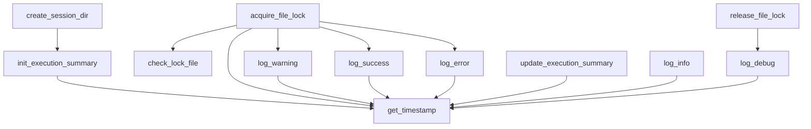

---

## 2.2 content-generator-v7.sh 주요 함수 인터페이스

**모듈 역할**: Orchestration 메인 스크립트, 에이전트 실행 및 검증 담당

**위치**: `scripts/content-generator-v7.sh`

**의존성**: `scripts/lib/common-utils.sh` (source로 로드)

### 2.2.1 재시작 메커니즘 함수

#### auto_determine_restart_point()

**시그니처**:
- 함수명: `auto_determine_restart_point`
- 입력 파라미터:
  - `$1 (file_path)`: 마크다운 파일 경로 (string, required)
- 반환값: 0 (항상 성공)
- 부수 효과:
  - stdout에 재시작 지점 출력

**설명**: 5-step priority 로직에 따라 재시작 지점을 자동으로 결정한다.

**출력 형식** (5가지):
- "IMPROVEMENT:{agent_name}" - Priority 1
- "RESUME:{agent_name}" - Priority 2 또는 5
- "RETRY:{agent_name}" - Priority 3
- "COMPLETE" - Priority 4
- "START:{agent_name}" - 기본값

**상세 로직**: Section 3.1 참조

---

#### determine_next_agent()

**시그니처**:
- 함수명: `determine_next_agent`
- 입력 파라미터:
  - `$1 (file_path)`: 마크다운 파일 경로 (string, required)
- 반환값: 0 (항상 성공)
- 부수 효과:
  - stdout에 다음 에이전트 이름 또는 "COMPLETE" 출력

**설명**: Work Status Markers를 읽어 다음 실행할 에이전트를 결정한다 (v6 호환).

**로직**:
1. IMPROVEMENT_NEEDED 확인 → 첫 번째 target 에이전트 반환
2. CURRENT_AGENT 확인 → 빈 문자열이면 "COMPLETE", 아니면 에이전트 이름 반환

---

### 2.2.2 계약 검증 함수

#### validate_preconditions()

**시그니처**:
- 함수명: `validate_preconditions`
- 입력 파라미터:
  - `$1 (agent_name)`: 에이전트 이름 (string, required)
  - `$2 (file_path)`: 마크다운 파일 경로 (string, required)
- 반환값:
  - 0: 검증 성공
  - 1: 검증 실패
- 부수 효과:
  - 로그 메시지 출력

**설명**: 에이전트 실행 전 Precondition을 검증한다.

**검증 항목** (에이전트별 상이):
- PC-1: CURRENT_AGENT 확인
- PC-2: STATUS 확인
- PC-3: 필수 입력 섹션 존재 확인

**상세 로직**: Section 4.1 참조

---

#### validate_postconditions()

**시그니처**:
- 함수명: `validate_postconditions`
- 입력 파라미터:
  - `$1 (agent_name)`: 에이전트 이름 (string, required)
  - `$2 (file_path)`: 마크다운 파일 경로 (string, required)
- 반환값:
  - 0: 검증 성공
  - 1: 검증 실패
- 부수 효과:
  - 로그 메시지 출력

**설명**: 에이전트 실행 후 Postcondition을 검증한다.

**검증 항목** (에이전트별 상이):
- PO-1: 출력 섹션 존재 확인
- PO-2: HANDOFF LOG [DONE] 기록 확인
- PO-3: CURRENT_AGENT 업데이트 확인

**상세 로직**: Section 4.2 참조

---

### 2.2.3 에이전트 실행 함수

#### execute_claude_agent()

**시그니처**:
- 함수명: `execute_claude_agent`
- 입력 파라미터:
  - `$1 (agent_name)`: 에이전트 이름 (string, required)
  - `$2 (session_id)`: Claude CLI 세션 ID (string, required)
  - `$3 (is_first_section)`: 첫 번째 실행 여부 (string, "true"|"false", required)
  - `$4 (target_file)`: 마크다운 파일 경로 (string, optional)
  - `$5 (topic_name)`: 토픽 이름 (string, optional)
- 반환값:
  - 0: 성공
  - 1: 실패 (Claude CLI exit code 전달)
- 환경 변수:
  - `CLAUDE_PATH`: Claude CLI 실행 파일 경로
  - `TEST_MODE`: 테스트 모드 플래그
  - `DEBUG_MODE`: 디버그 모드 플래그
- 부수 효과:
  - Claude CLI 실행
  - 에이전트별 로그 파일 생성

**설명**: Claude CLI를 래핑하여 에이전트를 실행한다. v6 `claude -p` 패턴을 보존한다.

**로직**:
1. 프롬프트 생성 (generate_agent_prompt 호출)
2. 에이전트별 로그 파일 경로 생성
3. TEST_MODE이면 실행 계획만 출력하고 종료
4. is_first_section="true"이면: `claude -p "{prompt}" --session-id "{session_id}"`
5. is_first_section="false"이면: `claude -p "{prompt}" --resume "{session_id}"`
6. stdout/stderr를 에이전트 로그 파일에 tee로 기록
7. exit code 반환

**중요**: v6 패턴 `claude -p` 실행 방식 보존 필수

---

#### execute_agent_with_validation()

**시그니처**:
- 함수명: `execute_agent_with_validation`
- 입력 파라미터:
  - `$1 (agent_name)`: 에이전트 이름 (string, required)
  - `$2 (file_path)`: 마크다운 파일 경로 (string, required)
  - `$3 (session_id)`: Claude CLI 세션 ID (string, required)
  - `$4 (is_first)`: 첫 번째 실행 여부 (string, "true"|"false", required)
- 반환값:
  - 0: 성공
  - 1: 실패 (Precondition/Postcondition/실행 실패)
- 환경 변수:
  - `SKIP_VALIDATION`: 검증 스킵 플래그
- 부수 효과:
  - Lock 획득/해제
  - 로그 출력
  - execution-summary.json 업데이트

**설명**: Precondition/Postcondition 검증과 함께 에이전트를 실행한다.

**실행 흐름** (7단계):
1. Precondition 검증 (SKIP_VALIDATION=false인 경우)
2. Lock 획득
3. 에이전트 실행 (시작 시간 기록)
4. Lock 해제
5. 실행 결과 확인 (exit code)
6. Postcondition 검증 (SKIP_VALIDATION=false인 경우)
7. 성공 로깅 (log_agent_performance 호출)

**상세 로직**: Section 5.1 참조

---

### 2.2.4 오류 처리 함수

#### handle_agent_failure()

**시그니처**:
- 함수명: `handle_agent_failure`
- 입력 파라미터:
  - `$1 (file_path)`: 마크다운 파일 경로 (string, required)
  - `$2 (agent_name)`: 에이전트 이름 (string, required)
  - `$3 (error_type)`: 오류 타입 (string, required)
  - `$4 (error_message)`: 오류 메시지 (string, required)
  - `$5 (attempt_num)`: 시도 횟수 (int, required)
- 반환값: 0 (항상 성공)
- 부수 효과:
  - HANDOFF LOG 업데이트
  - execution-summary.json 업데이트
  - 복구 제안 메시지 출력

**설명**: 에이전트 실패 시 오류를 기록하고 복구 제안을 출력한다.

**로직**:
1. HANDOFF LOG에 [FAILURE] 엔트리 추가
2. execution-summary.json의 errors 배열에 항목 추가
3. 오류 타입별 복구 제안 메시지 출력

**상세 로직**: Section 6.1 참조

---

## 2.3 모듈 간 의존성

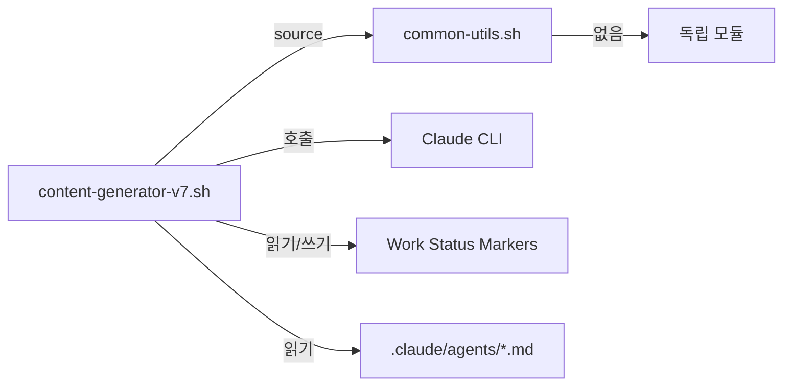

**의존성 설명**:
- content-generator-v7.sh는 common-utils.sh를 source로 로드하여 모든 함수 사용
- common-utils.sh는 독립 모듈로 외부 의존성 없음
- Work Status Markers는 Unit 1에서 정의, 읽기/쓰기만 수행
- Claude CLI는 외부 명령으로 래핑하여 호출

---

# Section 3: 재시작 메커니즘 로직

## 3.1 5-step priority 알고리즘 상세 설명

**목적**: 파일의 Work Status Markers를 분석하여 정확한 재시작 지점을 결정한다.

**입력**: 마크다운 파일 경로

**출력**: 재시작 지점 식별자 (5가지 형식 중 하나)

### 3.1.1 Priority 1: IMPROVEMENT_NEEDED 확인

**조건**: Work Status Markers에 IMPROVEMENT_NEEDED 필드가 존재하고 비어있지 않음

**동작**:
1. `grep "^<!-- IMPROVEMENT_NEEDED:" "$file_path"` 실행
2. IMPROVEMENT_NEEDED 다음 줄들에서 첫 번째 "- {agent}:" 패턴 추출
3. "IMPROVEMENT:{agent}" 형식으로 출력

**예시**:
```
<!-- IMPROVEMENT_NEEDED:
  - concepts-writer: 개념 설명 보완 필요
-->
```
→ 출력: "IMPROVEMENT:concepts-writer"

**우선순위가 가장 높은 이유**: content-validator가 명시적으로 개선 요청한 경우이므로 최우선 처리

---

### 3.1.2 Priority 2: CURRENT_AGENT 확인

**조건**: CURRENT_AGENT 필드가 비어있지 않음

**동작**:
1. `grep "^<!-- CURRENT_AGENT:" "$file_path"` 실행
2. CURRENT_AGENT 값 추출
3. "RESUME:{agent}" 형식으로 출력

**예시**:
```
<!-- CURRENT_AGENT: quiz-writer -->
```
→ 출력: "RESUME:quiz-writer"

**우선순위가 높은 이유**: 현재 작업 중인 에이전트가 있으므로 중단된 지점에서 재개

---

### 3.1.3 Priority 3: HANDOFF LOG 마지막 [FAILURE] 확인

**조건**: HANDOFF LOG에 [FAILURE] 엔트리가 존재

**동작**:
1. `grep -A 20 "^<!-- HANDOFF LOG:" "$file_path"` 실행
2. `grep "^\[FAILURE\]"` 필터링
3. `tail -1`로 마지막 [FAILURE] 엔트리 추출
4. 에이전트 이름 추출 (정규식: `\[FAILURE\] ([a-z-]+) \|`)
5. "RETRY:{agent}" 형식으로 출력

**예시**:
```
<!-- HANDOFF LOG:
[DONE] overview-writer | 2025-01-18T10:00:00+09:00
[FAILURE] concepts-writer | EXECUTION_FAILED (attempt 1) | 2025-01-18T10:05:00+09:00
-->
```
→ 출력: "RETRY:concepts-writer"

**우선순위가 높은 이유**: 실패한 에이전트를 재시도해야 함

---

### 3.1.4 Priority 4: [COMPLETE] 확인

**조건**: 파일 내 어디든 [COMPLETE] 마커 존재

**동작**:
1. `grep "\[COMPLETE\]" "$file_path"` 실행
2. 존재하면 "COMPLETE" 출력

**예시**:
```
<!-- HANDOFF LOG:
...
[COMPLETE] content-validator | All sections validated | 2025-01-18T12:00:00+09:00
-->
```
→ 출력: "COMPLETE"

**처리 방식**: --force 옵션 없으면 종료, 있으면 무시하고 재시작

---

### 3.1.5 Priority 5: 마지막 [DONE] 또는 [IMPROVE] 다음 에이전트

**조건**: HANDOFF LOG에 [DONE] 또는 [IMPROVE] 엔트리가 존재

**동작**:
1. `grep -E "^\[(DONE|IMPROVE)\]"` 실행
2. `tail -1`로 마지막 엔트리 추출
3. 에이전트 이름 추출
4. get_next_agent()로 다음 에이전트 결정
5. 다음 에이전트가 "COMPLETE"이면 "COMPLETE" 출력
6. 아니면 "RESUME:{next_agent}" 출력

**에이전트 순서**:
content-initiator → overview-writer → concepts-writer → visualization-writer → practice-writer → quiz-writer → content-validator → COMPLETE

**예시**:
```
<!-- HANDOFF LOG:
[DONE] overview-writer | 2025-01-18T10:00:00+09:00
[DONE] concepts-writer | 2025-01-18T10:30:00+09:00
-->
```
→ get_next_agent("concepts-writer") = "visualization-writer"
→ 출력: "RESUME:visualization-writer"

---

### 3.1.6 기본값: START

**조건**: 위 4가지 조건 모두 불만족 (새 파일 또는 빈 파일)

**동작**: "START:content-initiator" 출력

---

## 3.2 각 우선순위별 의사결정 로직 플로우차트

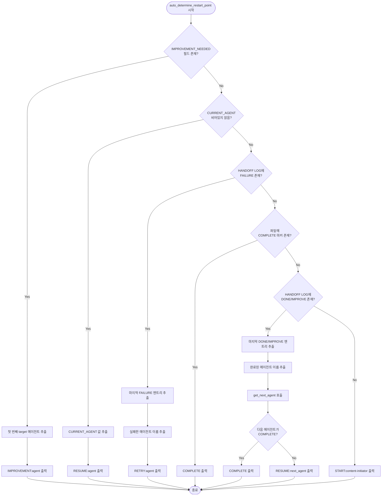

---

## 3.3 상태 전이 조건

**재시작 지점에서 파이프라인 상태로의 전이**:

| 재시작 지점 출력 | 파이프라인 상태 | 다음 동작 | Claude 세션 |
|---------------|--------------|----------|------------|
| IMPROVEMENT:{agent} | IN_PROGRESS | {agent} 실행 (개선 모드) | 새 세션 (is_first=true) |
| RESUME:{agent} | IN_PROGRESS | {agent} 실행 (계속 모드) | 새 세션 (is_first=true) |
| RETRY:{agent} | IN_PROGRESS | {agent} 실행 (재시도 모드) | 새 세션 (is_first=true) |
| COMPLETE | COMPLETED | 종료 (--force 없으면) 또는 무시 | N/A |
| START:{agent} | PENDING | {agent} 실행 (신규 시작) | 새 세션 (is_first=true) |

**중요**: RESUME은 "파일 Work Status Markers 재사용"을 의미하며, Claude CLI 세션 재사용을 의미하지 않습니다. 모든 restart type은 새로운 세션 ID를 생성하고 `is_first=true`로 시작합니다.

**상태 전이 다이어그램**:

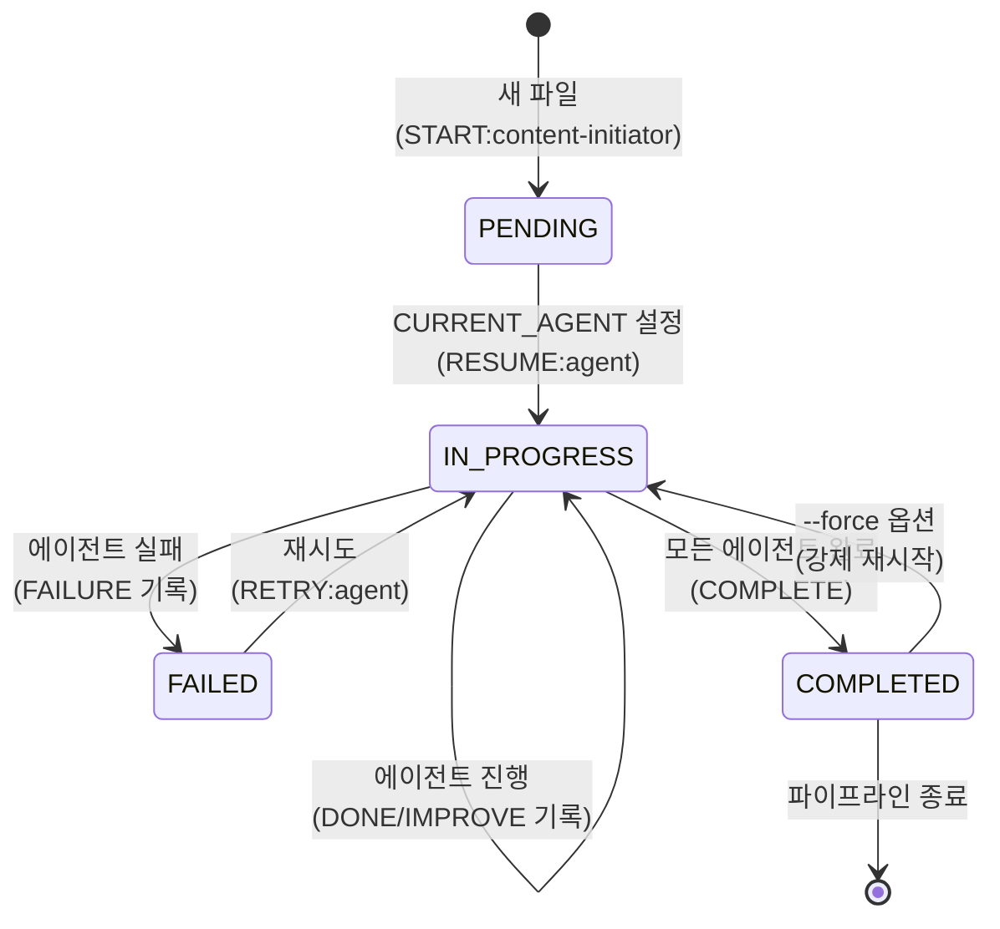

---

## 3.4 Edge case 처리

### Edge Case 1: 동시 조건 만족 (IMPROVEMENT_NEEDED + CURRENT_AGENT)

**상황**: content-validator가 IMPROVEMENT_NEEDED를 설정했지만 CURRENT_AGENT도 설정되어 있음

**처리**: Priority 1이 우선이므로 IMPROVEMENT_NEEDED의 target 에이전트 사용

**근거**: content-validator의 명시적 요청이 현재 작업보다 우선

---

### Edge Case 2: FAILURE 후 DONE 기록 존재

**상황**:
```
[FAILURE] concepts-writer | ... | 10:00
[DONE] concepts-writer | ... | 10:30
```

**처리**: Priority 5 적용, concepts-writer 다음 에이전트인 visualization-writer로 진행

**근거**: [DONE]이 [FAILURE]보다 나중이므로 재시도 성공으로 판단

---

### Edge Case 3: COMPLETE 후 --resume 사용

**상황**: [COMPLETE] 마커 존재, 사용자가 --resume 옵션 사용

**처리**:
- --force 옵션 없음: "COMPLETE" 출력 후 종료
- --force 옵션 있음: Priority 4 무시, Priority 5로 진행

**근거**: --force는 COMPLETE 상태를 무시하고 강제 재시작하는 옵션

---

### Edge Case 4: CURRENT_AGENT만 있고 HANDOFF LOG 없음

**상황**: CURRENT_AGENT="overview-writer", HANDOFF LOG 비어있음

**처리**: Priority 2 적용, "RESUME:overview-writer" 출력

**근거**: HANDOFF LOG는 선택적 정보, CURRENT_AGENT가 진실의 원천

---

### Edge Case 5: 빈 파일 (Work Status Markers 없음)

**상황**: 마크다운 파일이 존재하지만 Work Status Markers가 없음

**처리**: 모든 Priority 조건 불만족, "START:content-initiator" 출력

**근거**: content-initiator가 Work Status Markers를 생성해야 함

---

# Section 4: 계약 검증 로직

## 4.1 Precondition 검증 절차

**목적**: 에이전트 실행 전 필요 조건이 충족되었는지 확인한다.

**일반 Precondition** (모든 에이전트 공통):
- PC-1: CURRENT_AGENT 필드가 현재 에이전트 이름과 일치
- PC-2: STATUS 필드가 "IN_PROGRESS"

**에이전트별 Precondition** (PC-3):

### 4.1.1 content-initiator

| 검증 항목 | 설명 | 검증 방법 |
|---------|------|----------|
| PC-3-1: Frontmatter 존재 | YAML frontmatter가 파일 상단에 존재 | `head -n 10 "$file" \| grep "^---"` |

**실패 시 메시지**: "PC-3 failed: Frontmatter not found"

---

### 4.1.2 overview-writer

| 검증 항목 | 설명 | 검증 방법 |
|---------|------|----------|
| PC-3-1: Work Status Markers 존재 | Work Status Markers가 파일에 존재 | `grep "^<!-- WORK STATUS MARKERS -->"` |

**실패 시 메시지**: "PC-3 failed: Work Status Markers not found"

---

### 4.1.3 concepts-writer

| 검증 항목 | 설명 | 검증 방법 |
|---------|------|----------|
| PC-3-1: Overview 섹션 존재 | "# Overview" 섹션이 파일에 존재 | `grep "^# Overview" "$file"` |

**실패 시 메시지**: "PC-3 failed: Overview section not found"

---

### 4.1.4 visualization-writer

| 검증 항목 | 설명 | 검증 방법 |
|---------|------|----------|
| PC-3-1: Core Concepts 섹션 존재 | "# Core Concepts" 섹션이 파일에 존재 | `grep "^# Core Concepts" "$file"` |

**실패 시 메시지**: "PC-3 failed: Core Concepts section not found"

---

### 4.1.5 practice-writer

| 검증 항목 | 설명 | 검증 방법 |
|---------|------|----------|
| PC-3-1: Core Concepts 섹션 존재 | "# Core Concepts" 섹션이 파일에 존재 | `grep "^# Core Concepts" "$file"` |

**실패 시 메시지**: "PC-3 failed: Core Concepts section not found"

---

### 4.1.6 quiz-writer

| 검증 항목 | 설명 | 검증 방법 |
|---------|------|----------|
| PC-3-1: Code Patterns 또는 Experiments 섹션 존재 | 둘 중 하나 이상 존재 | `grep "^# Code Patterns" \|\| grep "^# Experiments"` |

**실패 시 메시지**: "PC-3 failed: Code Patterns or Experiments section not found"

---

### 4.1.7 content-validator

| 검증 항목 | 설명 | 검증 방법 |
|---------|------|----------|
| PC-3-1: Quiz 섹션 존재 | "# Quiz" 섹션이 파일에 존재 | `grep "^# Quiz" "$file"` |

**실패 시 메시지**: "PC-3 failed: Quiz section not found"

---

### 4.1.8 Precondition 검증 플로우차트

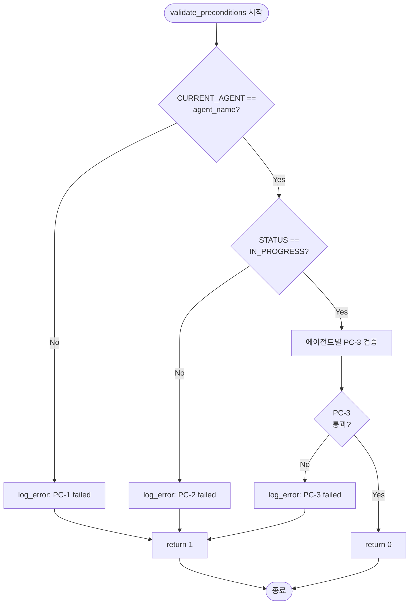

---

### 4.1.9 검증 실패 시 처리 흐름

**처리 단계**:
1. log_error()로 실패 사유 출력
2. handle_agent_failure() 호출
   - error_type="PRECONDITION_FAILED"
   - error_message="PC-X failed: {reason}"
3. HANDOFF LOG에 [FAILURE] 기록
4. execution-summary.json에 오류 추가
5. 복구 제안 메시지 출력
6. 에이전트 실행 중단 (return 1)

**복구 제안 메시지**:
```
💡 Suggestion: Check Work Status Markers (CURRENT_AGENT field)
   Run: grep -A 5 'WORK STATUS MARKERS' "{file_path}"
```

---

## 4.2 Postcondition 검증 절차

**목적**: 에이전트 실행 후 올바른 결과가 생성되었는지 확인한다.

**일반 Postcondition** (모든 에이전트 공통):
- PO-2: HANDOFF LOG에 [DONE] 엔트리 기록
- PO-3: CURRENT_AGENT가 다음 에이전트로 업데이트 (또는 비어있음)

**에이전트별 Postcondition** (PO-1):

### 4.2.1 content-initiator

| 검증 항목 | 설명 | 검증 방법 |
|---------|------|----------|
| PO-1-1: Work Status Markers 생성 | Work Status Markers가 파일에 존재 | `grep "^<!-- WORK STATUS MARKERS -->"` |

**실패 시 메시지**: "PO-1 failed: Work Status Markers not created"

---

### 4.2.2 overview-writer

| 검증 항목 | 설명 | 검증 방법 |
|---------|------|----------|
| PO-1-1: Overview 섹션 생성 | "# Overview" 섹션이 파일에 존재 | `grep "^# Overview" "$file"` |

**실패 시 메시지**: "PO-1 failed: Overview section not created"

---

### 4.2.3 concepts-writer

| 검증 항목 | 설명 | 검증 방법 |
|---------|------|----------|
| PO-1-1: Core Concepts 섹션 생성 | "# Core Concepts" 섹션이 파일에 존재 | `grep "^# Core Concepts" "$file"` |

**실패 시 메시지**: "PO-1 failed: Core Concepts section not created"

---

### 4.2.4 visualization-writer

| 검증 항목 | 설명 | 검증 방법 |
|---------|------|----------|
| PO-1-1: Visualization 컴포넌트 언급 (선택적) | "Visualization" 단어가 파일에 존재 | `grep "Visualization" "$file"` |

**주의**: 이 검증은 경고만 출력하고 실패로 처리하지 않음 (visualization은 선택적)

**경고 메시지**: "PO-1 warning: No visualization components found (optional)"

---

### 4.2.5 practice-writer

| 검증 항목 | 설명 | 검증 방법 |
|---------|------|----------|
| PO-1-1: Code Patterns 또는 Experiments 섹션 생성 | 둘 중 하나 이상 존재 | `grep "^# Code Patterns" \|\| grep "^# Experiments"` |

**실패 시 메시지**: "PO-1 failed: Code Patterns or Experiments section not created"

---

### 4.2.6 quiz-writer

| 검증 항목 | 설명 | 검증 방법 |
|---------|------|----------|
| PO-1-1: Quiz 섹션 생성 | "# Quiz" 섹션이 파일에 존재 | `grep "^# Quiz" "$file"` |

**실패 시 메시지**: "PO-1 failed: Quiz section not created"

---

### 4.2.7 content-validator

| 검증 항목 | 설명 | 검증 방법 |
|---------|------|----------|
| PO-1-1: VALIDATION_SCORE 필드 설정 | VALIDATION_SCORE 필드가 Work Status Markers에 존재 | `grep "^<!-- VALIDATION_SCORE:" "$file"` |

**실패 시 메시지**: "PO-1 failed: VALIDATION_SCORE not set"

---

### 4.2.8 Postcondition 검증 플로우차트

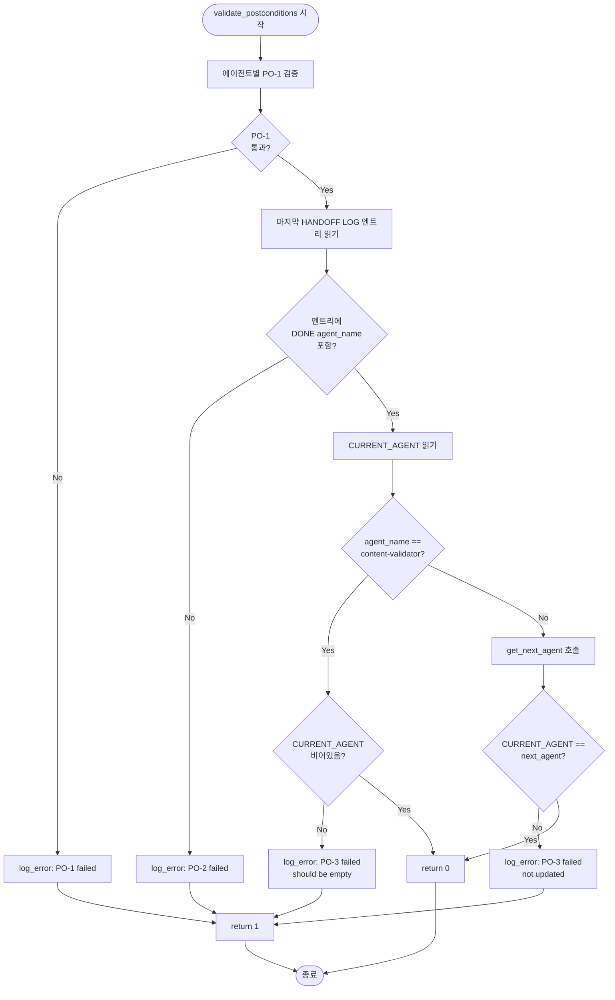

---

### 4.2.9 검증 실패 시 처리 흐름

**처리 단계**:
1. log_error()로 실패 사유 출력
2. handle_agent_failure() 호출
   - error_type="POSTCONDITION_FAILED"
   - error_message="PO-X failed: {reason}"
3. HANDOFF LOG에 [FAILURE] 기록
4. execution-summary.json에 오류 추가
5. 복구 제안 메시지 출력
6. 파이프라인 중단 (return 1)

**복구 제안 메시지**:
```
💡 Suggestion: Check if agent created output sections
   Run: grep '^#' "{file_path}" | head -10
```

---

## 4.3 검증 우회 조건

### 4.3.1 --skip-validation 옵션

**효과**: Precondition과 Postcondition 검증을 모두 스킵

**사용 시나리오**:
- 빠른 테스트 실행
- 검증 로직에 버그가 있어 임시 우회 필요
- 개발 중 반복 실행

**주의사항**: 검증 없이 실행하면 파이프라인 무결성 보장 불가

---

### 4.3.2 --from=AGENT 옵션

**효과**:
- 지정된 에이전트부터 실행
- 해당 에이전트의 Precondition 검증 스킵 (CURRENT_AGENT 불일치 허용)
- 이후 에이전트는 정상 검증

**사용 시나리오**:
- 특정 에이전트만 재실행
- 디버깅 목적

**구현 방식**:
1. `--from=quiz-writer` 옵션 파싱
2. CURRENT_AGENT를 강제로 "quiz-writer"로 설정 (또는 PC-1 검증 스킵)
3. quiz-writer부터 파이프라인 실행

**주의사항**: 이전 에이전트 출력이 없으면 Precondition 실패 가능

---

### 4.3.3 검증 우회 로직 플로우차트

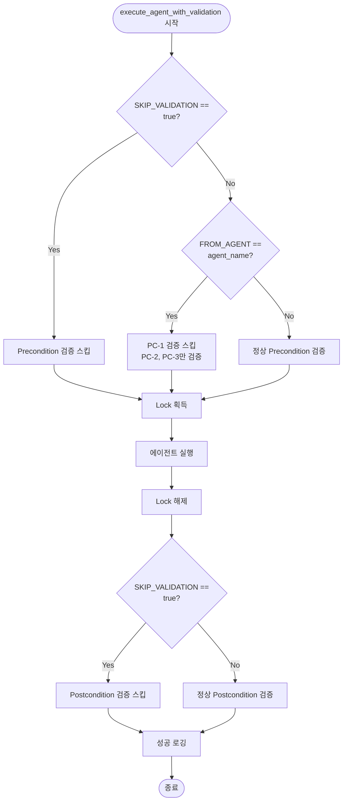

---

# Section 5: 에이전트 실행 흐름

## 5.1 정상 실행 흐름 (7단계)

**목적**: 단일 에이전트의 실행 흐름을 표준화하여 일관된 검증과 로깅을 보장한다.

**함수**: `execute_agent_with_validation(agent_name, file_path, session_id, is_first)`

### 5.1.1 7단계 실행 프로세스

#### Step 1: Precondition 검증

**조건**: `SKIP_VALIDATION=false` 또는 `FROM_AGENT != agent_name`

**동작**:
1. `validate_preconditions(agent_name, file_path)` 호출
2. 반환값이 1이면 즉시 중단, `handle_agent_failure()` 호출
3. 반환값이 0이면 다음 단계로 진행

**실패 시**:
- error_type="PRECONDITION_FAILED"
- 파이프라인 중단
- 복구 제안 메시지 출력

---

#### Step 2: Lock 획득

**동작**:
1. `acquire_file_lock(file_path, agent_name)` 호출
2. 반환값을 lock_file 변수에 저장
3. 반환값이 1이면 즉시 중단, `handle_agent_failure()` 호출
4. 반환값이 0이면 다음 단계로 진행

**실패 시**:
- error_type="LOCK_CONFLICT"
- 파이프라인 중단
- 다른 프로세스 작업 중 메시지 출력

**Trap 설정**:
```
trap "release_file_lock '$lock_file'" EXIT
```
→ 스크립트 종료 시 자동으로 lock 해제 보장

---

#### Step 3: 에이전트 실행 (시작 시간 기록)

**동작**:
1. 시작 시간 기록: `start_time=$(date +%s)`
2. `execute_claude_agent(agent_name, session_id, is_first, file_path)` 호출
3. 종료 코드 저장: `exit_code=$?`
4. 종료 시간 기록: `end_time=$(date +%s)`
5. 소요 시간 계산: `duration=$((end_time - start_time))`

**로깅**:
- 에이전트별 로그 파일: `logs/sessions/{session_id}/{agent_name}.log`
- 전체 실행 로그: `logs/content-generator-v7.log`

---

#### Step 4: Lock 해제

**동작**:
1. `release_file_lock(lock_file)` 호출
2. Trap 제거: `trap - EXIT`

**주의사항**: EXIT trap이 설정되어 있으므로, 명시적 해제 실패 시에도 스크립트 종료 시 자동 해제됨

---

#### Step 5: 실행 결과 확인

**조건**: exit_code 값에 따라 분기

**동작**:
1. exit_code가 0이 아니면 `handle_agent_failure()` 호출
   - error_type="EXECUTION_FAILED"
   - error_message="Claude CLI returned {exit_code}"
   - 파이프라인 중단 (return 1)
2. exit_code가 0이면 다음 단계로 진행

---

#### Step 6: Postcondition 검증

**조건**: `SKIP_VALIDATION=false`

**동작**:
1. `validate_postconditions(agent_name, file_path)` 호출
2. 반환값이 1이면 `handle_agent_failure()` 호출
   - error_type="POSTCONDITION_FAILED"
   - 파이프라인 중단 (return 1)
3. 반환값이 0이면 다음 단계로 진행

**실패 시**:
- 에이전트가 Work Status Markers를 올바르게 업데이트하지 않은 경우
- 출력 섹션이 생성되지 않은 경우

---

#### Step 7: 성공 로깅

**동작**:
1. `update_execution_summary(session_id, agent_name, exit_code, duration)` 호출
2. `log_success("Agent {agent_name} completed in {duration}s")` 호출
3. 파이프라인 계속 진행 (return 0)

**execution-summary.json 업데이트**:
```
{
  "name": "{agent_name}",
  "completed_at": "{timestamp}",
  "status": "SUCCESS",
  "exit_code": 0,
  "duration": {duration}
}
```

---

## 5.2 실행 흐름 다이어그램 (Mermaid)

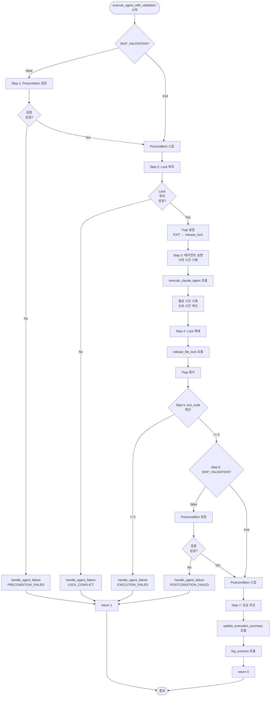

---

## 5.3 각 단계별 오류 처리 분기

### 5.3.1 Step 1 오류: Precondition 실패

**오류 타입**: PRECONDITION_FAILED

**원인** (3가지):
1. PC-1 실패: CURRENT_AGENT 불일치
2. PC-2 실패: STATUS가 IN_PROGRESS 아님
3. PC-3 실패: 필수 입력 섹션 없음 (에이전트별 상이)

**처리**:
1. `handle_agent_failure()` 호출
2. HANDOFF LOG에 [FAILURE] 기록
3. execution-summary.json에 오류 추가
4. 복구 제안 메시지 출력
5. 파이프라인 중단 (return 1)

**복구 제안 메시지**:
```
💡 Suggestion: Check Work Status Markers
   - PC-1 failed: CURRENT_AGENT should be "{agent_name}"
     Run: grep -A 5 'CURRENT_AGENT' "{file_path}"
   - PC-2 failed: STATUS should be "IN_PROGRESS"
     Run: grep -A 5 'STATUS' "{file_path}"
   - PC-3 failed: Required input sections missing
     Run: grep '^#' "{file_path}" | head -10
```

**재실행 방법**:
- 수동 수정 후 `--resume` 사용
- 또는 `--from={agent_name}` 사용 (PC-1 검증 스킵)

---

### 5.3.2 Step 2 오류: Lock 획득 실패

**오류 타입**: LOCK_CONFLICT

**원인** (2가지):
1. 다른 프로세스가 동일 파일 작업 중
2. Stale lock 제거 실패 (권한 문제)

**처리**:
1. `handle_agent_failure()` 호출
2. HANDOFF LOG에 [FAILURE] 기록
3. execution-summary.json에 오류 추가
4. 복구 제안 메시지 출력
5. 파이프라인 중단 (return 1)

**복구 제안 메시지**:
```
💡 Suggestion: Another process is working on this file
   1. Check running processes:
      ps aux | grep content-generator-v
   2. Check lock file:
      cat "{lock_file}"
   3. If stale lock, remove manually:
      rm -f "{lock_file}"
   4. Or use --force to override lock
```

**재실행 방법**:
- 다른 프로세스 종료 대기
- 또는 `--force` 옵션 사용 (강제 lock 제거)

---

### 5.3.3 Step 3 오류: 에이전트 실행 실패

**오류 타입**: EXECUTION_FAILED

**원인** (4가지):
1. Claude CLI 오류 (exit code != 0)
2. 프롬프트 파일 없음 (`.claude/agents/{agent_name}.md`)
3. 세션 ID 불일치
4. Claude CLI 타임아웃

**처리**:
1. `handle_agent_failure()` 호출
2. HANDOFF LOG에 [FAILURE] 기록
3. execution-summary.json에 오류 추가 (exit_code 포함)
4. 복구 제안 메시지 출력
5. 파이프라인 중단 (return 1)

**복구 제안 메시지**:
```
💡 Suggestion: Claude CLI returned exit code {exit_code}
   1. Check agent prompt file:
      ls .claude/agents/{agent_name}.md
   2. Check agent log:
      tail -n 50 logs/sessions/{session_id}/{agent_name}.log
   3. Re-run with --debug for more details
```

**재실행 방법**:
- `--resume` 사용 (동일 세션 ID로 재시도)
- 또는 `--restart` 사용 (새 세션 ID로 재시작)

---

### 5.3.4 Step 6 오류: Postcondition 실패

**오류 타입**: POSTCONDITION_FAILED

**원인** (3가지):
1. PO-1 실패: 출력 섹션 생성 안 됨
2. PO-2 실패: HANDOFF LOG [DONE] 기록 없음
3. PO-3 실패: CURRENT_AGENT 업데이트 안 됨

**처리**:
1. `handle_agent_failure()` 호출
2. HANDOFF LOG에 [FAILURE] 기록
3. execution-summary.json에 오류 추가
4. 복구 제안 메시지 출력
5. 파이프라인 중단 (return 1)

**복구 제안 메시지**:
```
💡 Suggestion: Agent did not update Work Status Markers correctly
   - PO-1 failed: Output section not created
     Run: grep '^#' "{file_path}" | tail -5
   - PO-2 failed: HANDOFF LOG missing [DONE] entry
     Run: grep -A 20 'HANDOFF LOG' "{file_path}" | tail -5
   - PO-3 failed: CURRENT_AGENT not updated
     Run: grep 'CURRENT_AGENT' "{file_path}"

   Solution: Check .claude/agents/{agent_name}.md prompt
```

**재실행 방법**:
- 프롬프트 수정 후 `--from={agent_name}` 사용
- 또는 `--skip-validation` 사용 (검증 스킵, 임시 우회)

---

### 5.3.5 오류 처리 요약 테이블

| 단계 | 오류 타입 | 복구 옵션 | 우선순위 |
|-----|---------|---------|---------|
| Step 1 | PRECONDITION_FAILED | `--from={agent}`, 수동 수정 후 `--resume` | 높음 (파이프라인 무결성) |
| Step 2 | LOCK_CONFLICT | 대기, `--force` | 중간 (일시적) |
| Step 3 | EXECUTION_FAILED | `--resume`, `--restart`, 프롬프트 수정 | 높음 (에이전트 버그) |
| Step 6 | POSTCONDITION_FAILED | `--from={agent}`, 프롬프트 수정 | 높음 (에이전트 버그) |

---

### 5.3.6 오류 처리 플로우 (통합)

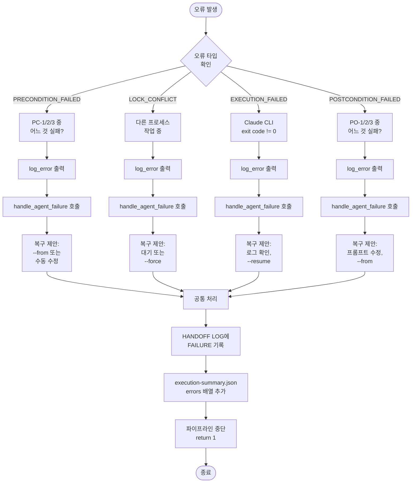

---

# Section 6: 오류 처리 로직

## 6.1 6가지 오류 타입별 처리 절차

**목적**: 에이전트 실행 중 발생 가능한 오류를 분류하고, 각 오류 타입별로 일관된 처리 절차를 제공한다.

**함수**: `handle_agent_failure(file_path, agent_name, error_type, error_message, attempt_num)`

### 6.1.1 PRECONDITION_FAILED

**발생 시점**: Step 1 - Precondition 검증 단계

**원인**:
- PC-1 실패: CURRENT_AGENT 필드가 agent_name과 불일치
- PC-2 실패: STATUS 필드가 "IN_PROGRESS"가 아님
- PC-3 실패: 에이전트별 필수 입력 섹션이 존재하지 않음

**처리 절차**:
1. **로깅**:
   - `log_error("Precondition validation failed for {agent_name}")`
   - `log_error("Reason: {error_message}")`

2. **HANDOFF LOG 업데이트**:
   ```
   [FAILURE] {agent_name} | PRECONDITION_FAILED (attempt {attempt_num}) | {timestamp}
   Reason: {error_message}
   ```

3. **execution-summary.json 업데이트**:
   - errors 배열에 항목 추가:
   ```
   {
     "agent": "{agent_name}",
     "error_type": "PRECONDITION_FAILED",
     "error_message": "{error_message}",
     "timestamp": "{timestamp}",
     "attempt": {attempt_num},
     "recovery_suggestion": "Check Work Status Markers (CURRENT_AGENT, STATUS fields)"
   }
   ```

4. **복구 제안 출력**:
   ```
   💡 Suggestion: Check Work Status Markers
      - PC-1 failed: CURRENT_AGENT should be "{agent_name}"
        Run: grep -A 5 'CURRENT_AGENT' "{file_path}"
      - PC-2 failed: STATUS should be "IN_PROGRESS"
        Run: grep -A 5 'STATUS' "{file_path}"
      - PC-3 failed: Required input sections missing
        Run: grep '^#' "{file_path}" | head -10

   Recovery options:
     1. Fix Work Status Markers manually
     2. Use --from={agent_name} to skip PC-1 validation
     3. Use --skip-validation to skip all validation (not recommended)
   ```

5. **파이프라인 중단**: return 1

---

### 6.1.2 POSTCONDITION_FAILED

**발생 시점**: Step 6 - Postcondition 검증 단계

**원인**:
- PO-1 실패: 에이전트가 출력 섹션을 생성하지 않음
- PO-2 실패: HANDOFF LOG에 [DONE] 엔트리가 없음
- PO-3 실패: CURRENT_AGENT가 다음 에이전트로 업데이트되지 않음

**처리 절차**:
1. **로깅**:
   - `log_error("Postcondition validation failed for {agent_name}")`
   - `log_error("Reason: {error_message}")`

2. **HANDOFF LOG 업데이트**:
   ```
   [FAILURE] {agent_name} | POSTCONDITION_FAILED (attempt {attempt_num}) | {timestamp}
   Reason: {error_message}
   ```

3. **execution-summary.json 업데이트**:
   - errors 배열에 항목 추가:
   ```
   {
     "agent": "{agent_name}",
     "error_type": "POSTCONDITION_FAILED",
     "error_message": "{error_message}",
     "timestamp": "{timestamp}",
     "attempt": {attempt_num},
     "recovery_suggestion": "Check if agent created output sections and updated Work Status Markers"
   }
   ```

4. **복구 제안 출력**:
   ```
   💡 Suggestion: Agent did not update Work Status Markers correctly
      - PO-1 failed: Output section not created
        Run: grep '^#' "{file_path}" | tail -5
      - PO-2 failed: HANDOFF LOG missing [DONE] entry
        Run: grep -A 20 'HANDOFF LOG' "{file_path}" | tail -5
      - PO-3 failed: CURRENT_AGENT not updated
        Run: grep 'CURRENT_AGENT' "{file_path}"

   Recovery options:
     1. Check agent prompt: .claude/agents/{agent_name}.md
     2. Re-run with --from={agent_name} after fixing prompt
     3. Use --skip-validation temporarily (not recommended)
   ```

5. **파이프라인 중단**: return 1

---

### 6.1.3 EXECUTION_FAILED

**발생 시점**: Step 5 - 실행 결과 확인 단계

**원인**:
- Claude CLI가 0이 아닌 exit code 반환
- 프롬프트 파일 (.claude/agents/{agent_name}.md) 없음
- 세션 ID 불일치
- Claude CLI 내부 오류

**처리 절차**:
1. **로깅**:
   - `log_error("Agent execution failed: {agent_name}")`
   - `log_error("Exit code: {exit_code}")`
   - `log_error("Message: {error_message}")`

2. **HANDOFF LOG 업데이트**:
   ```
   [FAILURE] {agent_name} | EXECUTION_FAILED (exit code {exit_code}, attempt {attempt_num}) | {timestamp}
   ```

3. **execution-summary.json 업데이트**:
   - errors 배열에 항목 추가:
   ```
   {
     "agent": "{agent_name}",
     "error_type": "EXECUTION_FAILED",
     "error_message": "Claude CLI returned exit code {exit_code}",
     "exit_code": {exit_code},
     "timestamp": "{timestamp}",
     "attempt": {attempt_num},
     "recovery_suggestion": "Check agent log and prompt file"
   }
   ```

4. **복구 제안 출력**:
   ```
   💡 Suggestion: Claude CLI returned exit code {exit_code}
      1. Check agent prompt file:
         ls .claude/agents/{agent_name}.md
      2. Check agent log:
         tail -n 50 logs/sessions/{session_id}/{agent_name}.log
      3. Check Claude CLI version:
         {CLAUDE_PATH} --version

   Recovery options:
     1. Use --resume to retry with same session
     2. Use --restart to start with new session
     3. Use --debug for more detailed logs
   ```

5. **파이프라인 중단**: return 1

---

### 6.1.4 PARSING_ERROR

**발생 시점**: Work Status Markers 파싱 중

**원인**:
- 파일 인코딩이 UTF-8이 아님
- Work Status Markers 형식이 잘못됨
- 파일이 손상됨

**처리 절차**:
1. **로깅**:
   - `log_error("Failed to parse Work Status Markers")`
   - `log_error("File: {file_path}")`
   - `log_error("Reason: {error_message}")`

2. **HANDOFF LOG 업데이트**:
   - Work Status Markers 자체가 손상되었으므로 업데이트 불가
   - 별도 오류 로그 파일에 기록: `logs/content-generator-v7-errors.log`

3. **execution-summary.json 업데이트**:
   - errors 배열에 항목 추가:
   ```
   {
     "agent": "N/A",
     "error_type": "PARSING_ERROR",
     "error_message": "{error_message}",
     "file_path": "{file_path}",
     "timestamp": "{timestamp}",
     "recovery_suggestion": "Check file encoding (must be UTF-8)"
   }
   ```

4. **복구 제안 출력**:
   ```
   💡 Suggestion: Failed to parse Work Status Markers
      1. Check file encoding:
         file -I "{file_path}"
      2. Convert to UTF-8 if needed:
         iconv -f <encoding> -t UTF-8 "{file_path}" > temp && mv temp "{file_path}"
      3. Verify Work Status Markers format:
         grep -A 30 'WORK STATUS MARKERS' "{file_path}"

   Recovery options:
     1. Fix file encoding to UTF-8
     2. Restore from backup if available
     3. Re-initialize with content-initiator
   ```

5. **파이프라인 중단**: return 1

---

### 6.1.5 LOCK_CONFLICT

**발생 시점**: Step 2 - Lock 획득 단계

**원인**:
- 다른 프로세스가 동일 파일에 대해 작업 중
- Stale lock 제거 실패 (권한 문제)
- Lock 디렉터리 생성 실패

**처리 절차**:
1. **로깅**:
   - `log_warning("Lock conflict detected")`
   - `log_warning("Lock file: {lock_file}")`
   - `log_warning("Waiting for lock release... (timeout: 300s)")`

2. **대기 루프** (최대 300초):
   - 5초마다 lock 파일 확인
   - Stale lock이면 자동 제거 후 진행
   - 유효한 lock이면 계속 대기
   - TEST_MODE=true이면 즉시 실패

3. **타임아웃 시 처리**:
   - `log_error("Lock acquisition timeout after 300s")`
   - HANDOFF LOG 업데이트:
   ```
   [FAILURE] {agent_name} | LOCK_CONFLICT (timeout 300s, attempt {attempt_num}) | {timestamp}
   ```

4. **execution-summary.json 업데이트**:
   ```
   {
     "agent": "{agent_name}",
     "error_type": "LOCK_CONFLICT",
     "error_message": "Another process is working on this file",
     "lock_file": "{lock_file}",
     "timestamp": "{timestamp}",
     "attempt": {attempt_num},
     "recovery_suggestion": "Wait for other process or use --force to override"
   }
   ```

5. **복구 제안 출력**:
   ```
   💡 Suggestion: Another process is working on this file
      1. Check running processes:
         ps aux | grep content-generator-v
      2. Check lock file:
         cat "{lock_file}"
      3. If stale lock, remove manually:
         rm -f "{lock_file}"

   Recovery options:
     1. Wait for other process to complete
     2. Use --force to override lock (dangerous)
     3. Kill other process if stale (use PID from lock file)
   ```

6. **파이프라인 중단**: return 1

---

### 6.1.6 TIMEOUT

**발생 시점**: 에이전트 실행 시간이 제한을 초과한 경우

**원인**:
- 에이전트가 무한 루프에 빠짐
- Claude CLI가 응답하지 않음
- 네트워크 문제로 API 호출 지연

**처리 절차**:
1. **로깅**:
   - `log_error("Agent execution timeout")`
   - `log_error("Agent: {agent_name}")`
   - `log_error("Timeout limit: {timeout_seconds}s")`

2. **프로세스 종료**:
   - Claude CLI 프로세스 강제 종료: `kill -9 $claude_pid`
   - Lock 해제

3. **HANDOFF LOG 업데이트**:
   ```
   [FAILURE] {agent_name} | TIMEOUT ({timeout_seconds}s exceeded, attempt {attempt_num}) | {timestamp}
   ```

4. **execution-summary.json 업데이트**:
   ```
   {
     "agent": "{agent_name}",
     "error_type": "TIMEOUT",
     "error_message": "Agent execution exceeded {timeout_seconds}s",
     "timeout_seconds": {timeout_seconds},
     "timestamp": "{timestamp}",
     "attempt": {attempt_num},
     "recovery_suggestion": "Increase timeout or check agent prompt for infinite loops"
   }
   ```

5. **복구 제안 출력**:
   ```
   💡 Suggestion: Agent execution timed out after {timeout_seconds}s
      1. Check agent log for infinite loops:
         tail -n 100 logs/sessions/{session_id}/{agent_name}.log
      2. Check agent prompt for logic errors:
         cat .claude/agents/{agent_name}.md
      3. Increase timeout if needed:
         export AGENT_TIMEOUT={new_timeout}

   Recovery options:
     1. Fix agent prompt logic
     2. Increase timeout value
     3. Use --resume to retry
   ```

6. **파이프라인 중단**: return 1

**참고**: v7에서는 타임아웃 기능이 선택적 (환경 변수 `AGENT_TIMEOUT` 설정 시에만 활성화)

---

## 6.2 오류 복구 제안 생성 로직

**목적**: 각 오류 타입에 맞는 구체적이고 실행 가능한 복구 제안을 생성한다.

### 6.2.1 복구 제안 템플릿 구조

**3단계 구조**:
1. **문제 진단 명령어**: 오류 원인을 확인할 수 있는 bash 명령어
2. **상세 설명**: 각 진단 명령어가 무엇을 확인하는지 설명
3. **복구 옵션**: 우선순위 순으로 정렬된 복구 방법

**템플릿 형식**:
```
💡 Suggestion: {error_summary}
   {diagnosis_commands}

Recovery options:
  1. {primary_recovery_method}
  2. {alternative_method}
  3. {last_resort_method}
```

---

### 6.2.2 오류 타입별 복구 우선순위

| 오류 타입 | 1순위 복구 방법 | 2순위 복구 방법 | 3순위 복구 방법 |
|---------|--------------|--------------|--------------|
| PRECONDITION_FAILED | 수동 수정 | --from={agent} | --skip-validation |
| POSTCONDITION_FAILED | 프롬프트 수정 | --from={agent} | --skip-validation |
| EXECUTION_FAILED | --resume | --restart | --debug |
| PARSING_ERROR | 인코딩 수정 | 백업 복원 | 재초기화 |
| LOCK_CONFLICT | 대기 | --force | 프로세스 종료 |
| TIMEOUT | 프롬프트 수정 | 타임아웃 증가 | --resume |

---

### 6.2.3 복구 제안 생성 플로우차트

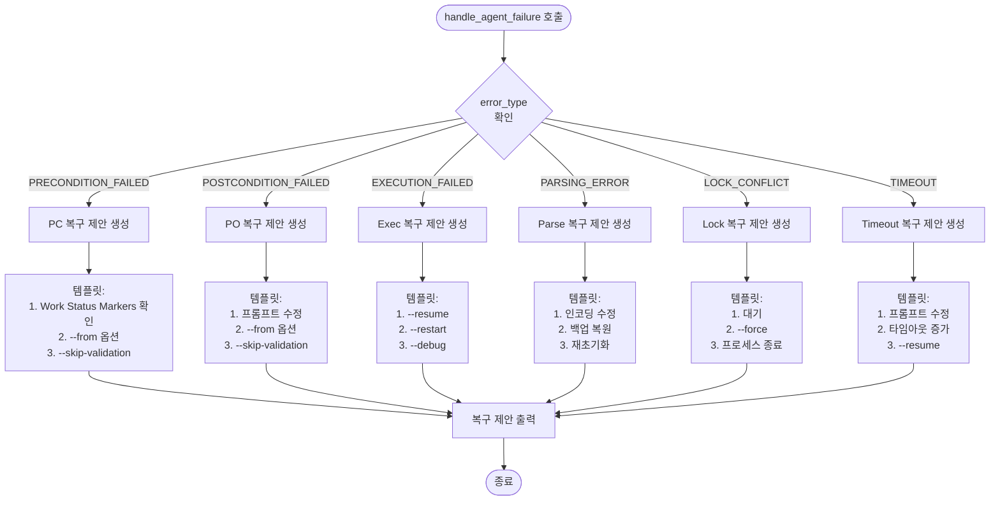

---

## 6.3 HANDOFF LOG 업데이트 로직

**목적**: 에이전트 실패 시 HANDOFF LOG에 [FAILURE] 엔트리를 기록하여 재시작 메커니즘이 정확한 지점을 식별할 수 있도록 한다.

### 6.3.1 [FAILURE] 엔트리 형식

**기본 형식**:
```
[FAILURE] {agent_name} | {error_type} (attempt {attempt_num}) | {timestamp}
```

**상세 정보 포함 형식** (선택적):
```
[FAILURE] {agent_name} | {error_type} ({detail}, attempt {attempt_num}) | {timestamp}
Reason: {error_message}
```

**예시**:
```
[FAILURE] concepts-writer | PRECONDITION_FAILED (attempt 1) | 2025-01-18T10:30:00+09:00
Reason: PC-1 failed - CURRENT_AGENT is 'overview-writer', expected 'concepts-writer'
```

---

### 6.3.2 HANDOFF LOG 업데이트 절차

**Step 1**: HANDOFF LOG 섹션 위치 찾기
- `grep -n "^<!-- HANDOFF LOG:" "$file_path"` 실행
- 시작 줄 번호 저장

**Step 2**: 기존 HANDOFF LOG 내용 읽기
- `sed -n '{start_line},{end_line}p' "$file_path"` 실행
- 기존 엔트리 보존 (Append-Only)

**Step 3**: 새 [FAILURE] 엔트리 추가
- 형식: `[FAILURE] {agent_name} | {error_type} (attempt {attempt_num}) | {timestamp}`
- 마지막 엔트리 다음 줄에 삽입

**Step 4**: HANDOFF LOG 섹션 업데이트
- sed 또는 awk로 파일 수정
- 기존 엔트리 + 새 엔트리

**Step 5**: 파일 쓰기
- 임시 파일에 저장 후 원본 파일 덮어쓰기
- 원자적 연산 보장 (`mv` 사용)

---

### 6.3.3 HANDOFF LOG 업데이트 플로우차트

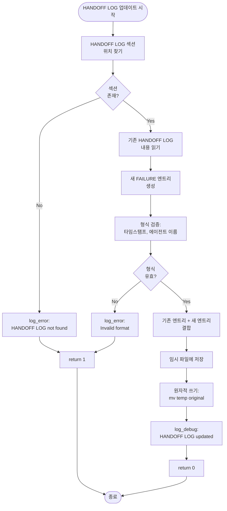

---

### 6.3.4 HANDOFF LOG 무결성 보장

**Append-Only 원칙**:
- 기존 엔트리는 절대 삭제하지 않음
- 새 엔트리만 추가
- 시간 순서 보장

**동시성 제어**:
- Lock 획득 후에만 HANDOFF LOG 업데이트
- Lock 해제 전에 파일 쓰기 완료

**백업 전략**:
- 업데이트 전 원본 파일 복사 (선택적)
- 임시 파일 사용으로 원자적 쓰기 보장

**검증**:
- 업데이트 후 grep으로 [FAILURE] 엔트리 확인
- 타임스탬프 형식 검증

---

# Section 7: Lock 메커니즘 로직

## 7.1 Lock 획득 절차

**함수**: `acquire_file_lock(file_path, agent_name)`

### 7.1.1 PID 유효성 확인 로직

**목적**: Lock 파일의 PID가 실제로 실행 중인 프로세스인지 확인

**절차**:
1. Lock 파일 읽기: `PID:timestamp:username:agent_name`
2. PID 추출: `cut -d ':' -f 1`
3. 프로세스 존재 확인: `ps -p $PID > /dev/null 2>&1`
   - exit code 0: 프로세스 실행 중 (유효한 Lock)
   - exit code 1: 프로세스 없음 (Stale Lock)

**macOS/Linux 호환성**:
- `ps -p $PID` 명령은 macOS, Linux 모두 지원
- 추가 플래그 불필요

---

### 7.1.2 Stale lock 감지 및 제거 조건

**Stale Lock 정의**: Lock 파일은 존재하지만 해당 PID의 프로세스가 실행 중이지 않은 상태

**감지 로직**:
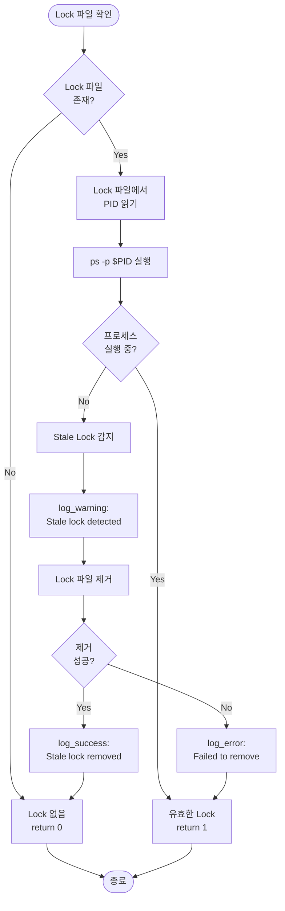

**제거 조건**:
- 조건 1: `ps -p $PID` 실패 (프로세스 없음)
- 조건 2: Lock 파일 삭제 권한 있음

**제거 실패 시**: log_error 출력 후 Lock 유효로 간주 (안전 우선)

---

### 7.1.3 대기 및 타임아웃 처리

**대기 로직**:
| 파라미터 | 값 | 설명 |
|---------|---|------|
| 최대 대기 시간 | 300초 (5분) | 환경 변수 `LOCK_TIMEOUT`으로 변경 가능 |
| 재시도 간격 | 5초 | 고정값 |
| 최대 재시도 횟수 | 60회 (300/5) | 계산값 |

**대기 루프**:
1. 5초마다 `check_lock_file()` 호출
2. Stale lock이면 자동 제거 후 Lock 획득
3. 유효한 lock이면 계속 대기
4. 60회 시도 후에도 Lock 획득 실패 시 타임아웃
5. TEST_MODE=true이면 대기 없이 즉시 실패

**타임아웃 처리**:
- `log_error("Lock acquisition timeout after 300s")`
- return 1 (실패)
- handle_agent_failure() 호출 (error_type=LOCK_CONFLICT)

---

## 7.2 Lock 해제 절차

**함수**: `release_file_lock(lock_file)`

**절차**:
1. Lock 파일 존재 확인
2. Lock 파일 삭제: `rm -f "$lock_file"`
3. 디버그 로그 출력: `log_debug("Lock released: $lock_file")`

**EXIT Trap과의 관계**:
- Trap 설정: `trap "release_file_lock '$lock_file'" EXIT`
- 명시적 해제 성공 시: Trap 제거 (`trap - EXIT`)
- 명시적 해제 실패 시: 스크립트 종료 시 Trap이 자동 실행

**멱등성 보장**: `rm -f`는 파일이 없어도 오류 없음

---

## 7.3 Lock 충돌 시나리오 및 처리

### 시나리오 1: 정상 병렬 실행 (서로 다른 토픽)

**상황**: 프로세스 A가 topic1.md 작업, 프로세스 B가 topic2.md 작업

**Lock 파일**:
- `.locks/topic1.lock` (A 소유)
- `.locks/topic2.lock` (B 소유)

**결과**: 충돌 없음, 양쪽 모두 정상 진행

---

### 시나리오 2: Lock 충돌 (동일 토픽)

**상황**: 프로세스 A가 topic1.md 작업 중, 프로세스 B도 topic1.md 시도

**처리**:
1. B가 Lock 획득 시도
2. `check_lock_file()` → Lock 유효 (A의 PID 실행 중)
3. B가 대기 (최대 300초)
4. A가 완료 시 Lock 해제
5. B가 Lock 획득 후 진행

---

### 시나리오 3: Stale Lock (프로세스 비정상 종료)

**상황**: 프로세스 A가 비정상 종료 (kill -9), Lock 파일 남음

**처리**:
1. 프로세스 B가 Lock 획득 시도
2. `check_lock_file()` → `ps -p $PID` 실패
3. Stale Lock 감지
4. Lock 파일 자동 제거
5. B가 Lock 획득 후 진행

---

### 시나리오 4: --force 옵션 사용

**상황**: 사용자가 `--force` 옵션으로 실행

**처리**:
1. `acquire_file_lock()` 진입
2. FORCE_MODE=true 확인
3. 기존 Lock 파일 강제 삭제 (`rm -f "$lock_file"`)
4. 새 Lock 파일 생성
5. 진행

**위험성**: 다른 프로세스가 작업 중이어도 강제 진행 → 파일 손상 가능

---

# Section 8: 데이터 구조 명세

## 8.1 execution-summary.json 구조

**목적**: 세션별 실행 결과를 구조화된 JSON으로 저장 (Unit 5 품질 분석용)

**파일 경로**: `logs/sessions/{session_id}/execution-summary.json`

| 필드명 | 타입 | 설명 | 필수 여부 | 기본값 |
|--------|------|------|----------|-------|
| session_id | string | 세션 ID (UUID) | 필수 | - |
| started_at | string | 세션 시작 시간 (ISO 8601) | 필수 | - |
| completed_at | string | 세션 완료 시간 (ISO 8601) | 선택적 | "" |
| total_duration | number | 총 소요 시간 (초) | 필수 | 0 |
| file_path | string | 대상 마크다운 파일 경로 | 필수 | "" |
| agents | array | 에이전트별 실행 정보 배열 | 필수 | [] |
| errors | array | 오류 정보 배열 | 필수 | [] |
| final_validation_score | number | 최종 검증 점수 (0-100) | 선택적 | 0 |

**agents 배열 항목 구조**:

| 필드명 | 타입 | 설명 | 필수 여부 |
|--------|------|------|----------|
| name | string | 에이전트 이름 | 필수 |
| completed_at | string | 완료 시간 (ISO 8601) | 필수 |
| status | string | "SUCCESS" 또는 "FAILURE" | 필수 |
| exit_code | number | Claude CLI exit code | 필수 |
| duration | number | 실행 시간 (초) | 필수 |

**errors 배열 항목 구조**:

| 필드명 | 타입 | 설명 | 필수 여부 |
|--------|------|------|----------|
| agent | string | 에이전트 이름 (파싱 오류 시 "N/A") | 필수 |
| error_type | string | 오류 타입 (6가지 중 하나) | 필수 |
| error_message | string | 오류 메시지 | 필수 |
| timestamp | string | 오류 발생 시간 (ISO 8601) | 필수 |
| attempt | number | 시도 횟수 | 필수 |
| recovery_suggestion | string | 복구 제안 메시지 | 선택적 |
| exit_code | number | Claude CLI exit code (EXECUTION_FAILED 시) | 선택적 |

**예시**:
```json
{
  "session_id": "123e4567-e89b-12d3-a456-426614174000",
  "started_at": "2025-01-18T10:00:00+09:00",
  "completed_at": "2025-01-18T10:30:00+09:00",
  "total_duration": 1800,
  "file_path": "public/content/ko/javascript-core-concepts/01-variables/let-vs-const.md",
  "agents": [
    {
      "name": "content-initiator",
      "completed_at": "2025-01-18T10:02:00+09:00",
      "status": "SUCCESS",
      "exit_code": 0,
      "duration": 120
    },
    {
      "name": "overview-writer",
      "completed_at": "2025-01-18T10:05:00+09:00",
      "status": "SUCCESS",
      "exit_code": 0,
      "duration": 180
    }
  ],
  "errors": [],
  "final_validation_score": 95
}
```

### 8.1.1 Shell 기반 JSON 업데이트 방식

**설계 원칙**:
- **순수 Shell 기반**: 외부 의존성 없이 sed, awk, grep만 사용
- **안전성 우선**: 기존 JSON 파싱 실패 시 graceful fallback
- **최소 복잡도**: JSON 전체 파싱 대신 필드별 sed 치환 방식 사용

**구현 전략**:

1. **간단한 필드 업데이트** (file_path, completed_at, total_duration, final_validation_score):
   - `sed -i '' 's/"field_name": ".*"/"field_name": "new_value"/' "$summary_file"`
   - 정규표현식 매칭으로 안전하게 치환

2. **배열 항목 추가** (agents, errors):
   - Step 1: agents/errors 배열의 닫는 대괄호 `]` 위치 찾기
   - Step 2: 닫는 대괄호 앞에 새 JSON 객체 삽입
   - Step 3: 배열이 비어있지 않으면 콤마 추가

**업데이트 함수 인터페이스**:

```bash
update_execution_summary() {
    local summary_file="$1"
    local update_type="$2"
    shift 2

    case "$update_type" in
        "set_file")
            local file_path="$1"
            # sed를 이용한 file_path 필드 업데이트
            ;;

        "agent_success")
            local agent_name="$1"
            local duration="$2"
            local exit_code="${3:-0}"
            # agents 배열에 JSON 객체 추가
            ;;

        "agent_error")
            local agent_name="$1"
            local error_type="$2"
            local error_message="$3"
            local attempt="$4"
            local exit_code="${5:-1}"
            # errors 배열에 JSON 객체 추가
            ;;

        "complete")
            local validation_score="${1:-0}"
            # completed_at, total_duration, final_validation_score 업데이트
            ;;
    esac
}
```

**JSON 배열 추가 로직** (agents/errors 공통):

```bash
# Step 1: 배열이 비어있는지 확인
is_empty=$(grep '"agents": \[\]' "$summary_file")

# Step 2: 새 JSON 객체 생성
new_entry='    {
      "name": "'"$agent_name"'",
      "completed_at": "'"$timestamp"'",
      "status": "SUCCESS",
      "exit_code": '$exit_code',
      "duration": '$duration'
    }'

# Step 3: 배열에 추가
if [ -n "$is_empty" ]; then
    # 빈 배열 → 바로 추가 (콤마 없음)
    sed -i '' 's/"agents": \[\]/"agents": [\n'"$new_entry"'\n  ]/' "$summary_file"
else
    # 비어있지 않은 배열 → 마지막 항목 뒤에 콤마 추가 후 추가
    sed -i '' '/^  ],$/i\
    ,\
'"$new_entry"'
' "$summary_file"
fi
```

**에러 처리**:
- sed 실패 시 로그만 남기고 스크립트 계속 실행 (execution-summary.json은 선택적 기능)
- JSON 파싱 오류 시 전체 재생성하지 않음 (기존 데이터 보존)

---

## 8.2 Lock 파일 구조

**목적**: 파일별 작업 중인 프로세스 식별

**파일 경로**: `.locks/{file_hash}.lock`

**형식**: 단일 라인 텍스트
```
{PID}:{timestamp}:{username}:{agent_name}
```

**예시**:
```
12345:2025-01-18T10:00:00+09:00:user:concepts-writer
```

**필드 설명**:

| 필드 | 설명 | 추출 방법 |
|------|------|----------|
| PID | 프로세스 ID | `$$` |
| timestamp | Lock 획득 시간 | `get_timestamp()` |
| username | 사용자 이름 | `whoami` |
| agent_name | 현재 실행 중인 에이전트 | 파라미터 |

---

## 8.3 로그 파일 형식

### 8.3.1 전체 실행 로그

**파일 경로**: `logs/content-generator-v7.log`

**형식**: 타임스탬프 + 로그 레벨 + 메시지
```
[{timestamp}] [{level}] {message}
```

**예시**:
```
[2025-01-18T10:00:00+09:00] [INFO] Starting content generation session: 123e4567-e89b-12d3-a456-426614174000
[2025-01-18T10:00:05+09:00] [SUCCESS] Lock acquired for topic1.md
[2025-01-18T10:02:00+09:00] [ERROR] Precondition validation failed for concepts-writer
```

---

### 8.3.2 에이전트별 로그

**파일 경로**: `logs/sessions/{session_id}/{agent_name}.log`

**내용**: Claude CLI의 stdout/stderr 출력

**생성 방법**: `claude -p ... 2>&1 | tee agent.log`

---

# Section 9: 실행 모드별 로직

## 9.1 Direct Mode 로직

**트리거**: `--direct=FILE` 옵션

**로직**:
1. FILE 경로 검증 (파일 존재, 읽기 권한)
2. FILE이 Work Status Markers 포함 확인
3. `auto_determine_restart_point(FILE)` 호출
4. 재시작 지점부터 파이프라인 실행

**특징**: 카테고리/서브카테고리 선택 단계 생략

---

## 9.2 Auto Mode 로직

**트리거**: `-a --category=X --subcategory=Y`

**로직**:
1. category.yaml 읽기
2. 불완전 파일 찾기 (`find_incomplete_file()`)
3. 찾으면 Direct Mode로 실행
4. 없으면 첫 번째 토픽 선택 후 실행

### 9.2.1 find_incomplete_file() 함수 설계

**목적**: category.yaml에서 불완전한 파일을 찾아 반환

**Parameters**:
- `$1 (category_yaml)`: category.yaml 파일 경로 (필수)
- `$2 (content_dir)`: 콘텐츠 디렉토리 경로 (필수)

**Returns**:
- 0: 불완전 파일 찾음 (stdout으로 파일 경로 출력)
- 1: 불완전 파일 없음 (모든 파일 COMPLETE)

**로직**:

```bash
find_incomplete_file() {
    local category_yaml="$1"
    local content_dir="$2"

    # Step 1: YAML에서 토픽 ID 추출 (순서대로)
    # - "  - id: XXX" 패턴 grep
    # - sed로 id 값만 추출

    # Step 2: 각 토픽 파일 순회
    for topic_id in $topic_list; do
        local file_path="$content_dir/${topic_id}.md"

        # Step 3: 파일 상태 확인
        if [ ! -f "$file_path" ]; then
            # 파일 없음 → 불완전 (생성 필요)
            echo "$file_path"
            return 0
        fi

        # Step 4: Work Status Markers 확인
        if grep -q "^CURRENT_AGENT:" "$file_path" 2>/dev/null; then
            # CURRENT_AGENT 존재 → 작업 중
            echo "$file_path"
            return 0
        fi

        # Step 5: COMPLETE 상태 확인
        if ! grep -q "\[COMPLETE\]" "$file_path" 2>/dev/null; then
            # COMPLETE 마커 없음 → 불완전
            echo "$file_path"
            return 0
        fi
    done

    # Step 6: 모든 파일 COMPLETE
    return 1
}
```

**YAML 파싱 방식** (순수 Shell):
```bash
# category.yaml 구조 예시:
# category: 01-react-basics
# topics:
#   - id: 01-what-is-react
#     title: React란 무엇인가?
#   - id: 02-virtual-dom
#     title: Virtual DOM

# 토픽 ID 추출:
topic_list=$(grep "^  - id:" "$category_yaml" | sed 's/.*id: *//' | xargs)
```

**불완전 판정 기준** (우선순위):
1. 파일 없음 → 불완전 (최우선)
2. CURRENT_AGENT 존재 → 작업 중 (높은 우선순위)
3. [COMPLETE] 마커 없음 → 미완성 (기본 우선순위)

---

## 9.3 Interactive Mode 로직

**트리거**: `-i` 옵션

**로직**:
1. 카테고리 목록 출력 (select_category)
2. 서브카테고리 목록 출력 (select_subcategory)
3. 토픽 목록 출력 (select_topic)
4. 사용자 선택 대기
5. Direct Mode로 실행

### 9.3.1 select_category() 함수 설계

**목적**: CONTENT_DIR에서 카테고리 목록을 표시하고 사용자 선택 받기

**Parameters**: None

**Returns**:
- 0: 선택 완료 (stdout으로 선택된 카테고리 경로 출력)
- 1: 선택 취소 또는 오류

**로직**:

```bash
select_category() {
    # Step 1: CONTENT_DIR에서 카테고리 목록 읽기
    local categories=$(find "$CONTENT_DIR" -mindepth 1 -maxdepth 1 -type d | sort)

    # Step 2: 카테고리 목록 번호와 함께 출력
    echo "Available categories:"
    local i=1
    for category in $categories; do
        echo "  $i) $(basename "$category")"
        ((i++))
    done

    # Step 3: 사용자 입력 대기
    read -p "Select category (1-$((i-1)) or 'q' to quit): " choice

    # Step 4: 입력 검증 및 반환
    if [ "$choice" = "q" ]; then
        return 1
    fi

    # 선택된 카테고리 출력
    echo "$selected_category"
    return 0
}
```

### 9.3.2 select_subcategory() 함수 설계

**목적**: 선택된 카테고리에서 서브카테고리 목록 표시하고 선택 받기

**Parameters**:
- `$1 (category_path)`: 카테고리 경로 (필수)

**Returns**:
- 0: 선택 완료 (stdout으로 선택된 서브카테고리 경로 출력)
- 1: 선택 취소 또는 오류

**로직**: select_category()와 유사 (하위 디렉토리 탐색)

### 9.3.3 select_topic() 함수 설계

**목적**: category.yaml에서 토픽 목록 표시하고 선택 받기

**Parameters**:
- `$1 (category_yaml)`: category.yaml 파일 경로 (필수)
- `$2 (content_dir)`: 콘텐츠 디렉토리 경로 (필수)

**Returns**:
- 0: 선택 완료 (stdout으로 선택된 파일 경로 출력)
- 1: 선택 취소 또는 오류

**로직**:

```bash
select_topic() {
    local category_yaml="$1"
    local content_dir="$2"

    # Step 1: YAML에서 토픽 리스트 읽기
    local topic_list=$(grep "^  - id:" "$category_yaml" | sed 's/.*id: *//')

    # Step 2: 각 토픽의 상태와 함께 출력
    echo "Available topics:"
    local i=1
    while IFS= read -r topic_id; do
        local file_path="$content_dir/${topic_id}.md"
        local status="❌ Not created"

        if [ -f "$file_path" ]; then
            if grep -q "\[COMPLETE\]" "$file_path" 2>/dev/null; then
                status="✅ COMPLETE"
            elif grep -q "^CURRENT_AGENT:" "$file_path" 2>/dev/null; then
                status="⏸️  In progress"
            else
                status="⏳ Incomplete"
            fi
        fi

        # 토픽 제목 추출 (YAML에서)
        local title=$(grep -A 1 "  - id: $topic_id" "$category_yaml" | grep "title:" | sed 's/.*title: *//')

        echo "  $i) $topic_id - $title [$status]"
        ((i++))
    done <<< "$topic_list"

    # Step 3: 사용자 입력 대기
    read -p "Select topic (1-$((i-1)) or 'q' to quit): " choice

    # Step 4: 선택된 토픽 파일 경로 출력
    echo "$selected_file_path"
    return 0
}
```

**UI 특징**:
- 각 토픽의 현재 상태 표시 (✅ COMPLETE, ⏸️ In progress, ⏳ Incomplete, ❌ Not created)
- 토픽 ID와 제목 함께 표시
- 'q' 입력으로 선택 취소 가능

---

## 9.4 Validate-Only Mode 로직

**트리거**: `--validate-only` 옵션

**로직**:
1. FILE 읽기
2. Work Status Markers 파싱
3. Precondition/Postcondition 검증만 수행
4. 에이전트 실행 없음
5. 검증 결과 출력

---

# Section 10: CLI 옵션 처리 로직

## 10.1 옵션 파싱 로직

**방법**: bash getopts 사용

**예시 구조**:
```
while getopts ":a:i-:" opt; do
  case $opt in
    -) # Long options
      case "${OPTARG}" in
        resume) RESUME=true ;;
        from=*) FROM_AGENT="${OPTARG#*=}" ;;
        force) FORCE_MODE=true ;;
        ...
      esac
      ;;
  esac
done
```

---

## 10.2 옵션 조합 검증 로직

**상호 배타적 옵션 체크**:

| 옵션 1 | 옵션 2 | 규칙 | 오류 메시지 |
|--------|--------|------|-------------|
| --resume | --from | 동시 사용 불가 | "Cannot use --resume and --from together" |
| --validate-only | --resume | 동시 사용 불가 | "--validate-only does not execute agents" |
| -a | -i | 동시 사용 불가 | "Cannot use -a and -i together" |

**검증 플로우차트**:
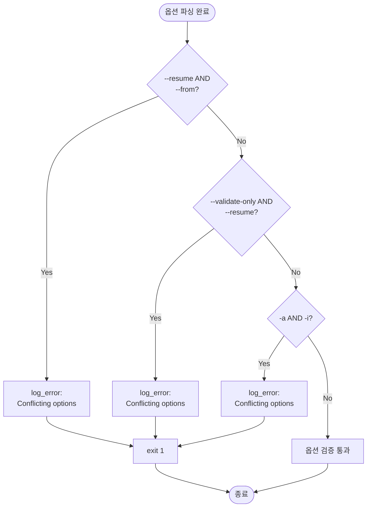

---

## 10.3 옵션별 동작 변경 로직

| 옵션 | 환경 변수 설정 | 동작 변경 |
|------|--------------|----------|
| --skip-validation | SKIP_VALIDATION=true | Precondition/Postcondition 검증 스킵 |
| --force | FORCE_MODE=true | Lock 강제 제거 |
| --debug | DEBUG_MODE=true | log_debug() 출력 활성화 |
| --test | TEST_MODE=true | 실제 실행 없이 플랜만 출력 |
| --from=X | FROM_AGENT=X | 특정 에이전트부터 실행 (PC-1 스킵) |

---

# Section 11: v6 → v7 로직 매핑

## 11.1 v6 주요 함수 → v7 함수 매핑

| v6 함수 | v7 함수 | 변경 사항 |
|---------|---------|----------|
| print_info | log_info | common-utils.sh로 이동 |
| print_success | log_success | common-utils.sh로 이동 |
| print_error | log_error | common-utils.sh로 이동 |
| print_warning | log_warning | common-utils.sh로 이동 |
| generate_session_id | generate_session_id | common-utils.sh로 이동 |
| parse_work_status_markers | 제거 | Work Status Markers 읽기만 수행 |
| identify_restart_point | auto_determine_restart_point | 3-step → 5-step priority 알고리즘 |
| determine_next_agent | determine_next_agent | 로직 유지 |
| handle_agent_failure | handle_agent_failure | 6가지 오류 타입 + 복구 제안 추가 |
| log_agent_performance | update_execution_summary | JSON 형식으로 변경 |
| acquire_lock | acquire_file_lock | common-utils.sh로 이동 |
| release_lock | release_file_lock | common-utils.sh로 이동 |
| execute_claude_agent | execute_claude_agent | `claude -p` 패턴 보존 |
| - | validate_preconditions | 신규 (Unit 2 계약 통합) |
| - | validate_postconditions | 신규 (Unit 2 계약 통합) |
| - | execute_agent_with_validation | 신규 (7단계 실행 흐름) |

---

## 11.2 제거된 로직 목록 및 사유

| v6 로직 | 제거 사유 |
|---------|----------|
| parse_work_status_markers | Work Status Markers는 grep으로 직접 읽기 (파싱 불필요) |
| test_section (섹션 테스트) | v7에서는 계약 검증으로 대체 |
| calculate_section_score | Unit 5 (품질 메트릭)으로 이관 |
| immediate/comprehensive/hybrid 모드 | Direct/Auto/Interactive 모드로 통합 |

---

## 11.3 추가된 로직 목록 및 목적

| v7 로직 | 목적 |
|---------|------|
| auto_determine_restart_point (5-step) | 정확한 재시작 지점 식별 (v6 3-step 개선) |
| validate_preconditions/postconditions | Unit 2 계약 검증 통합 |
| handle_agent_failure (6가지 오류 타입) | 세밀한 오류 분류 및 복구 제안 |
| execution-summary.json 생성 | Unit 5 품질 분석 데이터 제공 |
| --resume, --from 옵션 | 유연한 재시작 메커니즘 |

---

# Section 12: 구현 가이드라인

## 12.1 구현 우선순위

### Priority 1: 핵심 모듈 (1-2주)

| 작업 | 산출물 | 검증 방법 |
|------|--------|----------|
| common-utils.sh 구현 | 12개 함수 | 단위 테스트 (각 함수별) |
| 기본 실행 흐름 구현 | execute_agent_with_validation | 통합 테스트 (1개 에이전트) |
| Lock 메커니즘 구현 | acquire/release_file_lock | 동시 실행 테스트 |

---

### Priority 2: 검증 및 오류 처리 (1주)

| 작업 | 산출물 | 검증 방법 |
|------|--------|----------|
| Precondition/Postcondition 검증 | validate_* 함수 | 7개 에이전트별 테스트 |
| 오류 처리 구현 | handle_agent_failure | 6가지 오류 타입 시뮬레이션 |
| execution-summary.json 생성 | update_execution_summary | JSON 스키마 검증 |

---

### Priority 3: 고급 기능 (1주)

| 작업 | 산출물 | 검증 방법 |
|------|--------|----------|
| 5-step 재시작 메커니즘 | auto_determine_restart_point | 5가지 시나리오 테스트 |
| --resume, --from 옵션 | CLI 옵션 처리 | 옵션 조합 테스트 |
| 복구 제안 생성 | 오류 메시지 템플릿 | 사용자 피드백 |

---

## 12.2 구현 시 유의사항

### 유의사항 1: claude -p 패턴 보존 (중요!)

**필수 요구사항** (domain_design.md Question 1, 4):
- `claude -p "[subagent-name]" --session-id "$session_id"` 패턴 그대로 유지
- 프롬프트 기반 서브에이전트 실행 방식 변경 금지
- 검증된 실행 메커니즘 보존

**검증 방법**:
- v6와 v7의 Claude CLI 호출 비교
- 프롬프트 파일 경로 확인
- 세션 ID 전달 확인

---

### 유의사항 2: macOS/Linux 호환성

**호환성 확인 필요 명령어**:
- `date` (ISO 8601 타임스탬프)
  - macOS (BSD): `date +"%Y-%m-%dT%H:%M:%S%z"` → 콜론 삽입
  - Linux (GNU): `date --iso-8601=seconds`
- `ps -p $PID` (프로세스 확인)
  - 양쪽 모두 지원
- `grep -E` (정규식)
  - 양쪽 모두 지원

**테스트 환경**: macOS와 Linux에서 각각 실행 테스트

---

### 유의사항 3: 오류 메시지 명확성

**좋은 오류 메시지**:
```
❌ Precondition validation failed for concepts-writer
   PC-1 failed: CURRENT_AGENT is 'overview-writer', expected 'concepts-writer'
   
💡 Suggestion: Check Work Status Markers
   Run: grep -A 5 'CURRENT_AGENT' "file.md"
```

**나쁜 오류 메시지**:
```
Error: validation failed
```

---

## 12.3 구현 검증 방법

### 12.3.1 단위 테스트 (함수별)

**테스트 대상**: common-utils.sh의 모든 함수

**테스트 방법**:
- Bash 단위 테스트 프레임워크 (예: bats)
- 각 함수별 입력/출력 검증
- Edge case 테스트

**테스트 방법 예시** (log_info 함수):
- 테스트 항목 1: stdout 출력 확인
- 테스트 항목 2: LOG_FILE에 메시지 기록 확인
- 테스트 항목 3: 타임스탬프 형식 검증
- 검증 도구: Bash 단위 테스트 프레임워크 (예: bats)

---

### 12.3.2 통합 테스트 (에이전트별)

**테스트 시나리오**:
1. 정상 실행: content-initiator → ... → content-validator
2. Precondition 실패: PC-1/2/3 각각 테스트
3. Postcondition 실패: PO-1/2/3 각각 테스트
4. 재시작: --resume 옵션 테스트
5. 오류 복구: 각 오류 타입별 복구 흐름 테스트

**검증 항목**:
- Work Status Markers 정확성
- HANDOFF LOG 완전성
- execution-summary.json 형식

---

### 12.3.3 회귀 테스트 (v6 대비)

**테스트 방법**:
1. 동일한 입력 파일로 v6와 v7 실행
2. 최종 출력 마크다운 파일 비교 (diff)
3. Work Status Markers 비교
4. execution-summary.json 생성 확인 (v7만)

**허용 가능한 차이**:
- HANDOFF LOG 형식 차이 (v7이 더 상세)
- 로그 파일 위치 차이
- execution-summary.json 추가

**허용 불가 차이**:
- 최종 섹션 내용 변경
- Work Status Markers 누락

---

# 문서 종료

**v1.0 완료**: 2025-01-18

**다음 단계**: Phase 2.3 - 물리적 설계 (implementation)

---
